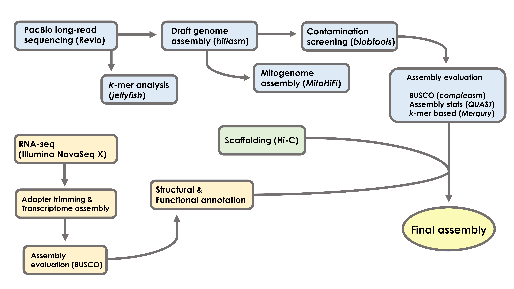

# Whole-genome assembly of the Ussuri Pitviper (*Gloydius ussuriensis*)
Chromosome-level reference genome assembly of the Ussuri Pitviper (*Gloydius ussuriensis*) using PacBio long-read sequencing, RNA-seq, and Hi-C.

-----------------------------------------------------------------------------------------------------
### Specimen

__*Gloydius ussuriensis* (AMNH 21010) collected from Hwacheon, South Korea (collected and photographed by Yucheol Shin)__

-----------------------------------------------------------------------------------------------------
### Assembly workflow

-----------------------------------------------------------------------------------------------------
### Computing resources and software package dependencies
#### HPC
- AMNH Mendel and Huxley HPCs
- apptainer v1.2.5 (loaded as a module on Mendel to run MitoHiFI)
- BLAST v2.10.1+ (loaded as a module on Mendel)
- BLAST v2.11.0 (loaded as a module on Huxley)
- blobtools v1.1.1
- compleasm v0.2.7
- efetch v24.0
- hifiasm v0.25.0-r726
- Earl Grey
- fastqc v0.12.1
- funannotate
- HiSat2 v2.2.2
- meryl v1.4.1
- merqury v1.3
- minimap2 v2.30-r1287
- MitoHiFi
- multiqc v1.33
- QUAST v5.3.0
- samtools v1.6 ("genome_assembly" conda env)
- samtools v1.23 ("samtools" conda env)
- seqkit v2.12.0
- StringTie v2.1.7
- trimmomatic v0.40

#### Local
- Geneious Prime v2019.2.3
- ggplot v3.5.1
- R v4.4.2
- seqkit v2.10.1

