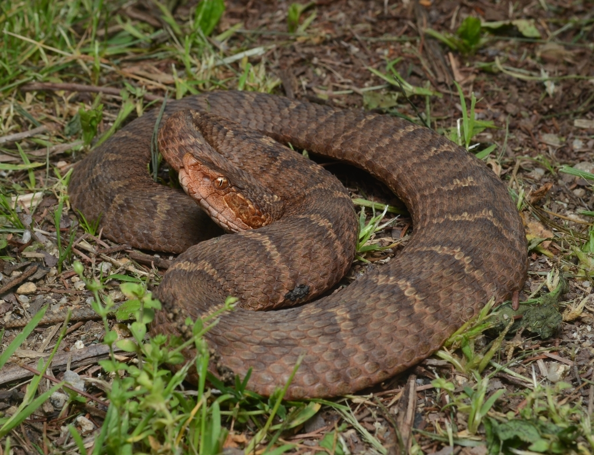

# Whole-genome assembly of the Ussuri Pitviper (*Gloydius ussuriensis*)
PacBio HiFi genome assembly of the Ussuri Pitviper (*Gloydius ussuriensis*)

__*Gloydius ussuriensis* (AMNH 21010) collected from Hwacheon, South Korea (collected and photographed by Yucheol Shin)__

### Computing resources and software package dependencies
__HPC__
- AMNH Mendel and Huxley HPCs
- BLAST v2.10.1+ (loaded as a module on Mendel)
- BLAST v2.11.0 (loaded as a module on Huxley)
- blobtools v1.1.1
- compleasm v0.2.7
- entrez
- hifiasm v0.25.0-r726
- Earl Grey
- fastqc v0.12.1
- funannotate
- HiSat2
- meryl v1.4.1
- merqury v1.3
- minimap2 v2.30-r1287
- multiqc v1.33
- QUAST v5.3.0
- samtools v1.6 ("genome_assembly" env) and v1.23 ("samtools" env)
- seqkit v2.12.0
- trimmomatic v0.40

__Local__
- Geneious Prime v2019.2.3
- ggplot v3.5.1
- R v4.4.2
- seqkit v2.3.0

