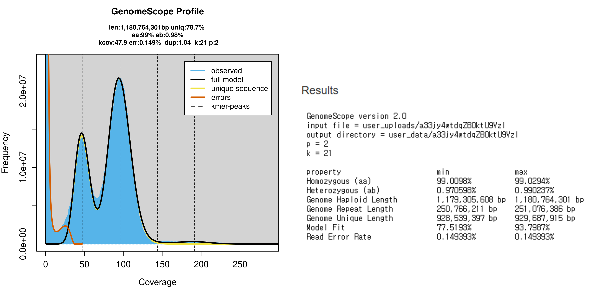

# Whole-genome assembly of the Ussuri Pitviper (*Gloydius ussuriensis*)
*Gloydius ussuriensis* PacBio HiFi genome assembly. Workflow adapted from: https://github.com/danielagarciacobos4/PacBio_GenomeAssembly_annotation and https://github.com/amandamarkee/actias-luna-genome

The individual used for this genome assembly is accessioned at the AMNH Herpetology Collections under the voucher number AMNH 21010.

__Workflow__
1. __Raw read QC with FastQC__
2. __*k*-mer analysis of raw reads using jellyfish__
3. __Draft genome assembly using hifiasm__
4. __Genome completeness using BUSCO__
5. __Genome assembly stats with QUAST__
6. __Genome annotation__
   - __RNA read QC__
   - __Adapter trimming__ 
   - __Transcriptome assembly__
   - __Structural annotation__
   - __Functional annotation__
7. __Scaffolding through Hi-C data incorporation__
8. __Mitogenome assembly__

## 1) Raw read QC with FastQC
Run QC on the raw PacBio HiFi reads using FastQC. This is only meant to be a "sanity check" and not the actual quality assessment because FastQC assumes short Illumina reads as an input.

```sh
#!/bin/bash
#SBATCH --job-name=fastQC_ussuri
#SBATCH --nodes=1
#SBATCH --mem=200G
#SBATCH --partition=compute
#SBATCH --cpus-per-task=24
#SBATCH --time=10:00:00
#SBATCH --mail-type=ALL
#SBATCH --mail-user=yshin@amnh.org
#SBATCH --output=/home/yshin/mendel-nas1/snake_genome_ass/G_ussuriensis_Chromo/PacBio_Revio/outfiles/slurm-%x_%j.out
#SBATCH --error=/home/yshin/mendel-nas1/snake_genome_ass/G_ussuriensis_Chromo/PacBio_Revio/outfiles/slurm-%x_%j.err

# initiate conda and activate the conda environment
source ~/.bash_profile
conda activate genome_assembly

# path to the fastq file
path_to_seq=/home/yshin/mendel-nas1/snake_genome_ass/G_ussuriensis_Chromo/PacBio_Revio/FASTQ

# output directory
out_dir=/home/yshin/mendel-nas1/snake_genome_ass/G_ussuriensis_Chromo/PacBio_Revio/FastQC

# run FastQC
fastqc -o ${out_dir} ${path_to_seq}/AMNH_21010_HiFi.fastq.gz
```

## 2) *k*-mer analysis of raw reads using jellyfish
Conduct a *k*-mer count analysis on the raw reads using jellyfish. This can be useful to estimate the genome size, heterozygosity, etc. Use the following script to submit a job to the AMNH Mendel HPC cluster. The "zcat [...]" line first unpacks the HiFi fastq.gz file (without permanently extracting the content, because this file is massive), converts it into the FASTA format (dropping quality scores, etc.), and pipes that into jellyfish. The output .jf file is then fed into the "jellyfish histo" command to produce the .histo file for viewing.

```sh
#!/bin/bash
#SBATCH --job-name=kmer_ussuri
#SBATCH --nodes=1
#SBATCH --mem=100G
#SBATCH --partition=compute
#SBATCH --cpus-per-task=24
#SBATCH --time=06:00:00
#SBATCH --mail-type=ALL
#SBATCH --mail-user=yshin@amnh.org
#SBATCH --output=/home/yshin/mendel-nas1/snake_genome_ass/G_ussuriensis_Chromo/PacBio_Revio/outfiles/slurm-%x_%j.out
#SBATCH --error=/home/yshin/mendel-nas1/snake_genome_ass/G_ussuriensis_Chromo/PacBio_Revio/outfiles/slurm-%x_%j.err

# initiate conda and activate the conda environment
source ~/.bash_profile
conda activate genome_assembly

# make sure the script to fail fast and loudly if something is broken
set -euo pipefail

# path to sequence read
path_to_seq=/home/yshin/mendel-nas1/snake_genome_ass/G_ussuriensis_Chromo/PacBio_Revio/FASTQ

# specify output directory
outdir=/home/yshin/mendel-nas1/snake_genome_ass/G_ussuriensis_Chromo/PacBio_Revio/outfiles/

# run jellyfish
zcat ${path_to_seq}/AMNH_21010_HiFi.fastq.gz | awk 'NR%4==1{print ">"substr($0,2)} NR%4==2{print}' | jellyfish count -m 21 -s 10G -t ${SLURM_CPUS_PER_TASK} -C /dev/fd/0 -o ${outdir}/Gloydius_ussuriensis_kmer.jf
jellyfish histo ${outdir}/Gloydius_ussuriensis_kmer.jf -t ${SLURM_CPUS_PER_TASK} > ${outdir}/Gloydius_ussuriensis_kmer.histo
```

The output .histo can be fed into GenomeScope 2.0 (http://genomescope.org/genomescope2.0/) to visualize the results, which look something like: 



The results suggest:
  - Estimated haploid genome size of 1.18 Gb
  - Estimated repeat content of 21.3%
  - High homozygosity (~99%)
  - Very low read error rate (~0.15%) 


## 3) Draft genome assembly using hifiasm
Hifiasm (https://github.com/chhylp123/hifiasm) is a fast, haplotype-resolved assembler for PacBio long-read sequencing data. Use the following script to submit a hifiasm job to the Mendel cluster. The estimated coverage for this sample is very high (~87x) and the fastq.gz file of raw reads is very big (63 GB). Use the bigmem partition and request a sufficient amount of CPUs and walltime to assemble this genome.

```sh
#!/bin/bash
#SBATCH --job-name=hifi_ussuri
#SBATCH --nodes=1
#SBATCH --mem=650G
#SBATCH --partition=bigmem
#SBATCH --cpus-per-task=24
#SBATCH --time=7-00:00:00
#SBATCH --mail-type=ALL
#SBATCH --mail-user=yshin@amnh.org
#SBATCH --output=/home/yshin/mendel-nas1/snake_genome_ass/G_ussuriensis_Chromo/PacBio_Revio/outfiles/slurm-%x_%j.out
#SBATCH --error=/home/yshin/mendel-nas1/snake_genome_ass/G_ussuriensis_Chromo/PacBio_Revio/outfiles/slurm-%x_%j.err

# initiate conda and activate the conda environment
source ~/.bash_profile
conda activate genome_assembly

# set output directory
out_dir=/home/yshin/mendel-nas1/snake_genome_ass/G_ussuriensis_Chromo/PacBio_Revio/hifiasm

# set taxon name as a variable
name="Gloydius_ussuriensis"

# run hifiasm - put results in their own directory named after the species
hifiasm -o ${out_dir}/${name}_v1.asm -t ${SLURM_CPUS_PER_TASK} /home/yshin/mendel-nas1/snake_genome_ass/G_ussuriensis_Chromo/PacBio_Revio/FASTQ/AMNH_21010_HiFi.fastq.gz
``` 

## 4) Genome completeness using BUSCO

## 5) Genome assembly stats with QUAST

## 6) Genome annotation
   - __RNA read QC:__
   Run FastQC on raw, untrimmed reads.

```sh
   #!/bin/bash
   #SBATCH --job-name=rnaQC_ussuri
   #SBATCH --nodes=1
   #SBATCH --mem=200G
   #SBATCH --partition=compute
   #SBATCH --cpus-per-task=24
   #SBATCH --time=10:00:00
   #SBATCH --mail-type=ALL
   #SBATCH --mail-user=yshin@amnh.org
   #SBATCH --output=/home/yshin/mendel-nas1/snake_genome_ass/G_ussuriensis_Chromo/PacBio_Revio/outfiles/slurm-%x_%j.out
   #SBATCH --error=/home/yshin/mendel-nas1/snake_genome_ass/G_ussuriensis_Chromo/PacBio_Revio/outfiles/slurm-%x_%j.err

   # initiate conda and activate the conda environment
   source ~/.bash_profile
   conda activate genome_assembly

   # path to the fastq file
   path_to_seq=/home/yshin/mendel-nas1/snake_genome_ass/G_ussuriensis_Chromo/RNAseq/FASTQ

   # output directory
   out_dir=/home/yshin/mendel-nas1/snake_genome_ass/G_ussuriensis_Chromo/RNAseq/FastQC/pretrim

   # run FastQC
   fastqc -o ${out_dir} ${path_to_seq}/AMNH_21010_Ht_1.fastq.gz ${path_to_seq}/AMNH_21010_Ht_2.fastq.gz ${path_to_seq}/AMNH_21010_Ky_1.fastq.gz ${path_to_seq}/AMNH_21010_Ky_2.fastq.gz ${path_to_seq}/AMNH_21010_Lg_1.fastq.gz ${path_to_seq}/AMNH_21010_Lg_2.fastq.gz ${path_to_seq}/AMNH_21010_Lr_1.fastq.gz ${path_to_seq}/AMNH_21010_Lr_2.fastq.gz ${path_to_seq}/AMNH_21010_Me_1.fastq.gz ${path_to_seq}/AMNH_21010_Me_2.fastq.gz ${path_to_seq}/AMNH_21010_Skin_1.fastq.gz ${path_to_seq}/AMNH_21010_Skin_2.fastq.gz
```

   - __Adapter trimming:__ 
   Use trimmomatic to trim adapters and then run FastQC on the trimmed reads.

   - __Transcriptome assembly:__

   - __Structural annotation:__
   - __Functional annotation:__

## 7) Scaffolding through Hi-C data incorporation

## 8) Mitogenome assembly
Because PacBio HiFi reads are long and highly contiguous, it is possible to assemble a full mitogenome as a bycatch. This can be done easily using some existing tools and a reference mitogenome to "fish out" the mitochondrial contigs from HiFi reads. There is already a conspecific mitogenome reference available on GenBank (NC_026553.1). We can fetch this mitogenome like so:

```txt
# create working directory for mitogenome assembly
mkdir -p /home/yshin/mendel-nas1/snake_genome_ass/G_ussuriensis_Chromo/PacBio_Revio/mito_ref
cd /home/yshin/mendel-nas1/snake_genome_ass/G_ussuriensis_Chromo/PacBio_Revio/mito_ref

# install entrez to fetch seq from ncbi
conda activate genome_assembly
conda install -y -c bioconda entrez-direct

# fetch seq and annotation
ref_acc=NC_026553.1
echo ${ref_acc}

efetch -db nucleotide -id ${ref_acc} -format fasta > ${ref_acc}.fa
efetch -db nucleotide -id ${ref_acc} -format gbwithparts > ${ref_acc}.gb
```

Then, create a conda environment for mitogenome assembly and install some packages that will be used.

```txt
# create conda environment for mitogenome assembly
conda create -n mito_assembly
conda activate mito_assembly

# install some packages
conda install -y -c bioconda minimap2 samtools flye
```

Once everything is prepared, use the pipeline below to assemble a mitogenome. 

```sh
#!/bin/bash
#SBATCH --job-name=mito_ussuri
#SBATCH --partition=compute
#SBATCH --nodes=1
#SBATCH --cpus-per-task=32
#SBATCH --mem=120G
#SBATCH --time=72:00:00
#SBATCH --mail-type=ALL
#SBATCH --mail-user=yshin@amnh.org
#SBATCH --output=/home/yshin/mendel-nas1/snake_genome_ass/G_ussuriensis_Chromo/PacBio_Revio/outfiles/slurm-%x_%j.out
#SBATCH --error=/home/yshin/mendel-nas1/snake_genome_ass/G_ussuriensis_Chromo/PacBio_Revio/outfiles/slurm-%x_%j.err

# activate conda environment
source ~/.bash_profile
conda activate mito_assembly

##############
#  1. setup  #
##############

# make the run fail loudly if something is broken
set -euo pipefail

# set some paths as variables
path_to_hifi=/home/yshin/mendel-nas1/snake_genome_ass/G_ussuriensis_Chromo/PacBio_Revio/FASTQ
path_to_mitoref=/home/yshin/mendel-nas1/snake_genome_ass/G_ussuriensis_Chromo/PacBio_Revio/mito_ref
out_dir=/home/yshin/mendel-nas1/snake_genome_ass/G_ussuriensis_Chromo/PacBio_Revio/mito_out

# set mapping quality score
# set this to 60 to drop numts and other crap that we do not want
mq=60


################
#  2. mapping  #
################

# print this message when starting
echo "start mapping reads to reference..."

# run minimap2
minimap2 -t ${SLURM_CPUS_PER_TASK} -ax map-hifi ${path_to_mitoref}/NC_026553.1.fa \
  ${path_to_hifi}/AMNH_21010_HiFi.fastq.gz | \
  samtools view -@ 8 -b -F 4 | \
  samtools sort -@ 8 -T ${out_dir}/tmp.mito -o ${out_dir}/mito_map.bam
samtools index ${out_dir}/mito_map.bam

#############################
#  3. extract mapped reads  #
#############################

# print this message when starting
echo "extract mapped reads for mapping quality score >= ${mq}"

# use samtools
samtools view -h ${out_dir}/mito_map.bam | \
  awk -v mq=${mq} 'BEGIN{OFS="\t"} $1 ~ /^@/ || $5 >= mq' | \
  samtools view -b -F 4 -o ${out_dir}/mito_map.MQ.bam

samtools index ${out_dir}/mito_map.MQ.bam

# Convert to FASTQ for assembly
samtools fastq ${out_dir}/mito_map.MQ.bam | gzip > ${out_dir}/mito_reads.MQ.fastq.gz

# print out this message
echo "mito reads written as FASTQ: mito_reads.MQ.fastq.gz"


#######################
#  4. assemble reads  #
#######################

# print this message when starting
echo "assemble reads with flye..."

# run flye
flye --pacbio-hifi ${out_dir}/mito_reads.MQ.fastq.gz \
  --out-dir ${out_dir}/flye_mito -t ${SLURM_CPUS_PER_TASK} --genome-size 20k

mito_asm=${out_dir}/flye_mito/assembly.fasta

# print out this message
echo "mitochondrial genome assembly complete! assembly written to: ${mito_asm}"


###############################################################
#  5. map mito reads back to mito assembly and compute depth  #
###############################################################

# print this message when starting
echo "remap mito reads back to assembled contigs..."

# run minimap2
minimap2 -t ${SLURM_CPUS_PER_TASK} -ax map-hifi ${mito_asm} ${out_dir}/mito_reads.MQ.fastq.gz | \
  samtools sort -@ 8 -o ${out_dir}/mito_realign.bam
samtools index ${out_dir}/mito_realign.bam

# compute depth
echo "compute depth..."

# run samtools depth
samtools depth ${out_dir}/mito_realign.bam > ${out_dir}/mito_depth.tsv
awk '{sum+=$3; n++} END{print "mean_depth\t"sum/n"\npositions\t"n}' ${out_dir}/mito_depth.tsv > ${out_dir}/depth_summary.txt


###########################################
#  6. validate by comparing to reference  #
###########################################

# print this message when starting
echo "validate assembly by comparing to reference..."

# run minimap2
minimap2 -x asm5 ${path_to_mitoref}/NC_026553.1.fa ${mito_asm} > ${out_dir}/mito_vs_ref.paf


###################################
# print this when all is complete #
###################################
echo "mitochondrial genome assembly pipeline complete!"

```

Once this is done, run a quick check to see what we've got:

```txt
# make sure you are in the "mito_assembly" conda environment
# run this in the directory containing the assembly.fasta file (which is the "flye_mito" folder)
seqkit stats assembly.fasta
grep -c "^>" assembly.fasta
```

The seqkit run will print out:

```txt
file            format  type  num_seqs  sum_len  min_len   avg_len  max_len
assembly.fasta  FASTA   DNA          3  107,365   17,211  35,788.3   45,823
```

This is not expected; The ideal outcome is having one clean contig containing the mitogenome.
Instead, there are three contigs. The longest one is 45,823 bp and the shortest one is 17,211 bp long. The shortest contig is likely to be the actual mitogenome, but we need to run some additional clean-up steps to confirm this.

Run the following pipeline to remap & reassemble the mitogenome:

```sh
#!/bin/bash
#SBATCH --job-name=mitoCleanup_ussuri
#SBATCH --partition=compute
#SBATCH --nodes=1
#SBATCH --cpus-per-task=32
#SBATCH --mem=120G
#SBATCH --time=72:00:00
#SBATCH --mail-type=ALL
#SBATCH --mail-user=yshin@amnh.org
#SBATCH --output=/home/yshin/mendel-nas1/snake_genome_ass/G_ussuriensis_Chromo/PacBio_Revio/outfiles/slurm-%x_%j.out
#SBATCH --error=/home/yshin/mendel-nas1/snake_genome_ass/G_ussuriensis_Chromo/PacBio_Revio/outfiles/slurm-%x_%j.err

# activate conda environment
source ~/.bash_profile
conda activate mito_assembly

# make the run fail loudly if something is broken
set -euo pipefail

# set paths as variables
wkdir=/home/yshin/mendel-nas1/snake_genome_ass/G_ussuriensis_Chromo/PacBio_Revio/mito_cleanup
path_to_hifi=/home/yshin/mendel-nas1/snake_genome_ass/G_ussuriensis_Chromo/PacBio_Revio/FASTQ
path_to_mitoref=/home/yshin/mendel-nas1/snake_genome_ass/G_ussuriensis_Chromo/PacBio_Revio/mito_ref
path_to_assembly=/home/yshin/mendel-nas1/snake_genome_ass/G_ussuriensis_Chromo/PacBio_Revio/mito_cleanup

# cd into working directory
cd ${wkdir}


####################################
#  1. identify likely mito contig  #
####################################

# print this message when starting
echo "ID likely mito contig..."

# list contigs by size
seqkit fx2tab -n -l ${path_to_assembly}/assembly.fasta | sort -k2,2n > contig_len.txt
cat contig_len.txt

# pick contig that is within the exptected size range of snake mitogenome
mito_contig=$(awk '$2>=16000 && $2<=19000 {print $1}' contig_len.txt)

if [[ -z $mito_contig ]]; then
  echo "ERROR! No contig in expected mitogenome size range"
  exit 1
fi

echo "selected likely mito contig: ${mito_contig}, moving on..."

# extract the selected contig
seqkit grep -n -p ${mito_contig} ${path_to_assembly}/assembly.fasta > mito_extract.fasta
seqkit stats mito_extract.fasta

# validate against the reference
minimap2 -x asm5 ${path_to_mitoref}/NC_026553.1.fa mito_extract.fasta > validate.paf
head validate.paf


###########################
#  2. remap & reassemble  #
###########################

# print this message when starting
echo "remap and reassemble..."

# mkdir for flye output
mkdir -p flye_mito_2

# remap raw hifi reads to extracted mito contig
minimap2 -t ${SLURM_CPUS_PER_TASK} -ax map-hifi mito_extract.fasta ${path_to_hifi}/AMNH_21010_HiFi.fastq.gz | \
  samtools view -b -F 4 -q 60 -o mito_remap.bam

samtools fastq mito_remap.bam | gzip > mito_remap.fastq.gz

# reassemble
flye --pacbio-hifi mito_remap.fastq.gz \
  --out-dir flye_mito_2 \
  --genome-size 20k \
  -t ${SLURM_CPUS_PER_TASK}

# print this when flye run is complete
echo "reassembly stats"
seqkit flye_mito_2/assembly.fasta

### print this message when all runs are complete
echo "remap and reassembly completed"

```

Run "seqkit stats" again on the assembly file
```txt
(mito_assembly) [yshin@mendel-head flye_mito_2]$ seqkit stats assembly.fasta
file            format  type  num_seqs  sum_len  min_len   avg_len  max_len
assembly.fasta  FASTA   DNA          3  107,365   17,211  35,788.3   45,823
```
The output still shows 3 sequences after remapping and reassembly. This means that the shortest contig (17,211 bp) is likely to be the actual mitogenome. This is about the same size as the reference mitogenome (17,208 bp). Let's extract this shortest contig. First identify the contig names:

```txt
# run this on the command line in the directory containing the flye output
(mito_assembly) [yshin@mendel-head flye_mito_2]$ seqkit fx2tab -n -l assembly.fasta | sort -k2,2n
contig_3        17211
contig_1        44331
contig_2        45823
```

Contig 3 is our mitogenome. Extract this contig:
```txt
seqkit grep -n -p contig_3 assembly.fasta > ussuri_mitogenome.fasta
seqkit stats ussuri_mitogenome.fasta

file                     format  type  num_seqs  sum_len  min_len  avg_len  max_len
ussuri_mitogenome.fasta  FASTA   DNA          1   17,211   17,211   17,211   17,211
```

Let's check the FASTA header:
```txt
(mito_assembly) [yshin@mendel-head flye_mito_2]$ head ussuri_mitogenome.fasta 
>contig_3
ACAGTCCCGCTTTTCACGTCCATATATTGTAACTCCTCCCGTCTATGTCCTTTCCAAGGC
```

This is not ideal; change the header with species name:
```txt
sed 's/^>.*/>Gloydius_ussuriensis_mitogenome/' ussuri_mitogenome.fasta > ussuri_mitogenome_ann.fasta
(mito_assembly) [yshin@mendel-head flye_mito_2]$ head ussuri_mitogenome_ann.fasta 
>Gloydius_ussuriensis_mitogenome
ACAGTCCCGCTTTTCACGTCCATATATTGTAACTCCTCCCGTCTATGTCCTTTCCAAGGC 
```
__*The following steps are (mostly) run on a local device*__

Now that this step is done, we can annotate the assembled mitogenome using MITOS2 (https://usegalaxy.org/root?tool_id=toolshed.g2.bx.psu.edu%2Frepos%2Fiuc%2Fmitos2%2Fmitos2%2F2.1.3%20galaxy0).

Use the following settings:
```txt
1) Input file: ussuri_mitogenome_ann.fasta
2) In file uploads, use "auto-detect" and do not specify the reference
3) Use "Vertebrate (2)" genetic code and "RefSeq63 Metazoa" for reference data
4) Select BED, GFF, and nucleotide FASTA as outputs
5) Turn on email notification
6) Turn on "Attempt to re-use jobs with identical parameters?"
```

MITOS2 can be run through the run on the Galaxy Server. The window looks something like this:


After MITOS2 run is complete, run a quick sanity check on the output GFF (annotation) file
```txt
(base) yshin@DESKTOP-43QC882:~/Gloydius_ussuriensis_genome_assembly/outfiles/mito_assembly/mitos2$ grep -v "^#" "Galaxy6-[MITOS2 on dataset 1_ GFF].gff" | cut -f3 | sort | uniq -c

 37 exon
 13 gene
 24 ncRNA_gene
 2 rRNA
 1 region
 22 tRNA

```
Looks good! Also check if the names of all 13 protein-coding genes:
```
grep -v "^#" "Galaxy6-[MITOS2 on dataset 1_ GFF].gff" | awk -F'\t' '$3=="gene"{print $9}' | \
  grep -Eo 'cox1|cox2|cox3|cob|cytb|atp6|atp8|nad1|nad2|nad3|nad4l|nad4|nad5|nad6' | sort | uniq -c

      3 atp6
      3 atp8
      3 cob
      3 cox1
      3 cox2
      3 cox3
      3 nad1
      3 nad2
      3 nad3
      3 nad4
      3 nad4l
      3 nad5
      3 nad6
```

Sweet. Now let's rotate the mitogenome FASTA based on the location of tRNA-Phe (trnF)
```txt
$ grep -i -E "trnF|tRNA-Phe|phenylalanine" "Galaxy6-[MITOS2 on dataset 1_ GFF].gff" Gloydius_ussuriensis_mitogenome mitfi   ncRNA_gene      692     755     .       +       .       ID=gene_trnF;Name=trnF;gene_id=trnF Gloydius_ussuriensis_mitogenome mitfi   tRNA    692     755     .       +       .       ID=transcript_trnF(gaa);Name=trnF(gaa);Parent=gene_trnF(gaa);gene_id=trnF(gaa) Gloydius_ussuriensis_mitogenome mitfi   exon    692     755     1.100000021625469e-10   +       .       Parent=transcript_trnF;Name=trnF
```

We can see that trnF starts at position 692 on the (+) strand. Now we can rotate the sequence based on this information. To do so, first install the "rotate" package under the mendel-nas1 directory:

```txt
###  this is run on the cluster
# install
git clone https://github.com/richarddurbin/rotate.git ; cd rotate ; make

# to run, cd into the folder containing rotate and then run:
./rotate

### run rotate with the input sequence
# path to seq
path_to_seq=/home/yshin/mendel-nas1/snake_genome_ass/G_ussuriensis_Chromo/PacBio_Revio/mito_cleanup/flye_mito_2

# make sure the path prints out
echo ${path_to_seq}

# run rotate. run this in the rotate directory under mendel-nas1/
./rotate -x 692 ${path_to_seq}/ussuri_mitogenome.fasta > ${path_to_seq}/ussuri_mt_rotated.fasta

# check stats
seqkit stats ${path_to_seq}/ussuri_mt_rotated.fasta

# the output
file                     format  type  num_seqs  sum_len  min_len  avg_len  max_len
ussuri_mt_rotated.fasta  FASTA   DNA          1   17,211   17,211   17,211   17,211
```

Awesome. Now re-run MITOS2 to get GFF of the rotated FASTA. Once this is done, run some final checks

```txt
###  this is run on a local device
# cd into mito assembly directory
cd outfiles/mito_assembly/rotated/

# make directory for the final output files
mkdir final

# copy files output from MITOS2 to the final folder
cp *.gff final/
cp 'Galaxy40-[ussuri_mt_rotated.fasta].fasta' final/

# cd into final folder and change file names
mv 'Galaxy40-[ussuri_mt_rotated.fasta].fasta' ussuri_mt_rotated.fasta
mv 'Galaxy42-[MITOS2 on dataset 40_ GFF].gff' annotation_rotated.gff

# confirm gene content again
grep -v "^#" *.gff | cut -f3 | sort | uniq -c

# the output
 37 exon
 13 gene
 24 ncRNA_gene
 2 rRNA
 1 region
 22 tRNA

# check trnF position
grep -i -E "gene_trnF|Name=trnF|trnF" *.gff

# the output
contig_3        mitfi   ncRNA_gene      17211   17274   .       +       .       ID=gene_trnF;Name=trnF;gene_id=trnF
contig_3        mitfi   tRNA    17211   17274   .       +       .       ID=transcript_trnF(gaa);Name=trnF(gaa);Parent=gene_trnF(gaa);gene_id=trnF(gaa)
contig_3        mitfi   exon    17211   17274   1.100000021625469e-10   +       .       Parent=transcript_trnF;Name=trnF
```

The trnF is shown to span 17,211 bp - 17,274 bp. Since this mitogenome is 17,211 long, the position shown here actually means that the trnF is at the start of the circularized sequence.

When we check the sequence, we can see that the FASTA header shows 'contig_3.' This is because we used a file that had the original contig name for rotation. 

```txt
head ussuri_mt_rotated.fasta
>contig_3
TTGCCTGTAGCTTAAGCCTAAAGTATAGCACTGAAAATGCTAAGATGGTAAAACCCTACAACAAAGGTCTTGGTCCTAAACCTCACATTACCTAAAATCATCTGTTTA
```

Change the name as such (run on the file stored locally):

```txt
# change name
sed 's/^>.*/>Gloydius_ussuriensis_mitogenome/' ussuri_mt_rotated.fasta > ussuri_mt_rotated_final.fasta

# check
$ head ussuri_mt_rotated_final.fasta 
>Gloydius_ussuriensis_mitogenome
TTGCCTGTAGCTTAAGCCTAAAGTATAGCACTGAAAATGCTAAGATGGTAAAACCCTACAACAAAGGTCTTGGTCCTAAACCTCACATTACCTAAAATCATCTGTTTA

# also change the sequence name in the .gff file
sed 's/^contig_3[[:space:]]/Gloydius_ussuriensis_mitogenome\t/' \
  annotation_rotated.gff > annotation_rotated_final.gff

# check
$ head annotation_rotated_final.gff 
##gff-version 3
#!gff-spec-version 1.21
Gloydius_ussuriensis_mitogenome mitos   region  1       17211   .       +       .       ID=contig_3:1..17211;Is_circular=True;Name=contig_3;genome=mitochondrion;mol_type=genomic DNA
```

Awesome! this can now be imported into Geneious for visualization.
