# Whole-genome assembly of the Ussuri Pitviper (*Gloydius ussuriensis*)
Reference genome assembly of *Gloydius ussuriensis* using PacBio HiFi long-read sequencing, RNA-seq, and Hi-C. Workflow adapted from: https://github.com/danielagarciacobos4/PacBio_GenomeAssembly_annotation, https://github.com/amandamarkee/onigra_genome, and https://github.com/amandamarkee/actias-luna-genome. Also, thanks to Amanda Markee (AMNH IZ), Daniela Garcia (AMNH Herp), Jon Hoffman (AMNH Herp), Dylan DeBaun (AMNH Herp), Dean Bobo (AMNH ICG), and Sajesh Singh (AMNH CS) for help and discussions.

The genome sequencing was done on the PacBio Revio system (1 SMRT cell) and RNA sequencing was done on the Illumina NovaSeq X (151bp PE). The individual used for this genome assembly is accessioned at the AMNH Herpetology Collections under the field number AMNH 21010.

__Note:__ I created this documentation in the hopes that my friends and future RGGS students doing genomics may find it useful. If you have any questions about any parts of the assembly process outlined below, please don't hesitate to email me at yshin@amnh.org or post a question in the "issues" section of the repository.

### Workflow

1. __[A quick sanity check on the dataset](https://github.com/yucheols/Gloydius_ussuriensis_genome_assembly/blob/main/doc.md#1-a-quick-sanity-check-on-the-dataset)__
2. __[*k*-mer analysis of raw reads using jellyfish](https://github.com/yucheols/Gloydius_ussuriensis_genome_assembly/blob/main/doc.md#2-k-mer-analysis-of-raw-reads-using-jellyfish)__
3. __[Draft genome assembly using hifiasm](https://github.com/yucheols/Gloydius_ussuriensis_genome_assembly/blob/main/doc.md#3-draft-genome-assembly-using-hifiasm)__
4. __[Contamination screening](https://github.com/yucheols/Gloydius_ussuriensis_genome_assembly/blob/main/doc.md#4-contamination-screening)__
   - __Screening for potential non-vertebrate contaminants using blobtools__
   - __Identifying and removing mitochondrial contigs from the draft assembly__
   - __Genomewide mean sequencing coverage after contamination screening__
5. __[Draft assembly evaluation](https://github.com/yucheols/Gloydius_ussuriensis_genome_assembly/blob/main/doc.md#5-draft-assembly-evaluation)__ 
   - __Genome completeness using BUSCO__
   - __Genome assembly stats with QUAST__
   - __*k*-mer based assembly evaluation with Merqury__
6. __[Scaffolding through Hi-C data incorporation](https://github.com/yucheols/Gloydius_ussuriensis_genome_assembly/blob/main/doc.md#6-scaffolding-through-hi-c-data-incorporation)__
   - __Hi-C sequencing overview__
   - __Setup__
   - __Combine sequencing reads across lanes__
   - __Map Hi-C reads to the draft genome__
   - __Scaffolding with YaHS__
   - __Hi-C contact map visualization with Juicer/Juicer Tools__
   - __Assignment of scaffolds to chromosomes and manual assembly curation__
   - __Sex chromosome validation based on sex-specific read coverage patterns__
7. __[Genome annotation](https://github.com/yucheols/Gloydius_ussuriensis_genome_assembly/blob/main/doc.md#7-genome-annotation)__
   - __Setup__
   - __RNA read QC (pre-trimming)__
   - __Adapter trimming & post-trimming QC__ 
   - __(Pre-Hi-C) RNA alignment to draft using HiSat2__
   - __(Pre-Hi-C) Draft-guided transcriptome assembly using StringTie__
   - __(Pre-Hi-C) Venom gland transcriptome data__
   - __(Post-Hi-C) Repeat masking (soft masking) using Earl Grey__
   - __(Post-Hi-C) Annotation using funannotate__
   - __(Post-Hi-C) Toxin gene annotation using ToxCodAn-Genome__
8. __[Chromosomal synteny](https://github.com/yucheols/Gloydius_ussuriensis_genome_assembly/blob/main/doc.md#8-chromosomal-synteny)__
   - __Setup__
9. __[Mitogenome assembly](https://github.com/yucheols/Gloydius_ussuriensis_genome_assembly/blob/main/doc.md#9-mitogenome-assembly)__
    - __"Manual" annotation with MITOS2__
    - __Submitting mitogenome to GenBank__
10. __[Telomere identification](https://github.com/yucheols/Gloydius_ussuriensis_genome_assembly/blob/main/doc.md#10-telomere-identification)__

## 1) A quick sanity check on the dataset
Even before doing anything, let's do a very quick sanity check on the HiFi data to check the reads we have are actually from our target species. Let's take a chunk from the HiFi FASTQ file, after cd'ing into the directory containing the fastq.gz file:
```txt
zcat AMNH_21010_HiFi.fastq.gz | head -n 2
```

When you run the line above you will get a string of sequence read printed out:


Let's copy the whole chunk and paste it into NCBI BLAST. The result  will look something like this:


We can see that the top hits are from the Tiger Rattlesnake (*Crotalus tigris*). This is the expected result, although the species itself is not in the genus *Gloydius*. This is because our target species (*G. ussuriensis*) only have isolated, Sanger-sequenced mitochondrial and nuclear markers accessioned in GenBank. Since *C. tigris* is in the same subfamily as *Gloydius*, this means that our FASTQ file contains actual genome sequence reads from *G. ussuriensis*. 

Let's do the same for the RNA seq reads:
```txt
zcat AMNH_21010_Ht_1.fastq.gz | head -n 2
```
Repeat this for each tissue type and read, and you will see that all the hits come out to be snake mRNA genes. For the skin RNA reads, using the regular megablast option to optimize for highly similar sequences will print out a warning "No significant similarity found." However, switching to optimization for somewhat similar sequences (blastn) will print out hits for snake genes (from *Thamnophis* and *Candoia*).

Also, let's estimate the mean sequencing depth ("coverage") we got from the raw gzipped FASTQ file. We can get the coverage based on the number of bp in our FASTQ file divided by the estimated genome size. We don't know the genome size of *G. ussuriensis*, but we can use the genome size of related species as a proxy - here we will use the Prairie Rattlesnake (*Crotalus viridis*) reference genome for this purpose (1.3 Gb). 

```txt
# get the number of bp
zcat AMNH_21010_HiFi.fastq.gz | awk 'NR%4==2{bp+=length($0)} END{print bp/1e9 " Gb"}'
```
The output is 134.449 Gb. If we use the *C. viridis* ref genome size, the coverage would be 134.449/1.3 = 103x.

Next, let's check the average read length. We can do so by running the "seqkit stats" command on our fastq.gz file:
```txt
# cd into the directory containing the .fastq.gz file
# cd /home/yshin/mendel-nas1/snake_genome_ass/G_ussuriensis_Chromo/PacBio_Revio/FASTQ

# activate the "genome_assembly" conda env to access seqkit / this conda env was already in place
# with seqkit installed
conda activate genome_assembly
seqkit stats AMNH_21010_HiFi.fastq.gz
```
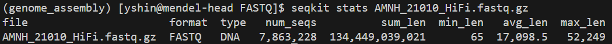

## 2) *k*-mer analysis of raw reads using jellyfish
Conduct a *k*-mer count analysis on the raw reads using jellyfish. This can be useful to estimate the genome size, heterozygosity, etc. Use the following script to submit a job to the AMNH Mendel HPC cluster. The "zcat [...]" line first unpacks the HiFi fastq.gz file (without permanently extracting the content, because this file is massive), converts it into the FASTA format (dropping quality scores, etc.), and pipes that into jellyfish. The output .jf file is then fed into the "jellyfish histo" command to produce the .histo file for viewing.

```sh
#!/bin/bash
#SBATCH --job-name=kmer_ussuri
#SBATCH --nodes=1
#SBATCH --mem=100G
#SBATCH --partition=compute
#SBATCH --cpus-per-task=24
#SBATCH --time=06:00:00
#SBATCH --mail-type=ALL
#SBATCH --mail-user=yshin@amnh.org
#SBATCH --output=/home/yshin/mendel-nas1/snake_genome_ass/G_ussuriensis_Chromo/scripts/outfiles/slurm-%x_%j.out
#SBATCH --error=/home/yshin/mendel-nas1/snake_genome_ass/G_ussuriensis_Chromo/scripts/outfiles/slurm-%x_%j.err

# initiate conda and activate the conda environment
source ~/.bash_profile
conda activate genome_assembly

# make sure the script to fail fast and loudly if something is broken
set -euo pipefail

# path to sequence read
path_to_seq=/home/yshin/mendel-nas1/snake_genome_ass/G_ussuriensis_Chromo/PacBio_Revio/FASTQ

# specify output directory
outdir=/home/yshin/mendel-nas1/snake_genome_ass/G_ussuriensis_Chromo/PacBio_Revio/outfiles/

# run jellyfish
zcat ${path_to_seq}/AMNH_21010_HiFi.fastq.gz | awk 'NR%4==1{print ">"substr($0,2)} NR%4==2{print}' | jellyfish count -m 21 -s 10G -t ${SLURM_CPUS_PER_TASK} -C /dev/fd/0 -o ${outdir}/Gloydius_ussuriensis_kmer.jf
jellyfish histo ${outdir}/Gloydius_ussuriensis_kmer.jf -t ${SLURM_CPUS_PER_TASK} > ${outdir}/Gloydius_ussuriensis_kmer.histo
```

The output .histo file can be fed into GenomeScope 2.0 (http://genomescope.org/genomescope2.0/) to visualize the results, which look something like: 

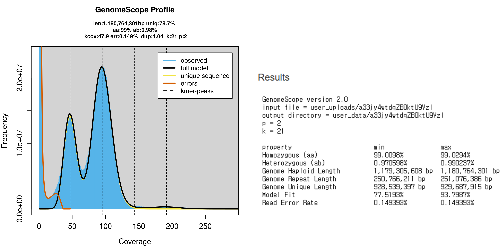

The results suggest:
  - Estimated haploid genome size of 1.18 Gb
  - Estimated repeat content of 21.3%
  - High homozygosity (~99%)
  - Very low read error rate (~0.15%) 
  - Very high sequencing coverage/depth (~100x)

## 3) Draft genome assembly using hifiasm
Hifiasm (https://github.com/chhylp123/hifiasm) is a fast, haplotype-resolved assembler for PacBio long-read sequencing data. Use the following script to submit a hifiasm job to the Mendel cluster. The estimated coverage for this sample is very high (100x ~ 114x) and the fastq.gz file of raw reads is very big (63 GB). Use the bigmem partition and request a sufficient amount of CPUs and walltime to assemble this genome.

```sh
#!/bin/bash
#SBATCH --job-name=hifi_ussuri
#SBATCH --nodes=1
#SBATCH --mem=650G
#SBATCH --partition=bigmem
#SBATCH --cpus-per-task=24
#SBATCH --time=7-00:00:00
#SBATCH --mail-type=ALL
#SBATCH --mail-user=yshin@amnh.org
#SBATCH --output=/home/yshin/mendel-nas1/snake_genome_ass/G_ussuriensis_Chromo/scripts/outfiles/slurm-%x_%j.out
#SBATCH --error=/home/yshin/mendel-nas1/snake_genome_ass/G_ussuriensis_Chromo/scripts/outfiles/slurm-%x_%j.err

# initiate conda and activate the conda environment
source ~/.bash_profile
conda activate genome_assembly

# set output directory
out_dir=/home/yshin/mendel-nas1/snake_genome_ass/G_ussuriensis_Chromo/PacBio_Revio/hifiasm

# set taxon name as a variable
name="Gloydius_ussuriensis"

# run hifiasm - put results in their own directory named after the species
hifiasm -o ${out_dir}/${name}_v1.asm -t ${SLURM_CPUS_PER_TASK} /home/yshin/mendel-nas1/snake_genome_ass/G_ussuriensis_Chromo/PacBio_Revio/FASTQ/AMNH_21010_HiFi.fastq.gz
``` 
This will take approximately 22 hours to run on Mendel. The output files should look something like this:
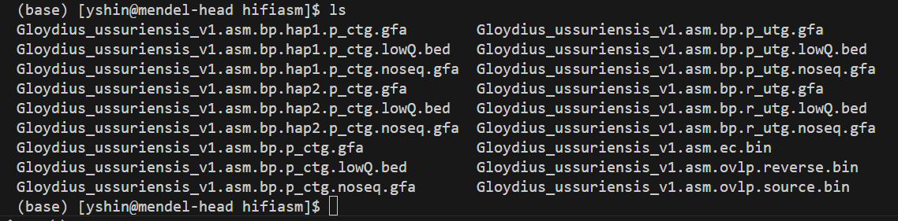

Among all these files the "bp.p_ctg.gfa" file contains the assembly graph of primary contigs and this is the file we will use in all downstream stuff. However, some packages take .fa as input, not .gfa. So we first need to convert the .gfa file of primary contigs into .fa file. Run the line below in the directory containing the hifiasm output files:

```txt
awk '$1=="S"{print ">"$2"\n"$3}' Gloydius_ussuriensis_v1.asm.bp.p_ctg.gfa > Gloydius_ussuriensis_v1.asm.bp.p_ctg.fa
```

## 4) Contamination screening
The draft assembly likely contains mitochondrial contigs and/or potential microbial contaminants. So, it is always a good idea to check for these and "clean up" the genome before finalizing the assembly and publishing it. This section is based on https://github.com/amandamarkee/actias-luna-genome

Let's setup the workspace for this clean up step.
```
# make a directory for clean up work
mkdir genome_cleanup

# copy the draft assembly from its directory to the clean up workspace
cp Gloydius_ussuriensis_v1.asm.bp.p_ctg.fa /home/yshin/mendel-nas1/snake_genome_ass/G_ussuriensis_Chromo/genome_cleanup

# create a conda env for blobtools
conda create -n blobtools
conda activate blobtools

# install blobtools
conda install bioconda::blobtools

```

Let's start by getting the "pre-cleanup" stats
```
seqkit stats Gloydius_ussuriensis_v1.asm.bp.p_ctg.fa > preclean_stats.txt
cat preclean_stats.txt
```
We can see that there are 140 contigs total.

----------------------------------------------------------------------------------------------------
### Screening for potential non-vertebrate contaminants using blobtools
We will use blobtools to identify potential non-vertebrate (e.g., microbial) contaminants. To run blobtools, we need the following:
  - nodes.dmp and names.dmp files from NCBI taxdump
  - .bam file output from minimap2 and samtools
  - .nt blast hit file from ncbi megablast run

Let's prep these files. First, get nodes.dmp and names.dmp files from NCBI taxdump.
```
# activate the blobtools conda env to use blobtools
conda activate blobtools

# create a directory to store data
mkdir data

# download NCBI taxdump and create nodes.dmp and names.dmp
wget ftp://ftp.ncbi.nlm.nih.gov/pub/taxonomy/taxdump.tar.gz -P data/
tar zxf data/taxdump.tar.gz -C data/ nodes.dmp names.dmp
blobtools nodesdb --nodes data/nodes.dmp --names data/names.dmp
```
Then, if you do "ls data/" you should see something like:


To generate the blast hit file, we will use the Huxley cluster because it already has the database soft linked to /nas3. Blast is also available as a module on Huxley. But before running blast, there is one thing to consider - blasting a whole genome assembly againt the database will take a long time. The job will either fail due to insufficient computational resources or walltime. 

One loophole is to divide up the assembly fasta file and then running an array job (thanks Amanda for this tip!).

To divide up the assembly fasta file, navigate to the directory containing the assembled genome and run these commands in the console:

```txt
# make directory for split fasta files
mkdir asm_div

# spilit fasta
awk 'BEGIN {n_seq=0;} /^>/ \
{if(n_seq%50==0){file=sprintf("seq_%d.fa",n_seq);} \
print >> file; n_seq++; next;} { print >> file; }' < Gloydius_ussuriensis_v1.asm.bp.p_ctg.fa

# move split fastas to asm_div directory
mv seq_* asm_div/

# put split files into a list
cd asm_div/
ls *.fa > blast.list

# check the number of lines in the blast.list file to use as an input to the array command
wc -l blast.list
```

Then run the array job as below:
```sh
#!/bin/bash
#SBATCH --job-name=blobBlst_ussuri
#SBATCH --nodes=1
#SBATCH --mem=500G
#SBATCH --partition=bigmem
#SBATCH --cpus-per-task=32
#SBATCH --array=1-3
#SBATCH --time=7-00:00:00
#SBATCH --mail-type=ALL
#SBATCH --mail-user=yshin@amnh.org
#SBATCH --output=/home/yshin/nas4/G_ussuriensis_Chromo/slurm_logs/slurm-%x_%j.out
#SBATCH --error=/home/yshin/nas4/G_ussuriensis_Chromo/slurm_logs/slurm-%x_%j.err

# this is run on the AMNH Huxley cluster
# load module
module load BLAST/2.11.0-Linux_x86_64 

# path to genome cleanup directory
wdir=/home/yshin/nas4/G_ussuriensis_Chromo/genome_cleanup

# path to DB
export BLASTDB=/nas3/database/nt_2024_10_23
blastdbcmd -db nt -info

# path to assembly
path_to_asm=${wdir}/asm_div

# output dir
out_dir=/home/yshin/nas4/G_ussuriensis_Chromo/genome_cleanup/blast_out

# assign and print array ID
i=${SLURM_ARRAY_TASK_ID}
P=$(awk "NR==$i" ${path_to_asm}/blast.list)

# run blast
blastn \
  -db nt \
  -task megablast \
  -query ${path_to_asm}/${P} \
  -out ${out_dir}/${P}.blast.out \
  -max_target_seqs 10 \
  -max_hsps 1 \
  -evalue 1e-20 \
  -outfmt "6 qseqid staxids bitscore sseqid sskingdoms sscinames" \
  -num_threads=${SLURM_CPUS_PER_TASK}  
```

Once this job finishes running, navigate to the output directory and merge the three output files into a single .nt file to be used as an input for blobtools.
```
# the output dir is /home/yshin/nas4/G_ussuriensis_Chromo/genome_cleanup/blast_out
cat *.blast.out > Gloydius_megablast.nt
```
Now, send this file to Mendel so that it can be used as input for blobtools.

We also need mapping files as a final input. These can be made by mapping the raw fastq file back to the reference (i.e. draft assembly) using minimap2, and then converting the output SAM file into a BAM file and sorting and indexing them using samtools. Run the job script below on Mendel:

```sh
#!/bin/bash
#SBATCH --job-name=blobMapping_ussuri
#SBATCH --nodes=1
#SBATCH --mem=200G
#SBATCH --partition=compute
#SBATCH --cpus-per-task=32
#SBATCH --time=144:00:00
#SBATCH --mail-type=ALL
#SBATCH --mail-user=yshin@amnh.org
#SBATCH --output=/home/yshin/mendel-nas1/snake_genome_ass/G_ussuriensis_Chromo/scripts/outfiles/slurm-%x_%j.out
#SBATCH --error=/home/yshin/mendel-nas1/snake_genome_ass/G_ussuriensis_Chromo/scripts/outfiles/slurm-%x_%j.err

# activate conda env
source ~/.bash_profile
conda activate genome_assembly

# designate paths to assembly and fastq
path=/home/yshin/mendel-nas1/snake_genome_ass/G_ussuriensis_Chromo/genome_cleanup

# output directory
outdir=/home/yshin/mendel-nas1/snake_genome_ass/G_ussuriensis_Chromo/genome_cleanup/mapping

# mapping
# -@ 8 means "use 8 threads" 
minimap2 -t ${SLURM_CPUS_PER_TASK} -ax map-hifi ${path}/Gloydius_ussuriensis_v1.asm.bp.p_ctg.fa \
  ${path}/AMNH_21010_HiFi.fastq.gz | samtools view -@ 8 -b \
  | samtools sort -@ 8 -o ${outdir}/ussuri_aln_sorted.bam

# index BAM 
samtools index ${outdir}/ussuri_aln_sorted.bam 
```
Now we have all the input files required to run blobtools. Run blobtools with this script on Mendel:

```sh
#!/bin/bash
#SBATCH --job-name=blobView_ussuri
#SBATCH --nodes=1
#SBATCH --mem=200G
#SBATCH --partition=compute
#SBATCH --cpus-per-task=32
#SBATCH --time=144:00:00
#SBATCH --mail-type=ALL
#SBATCH --mail-user=yshin@amnh.org
#SBATCH --output=/home/yshin/mendel-nas1/snake_genome_ass/G_ussuriensis_Chromo/scripts/outfiles/slurm-%x_%j.out
#SBATCH --error=/home/yshin/mendel-nas1/snake_genome_ass/G_ussuriensis_Chromo/scripts/outfiles/slurm-%x_%j.err

# activate conda env
source ~/.bash_profile
conda activate blobtools

# set paths to different inputs
asm=/home/yshin/mendel-nas1/snake_genome_ass/G_ussuriensis_Chromo/genome_cleanup/Gloydius_ussuriensis_v1.asm.bp.p_ctg.fa
aln_sorted_bam=/home/yshin/mendel-nas1/snake_genome_ass/G_ussuriensis_Chromo/genome_cleanup/mapping/ussuri_aln_sorted.bam
megablast=/home/yshin/mendel-nas1/snake_genome_ass/G_ussuriensis_Chromo/genome_cleanup/blast_out/Gloydius_megablast.nt
nodes=/home/yshin/mendel-nas1/snake_genome_ass/G_ussuriensis_Chromo/genome_cleanup/data/nodes.dmp
names=/home/yshin/mendel-nas1/snake_genome_ass/G_ussuriensis_Chromo/genome_cleanup/data/names.dmp

# output dir
outdir=/home/yshin/mendel-nas1/snake_genome_ass/G_ussuriensis_Chromo/genome_cleanup/blob_out

# run blobtools
blobtools create -i ${asm} -b ${aln_sorted_bam} -t ${megablast} --nodes ${nodes} --names ${names} \
  -o ${outdir}/ussuri_blob_results
```

Now, run the lines below in the head node to generate output files and plots.
```
# activate blobtools conda env
conda activate blobtools

# cd into the blobtools output directory
# view blobtools results and plot
blobtools view -i ussuri_blob_results.blobDB.json
blobtools plot -i ussuri_blob_results.blobDB.json
```
This will generate a whole bunch of files:
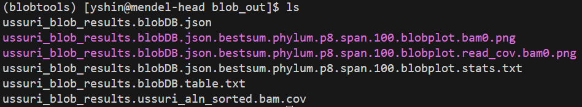

Now, scp these files from the cluster to a local device for viewing.

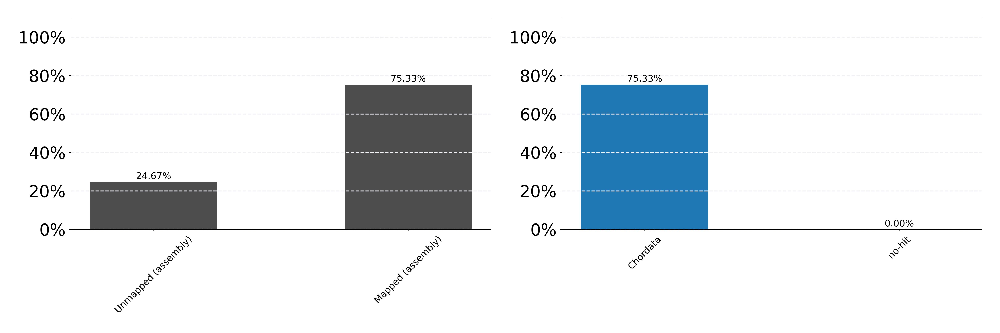

We can see there are no obvious non-vertebrate contaminants.

----------------------------------------------------------------------------------------------------
### Identifying and removing mitochondrial contigs from the draft assembly
PacBio long-read assemblies usually contain complete mitogenomes as a sequencing bycatch, and it is a good idea to identify and remove them from primary assemblies in order to get a clean nuclear whole genome. This can be done by blasting the mitochondrial reference to the draft assembly. *G. ussuriensis* already has a couple assembled mitogenomes on GenBank. We will use one of them (NC_026553.1) as a mitocohndrial reference. Let's fetch this sequence from GenBank using entrez.

```txt
# create a directory to store mito reference
mkdir -p /home/yshin/mendel-nas1/snake_genome_ass/G_ussuriensis_Chromo/PacBio_Revio/mito_ref
cd /home/yshin/mendel-nas1/snake_genome_ass/G_ussuriensis_Chromo/PacBio_Revio/mito_ref

# install entrez to fetch seq from ncbi
conda activate genome_assembly
conda install -y -c bioconda entrez-direct

# fetch seq and annotation
ref_acc=NC_026553.1
echo ${ref_acc}

efetch -db nucleotide -id ${ref_acc} -format fasta > ${ref_acc}.fa
efetch -db nucleotide -id ${ref_acc} -format gbwithparts > ${ref_acc}.gb

# move the .fa file to the "genome_cleanup" directory
cp NC_026553.1.fa /home/yshin/mendel-nas1/snake_genome_ass/G_ussuriensis_Chromo/genome_cleanup
```
Once you get this file, we can run blast on Mendel with the script below. Note that we are creating a blast database internally in this script. The "-outfmt 6" flag means that the output format will be tabular. 
```sh
#!/bin/bash
#SBATCH --job-name=idMito_ussuri
#SBATCH --nodes=1
#SBATCH --mem=200G
#SBATCH --partition=compute
#SBATCH --cpus-per-task=32
#SBATCH --time=144:00:00
#SBATCH --mail-type=ALL
#SBATCH --mail-user=yshin@amnh.org
#SBATCH --output=/home/yshin/mendel-nas1/snake_genome_ass/G_ussuriensis_Chromo/scripts/outfiles/slurm-%x_%j.out
#SBATCH --error=/home/yshin/mendel-nas1/snake_genome_ass/G_ussuriensis_Chromo/scripts/outfiles/slurm-%x_%j.err

# load blast
module load NCBI/blast-2.10.1+

# set paths to input
mito_ref=/home/yshin/mendel-nas1/snake_genome_ass/G_ussuriensis_Chromo/genome_cleanup/NC_026553.1.fa
asm_fa=/home/yshin/mendel-nas1/snake_genome_ass/G_ussuriensis_Chromo/genome_cleanup/Gloydius_ussuriensis_v1.asm.bp.p_ctg.fa

# set output dir
outdir=/home/yshin/mendel-nas1/snake_genome_ass/G_ussuriensis_Chromo/genome_cleanup

# build DB in a dedicated folder with a proper prefix name
dbdir=${outdir}/blast_db_mito
mkdir -p "${dbdir}"
dbprefix="${dbdir}/ussuri_asm"

echo "Making BLAST DB:"
echo "  asm_fa   = ${asm_fa}"
echo "  dbprefix = ${dbprefix}"

makeblastdb -in "${asm_fa}" -dbtype nucl -out "${dbprefix}"

# sanity check DB
echo "DB files:"
ls -lh "${dbprefix}".n* || { echo "ERROR: DB files not found"; exit 1; }
blastdbcmd -db "${dbprefix}" -info || { echo "ERROR: blastdbcmd failed"; exit 1; }

# run blast
blastn \
-query "${mito_ref}" \
-db "${dbprefix}" \
-out ${outdir}/mito_contigs_blast.out \
-outfmt 6 \
-evalue 1e-20 \
-num_threads ${SLURM_CPUS_PER_TASK}

# convert output into csv
tr '\t' ',' < ${outdir}/mito_contigs_blast.out > ${outdir}/mito_contigs_blast.csv
```

The output should look something like this:
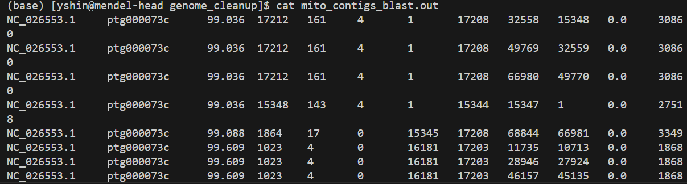

Let's break this down. 
- Column 1: "qseqid" (means "query sequence ID") - Shows the GenBank accession number of the mitogenome reference. 
- Column 2: "sseqid" (means "subject sequence ID") - Shows the contig names in the draft assembly. 
- Column 3: "pident" (percent identity) - Shows the percent match between the mitochondrial reference and contig. 
- Column 4: length - Shows the length of aligned region. 
- Column 5: mismatch - Shows the number of mismatched base pairs.
- Column 6: "gapopen" - Number of gaps in the alignment.
- Column 7: "qstart" - Start position on query (mitochondrial reference).
- Column 8: "qend" - End position on query.
- Column 9: "sstart" - Start position on subject (draft assembly). 
- Column 10: "send" - End position on subject.
- Column 11: "evalue" - evalue of 0 means that the probability the match is random is 0.
- Column 12: "bitscore" - Alignment score

Based on this, let's focus on the contig ptg000073c. This contig has a percent identity of 99% to the mitochondrial reference, the length of aligned region is 17,212bp, and mismatch is relatively small at 161bp over 17kb. The mitochondrial reference is 17,208bp. Based on this, this contig very likely contains the complete mitogenome, which is expected from PacBio long-read sequencing results. 

Let's look at this contig in more detail. First, let's check the length:
```
# make sure that you are working in the "genome_cleanup" directory
# activate conda env
conda activate genome_assembly

# check contig length
seqkit fx2tab -n -l Gloydius_ussuriensis_v1.asm.bp.p_ctg.fa | grep -w ptg000073c
```
This will show that the contig is 68.8Kb long, which is much longer than the actual mitogenome. But this likely because one whole mitogenome was repeated several time on the same contig. For example:
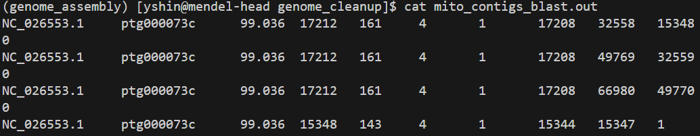
In the first three lines we can see that 17,212bp stretch is repeated three times, and the fourth line shows another 15,348bp region, and there are other, shorter hits. Combined, this is about 67Kb long. Also, 68.8Kb is about 17.2Kb x 4. 

We can verify this by blasting the putative mitochondrial contig to itself.
First, let's store this contig as a separate file.
```
# store mito contigs into a separate file
seqkit grep -p ptg000073c Gloydius_ussuriensis_v1.asm.bp.p_ctg.fa \
-o Gloydius_ussuriensis_AMNH_21010_mito.fa
```

Then, use the script below to run blast:
```sh
#!/bin/bash
#SBATCH --job-name=selfalignMito_ussuri
#SBATCH --nodes=1
#SBATCH --mem=50G
#SBATCH --partition=compute
#SBATCH --cpus-per-task=16
#SBATCH --time=04:00:00
#SBATCH --mail-type=ALL
#SBATCH --mail-user=yshin@amnh.org
#SBATCH --output=/home/yshin/mendel-nas1/snake_genome_ass/G_ussuriensis_Chromo/scripts/outfiles/slurm-%x_%j.out
#SBATCH --error=/home/yshin/mendel-nas1/snake_genome_ass/G_ussuriensis_Chromo/scripts/outfiles/slurm-%x_%j.err

# load modules
module load NCBI/blast-2.10.1+

# activate conda env
source ~/.bash_profile
conda activate genome_assembly

# inputs
mito_fa=/home/yshin/mendel-nas1/snake_genome_ass/G_ussuriensis_Chromo/genome_cleanup/Gloydius_ussuriensis_AMNH_21010_mito.fa
mito_contig="ptg000073c"

# output dir
outdir=/home/yshin/mendel-nas1/snake_genome_ass/G_ussuriensis_Chromo/genome_cleanup/selfalign_mito
mkdir -p "${outdir}"

# build BLAST DB from mito contig
dbdir="${outdir}/blast_db"
mkdir -p "${dbdir}"
dbprefix="${dbdir}/${mito_contig}"

echo "Making BLAST DB:"
echo "  mito_fa   = ${mito_fa}"
echo "  dbprefix  = ${dbprefix}"
makeblastdb -in "${mito_fa}" -dbtype nucl -out "${dbprefix}"

# sanity check DB
echo "DB info:"
blastdbcmd -db "${dbprefix}" -info || { echo "ERROR: blastdbcmd failed"; exit 1; }

# self-BLAST (mito vs mito)
# use stricter settings + filter to highlight tandem repeat structure
# include qlen/slen to help interpret offsets and copy structure.
tsv="${outdir}/${mito_contig}_selfblast.tsv"
csv="${outdir}/${mito_contig}_selfblast.csv"

blastn \
  -query "${mito_fa}" \
  -db "${dbprefix}" \
  -out "${tsv}" \
  -outfmt "6 qseqid sseqid pident length mismatch gapopen qstart qend sstart send evalue bitscore qlen slen" \
  -evalue 1e-50 \
  -num_threads "${SLURM_CPUS_PER_TASK}" \
  -dust no \
  -soft_masking false

# remove the trivial full-length self hit (diagonal) to make repeats obvious
# (keeps alignments where query and subject coordinates differ)
filtered_tsv="${outdir}/${mito_contig}_selfblast_filtered.tsv"
awk 'BEGIN{OFS="\t"} !($4==$13 && $7==1 && $8==$13 && $9==1 && $10==$13) {print}' "${tsv}" > "${filtered_tsv}"

# 5) convert to CSV (both full and filtered)
tr '\t' ',' < "${tsv}" > "${csv}"
tr '\t' ',' < "${filtered_tsv}" > "${outdir}/${mito_contig}_selfblast_filtered.csv"

echo "Done."
echo "Outputs:"
echo "  Full TSV      : ${tsv}"
echo "  Filtered TSV  : ${filtered_tsv}"
echo "  Full CSV      : ${csv}"
echo "  Filtered CSV  : ${outdir}/${mito_contig}_selfblast_filtered.csv"
```

Let's examine the output:
```
cat ptg000073c_selfblast_filtered.tsv
```


We can see that the alignment length here is 17,211bp. 17,211 x 4 is exactly 68,844bp. In the results, we can also see alignment lengths of 51,633bp (17,211 x 3) and 34,422bp (17,211 x 2). This basically means that the contig ptg000073c contains four tandem copies of the complete mitogenome.

Now that we identified the mitochondrial contig, let's snip it out from our draft assembly. This "no mito" assembly will be used in all downstream assembly steps.
```
# run on the head node
# set paths to input
asm=/home/yshin/mendel-nas1/snake_genome_ass/G_ussuriensis_Chromo/genome_cleanup/Gloydius_ussuriensis_v1.asm.bp.p_ctg.fa
mito_fa=/home/yshin/mendel-nas1/snake_genome_ass/G_ussuriensis_Chromo/genome_cleanup/ptg000073c.fa

# set output dir
outdir=/home/yshin/mendel-nas1/snake_genome_ass/G_ussuriensis_Chromo/PacBio_Revio/no_mito

# read the contig ID from the mito file
mito_id=$(grep -m1 "^>" "$mito_fa" | sed 's/^>//' | awk '{print $1}')
echo "mito contig ID = $mito_id"

# create the no-mito assembly
seqkit grep -v -p "$mito_id" "$asm" > "$outdir/Gloydius_ussuriensis_AMNH_21010_noMito.fa"

# sanity check == contig count should drop by 1
echo "original contigs:"; grep -c "^>" "$asm"
echo "no-mito contigs:"; grep -c "^>" "$outdir/Gloydius_ussuriensis_AMNH_21010_noMito.fa"
```
We can see that the total number of contigs went from 140 to 139 after removing the mito contig.

Also, let's store a single mitogenome copy for later use:
```
# run this in the "genome_cleanup" directory
seqkit grep -p ptg000073c Gloydius_ussuriensis_v1.asm.bp.p_ctg.fa > ptg000073c.fa
seqkit subseq -r 1:17211 ptg000073c.fa > mito_singlecopy.fa
seqkit stats mito_singlecopy.fa
```
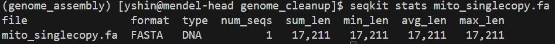

This is exactly what we expect to see.

As one final step, let's verify that the mitochondrial contig is gone from our draft assembly. This can be done using MitoHiFi (https://github.com/marcelauliano/MitoHiFi), which is a pipeline that finds, circularises and annotates mitogenome from PacBio assemblies. Installing this can be quite tricky. So, instead of fighting my way through installation, I created a directory for mitohifi under the "/home/yshin/mendel-nas1/snake_genome_ass/G_ussuriensis_Chromo" directory just copied the mitohifi.sif file from Dani's directory on Mendel. Also, it is possible to run MitoHiFi through the Galaxy web server (https://galaxy-main.usegalaxy.org/).
```
# make mitohifi directory
cd /home/yshin/mendel-nas1/snake_genome_ass/G_ussuriensis_Chromo
mkdir -p mitohifi
cd mitohifi/

# copy mitohifi.sif file over to this directory
cp /home/dgarcia/mendel-nas1/PacBio/Helicops_angulatus_Aug2024/mitogenome_assembly/MitoHiFi/mitohifi.sif .
``` 
After this, run the script below. If we correctly eliminated the mitochondrial contig, __this run should fail because there are no mitochondrial reads to find and annotate__

```sh
#!/bin/bash
#SBATCH --job-name=checkNoMito_ussuri
#SBATCH --nodes=1
#SBATCH --cpus-per-task=32
#SBATCH --mem=180G
#SBATCH --time=48:00:00
#SBATCH --partition=compute
#SBATCH --mail-type=ALL
#SBATCH --mail-user=yshin@amnh.org
#SBATCH --output=/home/yshin/mendel-nas1/snake_genome_ass/G_ussuriensis_Chromo/scripts/outfiles/slurm-%x_%j.out
#SBATCH --error=/home/yshin/mendel-nas1/snake_genome_ass/G_ussuriensis_Chromo/scripts/outfiles/slurm-%x_%j.err

# use mitohifi to verify the mito contig is absent from the "cleaned" assembly
# if we correctly eliminated mito contig, this script should fail to run
# the mitohifi .sif image was copied from Dani's file directory

# load apptainer to run mitohifi
module load Apptainer/apptainer-1.2.5

# MitoHiFi flags
# -c: assembled contigs in .fasta (e.g. output from hifiasm) 
# -r: PacBio read .fasta
# -f: Close-related Mitogenome is fasta format
# -g: .gb file associated with the mitogenome reference provided with -c
# -o: genetic code // vertebrate = 2 
# -t: n threads

# make output dir
outdir=/home/yshin/mendel-nas1/snake_genome_ass/G_ussuriensis_Chromo/check_no_mito
mkdir -p ${outdir}

# copy mitohifi.sif into outdir
cp /home/yshin/mendel-nas1/snake_genome_ass/G_ussuriensis_Chromo/mitohifi/mitohifi.sif ${outdir}

# cd into working directory
cd ${outdir}

# set paths for inputs (use /mendel-nas1, not /home/yshin/mendel-nas1)
contigs=/home/yshin/mendel-nas1/snake_genome_ass/G_ussuriensis_Chromo/PacBio_Revio/no_mito/Gloydius_ussuriensis_AMNH_21010_noMito.fa
mito_ref=/home/yshin/mendel-nas1/snake_genome_ass/G_ussuriensis_Chromo/PacBio_Revio/mito_ref/NC_026553.1.fa
mito_gb=/home/yshin/mendel-nas1/snake_genome_ass/G_ussuriensis_Chromo/PacBio_Revio/mito_ref/NC_026553.1.gb

# in-container file visibility test
apptainer exec --bind "/home/yshin:/home/yshin" --bind "/mendel-nas1:/mendel-nas1" --pwd "$PWD" mitohifi.sif \
  bash -lc 'ls -lh /home/yshin/mendel-nas1/snake_genome_ass/G_ussuriensis_Chromo/mitohifi/NC_026553.1.fa'

# run mitohifi
apptainer exec --bind "/home/yshin:/home/yshin" --bind "/mendel-nas1:/mendel-nas1" --pwd "$PWD" \
  mitohifi.sif python3 /opt/MitoHiFi/src/mitohifi.py -c ${contigs} -f ${mito_ref} -g ${mito_gb} -o 2 -t ${SLURM_CPUS_PER_TASK}
``` 
The error log should look something like this:
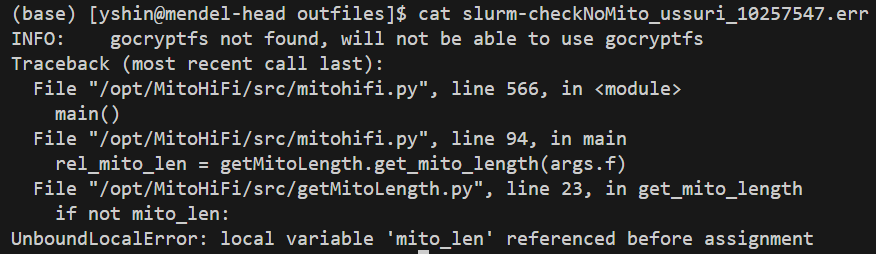

In contrast, running MitoHiFi with the assembly still containing the mitochondrial contig will produce the full result, including the annotated mitogenome.
```sh
#!/bin/bash
#SBATCH --job-name=mitoHiFi_ussuri
#SBATCH --nodes=1
#SBATCH --cpus-per-task=32
#SBATCH --mem=180G
#SBATCH --time=48:00:00
#SBATCH --partition=compute
#SBATCH --mail-type=ALL
#SBATCH --mail-user=yshin@amnh.org
#SBATCH --output=/home/yshin/mendel-nas1/snake_genome_ass/G_ussuriensis_Chromo/scripts/outfiles/slurm-%x_%j.out
#SBATCH --error=/home/yshin/mendel-nas1/snake_genome_ass/G_ussuriensis_Chromo/scripts/outfiles/slurm-%x_%j.err

# use mitohifi to identify and assemble a mitogenome from pacbio assembly
# the mitohifi .sif image was copied from Dani's file directory

# load apptainer to run mitohifi
module load Apptainer/apptainer-1.2.5

# MitoHiFi flags
# -c: assembled contigs in .fasta (e.g. output from hifiasm) 
# -r: PacBio read .fasta
# -f: Close-related Mitogenome is fasta format
# -g: .gb file associated with the mitogenome reference provided with -c
# -o: genetic code // vertebrate = 2 
# -t: n threads

# cd into working directory (optional)
cd /home/yshin/mendel-nas1/snake_genome_ass/G_ussuriensis_Chromo/mitohifi

# set paths for inputs (use /mendel-nas1, not /home/yshin/mendel-nas1)
contigs=/home/yshin/mendel-nas1/snake_genome_ass/G_ussuriensis_Chromo/genome_cleanup/Gloydius_ussuriensis_v1.asm.bp.p_ctg.fa
mito_ref=/home/yshin/mendel-nas1/snake_genome_ass/G_ussuriensis_Chromo/mitohifi/NC_026553.1.fa
mito_gb=/home/yshin/mendel-nas1/snake_genome_ass/G_ussuriensis_Chromo/mitohifi/NC_026553.1.gb

# in-container file visibility test
apptainer exec --bind "/home/yshin:/home/yshin" --bind "/mendel-nas1:/mendel-nas1" --pwd "$PWD" mitohifi.sif \
  bash -lc 'ls -lh /home/yshin/mendel-nas1/snake_genome_ass/G_ussuriensis_Chromo/mitohifi/NC_026553.1.fa'

# run mitohifi
apptainer exec --bind "/home/yshin:/home/yshin" --bind "/mendel-nas1:/mendel-nas1" --pwd "$PWD" \
  mitohifi.sif python3 /opt/MitoHiFi/src/mitohifi.py -c ${contigs} -f ${mito_ref} -g ${mito_gb} -o 2 -t ${SLURM_CPUS_PER_TASK}
```


Let's scp this file into a local device and have a closer look.
```
# run this locally in "/home/yshin/Gloydius_ussuriensis_genome_assembly/outfiles" directory
mkdir mitohifi
scp -r yshin@mendel.sdmz.amnh.org:/home/yshin/mendel-nas1/snake_genome_ass/G_ussuriensis_Chromo/mitohifi .
```

----------------------------------------------------------------------------------------------------
### Genomewide mean sequencing coverage after contamination screening
The coverage we calculated above from the raw fastq file represents the coverage based on total sequencing yield (i.e., amount of bases sequenced), prior to contamination screening. This value is going to be somewhat different from the mean sequencing coverage based on the reads mapped back to the assembly cleaned of contaminants and mitochondrial contigs. To calculate the mean sequencing coverage, let's first minimap2 to map the reads to the "no mito" assembly to generate and index a bam file. We will then calculate the coverage from this bam file:
```sh
#!/bin/bash
#SBATCH --job-name=calcCov_ussuri
#SBATCH --nodes=1
#SBATCH --mem=150G
#SBATCH --cpus-per-task=32
#SBATCH --partition=compute
#SBATCH --time=20:00:00
#SBATCH --mail-type=ALL
#SBATCH --mail-user=yshin@amnh.org
#SBATCH --output=/home/yshin/mendel-nas1/snake_genome_ass/G_ussuriensis_Chromo/scripts/outfiles/slurm-%x_%j.out
#SBATCH --error=/home/yshin/mendel-nas1/snake_genome_ass/G_ussuriensis_Chromo/scripts/outfiles/slurm-%x_%j.err

# activate conda env for genome assembly
source ~/.bash_profile
conda activate genome_assembly

# set paths
no_mito_dir=/home/yshin/mendel-nas1/snake_genome_ass/G_ussuriensis_Chromo/PacBio_Revio/no_mito/Gloydius_ussuriensis_AMNH_21010_noMito.fa
reads_dir=/home/yshin/mendel-nas1/snake_genome_ass/G_ussuriensis_Chromo/genome_cleanup/AMNH_21010_HiFi.fastq.gz   
out_dir=/home/yshin/mendel-nas1/snake_genome_ass/G_ussuriensis_Chromo/PacBio_Revio/no_mito/cov
mkdir -p ${out_dir}

# index fasta
samtools faidx ${no_mito_dir}

# map HiFi reads
echo "start mapping....."
minimap2 -t ${SLURM_CPUS_PER_TASK} -ax map-hifi ${no_mito_dir} ${reads_dir} \
| samtools sort -@ 8 -o ${out_dir}/no_mito_hifi.bam

samtools index ${out_dir}/no_mito_hifi.bam

# activate a separate conda env for the newer samtools version
source ~/.bash_profile
conda activate samtools

echo "activated a separate conda env for the newer samtools version....."

# calculate mean genome wide coverage 
echo "calculate mean genome wide coverage....."
samtools coverage ${out_dir}/no_mito_hifi.bam \
| awk 'NR>1 {sum += $3*$7; len += $3} END {print "mean depth of coverage =", sum/len "x"}'

# calculate how much of the genome (%) is covered >= 20x, 30x, and 50x
echo "calculate how much of the genome (%) is covered >= 20x, 30x, and 50x....."
samtools depth -a ${out_dir}/no_mito_hifi.bam \
| awk '{
  total++;
  if($3>=20) c20++;
  if($3>=30) c30++;
  if($3>=50) c50++;
} END {
  print "≥20× =", 100*c20/total "%";
  print "≥30× =", 100*c30/total "%";
  print "≥50× =", 100*c50/total "%";
}'

echo "done"
```
The result shows:
- 83.3x genome-wide mean coverage 
- 99% of the genome has ≥20× coverage
- 97.4% of the genome has ≥30× coverage
- 85.2% of the genome has ≥50× coverage


## 5) Draft assembly evaluation 
### Genome completeness using BUSCO
Now let's assess the completeness of our draft assembly output from hifiasm. BUSCO (Benchmarking Universal Single-Copy Orthologs) is a common metric to assess genome completeness. It uses a lineage-specific dataset to search for the presence/absence of highly conserved genes for that lineage in your genome assembly. We will use *compleasm* (https://github.com/huangnengCSU/compleasm) to assess genome completeness. This provides a faster alternative to the regular BUSCO package for large genome assemblies.

First, create a conda environment for *compleasm* and install the package:
```txt
# create a conda environment for compleasm and install it
conda create -n compleasm -c conda-forge -c bioconda compleasm
conda activate compleasm
compleasm -h
```

Run compleasm on Mendel with this script:
```sh
#!/bin/bash
#SBATCH --job-name=compleasm_ussuri
#SBATCH --nodes=1
#SBATCH --mem=200G
#SBATCH --partition=compute
#SBATCH --cpus-per-task=24
#SBATCH --time=12:00:00
#SBATCH --mail-type=ALL
#SBATCH --mail-user=yshin@amnh.org
#SBATCH --output=/home/yshin/mendel-nas1/snake_genome_ass/G_ussuriensis_Chromo/scripts/outfiles/slurm-%x_%j.out
#SBATCH --error=/home/yshin/mendel-nas1/snake_genome_ass/G_ussuriensis_Chromo/scripts/outfiles/slurm-%x_%j.err

# initiate conda and activate the conda environment
source ~/.bash_profile
conda activate compleasm

# set paths as variables
path_to_asm=/home/yshin/mendel-nas1/snake_genome_ass/G_ussuriensis_Chromo/PacBio_Revio/no_mito
out_path=/home/yshin/mendel-nas1/snake_genome_ass/G_ussuriensis_Chromo/PacBio_Revio/compleasm

# run compleasm
compleasm run -a ${path_to_asm}/Gloydius_ussuriensis_AMNH_21010_noMito.fa -o ${out_path} \
  -t ${SLURM_CPUS_PER_TASK} -l sauropsida --odb odb12
```

The script above should take only about 35 minutes to run. The results are:
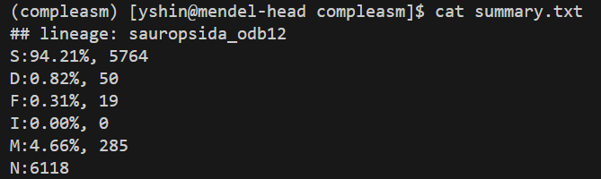

Compleasm output can be visualized in R:
```r
######  visualize compleasem output

# clean working environment
rm(list = ls(all.names = T))
gc()

# load packages
library(ggplot2)


######   compleasm result categories

# S (Single Copy Complete Genes): The BUSCO genes that can be entirely aligned in the assembly, with only one copy present.
# D (Duplicated Complete Genes): The BUSCO genes that can be completely aligned in the assembly, with more than one copy present.
# F (Fragmented Genes, subclass 1): The BUSCO genes which only a portion of the gene is present in the assembly, and the rest of the gene cannot be aligned.
# I (Fragmented Genes, subclass 2): The BUSCO genes in which a section of the gene aligns to one position in the assembly,
#                                   while the remaining part aligns to another position.
# M (Missing Genes): The BUSCO genes with no alignment present in the assembly.


######   compleasm result dataframe
compl_res <- data.frame(category = c('S', 'M', 'D', 'F'),
                        count = c(5764, 285, 50, 19))

print(compl_res)

######   calculate proportion
compl_res$percentage <- round((compl_res$count / sum(compl_res$count)) * 100, digits = 2) 
print(compl_res)

######   plotting order
compl_res$category <- factor(compl_res$category, levels = c('S', 'D', 'F', 'M'))


######   plot
ggplot(compl_res, aes(x = 2, y = percentage, fill = category)) +
  geom_col(width = 1, color = 'white') +
  xlim(0.1, 3.5) +
  coord_polar(theta = 'y') +
  scale_fill_manual(values = c(S = '#B3E2CD',
                               D = '#FDCDAC',
                               F = "#FFF2AE",
                               M = '#CBD5E8')) +
  theme_void() +
  theme(legend.position = 'none')

######  export plot
ggsave('Rplots/compleasm_result.png', width = 21, height = 20, dpi = 800, units = 'cm')
```
----------------------------------------------------------------------------------------------------
### Genome assembly stats with QUAST
QUAST is a quality assessment tool for genome assemblies. Installing QUAST in the "genome_assembly" conda environment is not possible because of python version clashes - we need to create a separate conda environment for this package.

Install QUAST:
```txt
conda create -n quast
conda activate quast
conda install bioconda::quast
``` 

When this is done, run QUAST with the script below:

```sh
#!/bin/bash
#SBATCH --job-name=quast_ussuri
#SBATCH --nodes=1
#SBATCH --mem=60G
#SBATCH --partition=compute
#SBATCH --cpus-per-task=24
#SBATCH --time=12:00:00
#SBATCH --mail-type=ALL
#SBATCH --mail-user=yshin@amnh.org
#SBATCH --output=/home/yshin/mendel-nas1/snake_genome_ass/G_ussuriensis_Chromo/scripts/outfiles/slurm-%x_%j.out
#SBATCH --error=/home/yshin/mendel-nas1/snake_genome_ass/G_ussuriensis_Chromo/scripts/outfiles/slurm-%x_%j.err

# initiate conda and activate the quast conda environment
source ~/.bash_profile
conda activate quast

# path to assembly
path_to_asm=/home/yshin/mendel-nas1/snake_genome_ass/G_ussuriensis_Chromo/PacBio_Revio/no_mito

# output directory
out_dir=/home/yshin/mendel-nas1/snake_genome_ass/G_ussuriensis_Chromo/PacBio_Revio/quast
mkdir -p ${out_dir}

# run quast
quast.py -t ${SLURM_CPUS_PER_TASK} ${path_to_asm}/Gloydius_ussuriensis_AMNH_21010_noMito.fa -o ${out_dir} 
```
----------------------------------------------------------------------------------------------------
### *k*-mer based assembly evaluation with Merqury
Let's use Merqury as another assembly evaluation tool. Similar to jellyfish, this one is also based on *k*-mers. But unlike jellyfish we ran above (which was on raw read fastq), we are running merqury on the assembly. Basically, jellyfish just counts *k*-mers from on your reads. On the other hand, merqury is a framework to evaluate assemblies based on *k*-mer comparisons. It basically compares the assembly to reads. In other words, it checks whether the assembly faithfully represent the sequences that exist in the reads, using *k*-mers as evidence. It does so by computing assembly QV (sequence accuracy), *k*-mer completeness, etc. 

The genome size estimate based on jellyfish was 1.18Gb, but the size estimate from QUAST was 1.59Gb.
By comparing read k-mers and assembly k-mers, Merqury can tell you whether the genome size based on jellyfish output is an underestimation of the true genome size.

Let's begin by creating a separate conda environment for merqury. We also need to install one of the dependencies (meryl) separately in that conda environment.
```
# create a new conda env for merqury
conda create -n merqury
conda activate merqury

# install meryl
conda install bioconda::meryl==1.4.1

# install merqury
conda install bioconda::merqury
```
Then run Merqury like so:
```sh
#!/bin/bash
#SBATCH --job-name=merqury_ussuri
#SBATCH --nodes=1
#SBATCH --cpus-per-task=32
#SBATCH --mem=180G
#SBATCH --time=48:00:00
#SBATCH --partition=compute
#SBATCH --mail-type=ALL
#SBATCH --mail-user=yshin@amnh.org
#SBATCH --output=/home/yshin/mendel-nas1/snake_genome_ass/G_ussuriensis_Chromo/scripts/outfiles/slurm-%x_%j.out
#SBATCH --error=/home/yshin/mendel-nas1/snake_genome_ass/G_ussuriensis_Chromo/scripts/outfiles/slurm-%x_%j.err

# activate conda env 
source ~/.bash_profile
conda activate merqury

# inputs 
asm_dir=/home/yshin/mendel-nas1/snake_genome_ass/G_ussuriensis_Chromo/PacBio_Revio/no_mito/Gloydius_ussuriensis_AMNH_21010_noMito.fa
read_dir=/home/yshin/mendel-nas1/snake_genome_ass/G_ussuriensis_Chromo/PacBio_Revio/FASTQ/AMNH_21010_HiFi.fastq.gz

# parameters
K=21
THREADS=${SLURM_CPUS_PER_TASK}

# outputs 
out_dir=/home/yshin/mendel-nas1/snake_genome_ass/G_ussuriensis_Chromo/PacBio_Revio/merqury/noMito_k${K}
PREFIX=AMNH_21010_noMito_k${K}

mkdir -p "$out_dir"
cd "$out_dir"

echo "[INFO] Using K=$K threads=$THREADS"
echo "[INFO] Assembly: $asm_dir"
echo "[INFO] Reads:    $read_dir"
echo "[INFO] Output:   $out_dir/$PREFIX.*"

# sanity checks
command -v meryl >/dev/null 2>&1 || { echo "[ERROR] meryl not found in PATH"; exit 1; }
command -v merqury.sh >/dev/null 2>&1 || { echo "[ERROR] merqury.sh not found in PATH"; exit 1; }

# build read k-mer database
echo "[INFO] Counting k-mers in reads with meryl..."
meryl k=$K threads=$THREADS count "$read_dir" output reads.k${K}.meryl

# run Merqury == computes QV, completeness, spectra-cn, etc.
echo "[INFO] Running Merqury..."
merqury.sh reads.k${K}.meryl "$asm_dir" "$PREFIX" 2>&1 | tee "$PREFIX.merqury.log"

echo "[INFO] Done."
echo "[INFO] Key outputs to look at:"
echo "  - ${PREFIX}.qv            (assembly QV)"
echo "  - ${PREFIX}.completeness  (k-mer completeness)"
echo "  - ${PREFIX}.spectra-cn.*  (copy-number spectra plots/data)"
```
Check the results when the job finishes running. Let's check the .qv file first.
```
# cd into "/home/yshin/mendel-nas1/snake_genome_ass/G_ussuriensis_Chromo/PacBio_Revio/merqury/noMito_k21" dirctory"
cat AMNH_21010_noMito_k21.qv 
```


Let's break it down:
- Column 1: Assembly name
- Column 2: Error *k*-mers
- Column 3: Total bases
- Column 4: QV score
- Column 5: Error rate

We can see the QV score is very high (> 70) and error rate is very low. This means that the estimated genome size based on QUAST is unlikely to be an overestimation due to sequencing artifacts/errors. 

Let's also check the *k*-mer completeness.
```
cat AMNH_21010_noMito_k21.completeness.stats
```
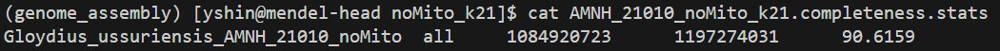
- Column 1: Assembly name
- Column 2: Subset ("all" means that completeness was calculated from all read *k*-mers)
- Column 3: Total read *k*-mers found in the assembly
- Column 4: Total *k*-mers found in the reads
- Column 5: *k*-mer completeness (%)

So, the *k*-mer completeness is very high. The ~9.4% of the *k*-mers in the reads are not present in the assembly likely due to: 1) Repeat complexity, 2) *k*-mers specific to alternative alleles at heterozygous loci not present in collapsed primary assembly, 3) Filtering based on read coverage. This does not mean that ~9.4% of the genome is missing. For these reasons, the haploid genome size estimated by jellyfish (1.18Gb) is likely and underestimation of the true genome size (1.6Gb) due to repeats and heterozygosity.

## 6) Scaffolding through Hi-C data incorporation
### Hi-C sequencing overview
Hi-C sequencing was done at Texas A&M Institute for Genome Sciences and Society (TIGGS) on three lanes of Illumina NovaSeq X Plus, using the same blood sample used for PacBio sequencing. The sequencing libraries were prepared using the Dovetail Omni-C kit.

### Setup
Let's create a directory for scaffolding and install YaHS, which is a scaffolding tool for Hi-C data.
```sh
# create a directory for scaffolding
mkdir -p /home/yshin/mendel-nas1/snake_genome_ass/G_ussuriensis_Chromo/scaffolding
```

Let's also create a conda env for scaffolding on Mendel and install YaHS.
```sh
# create conda env for scaffolding
conda create -n scaffolding
conda activate scaffolding

# install YaHS
conda install bioconda::yahs
```

### Combine sequencing reads across lanes
The sample was sequenced on three Illuminal lanes. So, there are six files total (two reads x three lanes). 


Let's combine reads across lanes.
```sh
# run under the scaffolding directory in Mendel
mkdir -p combined

cat \
  lane_1/26231TGS_Gloydius-ussuriensis-21010_S5_L001_R1_001.fastq.gz \
  lane_2/26231TGS_Gloydius-ussuriensis-21010_S5_L002_R1_001.fastq.gz \
  lane_3/26231TGS_Gloydius-ussuriensis-21010_S5_L005_R1_001.fastq.gz \
  > combined/Gloydius_ussuriensis_HiC_R1.fastq.gz

cat \
  lane_1/26231TGS_Gloydius-ussuriensis-21010_S5_L001_R2_001.fastq.gz \
  lane_2/26231TGS_Gloydius-ussuriensis-21010_S5_L002_R2_001.fastq.gz \
  lane_3/26231TGS_Gloydius-ussuriensis-21010_S5_L005_R2_001.fastq.gz \
  > combined/Gloydius_ussuriensis_HiC_R2.fastq.gz
```
Also note that it is not necessary to adapter/quality trim reads for Dovetail Omni-C libraries. Proceed to Hi-C mapping and scaffolding.

### Map Hi-C reads to the draft genome
The next step is to prepare the PacBio draft genome and map Hi-C reads to it. Let's symlink the draft directory into the scaffolding directory.

```sh
# under the scaffolding directory on Mendel
mkdir -p draft
ln -s /home/yshin/mendel-nas1/snake_genome_ass/G_ussuriensis_Chromo/PacBio_Revio/no_mito/Gloydius_ussuriensis_AMNH_21010_noMito.fa draft/Gloydius_ussuriensis_AMNH_21010_noMito.fa
```

To index the draft genome and to map Hi-C reads to it, we need to install BWA. Also install samtools.

```sh
# in the scaffolding conda env
conda install bioconda::bwa
conda install bioconda::samtools
```

Then, run the script below to index the draft genome.
```sh
#!/bin/bash
#SBATCH --job-name=bwa_index
#SBATCH --cpus-per-task=8
#SBATCH --mem=32G
#SBATCH --time=08:00:00
#SBATCH --mail-type=ALL
#SBATCH --mail-user=yshin@amnh.org
#SBATCH --output=/home/yshin/mendel-nas1/snake_genome_ass/G_ussuriensis_Chromo/scripts/outfiles/slurm-%x_%j.out
#SBATCH --error=/home/yshin/mendel-nas1/snake_genome_ass/G_ussuriensis_Chromo/scripts/outfiles/slurm-%x_%j.err

# initiate conda and activate the conda environment
source ~/.bash_profile
conda activate scaffolding

# set directory
indir=/home/yshin/mendel-nas1/snake_genome_ass/G_ussuriensis_Chromo/scaffolding/draft

# run bwa
bwa index ${indir}/Gloydius_ussuriensis_AMNH_21010_noMito.fa
samtools faidx ${indir}/Gloydius_ussuriensis_AMNH_21010_noMito.fa
```

After the above script finishes running, map Hi-C reads to the draft using bwa-mem.
```sh
#!/bin/bash
#SBATCH --job-name=hic_map
#SBATCH --nodes=1
#SBATCH --cpus-per-task=32
#SBATCH --mem=300G
#SBATCH --time=72:00:00
#SBATCH --partition=compute
#SBATCH --mail-type=ALL
#SBATCH --mail-user=yshin@amnh.org
#SBATCH --output=/home/yshin/mendel-nas1/snake_genome_ass/G_ussuriensis_Chromo/scripts/outfiles/slurm-%x_%j.out
#SBATCH --error=/home/yshin/mendel-nas1/snake_genome_ass/G_ussuriensis_Chromo/scripts/outfiles/slurm-%x_%j.err

# initiate conda and activate the conda environment
source ~/.bash_profile
conda activate scaffolding

# make sure the job will stop if any step fails
set -euo pipefail

# set directories
indir="/home/yshin/mendel-nas1/snake_genome_ass/G_ussuriensis_Chromo/scaffolding/combined"
outdir="/home/yshin/mendel-nas1/snake_genome_ass/G_ussuriensis_Chromo/scaffolding"
tmpdir="${outdir}/tmp_hic_map_${SLURM_JOB_ID}"

# make directories for temp files
sort1_tmp="${tmpdir}/sort1"
namesort_tmp="${tmpdir}/namesort"
coordsort_tmp="${tmpdir}/coordsort"

mkdir -p "${sort1_tmp}" "${namesort_tmp}" "${coordsort_tmp}"

# make a directory for bwa logs
mkdir -p "${outdir}/logs"

# set variables
REF="/home/yshin/mendel-nas1/snake_genome_ass/G_ussuriensis_Chromo/scaffolding/draft/Gloydius_ussuriensis_AMNH_21010_noMito.fa"
R1="${indir}/Gloydius_ussuriensis_HiC_R1.fastq.gz"
R2="${indir}/Gloydius_ussuriensis_HiC_R2.fastq.gz"
BAM_PREFIX="${outdir}/Gloydius_ussuriensis_HiC_to_draft"

# basic checks
echo "Starting BWA mapping: $(date)"
echo "REF = ${REF}"
echo "R1  = ${R1}"
echo "R2  = ${R2}"
echo "TMP = ${tmpdir}"

# quota/filesystem reporting
quota -s || true
df -h "${outdir}" || true

# flag if inputs are missing
[[ -s "${REF}" ]] || { echo "ERROR: missing reference ${REF}"; exit 1; }
[[ -s "${R1}" ]] || { echo "ERROR: missing R1 ${R1}"; exit 1; }
[[ -s "${R2}" ]] || { echo "ERROR: missing R2 ${R2}"; exit 1; }

# run bwa mem
bwa mem -5SP -t ${SLURM_CPUS_PER_TASK} "${REF}" "${R1}" "${R2}" 2> "${outdir}/logs/bwa_mem.log" | \
  samtools view -@ 16 -bS - | \
  samtools sort -@ 16 -m 4G -T "${sort1_tmp}/sort1" -o "${BAM_PREFIX}.sorted.bam" -

samtools index "${BAM_PREFIX}.sorted.bam"

# name-sort for fixmate
echo "Starting name-sort: $(date)"
ls -ld "${namesort_tmp}"
df -h "${namesort_tmp}" || true
quota -s || true

samtools sort -@ 16 -m 4G -T "${namesort_tmp}/namesort" -n \
  -o "${BAM_PREFIX}.namesort.bam" \
  "${BAM_PREFIX}.sorted.bam"

# add mate information
samtools fixmate -@ 16 -m \
  "${BAM_PREFIX}.namesort.bam" \
  "${BAM_PREFIX}.fixmate.bam"

# coordinate-sort again
samtools sort -@ 16 -m 4G -T "${coordsort_tmp}/coordsort" \
  -o "${BAM_PREFIX}.fixmate.coordsort.bam" \
  "${BAM_PREFIX}.fixmate.bam"

# mark duplicates
samtools markdup -@ 16 \
  "${BAM_PREFIX}.fixmate.coordsort.bam" \
  "${BAM_PREFIX}.markdup.bam"

samtools index "${BAM_PREFIX}.markdup.bam"

# produce basic mapping summary
samtools flagstat "${BAM_PREFIX}.markdup.bam" > "${BAM_PREFIX}.markdup.flagstat.txt"

# check final BAM integrity
samtools quickcheck -v "${BAM_PREFIX}.markdup.bam"

# clean temp files only if everything succeeded
rm -rf "${tmpdir}"

echo "Finished Hi-C mapping: $(date)"
ls -lh "${BAM_PREFIX}.markdup.bam" "${BAM_PREFIX}.markdup.bam.bai" "${BAM_PREFIX}.markdup.flagstat.txt"
``` 
The above script has the following steps:
  1) bwa-mem maps the trimmed Hi-C reads to the draft HiFi genome and outputs alignments as SAM text
  2) samtools view reads that SAM from the pipe and converts it to BAM
  3) samtools sort coordinate-sorts the BAM and writes a sorted bam file
  4) samtools index creates an index for the coordinate-sorted BAM.
  5) samtools sort -n creates a name-sorted BAM (read pairs are placed next to each other)
  6) samtools fixmate adds/corrects mate-pair information needed for duplicate marking
  7) samtools sort coordinate-sorts the BAM again
  8) samtools markdup marks duplicate alignments in the BAM
  9) samtools index indexes the duplicate-marked BAM
  10) samtools flagstat summarizes the final duplicate-marked BAM

### Scaffolding with YaHS
After mapping is done, run scaffolding with YaHS. YaHS takes optional arguments, a contig fasta file (i.e., draft genome), and one of several possible Hi-C input format (e.g., bed, bam, pa5, bin).

```sh
#!/bin/bash
#SBATCH --job-name=yahs_hic
#SBATCH --cpus-per-task=16
#SBATCH --mem=100G
#SBATCH --time=48:00:00
#SBATCH --mail-type=ALL
#SBATCH --mail-user=yshin@amnh.org
#SBATCH --output=/home/yshin/mendel-nas1/snake_genome_ass/G_ussuriensis_Chromo/scripts/outfiles/slurm-%x_%j.out
#SBATCH --error=/home/yshin/mendel-nas1/snake_genome_ass/G_ussuriensis_Chromo/scripts/outfiles/slurm-%x_%j.err

# initiate conda and activate the conda environment
source ~/.bash_profile
conda activate scaffolding

# stop if anything fails
set -euo pipefail

# set paths
indir="/home/yshin/mendel-nas1/snake_genome_ass/G_ussuriensis_Chromo/scaffolding"
outdir="${indir}/yahs_out"

REF="${indir}/draft/Gloydius_ussuriensis_AMNH_21010_noMito.fa"
BAM="${indir}/Gloydius_ussuriensis_HiC_to_draft.markdup.bam"

# make yahs outdir
mkdir -p "$outdir"
cd "$outdir"

# run yahs
yahs "$REF" "$BAM" -o Gloydius_ussuriensis_AMNH_21010_yahs
```

Submit the above script with the following SLURM dependency (the script will start running once the mapping job is done).
```sh
sbatch --dependency=afterok:10822420 G_ussuri_YaHS.sh
```
Check the assembly stats in the log file after YaHS finishes running.


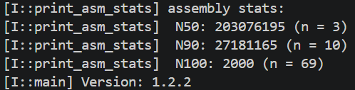

We can see that the scaffold N50 = 203.1 Mb and L50 = 3, which is much more contiguous than our PacBio N50 = 127.5 Mb and L50 = 3.

The key output here is "Gloydius_ussuriensis_AMNH_21010_yahs_scaffolds_final.fa." Let's index this file. This will generate a ".fai" file.
```
# activate the scaffolding conda env first to access samtools
samtools faidx Gloydius_ussuriensis_AMNH_21010_yahs_scaffolds_final.fa
```
Let's inspect scaffold sizes.
```
cut -f1,2 Gloydius_ussuriensis_AMNH_21010_yahs_scaffolds_final.fa.fai | sort -k2,2nr | head -n 30
```
This will show that there are 9 very large scaffolds (57–341 Mb), several medium scaffolds (8–27 Mb), and many small leftover scaffolds.

To see if these scaffolds are correctly oriented and joined, we need to look at the Hi-C contact map.

### Hi-C contact map visualization with Juicer/Juicer Tools
Juicer is already installed together with YaHS. Also install Juicer Tools.
```
# in the scaffolding conda env
# install java
conda install -c conda-forge openjdk=11

# make dir for juicer tools
mkdir -p /home/yshin/mendel-nas1/juicer_tools

# install jucer tools
wget https://s3.amazonaws.com/hicfiles.tc4ga.com/public/juicer/juicer_tools_1.22.01.jar
```

Run juicer/juicer tools as below. One thing to note is that I'm feeding it the original PacBio draft .fai file. I did this because the job crashed when I gave it the scaffold .fai file because juicer looked for the original contig name. 
```sh
#!/bin/bash
#SBATCH --job-name=juicer
#SBATCH --nodes=1
#SBATCH --cpus-per-task=16
#SBATCH --mem=450G
#SBATCH --time=24:00:00
#SBATCH --partition=bigmem
#SBATCH --mail-type=ALL
#SBATCH --mail-user=yshin@amnh.org
#SBATCH --output=/home/yshin/mendel-nas1/snake_genome_ass/G_ussuriensis_Chromo/scripts/outfiles/slurm-%x_%j.out
#SBATCH --error=/home/yshin/mendel-nas1/snake_genome_ass/G_ussuriensis_Chromo/scripts/outfiles/slurm-%x_%j.err

# initiate conda and activate the conda environment
source ~/.bash_profile
conda activate scaffolding

# stop if anything fails
set -euo pipefail

# set dir
workdir="/home/yshin/mendel-nas1/snake_genome_ass/G_ussuriensis_Chromo/scaffolding/yahs_out"
prefix="Gloydius_ussuriensis_AMNH_21010_yahs"

# set vars
BIN="${workdir}/${prefix}.bin"
AGP="${workdir}/${prefix}_scaffolds_final.agp"
FASTA="${workdir}/${prefix}_scaffolds_final.fa"

# IMPORTANT: use the original PacBio draft FASTA index here,
# not the final YaHS scaffolded FASTA index
FAI="/home/yshin/mendel-nas1/snake_genome_ass/G_ussuriensis_Chromo/PacBio_Revio/no_mito/Gloydius_ussuriensis_AMNH_21010_noMito.fa.fai"

JBAT="${workdir}/${prefix}_JBAT"

# standalone juicer_tools jar
JUICER_TOOLS_JAR="/home/yshin/mendel-nas1/juicer_tools/juicer_tools_1.22.01.jar"

# cd into working dir
cd "$workdir"

# sanity checks
echo "Checking files: $(date)"
ls -lh "$BIN"
ls -lh "$AGP"
ls -lh "$FASTA"
ls -lh "$FAI"
ls -lh "$JUICER_TOOLS_JAR"

which juicer
which java
java -version
which samtools

echo "Using juicer tools jar:"
echo "$JUICER_TOOLS_JAR"

# remove previous incomplete hic only
rm -f "${JBAT}.hic"

# run juicer pre from YaHS
echo "Running juicer pre: $(date)"
juicer pre \
    -a \
    -o "$JBAT" \
    "$BIN" \
    "$AGP" \
    "$FAI" \
    > "${JBAT}.log" 2>&1

echo "Finished juicer pre: $(date)"

# make chromosome sizes file from juicer pre log
echo "Making chromosome sizes file from juicer pre log: $(date)"
grep PRE_C_SIZE "${JBAT}.log" | awk '{print $2, $3}' > "${JBAT}.chrom.sizes"

echo "Chromosome sizes:"
cat "${JBAT}.chrom.sizes"

# check JBAT outputs
echo "Checking JBAT outputs:"
ls -lh "${JBAT}"*

# make sure JBAT txt exists and has contacts
echo "Checking JBAT contact file:"
ls -lh "${JBAT}.txt"
head -n 5 "${JBAT}.txt"

# run juicer tools directly with java
echo "Creating .hic file: $(date)"

java -Xmx400G -jar "$JUICER_TOOLS_JAR" pre \
    "${JBAT}.txt" \
    "${JBAT}.hic" \
    "${JBAT}.chrom.sizes" \
    > "${JBAT}.make_hic.stdout" \
    2> "${JBAT}.make_hic.stderr"

echo "Finished creating .hic file: $(date)"

# final check
echo "Final JBAT files:"
ls -lh "${JBAT}.hic" "${JBAT}.assembly" "${JBAT}.chrom.sizes" "${JBAT}.txt"

echo "Testing whether .hic is readable:"
java -jar "$JUICER_TOOLS_JAR" dump observed NONE \
    "${JBAT}.hic" \
    assembly assembly BP 1000000 | head \
    > "${JBAT}.hic_read_test.txt"

echo "Read test output:"
cat "${JBAT}.hic_read_test.txt"

echo "Done: $(date)"
```
I added a final .hic file validation step because initial runs without this chunk ran without errors but produced unreadable .hic file (this was due to a Java heap space limit; I increased mem and switched to the bigmem node). 

This will generate .hic and .assembly files. scp these to a local directory and inspect them in Juicebox GUI.

The Hi-C contact map showed a strong diagonal signal and about nine distinct square blocks (likely macrochromosomes). Since we don't see any evidence of major misjoins (e.g., off-diagonal signals), we can proceed to the annnotation step.

Let's create the final assembly folder and copy the final FASTA, AGP, Hi-C files, and QC summaries:
```
# make the final assembly dir
mkdir -p /home/yshin/mendel-nas1/snake_genome_ass/G_ussuriensis_Chromo/final_assembly

# copy files
cd /home/yshin/mendel-nas1/snake_genome_ass/G_ussuriensis_Chromo/final_assembly

cp ../scaffolding/yahs_out/Gloydius_ussuriensis_AMNH_21010_yahs_scaffolds_final.fa \
   Gloydius_ussuriensis_AMNH_21010_chromosome_level.fa

cp ../scaffolding/yahs_out/Gloydius_ussuriensis_AMNH_21010_yahs_scaffolds_final.agp \
   Gloydius_ussuriensis_AMNH_21010_chromosome_level.agp

cp ../scaffolding/yahs_out/Gloydius_ussuriensis_AMNH_21010_yahs_JBAT.hic \
   Gloydius_ussuriensis_AMNH_21010_chromosome_level_JBAT.hic

cp ../scaffolding/yahs_out/Gloydius_ussuriensis_AMNH_21010_yahs_JBAT.assembly \
   Gloydius_ussuriensis_AMNH_21010_chromosome_level_JBAT.assembly
```

Then, index the final assembly FASTA
```
conda activate scaffolding
samtools faidx Gloydius_ussuriensis_AMNH_21010_chromosome_level.fa
```

Create a scaffold size table
```
cut -f1,2 Gloydius_ussuriensis_AMNH_21010_chromosome_level.fa.fai \
  | sort -k2,2nr \
  > Gloydius_ussuriensis_AMNH_21010_chromosome_level.scaffold_sizes.tsv
```

Generate checksums:
```
md5sum Gloydius_ussuriensis_AMNH_21010_chromosome_level.fa \
       Gloydius_ussuriensis_AMNH_21010_chromosome_level.agp \
       Gloydius_ussuriensis_AMNH_21010_chromosome_level_JBAT.hic \
       Gloydius_ussuriensis_AMNH_21010_chromosome_level_JBAT.assembly \
       > Gloydius_ussuriensis_AMNH_21010_final_assembly.md5
```

### Assignment of scaffolds to chromosomes and manual assembly curation
Our Hi-C genome is currently at the scaffold level, i.e., they are not assigned to chromosomes yet. To do so, we will use the Eastern Diamondback (*Crotalus adamanteus*) reference genome assembly (assembled from a female [ZW]), the Prairie Rattlesnake (*Crotalus viridis*) reference genome (assembled from a male [ZZ]), and the Adder (*Vipera berus*) reference genome (assembled from a female [ZW]).  

Let's download these genomes. Below is for the *C.adamanteus* genome. Repeat for the *C.viridis* and *v. berus* genomes.
```sh
# cd into dir to store the assembly
cd /home/yshin/mendel-nas1/snake_genome_ass/G_ussuriensis_Chromo/synteny/assemblies

# create a conda env and install NCBI Datasets CLI
conda create -n ncbi_datasets -c conda-forge ncbi-datasets-cli unzip seqkit -y
conda activate ncbi_datasets

# download the genome
datasets download genome accession GCA_039797435.1 \
  --include genome,seq-report \
  --filename Crotalus_adamanteus_GCA_039797435.1.zip

# unzip the genome
unzip Crotalus_adamanteus_GCA_039797435.1.zip -d Crotalus_adamanteus_GCA_039797435.1

# symlink the genome
ln -s $(find Crotalus_adamanteus_GCA_039797435.1 -type f -name "*.fna" | head -n 1) \
      Crotalus_adamanteus_GCA_039797435.1.fa
```

Then index the genome and check chromosome names
```
# index
conda activate scaffolding
samtools faidx Crotalus_adamanteus_GCA_039797435.1.fa

# check names
cut -f1,2 Crotalus_adamanteus_GCA_039797435.1.fa.fai \
  | sort -k2,2nr \
  | head -n 40
```

Now proceed with whole-genome alignment using minimap2
```sh
#!/bin/bash
#SBATCH --job-name=assign_chromo
#SBATCH --nodes=1
#SBATCH --cpus-per-task=32
#SBATCH --mem=100G
#SBATCH --time=24:00:00
#SBATCH --partition=compute
#SBATCH --mail-type=ALL
#SBATCH --mail-user=yshin@amnh.org
#SBATCH --output=/home/yshin/mendel-nas1/snake_genome_ass/G_ussuriensis_Chromo/scripts/outfiles/slurm-%x_%j.out
#SBATCH --error=/home/yshin/mendel-nas1/snake_genome_ass/G_ussuriensis_Chromo/scripts/outfiles/slurm-%x_%j.err

# activate the conda env
source ~/.bash_profile
conda activate genome_assembly  # to access minimap2

set -euo pipefail

# set dir
workdir="/home/yshin/mendel-nas1/snake_genome_ass/G_ussuriensis_Chromo/synteny/Crotalus_adamanteus"
mkdir -p "$workdir"
cd "$workdir"

# set variables
QUERY="/home/yshin/mendel-nas1/snake_genome_ass/G_ussuriensis_Chromo/final_assembly/Gloydius_ussuriensis_AMNH_21010_chromosome_level.fa"
REF="/home/yshin/mendel-nas1/snake_genome_ass/G_ussuriensis_Chromo/synteny/assemblies/Crotalus_adamanteus_GCA_039797435.1.fa"

# sanity checks
echo "Checking files:"
ls -lh "$QUERY" "$REF"
which minimap2

# run minimap2
echo "Starting minimap2: $(date)"
minimap2 -x asm20 -t "${SLURM_CPUS_PER_TASK}" "$REF" "$QUERY" \
  > Gloydius_vs_Crotalus_adamanteus.asm20.paf

echo "Finished minimap2: $(date)"
ls -lh Gloydius_vs_Crotalus_adamanteus.asm20.paf
```

This will generate a .paf file. Summarize this into a scaffold-to-reference chromosome assignment table by running the Python script below.
```py
#!/usr/bin/env python3

import sys
from collections import defaultdict

paf = sys.argv[1]

# qname -> qlen
query_lengths = {}

# qname -> ref -> list of query intervals
intervals = defaultdict(lambda: defaultdict(list))

def merge_intervals(ints):
    if not ints:
        return []
    ints = sorted(ints)
    merged = [ints[0]]
    for start, end in ints[1:]:
        last_start, last_end = merged[-1]
        if start <= last_end:
            merged[-1] = (last_start, max(last_end, end))
        else:
            merged.append((start, end))
    return merged

def interval_total(ints):
    return sum(end - start for start, end in ints)

with open(paf) as f:
    for line in f:
        if not line.strip():
            continue

        fields = line.rstrip("\n").split("\t")

        qname = fields[0]
        qlen = int(fields[1])
        qstart = int(fields[2])
        qend = int(fields[3])

        rname = fields[5]
        aln_len = int(fields[10])
        mapq = int(fields[11])

        # filter small/noisy alignments
        if aln_len < 10000:
            continue
        if mapq < 5:
            continue

        query_lengths[qname] = qlen
        intervals[qname][rname].append((qstart, qend))

print(
    "query_scaffold\tquery_length\tbest_reference_chromosome\t"
    "best_unique_query_bp\ttotal_unique_query_bp\t"
    "best_fraction_of_aligned\tbest_fraction_of_scaffold"
)

for qname in sorted(query_lengths, key=lambda x: query_lengths[x], reverse=True):
    ref_intervals = intervals[qname]

    if not ref_intervals:
        continue

    ref_unique = {}
    all_intervals = []

    for rname, ints in ref_intervals.items():
        merged = merge_intervals(ints)
        bp = interval_total(merged)
        ref_unique[rname] = bp
        all_intervals.extend(ints)

    total_unique = interval_total(merge_intervals(all_intervals))
    best_ref, best_bp = max(ref_unique.items(), key=lambda x: x[1])

    best_fraction_of_aligned = best_bp / total_unique if total_unique else 0
    best_fraction_of_scaffold = best_bp / query_lengths[qname] if query_lengths[qname] else 0

    print(
        f"{qname}\t{query_lengths[qname]}\t{best_ref}\t"
        f"{best_bp}\t{total_unique}\t"
        f"{best_fraction_of_aligned:.4f}\t{best_fraction_of_scaffold:.4f}"
    )
```

Run it like this:
```
# go to the Python scripts dir
python chromo_assign_summary.py /home/yshin/mendel-nas1/snake_genome_ass/G_ussuriensis_Chromo/synteny/Crotalus_adamanteus/Gloydius_vs_Crotalus_adamanteus.asm20.paf > /home/yshin/mendel-nas1/snake_genome_ass/G_ussuriensis_Chromo/synteny/Crotalus_adamanteus/Gloydius_to_Crotalus_adamanteus_scaffold_assignment.tsv
```

Repeat this for *C. adamanteus*, *C. viridis*, and *V. berus* genomes. This will show that *C. adamanteus* and *C. viridis* chromosome 18 and *V. berus* chromosome 16 are "missing" from the *G. ussuriensis* assembly. To veify whether these chromosomes are truly missing from the assembly, or whether two chromosome were misjoined, let's inspect the raw. paf file and the Hi-C contact map. Although the first look at the contact map did not show any obvious misjoins, it's worth checking again. 

First, for the *C. adamanteus* .paf file, run:
```
awk '$6=="CM077934.1" {bp[$1]+=$11; n[$1]++}END {  for (s in bp) print s, bp[s], n[s]}' Gloydius_vs_Crotalus_adamanteus.asm20.paf | sort -k2,2nr | head -30
```
This command basically shows which *G. ussuriensis* scaffolds align to *C. adamanteus* chromosome 18, and how much sequence from each scaffold aligns there. In the .paf file, $1 is the *G. ussuriensis* scaffold, $6 is the *C. adamanteus* chromosome, and $11 is the aligned length. The output will show that *G. ussuriensis* scaffold 11 has ~11.06 Mb aligned to *C. adamanteus* chromosome 18.

Now, run below for the *C. viridis* .paf file.
```
awk '$6=="CM012322.1" {bp[$1]+=$11; n[$1]++}
END {
  for (s in bp) print s, bp[s], n[s]
}' Gloydius_vs_Crotalus_viridis.asm20.paf | sort -k2,2nr | head -30
```
The output will show that *G. ussuriensis* scaffold 11 has ~6.52 Mb aligned to *C. viridis* chromosome 18.

Lastly, run this for the *V. berus* .paf file:
```
awk '$6=="OZ077574.1" {
    bp[$1]+=$11;
    n[$1]++;
}
END {
    for (s in bp) print s, bp[s], n[s]
}' Gloydius_vs_Vipera_berus.asm20.paf | sort -k2,2nr | head -30
```
The output will show that *G. ussuriensis* scaffold 11 has ~11.37 Mb aligned to *V. berus* chromosome 16.

Since the *G. ussuriensis* scaffold 11 had highest matches to chromosome 11 in *C. adamanteus* and *C. viridis*, and chromosome 12 in *V. berus*, this suggests that two chromosomes were likely misjoined in the assembly. 

When you zoom into scaffold 11 in the Hi-C contact map, you will see the block corresponding to chromosome 11 actually contains two distinct chunks.


Now, let's identify where to break this misjoin. I'm using *C. adamanteus* and *V. berus* here because the output from *C. viridis* paf file was noisier (but it didn't contract the results from the other two species).

Run below for *C. adamanteus*
```
awk '$1=="scaffold_11" && ($6=="CM077927.1" || $6=="CM077934.1") {
    ref=($6=="CM077927.1" ? "C_adamanteus_Chr11_like" : "C_adamanteus_Chr18_like");
    print $3, $4, ref, $6, $8, $9, $11, $5
}' Gloydius_vs_Crotalus_adamanteus.asm20.paf | sort -k1,1n | column -t
```            
This will identify where on scaffold 11 the transition happens from *C. adamanteus* "chr11 like" sequence to C. adamanteus "chr18 like" sequence. The output will show that chr11-like ends at position 17,166,186 and chr18-like starts at position 17,183,323.


And for *V. berus*
```
awk '$1=="scaffold_11" && ($6=="OZ077570.1" || $6=="OZ077574.1") {
    ref=($6=="OZ077570.1" ? "V_berus_Chr12_like" : "V_berus_Chr16_like");
    print $3, $4, ref, $6, $8, $9, $11, $5
}' Gloydius_vs_Vipera_berus.asm20.paf | sort -k1,1n | column -t
```
This will show that in scaffold 11, *V. berus* chr12-like portion ends at position 17,164,430 and chr16-like portion starts at position 17,183,534.

From the *C. adamanteus* result, we can see that there is a small gap between the transition point. We can take the midpoint of this gap ((17,166,186 + 17,183,323) / 2 = 17,174,754.5) to break this misjoin, rounded to 17,175,000.

Let's go to the final assmebly dir and create a directory for the curated assembly
```
cd /home/yshin/mendel-nas1/snake_genome_ass/G_ussuriensis_Chromo/final_assembly

mkdir -p curated
cd curated
```
Then, run this:
```
# set variables
ASM="../Gloydius_ussuriensis_AMNH_21010_chromosome_level.fa"
CUT=17175000

OUT="Gloydius_ussuriensis_AMNH_21010_curated_scaffold11_split.fa"
UNPLACED="Gloydius_ussuriensis_AMNH_21010_unplaced_lowconf_scaffolds.fa"
MAP="Gloydius_ussuriensis_AMNH_21010_chromosome_renaming.tsv"

# index & check assembly
conda activate scaffolding
samtools faidx "$ASM"
cut -f1,2 "$ASM.fai" | column -t | head -40
```
Run the below script from the "final_assembly" dir.
```sh
#!/bin/bash
set -euo pipefail

# Input final assembly
ASM="Gloydius_ussuriensis_AMNH_21010_chromosome_level.fa"

# Split point for scaffold_11
CUT=17175000

# Output directory
OUTDIR="/home/yshin/mendel-nas1/snake_genome_ass/G_ussuriensis_Chromo/final_assembly/curated"
mkdir -p "$OUTDIR"

# Output files
OUT="${OUTDIR}/Gloydius_ussuriensis_AMNH_21010_curated_scaffold11_split.fa"
UNPLACED="${OUTDIR}/Gloydius_ussuriensis_AMNH_21010_unplaced_lowconf_scaffolds.fa"
MAP="${OUTDIR}/Gloydius_ussuriensis_AMNH_21010_chromosome_rename.tsv"

# ------------------------------------------------------------
# Index input assembly
# ------------------------------------------------------------

samtools faidx "$ASM"

# Get scaffold_11 length
len11=$(awk '$1=="scaffold_11" {print $2}' "${ASM}.fai")

echo "scaffold_11 length: $len11"
echo "split coordinate:   $CUT"
echo "Chr11-like length:  $CUT"
echo "Chr18-like length:  $((len11 - CUT))"

# Remove previous outputs if present
rm -f "$OUT" "$OUT.fai" "$UNPLACED" "$UNPLACED.fai" "$MAP"

# ------------------------------------------------------------
# Write renaming / coordinate tracking table
# ------------------------------------------------------------

cat > "$MAP" <<EOF
old_scaffold	old_start	old_end	new_name	final_call
scaffold_1	1	end	G_ussuri_chr1	Chr1
scaffold_2	1	end	G_ussuri_chr2	Chr2
scaffold_3	1	end	G_ussuri_chr3	Chr3
scaffold_5	1	end	G_ussuri_chr4	Chr4
scaffold_6	1	end	G_ussuri_chr5	Chr5
scaffold_7	1	end	G_ussuri_chr6	Chr6
scaffold_8	1	end	G_ussuri_chr7	Chr7
scaffold_4	1	end	G_ussuri_chrZ	Z
scaffold_9	1	end	G_ussuri_chrW	W
scaffold_12	1	end	G_ussuri_chr9	Chr9
scaffold_10	1	end	G_ussuri_chr10	Chr10
scaffold_11	1	17175000	G_ussuri_chr11	Chr11
scaffold_13	1	end	G_ussuri_chr12	Chr12
scaffold_15	1	end	G_ussuri_chr13	Chr13
scaffold_14	1	end	G_ussuri_chr14	Chr14
scaffold_17	1	end	G_ussuri_chr15	Chr15
scaffold_18	1	end	G_ussuri_chr16	Chr16
scaffold_16	1	end	G_ussuri_chr17	Chr17
scaffold_11	17175001	end	G_ussuri_chr18	Chr18
EOF

# ------------------------------------------------------------
# Helper function: extract full scaffold and rename FASTA header
# ------------------------------------------------------------

extract_full () {
    old="$1"
    new="$2"

    if ! grep -q -w "$old" "${ASM}.fai"; then
        echo "ERROR: $old not found in ${ASM}.fai"
        exit 1
    fi

    samtools faidx "$ASM" "$old" | sed "1s/.*/>${new}/" >> "$OUT"
}

# ------------------------------------------------------------
# Build curated chromosome-only FASTA
# ------------------------------------------------------------

# Large autosomes
extract_full scaffold_1  G_ussuri_chr1
extract_full scaffold_2  G_ussuri_chr2
extract_full scaffold_3  G_ussuri_chr3
extract_full scaffold_5  G_ussuri_chr4
extract_full scaffold_6  G_ussuri_chr5
extract_full scaffold_7  G_ussuri_chr6
extract_full scaffold_8  G_ussuri_chr7

# Sex chromosomes
extract_full scaffold_4  G_ussuri_chrZ
extract_full scaffold_9  G_ussuri_chrW

# Smaller autosomes
extract_full scaffold_12 G_ussuri_chr9
extract_full scaffold_10 G_ussuri_chr10

# Split scaffold_11: first piece = Chr11
samtools faidx "$ASM" "scaffold_11:1-${CUT}" | \
    sed "1s/.*/>G_ussuri_chr11/" >> "$OUT"

extract_full scaffold_13 G_ussuri_chr12
extract_full scaffold_15 G_ussuri_chr13
extract_full scaffold_14 G_ussuri_chr14
extract_full scaffold_17 G_ussuri_chr15
extract_full scaffold_18 G_ussuri_chr16
extract_full scaffold_16 G_ussuri_chr17

# Split scaffold_11: second piece = Chr18
samtools faidx "$ASM" "scaffold_11:$((CUT + 1))-${len11}" | \
    sed "1s/.*/>G_ussuri_chr18/" >> "$OUT"

# Index curated FASTA
samtools faidx "$OUT"

# ------------------------------------------------------------
# Save low-confidence / unplaced scaffolds separately
# ------------------------------------------------------------

HIGHCONF="${OUTDIR}/highconf_scaffolds.txt"
ALL="${OUTDIR}/all_scaffolds.txt"
LOWCONF="${OUTDIR}/lowconf_scaffolds.txt"

cat > "$HIGHCONF" <<EOF
scaffold_1
scaffold_2
scaffold_3
scaffold_4
scaffold_5
scaffold_6
scaffold_7
scaffold_8
scaffold_9
scaffold_10
scaffold_11
scaffold_12
scaffold_13
scaffold_14
scaffold_15
scaffold_16
scaffold_17
scaffold_18
EOF

cut -f1 "${ASM}.fai" > "$ALL"

grep -vxFf "$HIGHCONF" "$ALL" > "$LOWCONF"

while read -r s; do
    samtools faidx "$ASM" "$s" >> "$UNPLACED"
done < "$LOWCONF"

samtools faidx "$UNPLACED"

# ------------------------------------------------------------
# Final checks
# ------------------------------------------------------------

echo
echo "Curated chromosome FASTA:"
echo "$OUT"
echo

echo "Number of curated chromosome sequences:"
grep -c "^>" "$OUT"

echo
echo "Curated chromosome sizes:"
cut -f1,2 "$OUT.fai" | column -t

echo
echo "Split scaffold_11 pieces:"
grep -E "G_ussuri_chr11|G_ussuri_chr18" "$OUT.fai" | column -t

echo
echo "Unplaced / low-confidence scaffolds:"
echo "$UNPLACED"
echo "Number of unplaced sequences:"
grep -c "^>" "$UNPLACED"

echo
echo "Renaming table:"
echo "$MAP"

echo
echo "Done."
```

After this, run a quick check on the curated assembly:
```
cd /home/yshin/mendel-nas1/snake_genome_ass/G_ussuriensis_Chromo/final_assembly/curated

OUT="Gloydius_ussuriensis_AMNH_21010_curated_scaffold11_split.fa"
UNPLACED="Gloydius_ussuriensis_AMNH_21010_unplaced_lowconf_scaffolds.fa"

echo "Number of curated chromosome sequences:"
grep -c "^>" "$OUT"

echo "Curated chromosome sizes:"
cut -f1,2 "$OUT.fai" | column -t

echo "Split scaffold_11 pieces:"
grep -E "G_ussuri_chr11|G_ussuri_chr18" "$OUT.fai" | column -t

echo "Number of unplaced/low-confidence scaffolds:"
grep -c "^>" "$UNPLACED" 
```

Then make a checksum
```
md5sum Gloydius_ussuriensis_AMNH_21010_curated_scaffold11_split.fa \
  > Gloydius_ussuriensis_AMNH_21010_curated_scaffold11_split.fa.md5

md5sum Gloydius_ussuriensis_AMNH_21010_unplaced_lowconf_scaffolds.fa \
  > Gloydius_ussuriensis_AMNH_21010_unplaced_lowconf_scaffolds.fa.md5
```

Also check the size of the curated assembly
```
awk '{sum+=$2} END{print "curated_bp", sum}' \
Gloydius_ussuriensis_AMNH_21010_curated_scaffold11_split.fa.fai
```
After this, run a final synteny check with the *C. adamanteus* genome and re-build the Hi-C contact map.

When you re-run minimap2 with the curated assembly and *C. adamanteus* genome, you will see the output shows excellent chromosome assignment summary, with 1:1 matches between each *G. ussuriensis* scaffold and named *C. adamanteus* chromosome. 

To rebuild the Hi-C contact map, run the script below:
```sh
#!/bin/bash
#SBATCH --job-name=curated_hicmap
#SBATCH --nodes=1
#SBATCH --cpus-per-task=32
#SBATCH --mem=450G
#SBATCH --time=72:00:00
#SBATCH --partition=bigmem
#SBATCH --mail-type=ALL
#SBATCH --mail-user=yshin@amnh.org
#SBATCH --output=/home/yshin/mendel-nas1/snake_genome_ass/G_ussuriensis_Chromo/scripts/outfiles/slurm-%x_%j.out
#SBATCH --error=/home/yshin/mendel-nas1/snake_genome_ass/G_ussuriensis_Chromo/scripts/outfiles/slurm-%x_%j.err

# init conda env
source ~/.bash_profile
conda activate scaffolding

set -euo pipefail

THREADS="${SLURM_CPUS_PER_TASK}"

# working directory for rebuilt Hi-C map
workdir="/home/yshin/mendel-nas1/snake_genome_ass/G_ussuriensis_Chromo/final_assembly/curated/hic_rebuild"
mkdir -p "$workdir"
cd "$workdir"

# curated split assembly
FASTA="/home/yshin/mendel-nas1/snake_genome_ass/G_ussuriensis_Chromo/final_assembly/curated/Gloydius_ussuriensis_AMNH_21010_curated_scaffold11_split.fa"

# path to hic reads
hicdir="/home/yshin/mendel-nas1/snake_genome_ass/G_ussuriensis_Chromo/scaffolding/combined"
R1="${hicdir}/Gloydius_ussuriensis_HiC_R1.fastq.gz"
R2="${hicdir}/Gloydius_ussuriensis_HiC_R2.fastq.gz"

# output prefix
prefix="Gloydius_ussuriensis_AMNH_21010_curated_scaffold11_split"

# juicer .jar path
JUICER_TOOLS_JAR="/home/yshin/mendel-nas1/juicer_tools/juicer_tools_1.22.01.jar"

# sanity checks
echo "Checking input files: $(date)"
ls -lh "$FASTA"
ls -lh "$R1"
ls -lh "$R2"
ls -lh "$JUICER_TOOLS_JAR"

which bwa-mem2
which samtools
which yahs
which juicer
which java

java -version

echo "Indexing curated FASTA: $(date)"
samtools faidx "$FASTA"

if [ ! -e "${FASTA}.0123" ] && [ ! -e "${FASTA}.bwt.2bit.64" ]; then
    bwa-mem2 index "$FASTA"
fi

# map hic reads to curated split assembly
echo "Mapping Hi-C reads to curated split FASTA: $(date)"
bwa-mem2 mem -5SP -t "$THREADS" "$FASTA" "$R1" "$R2" | \
    samtools view -@ "$THREADS" -b -F 3340 - | \
    samtools sort -@ "$THREADS" -o "${prefix}.sorted.bam" -

samtools index "${prefix}.sorted.bam"

# run yahs
echo "Running YaHS on curated split assembly: $(date)"
yahs "$FASTA" "${prefix}.sorted.bam" -o "$prefix"

# run juicer pre to generate .hic file
echo "Running juicer pre: $(date)"
juicer pre \
    -a \
    -o "${prefix}_JBAT" \
    "${prefix}.bin" \
    "${prefix}_scaffolds_final.agp" \
    "${FASTA}.fai" \
    > "${prefix}_JBAT.log" 2>&1

echo "Making chromosome sizes file: $(date)"
grep PRE_C_SIZE "${prefix}_JBAT.log" | awk '{print $2, $3}' > "${prefix}_JBAT.chrom.sizes"

echo "Chromosome sizes:"
cat "${prefix}_JBAT.chrom.sizes"

echo "Checking JBAT contact file:"
ls -lh "${prefix}_JBAT.txt"
head -n 5 "${prefix}_JBAT.txt"

echo "Creating .hic file: $(date)"
java -Xmx400G -jar "$JUICER_TOOLS_JAR" pre \
    "${prefix}_JBAT.txt" \
    "${prefix}_JBAT.hic" \
    "${prefix}_JBAT.chrom.sizes" \
    > "${prefix}_JBAT.make_hic.stdout" \
    2> "${prefix}_JBAT.make_hic.stderr"

echo "Final files:"
ls -lh "${prefix}_JBAT.hic" "${prefix}_JBAT.assembly" "${prefix}_JBAT.chrom.sizes" "${prefix}_JBAT.txt"

# test .hic readability
echo "Testing .hic readability:"
java -jar "$JUICER_TOOLS_JAR" dump observed NONE \
    "${prefix}_JBAT.hic" \
    assembly assembly BP 1000000 | head \
    > "${prefix}_JBAT.hic_read_test.txt" || true

cat "${prefix}_JBAT.hic_read_test.txt" || true

echo "Done: $(date)"
```

Before running the script, also install BWA-MEM2 in the scaffolding conda env:
```
conda install bioconda::bwa-mem2
```

While the above script is running, run __one final QC__ on the curated assembly by re-running QUAST, compleasm, and Merqury. 

Create the final QC dir and re-run:
```
cd /home/yshin/mendel-nas1/snake_genome_ass/G_ussuriensis_Chromo/final_assembly/curated
mkdir final_QC final_QC/QUAST final_QC/compleasm final_QC/Merqury
```

### Sex chromosome validation based on sex-specific read coverage patterns
Our synteny-based chromosome assignment, using *C. adamanteus* (ZW), *C. viridis* (ZZ), and *V. berus* (ZW) assemblies, identified Z and W chromosomes in the *G. ussuriensis* assembly. As an independent validation of this assignment, we will use low-coverage whole-genome resequencing data from 4 males and 8 females and map sequencing reads from these samples to the reference *G. ussuriensis* assembly. 


Create a directory for this analysis.
```
cd /home/yshin/mendel-nas1/snake_genome_ass/G_ussuriensis_Chromo/final_assembly
mkdir -p sex_chr_coverage
cd sex_chr_coverage
```

And create a low coverage WGS sample metadata file. 
```
# create the metadata file
cat > sample_metadata.tsv <<'EOF'
sample	sex	locality
AMNH_21010	F	Hwacheon
AMNH_21050	M	Jeju
AMNH_21060	M	Jeju
AMNH_21070	F	Udo
AMNH_21073	F	Udo
AMNH_21128	F	Gumi
AMNH_21147	M	Daejeon
AMNH_21161	F	Sancheong
AMNH_21162	F	Sancheong
AMNH_21164	F	Yeoncheon
AMNH_21172	F	Busan
AMNH_21185	M	Yangyang
EOF

# use printf so bash inserts real tab characters
printf "sample\tsex\tlocality\n" > sample_metadata.tsv
printf "AMNH_21010\tF\tHwacheon\n" >> sample_metadata.tsv
printf "AMNH_21050\tM\tJeju\n" >> sample_metadata.tsv
printf "AMNH_21060\tM\tJeju\n" >> sample_metadata.tsv
printf "AMNH_21070\tF\tUdo\n" >> sample_metadata.tsv
printf "AMNH_21073\tF\tUdo\n" >> sample_metadata.tsv
printf "AMNH_21128\tF\tGumi\n" >> sample_metadata.tsv
printf "AMNH_21147\tM\tDaejeon\n" >> sample_metadata.tsv
printf "AMNH_21161\tF\tSancheong\n" >> sample_metadata.tsv
printf "AMNH_21162\tF\tSancheong\n" >> sample_metadata.tsv
printf "AMNH_21164\tF\tYeoncheon\n" >> sample_metadata.tsv
printf "AMNH_21172\tF\tBusan\n" >> sample_metadata.tsv
printf "AMNH_21185\tM\tYangyang\n" >> sample_metadata.tsv
```

Then, prep the *G. ussuriensis* reference assembly.
```sh
# in the "sex_chr_coverage" dir
# set ref genome as a var
ref="/home/yshin/mendel-nas1/snake_genome_ass/G_ussuriensis_Chromo/final_assembly/curated/Gloydius_ussuriensis_AMNH_21010_curated_scaffold11_split.fa"

# take the first two columns from the fasta index file and save it to a new file called "ref.genome"
cut -f1,2 "${ref}.fai" > ref.genome
```

check the chromosome names in the assembly fasta.
```sh
awk '{print NR, $1, $2}' "${ref}.fai" | sort -k3,3nr | head -30
```

create a chromosome name classification file.
```
# make chromosome class file
cat > chr_sets.tsv <<'EOF'
chrom	class
G_ussuri_chr1	AUTO
G_ussuri_chr2	AUTO
G_ussuri_chr3	AUTO
G_ussuri_chr4	AUTO
G_ussuri_chr5	AUTO
G_ussuri_chr6	AUTO
G_ussuri_chr7	AUTO
G_ussuri_chrZ	Z
G_ussuri_chrW	W
G_ussuri_chr9	AUTO
G_ussuri_chr10	AUTO
G_ussuri_chr11	AUTO
G_ussuri_chr12	AUTO
G_ussuri_chr13	AUTO
G_ussuri_chr14	AUTO
G_ussuri_chr15	AUTO
G_ussuri_chr16	AUTO
G_ussuri_chr17	AUTO
G_ussuri_chr18	AUTO
EOF

# use printf so bash inserts real tab characters
printf "chrom\tclass\n" > chr_sets.tsv
printf "G_ussuri_chr1\tAUTO\n" >> chr_sets.tsv
printf "G_ussuri_chr2\tAUTO\n" >> chr_sets.tsv
printf "G_ussuri_chr3\tAUTO\n" >> chr_sets.tsv
printf "G_ussuri_chr4\tAUTO\n" >> chr_sets.tsv
printf "G_ussuri_chr5\tAUTO\n" >> chr_sets.tsv
printf "G_ussuri_chr6\tAUTO\n" >> chr_sets.tsv
printf "G_ussuri_chr7\tAUTO\n" >> chr_sets.tsv
printf "G_ussuri_chrZ\tZ\n" >> chr_sets.tsv
printf "G_ussuri_chrW\tW\n" >> chr_sets.tsv
printf "G_ussuri_chr9\tAUTO\n" >> chr_sets.tsv
printf "G_ussuri_chr10\tAUTO\n" >> chr_sets.tsv
printf "G_ussuri_chr11\tAUTO\n" >> chr_sets.tsv
printf "G_ussuri_chr12\tAUTO\n" >> chr_sets.tsv
printf "G_ussuri_chr13\tAUTO\n" >> chr_sets.tsv
printf "G_ussuri_chr14\tAUTO\n" >> chr_sets.tsv
printf "G_ussuri_chr15\tAUTO\n" >> chr_sets.tsv
printf "G_ussuri_chr16\tAUTO\n" >> chr_sets.tsv
printf "G_ussuri_chr17\tAUTO\n" >> chr_sets.tsv
printf "G_ussuri_chr18\tAUTO\n" >> chr_sets.tsv
```

Next, make 100 kb windows using bedtools. First, install bedtools and mosdepth into the scaffolding conda env:
```
conda install bioconda::bedtools
conda install bioconda::mosdepth
```
Then run:
```
bedtools makewindows -g ref.genome -w 100000 > windows_100kb.bed
```

After this, map reads and calculate window coverage:
```sh
#!/bin/bash
#SBATCH --job-name=sex_chr_depth
#SBATCH --nodes=1
#SBATCH --cpus-per-task=16
#SBATCH --mem=80G
#SBATCH --time=24:00:00
#SBATCH --partition=compute
#SBATCH --array=1-12
#SBATCH --mail-type=ALL
#SBATCH --mail-user=yshin@amnh.org
#SBATCH --output=/home/yshin/mendel-nas1/snake_genome_ass/G_ussuriensis_Chromo/scripts/outfiles/slurm-%x_%j.out
#SBATCH --error=/home/yshin/mendel-nas1/snake_genome_ass/G_ussuriensis_Chromo/scripts/outfiles/slurm-%x_%j.err

# activate conda env
source ~/.bash_profile
conda activate scaffolding

set -euo pipefail

# project dir
project="/home/yshin/mendel-nas1/snake_genome_ass/G_ussuriensis_Chromo/final_assembly/sex_chr_coverage"

# chromosome level assembly
ref="/home/yshin/mendel-nas1/snake_genome_ass/G_ussuriensis_Chromo/final_assembly/curated/Gloydius_ussuriensis_AMNH_21010_curated_scaffold11_split.fa"

# low coverage whole genome sequencing reads
reads="/home/yshin/mendel-nas1/ussuri_popgen/Genome_seq/04.Trimmed"

# metadata and window files
metadata="${project}/sample_metadata.tsv"
windows="${project}/windows_100kb.bed"

# slurm threads
threads="${SLURM_CPUS_PER_TASK}"

# chooses which sample an array task should process
sample=$(awk -v n="${SLURM_ARRAY_TASK_ID}" 'NR==n+1 {print $1}' "$metadata")

r1="${reads}/${sample}_R1.trimmed.fq.gz"
r2="${reads}/${sample}_R2.trimmed.fq.gz"

echo "Sample: $sample"
echo "R1: $r1"
echo "R2: $r2"

# spit out errors if read files are missing
if [[ ! -s "$r1" ]]; then
    echo "ERROR: missing R1: $r1"
    exit 1
fi

if [[ ! -s "$r2" ]]; then
    echo "ERROR: missing R2: $r2"
    exit 1
fi

# create output & other directories
mkdir -p "${project}/bam" "${project}/depth" "${project}/tmp"

tmpdir="${project}/tmp/${sample}"
mkdir -p "$tmpdir"

if command -v bwa-mem2 >/dev/null 2>&1; then
    aligner="bwa-mem2 mem"
else
    aligner="bwa mem"
fi

echo "Using aligner: $aligner"

# Name-sort for duplicate marking
$aligner -t "$threads" \
    -R "@RG\tID:${sample}\tSM:${sample}\tPL:ILLUMINA" \
    "$ref" "$r1" "$r2" \
    | samtools sort -n -@ "$threads" -T "${tmpdir}/${sample}.name" \
      -o "${tmpdir}/${sample}.name.bam" -

# Fix mate information
samtools fixmate -m \
    "${tmpdir}/${sample}.name.bam" \
    "${tmpdir}/${sample}.fixmate.bam"

# Coordinate sort
samtools sort -@ "$threads" -T "${tmpdir}/${sample}.coord" \
    -o "${tmpdir}/${sample}.coord.bam" \
    "${tmpdir}/${sample}.fixmate.bam"

# Remove duplicates
samtools markdup -r -@ "$threads" \
    "${tmpdir}/${sample}.coord.bam" \
    "${project}/bam/${sample}.markdup.bam"

samtools index -@ "$threads" "${project}/bam/${sample}.markdup.bam"

# Windowed depth.
# MAPQ 30 keeps mainly confidently mapped reads.
mosdepth -t "$threads" \
    --mapq 30 \
    --by "$windows" \
    "${project}/depth/${sample}" \
    "${project}/bam/${sample}.markdup.bam"

# Basic mapping statistics
samtools flagstat -@ "$threads" \
    "${project}/bam/${sample}.markdup.bam" \
    > "${project}/bam/${sample}.flagstat.txt"

rm -rf "$tmpdir"

echo "Finished sample: $sample"
```

After this finishes running, summarize and plot normalized Z/W/autosome coverage in R.
```r
########## summarize normalized Z/W/autosome coverage in R

# clean working env
rm(list = ls(all.names = T))
gc()

# load packages
library(data.table)
library(dplyr)
library(tidyr)
library(ggplot2)

# local R project directory
project <- '/home/yshin/Gloydius_ussuriensis_genome_assembly/R'

# local input and output folders
data_dir <- file.path(project, 'Rdata', 'sex_chr_coverage')
plot_dir <- file.path(project, 'Rplots')

# load metadata and chromosome set files
meta <- fread(file.path(data_dir, 'sample_metadata.tsv'))
chr_sets <- fread(file.path(data_dir, 'chr_sets.tsv'))

# get list of mosdepth depth files
depth_files <- list.files(file.path(data_dir, 'depth'), pattern = '\\.regions\\.bed\\.gz$', full.names = T)

if (length(depth_files) == 0) {
  stop('No mosdepth .regions.bed.gz files found')
}

cat('Number of depth files found:', length(depth_files), '\n')

# read depth files
depth_list <- lapply(depth_files, function(f) {
  x <- fread(f, col.names = c('chrom', 'start', 'end', 'depth'))
  x$sample <- sub('\\.regions\\.bed\\.gz$', '', basename(f))
  x
})

depth <- rbindlist(depth_list)
print(depth)

# keep only chromosomes listed in chr_sets.tsv
depth <- depth %>%
  inner_join(chr_sets, by = 'chrom') %>%
  left_join(meta, by = 'sample')

head(depth)

# check for missing metadata
missing_meta <- depth %>%
  filter(is.na(sex) | is.na(locality)) %>%
  distinct(sample)

if (nrow(missing_meta) > 0) {
  print(missing_meta)
  stop('Some depth files do not have matching sample metadata')
}

# autosome median depth per sample
auto_median <- depth %>%
  filter(class == 'AUTO') %>%
  group_by(sample) %>%
  summarise(auto_median_depth = median(depth, na.rm = T), .groups = 'drop')

head(auto_median)

# normalize depth by autosomal median
depth_norm <- depth %>%
  left_join(auto_median, by = 'sample') %>%
  mutate(norm_depth = depth / auto_median_depth)

head(depth_norm)

# chromosome-level summary
chr_summary <- depth_norm %>%
  group_by(sample, sex, locality, chrom, class) %>%
  summarise(median_norm_depth = median(norm_depth, na.rm = T),
            mean_norm_depth = mean(norm_depth, na.rm = T),
            n_windows = n(),
            .groups = 'drop')

head(chr_summary)

# class-level summary: AUTO, Z, W
class_summary <- depth_norm %>%
  group_by(sample, sex, locality, class) %>%
  summarise(median_norm_depth = median(norm_depth, na.rm = T), 
            mean_norm_depth = mean(norm_depth, na.rm = T),
            n_windows = n(),
            .groups = 'drop')

class_wide <- class_summary %>%
  select(sample, sex, locality, class, median_norm_depth) %>%
  pivot_wider(names_from = class, values_from = median_norm_depth)

# write output summary tables to Rdata
write.table(chr_summary, file = file.path(data_dir, 'sexchr_chromosome_depth_summary.tsv'), sep = '\t', quote = F, row.names = F)
write.table(class_summary, file = file.path(data_dir, 'sexchr_class_depth_summary.tsv'), sep = '\t', quote = F, row.names = F)
write.table(class_wide,file = file.path(data_dir, 'sexchr_class_depth_wide.tsv'), sep = '\t', quote = F, row.names = F)

# plot 1: sex-specific Z/W coverage validation
class_wide$sex <- recode(class_wide$sex, 'F' = 'Female', 'M' = 'Male')

p1 <- ggplot(class_wide, aes(x = Z, y = W, shape = sex, fill = sex)) +
  geom_point(size = 4.5, color = 'black', stroke = 1.5) +
  geom_vline(xintercept = 0.75, linetype = 'dashed') +
  geom_hline(yintercept = 0.15, linetype = 'dashed') +
  scale_fill_manual(values = c(Female = 'salmon', Male = 'cornflowerblue')) +
  scale_shape_manual(values = c(Female = 21, Male = 24)) +
  labs(x = 'Normalized Z depth', y = 'Normalized W depth') +
  theme_bw() +
  theme(legend.position = 'top',
        legend.title = element_blank(),
        legend.text = element_text(size = 16),
        axis.title = element_text(size = 16),
        axis.title.x = element_text(margin = margin(t = 15)),
        axis.title.y = element_text(margin = margin(r = 20)),
        axis.text = element_text(size = 14))

print(p1)

# plot 2: autosome-normalized coverage by chromosome class per sample
class_summary$sample <- factor(class_summary$sample,
                               levels = c('AMNH_21010', 'AMNH_21070', 'AMNH_21073', 'AMNH_21128',
                                          'AMNH_21161', 'AMNH_21162', 'AMNH_21164', 'AMNH_21172',
                                          'AMNH_21050', 'AMNH_21060', 'AMNH_21147', 'AMNH_21185'))

class_summary$class <- recode(class_summary$class, 'AUTO' = 'Autosome', 'Z' = 'Z', 'W' = 'W')
class_summary$class <- factor(class_summary$class, levels = c('Autosome', 'Z', 'W'))


p2 <- ggplot(class_summary, aes(x = sample, y = median_norm_depth, fill = class)) +
  geom_col(position = 'dodge') +
  coord_flip() +
  scale_fill_manual(values = c(Autosome = 'grey80',
                               Z = 'steelblue3',
                               W = 'goldenrod2')) +
  labs(x = 'Sample', y = 'Median normalized depth') +
  theme_bw() +
  theme(legend.position = 'top',
        legend.title = element_blank(),
        legend.text = element_text(size = 16),
        axis.title = element_text(size = 16),
        axis.title.x = element_text(margin = margin(t = 15)),
        axis.title.y = element_text(margin = margin(r = 20)),
        axis.text = element_text(size = 14))

print(p2)

# plot 3: known sex comparison by chromosome class
#p3 <- class_summary %>%
#  filter(class %in% c('AUTO', 'Z', 'W')) %>%
#  ggplot(aes(x = sex, y = median_norm_depth)) +
#  geom_boxplot(outlier.shape = NA) +
#  geom_jitter(width = 0.15, height = 0, size = 2) +
#  facet_wrap(~class, scales = 'free_y') +
#  labs(x = 'Known sex', y = 'Median normalized depth') +
#  theme_bw()

#print(p3)

# save plots
ggsave(filename = file.path(plot_dir, 'Z_vs_W_normalized_depth.png'), plot = p1, width = 7, height = 6, dpi = 800)
ggsave(filename = file.path(plot_dir, 'AUTO_Z_W_depth_by_sample.png'), plot = p2, width = 8, height = 7, dpi = 800)
#ggsave(filename = file.path(plot_dir, 'known_sex_AUTO_Z_W_validation.png'), plot = p3, width = 7, height = 5, dpi = 300)
```

## 7) Genome annotation
### Setup
Let's create new conda environments for packages to be used in genome annotation. Trimmomatic will be used for trimming Illumina adaptera. The funannotation package provides an automated pipeline for gene prediction, annotation, and comparison. The Earl Grey package automates transposable element annotation.
```
### create a conda environment and install funannotate
# add channels
conda config --add channels defaults
conda config --add channels bioconda
conda config --add channels conda-forge

# create a conda env for trimmomatic and install it
conda create -n trimmomatic -c conda-forge -c bioconda trimmomatic

# create a conda env for funannotate and install it
conda create -n funannotate "python>=3.6,<3.9" funannotate
```
----------------------------------------------------------------------------------------------------
### RNA read QC (pre-trimming)
Run FastQC on raw, untrimmed reads.

```sh
#!/bin/bash
#SBATCH --job-name=rnaQC_ussuri
#SBATCH --nodes=1
#SBATCH --mem=200G
#SBATCH --partition=compute
#SBATCH --cpus-per-task=24
#SBATCH --time=10:00:00
#SBATCH --mail-type=ALL
#SBATCH --mail-user=yshin@amnh.org
#SBATCH --output=/home/yshin/mendel-nas1/snake_genome_ass/G_ussuriensis_Chromo/scripts/outfiles/slurm-%x_%j.out
#SBATCH --error=/home/yshin/mendel-nas1/snake_genome_ass/G_ussuriensis_Chromo/scripts/outfiles/slurm-%x_%j.err

# initiate conda and activate the conda environment
source ~/.bash_profile
conda activate genome_assembly

# path to the fastq file
path_to_seq=/home/yshin/mendel-nas1/snake_genome_ass/G_ussuriensis_Chromo/RNAseq/FASTQ

# output directory
out_dir=/home/yshin/mendel-nas1/snake_genome_ass/G_ussuriensis_Chromo/RNAseq/FastQC/pretrim

# run FastQC
fastqc -o ${out_dir} ${path_to_seq}/AMNH_21010_Ht_1.fastq.gz ${path_to_seq}/AMNH_21010_Ht_2.fastq.gz ${path_to_seq}/AMNH_21010_Ky_1.fastq.gz ${path_to_seq}/AMNH_21010_Ky_2.fastq.gz ${path_to_seq}/AMNH_21010_Lg_1.fastq.gz ${path_to_seq}/AMNH_21010_Lg_2.fastq.gz ${path_to_seq}/AMNH_21010_Lr_1.fastq.gz ${path_to_seq}/AMNH_21010_Lr_2.fastq.gz ${path_to_seq}/AMNH_21010_Me_1.fastq.gz ${path_to_seq}/AMNH_21010_Me_2.fastq.gz ${path_to_seq}/AMNH_21010_Skin_1.fastq.gz ${path_to_seq}/AMNH_21010_Skin_2.fastq.gz
``` 
----------------------------------------------------------------------------------------------------
### Adapter trimming & post-trimming QC 
Use trimmomatic to trim adapters and then run FastQC on the trimmed reads. The RNA sequencing was done on Illumina NovaSeq X in a paired-end mode. We will use trimmomatic to trim the Illumina adapters. Since we did paired end sequencing on six different tissues, there are a total of 12 FASTQ files. Repeating trimmomatic independently for each tissue type is not very effective. Instead, I wrote a simple for loop to do the trimming in one go:

```sh
#!/bin/bash
#SBATCH --job-name=adapterTrim_ussuri
#SBATCH --nodes=1
#SBATCH --mem=100G
#SBATCH --partition=compute
#SBATCH --cpus-per-task=30
#SBATCH --time=7-00:00:00
#SBATCH --mail-type=ALL
#SBATCH --mail-user=yshin@amnh.org
#SBATCH --output=/home/yshin/mendel-nas1/snake_genome_ass/G_ussuriensis_Chromo/scripts/outfiles/slurm-%x_%j.out
#SBATCH --error=/home/yshin/mendel-nas1/snake_genome_ass/G_ussuriensis_Chromo/scripts/outfiles/slurm-%x_%j.err

# initiate conda and activate the conda environment
source ~/.bash_profile
conda activate trimmomatic

# paths to input forward & reverse reads, adapters, and output trimmed reads 
path_to_seq=/home/yshin/mendel-nas1/snake_genome_ass/G_ussuriensis_Chromo/RNAseq/FASTQ
adapters=/home/yshin/mendel-nas1/snake_genome_ass/G_ussuriensis_Chromo/RNAseq/custom_adapters.fa
out_path=/home/yshin/mendel-nas1/snake_genome_ass/G_ussuriensis_Chromo/RNAseq/trimmed

# loop through the read files in the directory and run trimmomatic
# print this before looping
echo "start adapter trimming..."

# loop through the file in the directory and run trimmomatic
for f_read in ${path_to_seq}/*_1.fastq.gz; do
  
  # echo forward read
  echo "found a forward read: ${f_read##*/}"

  # designate reverse read
  r_read=${f_read/_1.fastq.gz/_2.fastq.gz}
  echo "found a corresponding reverse read: ${r_read##*/}"

  # print out a message on the type of tissue being processed
  tissue=${f_read%_1.fastq.gz}
  echo "Start adapter trimming ${tissue##*/} reads..."

  # run trimmomatic
  trimmomatic PE -threads ${SLURM_CPUS_PER_TASK} -phred33 \
    -Xmx80g \
    ${f_read} ${r_read} \
    ${tissue}_R1_paired.fastq.gz ${tissue}_R1_unpaired.fastq.gz \
    ${tissue}_R2_paired.fastq.gz ${tissue}_R2_unpaired.fastq.gz \
    ILLUMINACLIP:${adapters}:2:30:10 LEADING:3 TRAILING:3 SLIDINGWINDOW:4:15 MINLEN:36 
done

# move trimmed files to the output directory
echo "move trimmed files to output dir..."

mv ${path_to_seq}/*_R1_paired.fastq.gz ${out_path}
mv ${path_to_seq}/*_R2_paired.fastq.gz ${out_path}
mv ${path_to_seq}/*_R1_unpaired.fastq.gz ${out_path}
mv ${path_to_seq}/*_R2_unpaired.fastq.gz ${out_path}

echo "all files moved to output dir"

# print this at the end
echo "Trimming on all tissue types finished successfully"
```
This run will result in a total of 24 files, two files (paired & unpaired) for each read. Now run FastQC again on trimmed read files:

```sh
#!/bin/bash
#SBATCH --job-name=rnaQC_posttrim
#SBATCH --nodes=1
#SBATCH --mem=200G
#SBATCH --partition=compute
#SBATCH --cpus-per-task=24
#SBATCH --time=10:00:00
#SBATCH --mail-type=ALL
#SBATCH --mail-user=yshin@amnh.org
#SBATCH --output=/home/yshin/mendel-nas1/snake_genome_ass/G_ussuriensis_Chromo/scripts/outfiles/slurm-%x_%j.out
#SBATCH --error=/home/yshin/mendel-nas1/snake_genome_ass/G_ussuriensis_Chromo/scripts/outfiles/slurm-%x_%j.err

# initiate conda and activate the conda environment
source ~/.bash_profile
conda activate genome_assembly

# paths to the trimmed fastq files
path_to_trimmed=/home/yshin/mendel-nas1/snake_genome_ass/G_ussuriensis_Chromo/RNAseq/trimmed

# output directory
out_dir=/home/yshin/mendel-nas1/snake_genome_ass/G_ussuriensis_Chromo/RNAseq/FastQC/posttrim

# run FastQC
for file in ${path_to_trimmed}/*_paired.fastq.gz; do
  echo "running FastQC on $(basename "${file}")..."
  fastqc -o ${out_dir} -t ${SLURM_CPUS_PER_TASK} ${file}
  echo "FastQC on ${file##*/} completed"
done

# print when completed
echo "FastQC on all files completed"
```
Let's compare pre-trimming and post-trimming FastQC results, focusing on adapter content.
Let's open up the results for heart RNA reads:

We can see that the adapters are basically gone after trimming.
   
It can be annoying to look through all the different .html files containing QC results for each tissue type. MultiQC (https://github.com/MultiQC/MultiQC) is a really neat tool that enables the user to merge outputs from different bioinformatics software to generate one, clean QC output.

You only need to supply MultiQC some options and path to the files you want to merge (e.g., path to multiple FastQC outputs).
```sh
# set directories as variables
outdir=/home/yshin/mendel-nas1/snake_genome_ass/G_ussuriensis_Chromo/RNAseq/FastQC/multiqc
indir=/home/yshin/mendel-nas1/snake_genome_ass/G_ussuriensis_Chromo/RNAseq/FastQC

# run multiqc == can run this on the head node because it runs very fast
multiqc -o ${outdir} --filename "posttrim_QC" ${indir}/posttrim
```


The MultiQC output gives a single, neatly organized .html file:
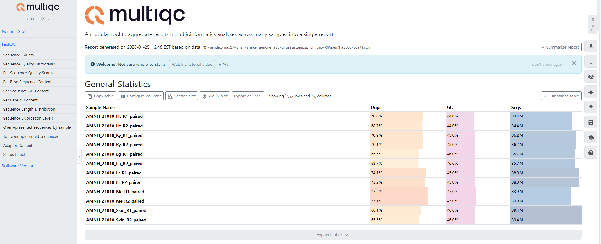

----------------------------------------------------------------------------------------------------
### (Pre-Hi-C) RNA alignment to draft using HiSat2
Now that we have our RNA-seq reads trimmed of adapter sequences and QCed, we can go ahead and align these reads to our draft genome to obtain mapping quality, etc. 

Let's create a conda environment for HiSat2 and install the package in it:
```
conda create -n hisat2 -c bioconda hisat2
conda activate hisat2
```

Also, let's copy paired reads over to our annotation directory. This is not entirely necessary, but I did it to keep the files neatly organized for different tasks.
```
# create a directory for annotation under the main assembly directory
# which is "/home/yshin/mendel-nas1/snake_genome_ass/G_ussuriensis_Chromo"
cd /home/yshin/mendel-nas1/snake_genome_ass/G_ussuriensis_Chromo
mkdir -p annotation
mkdir -p annotation/paired_RNAseq_reads

# copy the files
cd /home/yshin/mendel-nas1/snake_genome_ass/G_ussuriensis_Chromo/RNAseq/trimmed
cp *_R1_paired.fastq.gz /home/yshin/mendel-nas1/snake_genome_ass/G_ussuriensis_Chromo/annotation/paired_RNAseq_reads
cp *_R2_paired.fastq.gz /home/yshin/mendel-nas1/snake_genome_ass/G_ussuriensis_Chromo/annotation/paired_RNAseq_reads

# check files
ls /home/yshin/mendel-nas1/snake_genome_ass/G_ussuriensis_Chromo/annotation/paired_RNAseq_reads
```


Now, let's run HiSat2 on Mendel with the script below
```sh
#!/bin/bash
#SBATCH --job-name=hisat2_preHiC
#SBATCH --nodes=1
#SBATCH --partition=compute
#SBATCH --cpus-per-task=48
#SBATCH --mem=200G
#SBATCH --time=180:00:00
#SBATCH --mail-type=ALL
#SBATCH --mail-user=yshin@amnh.org
#SBATCH --output=/home/yshin/mendel-nas1/snake_genome_ass/G_ussuriensis_Chromo/scripts/outfiles/slurm-%x_%j.out
#SBATCH --error=/home/yshin/mendel-nas1/snake_genome_ass/G_ussuriensis_Chromo/scripts/outfiles/slurm-%x_%j.err

# activate conda env
source ~/.bash_profile
export PATH=/home/yshin/mendel-nas1/miniconda3/bin:$PATH
conda activate hisat2

# set paths for draft genome and RNA reads
draft_fa=/home/yshin/mendel-nas1/snake_genome_ass/G_ussuriensis_Chromo/PacBio_Revio/no_mito/Gloydius_ussuriensis_AMNH_21010_noMito.fa
rna_path=/home/yshin/mendel-nas1/snake_genome_ass/G_ussuriensis_Chromo/annotation/paired_RNAseq_reads

# output directory; create these dirs if they dont exist
outpath=/home/yshin/mendel-nas1/snake_genome_ass/G_ussuriensis_Chromo/annotation/hisat2_preHiC
mkdir -p ${outpath}
mkdir -p ${outpath}/{index,bam,logs}

# make index prefix 
index_prefix=${outpath}/index/Gloydius_ussuriensis_AMNH_21010_noMito

# build hisat2 index, skip if it already exist
if [[ ! -e ${index_prefix}.1.ht2 && ! -e ${index_prefix}.1.ht2l ]]; then
  echo "[INFO] Building HISAT2 index..."
  hisat2-build -p ${SLURM_CPUS_PER_TASK} ${draft_fa} ${index_prefix}
else
  echo "[INFO] HISAT2 index exists. Skipping."
fi

# map RNA reads to draft genome
# print out message
echo "[INFO] Mapping RNA-seq reads in: ${rna_path}"

# prevent loop from running if there are no files with matching names
shopt -s nullglob

# loop over all R1 files, get sample names, and get R2 file names
for R1 in ${rna_path}/AMNH_21010_*_R1_paired.fastq.gz; do
  sample=$(basename ${R1} _R1_paired.fastq.gz)
  R2=${rna_path}/${sample}_R2_paired.fastq.gz

  # skip if R2 is missing
  if [[ ! -f ${R2} ]]; then
    echo "[WARN] Missing R2 for ${sample}. Skipping."
    continue
  fi
  
  # print out some helpful message
  echo "[INFO] Mapping: ${sample}"

  # define output files
  bam=${outpath}/bam/${sample}.sorted.bam
  log=${outpath}/logs/${sample}.hisat2.log

  # run hisat with parameters specified above and then sort using samtools
  # --dta: means "downstream transcriptome assembly"; alignment report optimized for StringTie
  # -x: draft genome
  # -1: read 1 file
  # -2: read 2 file
  # 2> ${log}: direct & store output stats into log file
  # | samtools sort: pipe hisat2 output directly into samtools sort command
  # -: means "take piped input"
  # samtools index: index the sorted bam file
  hisat2 -p ${SLURM_CPUS_PER_TASK} --dta \
    -x ${index_prefix} \
    -1 ${R1} -2 ${R2} \
    2> ${log} \
  | samtools sort -@ ${SLURM_CPUS_PER_TASK} -o ${bam} -

  samtools index ${bam}
done

# print when done
echo "[DONE] HISAT2 mapping complete."
echo "[INFO] BAMs in: ${outpath}/bam"
echo "[INFO] Logs in: ${outpath}/logs"
```

We can open up the log files to check the overall alignment rate per tissue type. This is as follows:
  - Heart: 64.79%
  - Lung: 78.11%
  - Kidney: 82.91%
  - Liver: 87.25%
  - Muscle: 88.53%
  - Skin: 85.89%

----------------------------------------------------------------------------------------------------
### (Pre-Hi-C) Draft-guided transcriptome assembly using StringTie
Now. let's use StringTie to conduct transcriptome assembly guided by the draft genome. Let's create a conda environment for StringTie and install the package:
```
conda create -n stringtie -c bioconda stringtie
```

Next, run StringTie on Mendel with the script below. 
```sh
#!/bin/bash
#SBATCH --job-name=stringtie_preHiC
#SBATCH --nodes=1
#SBATCH --partition=compute
#SBATCH --cpus-per-task=48
#SBATCH --mem=200G
#SBATCH --time=180:00:00
#SBATCH --mail-type=ALL
#SBATCH --mail-user=yshin@amnh.org
#SBATCH --output=/home/yshin/mendel-nas1/snake_genome_ass/G_ussuriensis_Chromo/scripts/outfiles/slurm-%x_%j.out
#SBATCH --error=/home/yshin/mendel-nas1/snake_genome_ass/G_ussuriensis_Chromo/scripts/outfiles/slurm-%x_%j.err

# activate conda env
source ~/.bash_profile
export PATH=/home/yshin/mendel-nas1/miniconda3/bin:$PATH
conda activate stringtie

# dir to bam files
bam_dir=/home/yshin/mendel-nas1/snake_genome_ass/G_ussuriensis_Chromo/annotation/hisat2_preHiC/bam

# output dir
out_dir=/home/yshin/mendel-nas1/snake_genome_ass/G_ussuriensis_Chromo/annotation/StringTie_preHiC
mkdir -p ${out_dir}
mkdir -p ${out_dir}/gtf ${out_dir}/merge 

# run stringtie // loop through file per tissue and assemble per tissue
# each loop takes one bam file (RNA alignment), assembles a transcriptome, and outputs a gtf file for a given tisue type
for bam in ${bam_dir}/*.sorted.bam; do
  sample=$(basename "$bam". sorted.bam)
  echo "assembling transcripts from ${sample}..."
  stringtie "$bam" -p ${SLURM_CPUS_PER_TASK} -o ${out_dir}/gtf/${sample}.gtf
  echo "done assembling transcripts from ${sample}..."
done

# merge gtf per tissue into a single gtf
echo "merging transcripts"
ls ${out_dir}/gtf/*.gtf > ${out_dir}/merge/gtf_list.txt
stringtie --merge -p ${SLURM_CPUS_PER_TASK} -o ${out_dir}/merge/merged.gtf ${out_dir}/merge/gtf_list.txt

# print when done
echo "DONE"
```
Now, let's see how many transcripts, exons, and genes we've got from this run:
```
# check the number of transcripts (counting the number of unique transcript_id) and number of exons
cut -f3 merged.gtf | sort | uniq -c | sort -nr | head

# check the number of genes (counting the number of unique gene_id)
awk '$3=="transcript" {match($0,/gene_id "[^"]+"/,a); if(a[0]!=""){gsub(/gene_id "|"/,"",a[0]); print a[0]}}' merged.gtf | sort -u | wc -l
```
The outputs will show that we have:
  - 381,058 exons
  - 37,147 transcripts
  - 20,527 genes

These results seem to be in great shape in terms of transcript evidence-building. We will put a pause here, finish Hi-C incorporation, and move on to final annotation once our assembly is at the scaffold level. 

----------------------------------------------------------------------------------------------------
### (Pre-Hi-C) Venom gland transcriptome data
Park et al. (2026) produced venom gland transcriptome data for the three *Gloydius* species found in South Korea. This can be useful for placing expressed venom gene candidates to specific scaffolds.

First, create a new directory under the annotation directory
```sh
mkdir -p venom_gland venom_gland/ncbi_seq venom_gland/fastq
```
Then, download NCBI SRA Toolkit on Mendel. Go to the following link (https://github.com/ncbi/sra-tools/wiki/01.-Downloading-SRA-Toolkit) and copy the link for AlmaLinux 64 bit architecture. Then:
```sh
wget https://ftp-trace.ncbi.nlm.nih.gov/sra/sdk/3.4.1/sratoolkit.3.4.1-alma_linux64.tar.gz
```
You should see a tar.gz file created under the annotation directory. Untar this file like so:
```sh
tar -xzvf sratoolkit.3.4.1-alma_linux64.tar.gz
rm *.tar.gz
```
Then add the executable to the PATH variable:
```sh
export PATH=$PWD/sratoolkit.3.4.1-alma_linux64/bin:$PATH
```

Then submit the script below to SLURM.
```sh
#!/bin/bash
#SBATCH --job-name=get_venom_data
#SBATCH --nodes=1
#SBATCH --partition=compute
#SBATCH --ntasks=1
#SBATCH --cpus-per-task=12
#SBATCH --mem=50G
#SBATCH --time=25:00:00
#SBATCH --mail-type=ALL
#SBATCH --mail-user=yshin@amnh.org
#SBATCH --output=/home/yshin/mendel-nas1/snake_genome_ass/G_ussuriensis_Chromo/scripts/outfiles/slurm-%x_%j.out
#SBATCH --error=/home/yshin/mendel-nas1/snake_genome_ass/G_ussuriensis_Chromo/scripts/outfiles/slurm-%x_%j.err

set -euo pipefail

### commands start here ###

# path to SRA toolkit
export PATH=$PWD/sratoolkit.3.4.1-alma_linux64/bin:$PATH

# set directories
basedir="/home/yshin/mendel-nas1/snake_genome_ass/G_ussuriensis_Chromo/annotation/venom_gland"
sradir="${basedir}/ncbi_seq"
fastqdir="${basedir}/fastq"
tmpdir="${basedir}/tmp"

mkdir -p "$sradir" "$fastqdir" "$tmpdir"

# download SRA files
prefetch SRR35908235 -O "$sradir"
prefetch SRR35908238 -O "$sradir"

# convert .sra files to FASTQ files
fasterq-dump "$sradir/SRR35908235/SRR35908235.sra" \
  --split-files \
  --threads 12 \
  --temp "$tmpdir" \
  -O "$fastqdir"

fasterq-dump "$sradir/SRR35908238/SRR35908238.sra" \
  --split-files \
  --threads 12 \
  --temp "$tmpdir" \
  -O "$fastqdir"

# gzip FASTQ files
gzip "$fastqdir"/*.fastq
```

After this, run a quick sanity check from the fastq directory.
```sh
# verify the files have sequences
zcat SRR35908235_1.fastq.gz | head -n 4
zcat SRR35908235_2.fastq.gz | head -n 4

zcat SRR35908238_1.fastq.gz | head -n 4
zcat SRR35908238_2.fastq.gz | head -n 4

# check file size == R1/R2 files should have the same size
ls -lh
```
Then QC the files using FastQC and MultiQC.
```sh
#!/bin/bash
#SBATCH --job-name=venom_gland_qc
#SBATCH --nodes=1
#SBATCH --partition=compute
#SBATCH --ntasks=1
#SBATCH --cpus-per-task=12
#SBATCH --mem=20G
#SBATCH --time=04:00:00
#SBATCH --mail-type=ALL
#SBATCH --mail-user=yshin@amnh.org
#SBATCH --output=/home/yshin/mendel-nas1/snake_genome_ass/G_ussuriensis_Chromo/scripts/outfiles/slurm-%x_%j.out
#SBATCH --error=/home/yshin/mendel-nas1/snake_genome_ass/G_ussuriensis_Chromo/scripts/outfiles/slurm-%x_%j.err

set -euo pipefail

# initiate conda and activate the conda environment
source ~/.bash_profile
conda activate genome_assembly

# set directory
basedir="/home/yshin/mendel-nas1/snake_genome_ass/G_ussuriensis_Chromo/annotation/venom_gland"
cd "$basedir"

# make output dir
mkdir -p qc_fastqc

# run fastqc
fastqc fastq/*.fastq.gz \
  -o qc_fastqc \
  -t 12

# activate multiqc conda env 
conda activate multiqc

# run multiqc
multiqc qc_fastqc \
  -o qc_fastqc
```

The MultiQC report shows considerable adapter content. Use fastp for automatic adapter detection and trimming for Illumina paired-end reads.
```sh
#!/bin/bash
#SBATCH --job-name=venom_trim
#SBATCH --nodes=1
#SBATCH --cpus-per-task=8
#SBATCH --mem=32G
#SBATCH --time=12:00:00
#SBATCH --partition=compute
#SBATCH --mail-type=ALL
#SBATCH --mail-user=yshin@amnh.org
#SBATCH --output=/home/yshin/mendel-nas1/snake_genome_ass/G_ussuriensis_Chromo/scripts/outfiles/slurm-%x_%j.out
#SBATCH --error=/home/yshin/mendel-nas1/snake_genome_ass/G_ussuriensis_Chromo/scripts/outfiles/slurm-%x_%j.err

source ~/.bash_profile
conda activate scaffolding

# set directories
basedir="/home/yshin/mendel-nas1/snake_genome_ass/G_ussuriensis_Chromo/annotation/venom_gland"
indir="${basedir}/fastq"
outdir="${basedir}/trimmed_fastq"
reportdir="${basedir}/fastp_reports"

mkdir -p "$outdir" "$reportdir"

ACCESSIONS=(
  SRR35908235
  SRR35908238
)

for acc in "${ACCESSIONS[@]}"; do
  echo "Trimming ${acc}"

  fastp \
    -i "${indir}/${acc}_1.fastq.gz" \
    -I "${indir}/${acc}_2.fastq.gz" \
    -o "${outdir}/${acc}_1.trimmed.fastq.gz" \
    -O "${outdir}/${acc}_2.trimmed.fastq.gz" \
    --detect_adapter_for_pe \
    --thread 8 \
    --html "${reportdir}/${acc}.fastp.html" \
    --json "${reportdir}/${acc}.fastp.json"

  echo "Finished ${acc}"
done
```

After this is done, run FastQC and MultiQC again on trimmed reads.
```sh
#!/bin/bash
#SBATCH --job-name=venom_gland_posttrim_qc
#SBATCH --nodes=1
#SBATCH --partition=compute
#SBATCH --ntasks=1
#SBATCH --cpus-per-task=12
#SBATCH --mem=20G
#SBATCH --time=04:00:00
#SBATCH --mail-type=ALL
#SBATCH --mail-user=yshin@amnh.org
#SBATCH --output=/home/yshin/mendel-nas1/snake_genome_ass/G_ussuriensis_Chromo/scripts/outfiles/slurm-%x_%j.out
#SBATCH --error=/home/yshin/mendel-nas1/snake_genome_ass/G_ussuriensis_Chromo/scripts/outfiles/slurm-%x_%j.err

# initiate conda and activate the conda environment
source ~/.bash_profile
conda activate genome_assembly

# set directory
basedir="/home/yshin/mendel-nas1/snake_genome_ass/G_ussuriensis_Chromo/annotation/venom_gland"
cd "$basedir"

# make output dir
mkdir -p postrrim_qc_fastqc

# run fastqc
fastqc trimmed_fastq/*.fastq.gz \
  -o postrrim_qc_fastqc \
  -t 12

# activate multiqc conda env 
conda activate multiqc

# run multiqc
multiqc postrrim_qc_fastqc \
  -o postrrim_qc_fastqc
```

----------------------------------------------------------------------------------------------------
### (Post-Hi-C) Repeat masking (soft masking) using Earl Grey
Before moving on to final annotation, it is necessary to annotate the repeats and soft mask the genome. We can do this using the Earl Grey pipeline (https://github.com/TobyBaril/EarlGrey), which is a fully-automated pipeline for transposable element (TE)/repeat annotation.

Let's start by creating a separate conda environment and install Earl Grey: 

```
# create a conda environment for Earl Grey and install it
conda create -n earlgrey -c conda-forge -c bioconda earlgrey=7.0.1
```

Once this is done, run Earl Grey with the script below on Mendel (make sure the input genome is the final, curated chromosome-level assembly):
```sh
#!/bin/bash
#SBATCH --job-name=earlGrey_ussuri
#SBATCH --nodes=1
#SBATCH --cpus-per-task=48
#SBATCH --mem=600G
#SBATCH --time=180:00:00
#SBATCH --partition=bigmem
#SBATCH --mail-type=ALL
#SBATCH --mail-user=yshin@amnh.org
#SBATCH --output=/home/yshin/mendel-nas1/snake_genome_ass/G_ussuriensis_Chromo/scripts/outfiles/slurm-%x_%j.out
#SBATCH --error=/home/yshin/mendel-nas1/snake_genome_ass/G_ussuriensis_Chromo/scripts/outfiles/slurm-%x_%j.err

# soft masking the scaffolded assembly with Earl Grey

# activate the conda env
source ~/.bash_profile
conda activate earlgrey

# set variables
GENOME="/home/yshin/mendel-nas1/snake_genome_ass/G_ussuriensis_Chromo/final_assembly/curated/Gloydius_ussuriensis_AMNH_21010_curated_scaffold11_split.fa"
SPECIES="Gloydius_ussuriensis"

# output path
outpath=/home/yshin/mendel-nas1/snake_genome_ass/G_ussuriensis_Chromo/annotation/soft_masked
mkdir -p $outpath

# run Earl Grey
echo "Starting EarlGrey: $(date)"

# -d flag == Create soft-masked genome at the end? (yes/no, Default: no)
earlGrey -g ${GENOME} -s ${SPECIES} -o ${outpath} -d yes -t ${SLURM_CPUS_PER_TASK}

echo "Finished EarlGrey: $(date)"

# list outputs
echo "EarlGrey output files:"
find "$outdir" -maxdepth 3 -type f | head -n 50

echo "Done: $(date)"
```
----------------------------------------------------------------------------------------------------
### (Post-Hi-C) Annotation using funannotate
The general annotation workflow is as follows:
```
1. funannotate train: organ tissue RNA-seq data + publicly available venom gland RNA-seq data
2. funannotate predict
3. funannotate update
4. funannotate fix
5. InterProScan on proteins predicted by funannotate predict
6. funannotate annotate
7. Final QC / manual curation
```

Let's start by symlinking the softmasked fasta for annotation.
```sh
# symlink softmasked fasta output from earl grey
ln -s /home/yshin/mendel-nas1/snake_genome_ass/G_ussuriensis_Chromo/annotation/soft_masked/Gloydius_ussuriensis_EarlGrey/Gloydius_ussuriensis_summaryFiles/Gloydius_ussuriensis.softmasked.fasta \
  Gloydius_ussuriensis.softmasked.fa
```
Then activate the funannotate conda env and install gffread.
```sh
conda activate funannotate
conda install bioconda::gffread
```

####  Setup funannotate 1: GeneMark
funannotate also requires an initial database setup step. Run setup as below:
```sh
# create db path
db_path="/home/yshin/mendel-nas1/snake_genome_ass/G_ussuriensis_Chromo/an
notation/funannotate_db"

mkdir -p ${db_path}

# check dependencies
funannotate check --show-versions

# setup db
funannotate setup -d ${db_path} -i all --wget

# run this once the setup is done
echo 'export FUNANNOTATE_DB=/home/yshin/mendel-nas1/snake_genome_ass/G_ussuriensis_Chromo/annotation/funannotate_db' >> ~/.bash_profile

# also set up BUSCO lineage db 
# this version of funannotate do not support the sauropsida lineage DB; use tetrapoda db instead 
export FUNANNOTATE_DB="/home/yshin/mendel-nas1/snake_genome_ass/G_ussuriensis_Chromo/annotation/funannotate_db"
funannotate setup -d "$FUNANNOTATE_DB" -b tetrapoda --wget
```
After this, if you run "funannotate check --show-versions", you'll see the current configuration is missing some key dependencies, such as eggnog mapper ("ERROR: emapper.py not installed"), GeneMark ("ERROR: gmes_petap.pl not installed"), and signalp ("ERROR: signalp not installed"). 

GeneMark cannot be installed through conda. We need to manually download the .tar.gz file from the GeneMark website and scp it to Mendel.
```
# on Mendel
mkdir -p "/home/yshin/mendel-nas1/gmes_linux_64"
cd "/home/yshin/mendel-nas1/gmes_linux_64"

# in local device
scp gmes_linux_64_4.tar.gz yshin@mendel.sdmz.amnh.org:/home/yshin/mendel-nas1/gmes_linux_64

# unzip on Mendel
tar -xvzf gmes_linux_64_4.tar.gz
```

Now, set the GeneMark path:
```
export GENEMARK_PATH="/home/yshin/mendel-nas1/gmes_linux_64/gmes_linux_64_4"
export PATH="$GENEMARK_PATH:$PATH"
```

Also, download the key file from the website (Linux 64 bit) and scp it to the Mendel home directory. After that, run:
```
zcat gm_key_64.gz > ~/.gm_key
chmod 600 ~/.gm_key
```

Then, run a full check
```sh
conda activate funannotate

export FUNANNOTATE_DB="/home/yshin/mendel-nas1/snake_genome_ass/G_ussuriensis_Chromo/annotation/funannotate_db"
export GENEMARK_PATH="/home/yshin/mendel-nas1/gmes_linux_64/gmes_linux_64_4"
export PATH="$GENEMARK_PATH:$PATH"

funannotate check --show-versions
```
Now you shouldn't see the GeneMark error.

####  Setup funannotate 2: eggNOG-mapper
```
# in the funannotate conda env 
conda install -c conda-forge -c bioconda eggnog-mapper

# download eggnog db
export EGGNOG_DATA_DIR="/home/yshin/mendel-nas1/eggnog_db"
mkdir -p "$EGGNOG_DATA_DIR"
cd "$EGGNOG_DATA_DIR"

BASE="http://eggnog5.embl.de/download/emapperdb-5.0.2"

wget -c -O eggnog.db.gz "$BASE/eggnog.db.gz"
wget -c -O eggnog.taxa.tar.gz "$BASE/eggnog.taxa.tar.gz"
wget -c -O eggnog_proteins.dmnd.gz "$BASE/eggnog_proteins.dmnd.gz"

# decompress
gunzip -f eggnog.db.gz
gunzip -f eggnog_proteins.dmnd.gz
tar -xvzf eggnog.taxa.tar.gz
rm -f eggnog.taxa.tar.gz

# check installation
which emapper.py
emapper.py --version
```

####  Setup funannotate 3: SignalP
Install signalp from the software website and scp it to Mendel. After that:
```
# make install directory
mkdir -p /home/yshin/mendel-nas1/signalp

# unpack
tar -xvzf /home/yshin/mendel-nas1/signalp-6.0i.fast.tar.gz -C /home/yshin/mendel-nas1/signalp

# cd into the package dir
/home/yshin/mendel-nas1/signalp/signalp6_fast/signalp-6-package

# put pip cache and temp files on nas, not /home, to prevent disk quota error
mkdir -p /home/yshin/mendel-nas1/tmp/pip_cache
mkdir -p /home/yshin/mendel-nas1/tmp/pip_tmp

export PIP_CACHE_DIR="/home/yshin/mendel-nas1/tmp/pip_cache"
export TMPDIR="/home/yshin/mendel-nas1/tmp/pip_tmp"

# install
python -m pip install --no-cache-dir .

# symlink for funannotate
export LD_LIBRARY_PATH="$CONDA_PREFIX/lib:$LD_LIBRARY_PATH"

cd "$CONDA_PREFIX/bin"
ln -sf signalp6 signalp
```

Then run a final check. This should print "All 37 external dependencies are installed" at the end.
```
funannotate check --show-versions
```
Also, copy the "distilled_model_signalp6.pt" file into the signalp installation "model_weights" dir.
```sh
cp -av \
/home/yshin/mendel-nas1/signalp/signalp6_fast/signalp-6-package/models/distilled_model_signalp6.pt \
/home/yshin/mendel-nas1/miniconda3/envs/funannotate/lib/python3.8/site-packages/signalp/model_weights/
```

Check whether the file is correctly copied.
```sh
ls -lh \
/home/yshin/mendel-nas1/miniconda3/envs/funannotate/lib/python3.8/site-packages/signalp/model_weights/
```

####  Install InterProScan
First, create a new directory to store interproscan
```sh
cd /home/yshin/mendel-nas1

mkdir -p interproscan
cd interproscan
```
Next, install interproscan and checksum files.
```sh
# download interproscan
wget https://ftp.ebi.ac.uk/pub/software/unix/iprscan/5/5.78-109.0/interproscan-5.78-109.0-64-bit.tar.gz

# download checksum
wget https://ftp.ebi.ac.uk/pub/software/unix/iprscan/5/5.78-109.0/interproscan-5.78-109.0-64-bit.tar.gz.md5
```
Check download:
```
md5sum -c interproscan-5.78-109.0-64-bit.tar.gz.md5
```

Extract the file while preserving permissions:
```sh
# extract
tar -pxvzf interproscan-5.78-109.0-64-bit.tar.gz

# check script
ls -lh /home/yshin/mendel-nas1/interproscan/interproscan-5.78-109.0/interproscan.sh
```

Also check the runtime requirements. What we want is Java 11 or above.
```sh
java -version
python3 --version
perl -version | head
echo "$JAVA_HOME"
```

####  funannotate step 1: Train
Run with the script below.
```sh
#!/bin/bash
#SBATCH --job-name=funannotate_train
#SBATCH --nodes=1
#SBATCH --partition=compute
#SBATCH --ntasks=1
#SBATCH --cpus-per-task=32
#SBATCH --mem=300G
#SBATCH --time=300:00:00
#SBATCH --mail-type=ALL
#SBATCH --mail-user=yshin@amnh.org
#SBATCH --output=/home/yshin/mendel-nas1/snake_genome_ass/G_ussuriensis_Chromo/scripts/outfiles/slurm-%x_%j.out
#SBATCH --error=/home/yshin/mendel-nas1/snake_genome_ass/G_ussuriensis_Chromo/scripts/outfiles/slurm-%x_%j.err

# activate environment and set up analyses
source ~/.bash_profile
conda activate funannotate
set -euo pipefail

# avoid system library conflicts
export LD_LIBRARY_PATH="${CONDA_PREFIX}/lib:${LD_LIBRARY_PATH:-}"

# funannotate databases and external tools
export FUNANNOTATE_DB="/home/yshin/mendel-nas1/snake_genome_ass/G_ussuriensis_Chromo/annotation/funannotate_db"
export GENEMARK_PATH="/home/yshin/mendel-nas1/gmes_linux_64/gmes_linux_64_4"
export PATH="$GENEMARK_PATH:$PATH"
export EGGNOG_DATA_DIR="/home/yshin/mendel-nas1/eggnog_db"

# use a short temporary directory and clean it up on exit
export TMPDIR="/tmp/yshin_fun_${SLURM_JOB_ID}"
export TEMP="$TMPDIR"
export TMP="$TMPDIR"
mkdir -p "$TMPDIR"

trap 'rm -rf "$TMPDIR"' EXIT

# set paths for input and output
# softmakesked genome assembly
genome="/home/yshin/mendel-nas1/snake_genome_ass/G_ussuriensis_Chromo/annotation/soft_masked/Gloydius_ussuriensis_EarlGrey/Gloydius_ussuriensis_summaryFiles/Gloydius_ussuriensis.softmasked.fasta"

# path to paired-end RNA-seq reads from organ tissues and venom gland
tissue_reads="/home/yshin/mendel-nas1/snake_genome_ass/G_ussuriensis_Chromo/annotation/paired_RNAseq_reads"
venom_reads="/home/yshin/mendel-nas1/snake_genome_ass/G_ussuriensis_Chromo/annotation/venom_gland/trimmed_fastq"

# make output dir for all funannotate results
outdir="/home/yshin/mendel-nas1/snake_genome_ass/G_ussuriensis_Chromo/annotation/funannotate/"
mkdir -p "$outdir"

# Train to align RNA-seq data, run Trinity, and then run PASA
funannotate train -i ${genome} -o ${outdir} \
    --left ${tissue_reads}/AMNH_21010_Ht_R1_paired.fastq.gz ${tissue_reads}/AMNH_21010_Lr_R1_paired.fastq.gz ${tissue_reads}/AMNH_21010_Ky_R1_paired.fastq.gz ${tissue_reads}/AMNH_21010_Me_R1_paired.fastq.gz ${tissue_reads}/AMNH_21010_Lg_R1_paired.fastq.gz ${tissue_reads}/AMNH_21010_Skin_R1_paired.fastq.gz ${venom_reads}/SRR35908235_1.trimmed.fastq.gz \
    --right ${tissue_reads}/AMNH_21010_Ht_R2_paired.fastq.gz ${tissue_reads}/AMNH_21010_Lr_R2_paired.fastq.gz ${tissue_reads}/AMNH_21010_Ky_R2_paired.fastq.gz ${tissue_reads}/AMNH_21010_Me_R2_paired.fastq.gz ${tissue_reads}/AMNH_21010_Lg_R2_paired.fastq.gz ${tissue_reads}/AMNH_21010_Skin_R2_paired.fastq.gz ${venom_reads}/SRR35908235_2.trimmed.fastq.gz \
    --species "Gloydius ussuriensis" \
    --isolate AMNH_21010 \
    --stranded RF \
    --max_intronlen 100000 \
    --cpus "$SLURM_CPUS_PER_TASK" \
    --memory 250G \
    --no_trimmomatic
```

####  funannotate step 2: Predict
```sh
#!/bin/bash
#SBATCH --job-name=funannotate_predict
#SBATCH --nodes=1
#SBATCH --partition=compute
#SBATCH --ntasks=1
#SBATCH --cpus-per-task=32
#SBATCH --mem=300G
#SBATCH --time=300:00:00
#SBATCH --mail-type=ALL
#SBATCH --mail-user=yshin@amnh.org
#SBATCH --output=/home/yshin/mendel-nas1/snake_genome_ass/G_ussuriensis_Chromo/scripts/outfiles/slurm-%x_%j.out
#SBATCH --error=/home/yshin/mendel-nas1/snake_genome_ass/G_ussuriensis_Chromo/scripts/outfiles/slurm-%x_%j.err

# activate environment and set up analyses
source ~/.bash_profile
conda activate funannotate
set -euo pipefail

# avoid system library conflicts
export LD_LIBRARY_PATH="${CONDA_PREFIX}/lib:${LD_LIBRARY_PATH:-}"

# funannotate databases and external tools
export FUNANNOTATE_DB="/home/yshin/mendel-nas1/snake_genome_ass/G_ussuriensis_Chromo/annotation/funannotate_db"
export GENEMARK_PATH="/home/yshin/mendel-nas1/gmes_linux_64/gmes_linux_64_4"
export PATH="$GENEMARK_PATH:$PATH"
export EGGNOG_DATA_DIR="/home/yshin/mendel-nas1/eggnog_db"

# use a short temporary directory and clean it up on exit
export TMPDIR="/tmp/yshin_fun_${SLURM_JOB_ID}"
export TEMP="$TMPDIR"
export TMP="$TMPDIR"
mkdir -p "$TMPDIR"

trap 'rm -rf "$TMPDIR"' EXIT

# set paths for input and output
# softmakesked genome assembly
genome="/home/yshin/mendel-nas1/snake_genome_ass/G_ussuriensis_Chromo/annotation/soft_masked/Gloydius_ussuriensis_EarlGrey/Gloydius_ussuriensis_summaryFiles/Gloydius_ussuriensis.softmasked.fasta"

# output directory for funannotate results
outdir="/home/yshin/mendel-nas1/snake_genome_ass/G_ussuriensis_Chromo/annotation/funannotate/"

# run funannotate predict
funannotate predict \
    -i ${genome} \
    -o ${outdir} \
    --species "Gloydius ussuriensis" \
    --isolate AMNH_21010 \
    --busco_db tetrapoda \
    --organism other \
    --busco_seed_species Taeniopygia_guttata \
    --max_intronlen 100000 \
    --repeats2evm \
    --cpus "$SLURM_CPUS_PER_TASK"
```

####  funannotate step 3: Update

####  funannotate step 4: Fix

####  funannotate step 5: InterProScan
Run interproscan through "funannotate iprscan" using the script below:
```sh
#!/bin/bash
#SBATCH --job-name=iprscan
#SBATCH --nodes=1
#SBATCH --partition=compute
#SBATCH --ntasks=1
#SBATCH --cpus-per-task=32
#SBATCH --mem=300G
#SBATCH --time=168:00:00
#SBATCH --mail-type=ALL
#SBATCH --mail-user=yshin@amnh.org
#SBATCH --output=/home/yshin/mendel-nas1/snake_genome_ass/G_ussuriensis_Chromo/scripts/outfiles/slurm-%x_%j.out
#SBATCH --error=/home/yshin/mendel-nas1/snake_genome_ass/G_ussuriensis_Chromo/scripts/outfiles/slurm-%x_%j.err


# ============================================================
# 1. environment
# ============================================================

source ~/.bash_profile
conda activate funannotate

set -euo pipefail


# ============================================================
# 2. paths
# ============================================================

workdir="/home/yshin/mendel-nas1/snake_genome_ass/G_ussuriensis_Chromo/annotation/funannotate"
outdir="${workdir}/G_ussuriensis_funannotate"
iprdir="/home/yshin/mendel-nas1/interproscan/interproscan-5.78-109.0"
iprscan="${iprdir}/interproscan.sh"

# ============================================================
# 3. validate InterProScan
# ============================================================

if [ ! -x "$iprscan" ]; then
    echo "ERROR: InterProScan executable not found:"
    echo "$iprscan"
    exit 1
fi

echo
echo "InterProScan:"
"$iprscan" -version

echo
echo "Java:"
java -version

echo
echo "Python:"
python3 --version


# ============================================================
# 4. validate funannotate predict output
# ============================================================

if [ ! -d "$outdir/predict_results" ]; then
    echo "ERROR: Funannotate predict_results directory not found:"
    echo "$outdir/predict_results"
    exit 1
fi

proteins=$(find "$outdir/predict_results" \
    -maxdepth 1 \
    -type f \
    -name "*.proteins.fa" \
    | head -n 1)

if [ -z "$proteins" ] || [ ! -s "$proteins" ]; then
    echo "ERROR: Funannotate protein FASTA not found."
    exit 1
fi

echo
echo "Protein FASTA:"
echo "$proteins"

echo
echo "Number of proteins:"
grep -c '^>' "$proteins"


# ============================================================
# 5. remove stale empty InterProScan result if present
# ============================================================

iprxml="${outdir}/annotate_misc/iprscan.xml"

if [ -e "$iprxml" ] && [ ! -s "$iprxml" ]; then
    echo
    echo "Removing empty previous InterProScan XML:"
    rm -f "$iprxml"
fi


# ============================================================
# 6. run InterProScan through funannotate
# ============================================================

cd "$workdir"

echo
echo "Running funannotate iprscan..."
echo

funannotate iprscan \
    -i "$outdir" \
    -m local \
    --iprscan_path "$iprscan" \
    -c 4 \
    --debug


# ============================================================
# 7. validate output
# ============================================================

if [ ! -s "$iprxml" ]; then
    echo
    echo "ERROR: InterProScan XML is missing or empty:"
    echo "$iprxml"
    exit 1
fi

echo
echo "InterProScan completed successfully."
echo

ls -lh "$iprxml"

echo
echo "XML beginning:"
head -n 3 "$iprxml"

echo
echo "Done."
```

####  funannotate step 6: Annotate 
Using the outputs from "funannotate predict" and interproscan runs, now run funannotate annotate step:
```sh
#!/bin/bash
#SBATCH --job-name=funannotate_annotate
#SBATCH --nodes=1
#SBATCH --partition=compute
#SBATCH --ntasks=1
#SBATCH --cpus-per-task=32
#SBATCH --mem=350G
#SBATCH --time=168:00:00
#SBATCH --mail-type=ALL
#SBATCH --mail-user=yshin@amnh.org
#SBATCH --output=/home/yshin/mendel-nas1/snake_genome_ass/G_ussuriensis_Chromo/scripts/outfiles/slurm-%x_%j.out
#SBATCH --error=/home/yshin/mendel-nas1/snake_genome_ass/G_ussuriensis_Chromo/scripts/outfiles/slurm-%x_%j.err


# ============================================================
# 1. activate funannotate environment
# ============================================================

source ~/.bash_profile
conda activate funannotate

set -euo pipefail

# avoid system libstdc++ conflict with SignalP / PIL
export LD_LIBRARY_PATH="${CONDA_PREFIX}/lib:${LD_LIBRARY_PATH:-}"

# funannotate databases
export FUNANNOTATE_DB="/home/yshin/mendel-nas1/snake_genome_ass/G_ussuriensis_Chromo/annotation/funannotate_db"
export EGGNOG_DATA_DIR="/home/yshin/mendel-nas1/eggnog_db"


# ============================================================
# 2. temporary directory
# ============================================================

export TMPDIR="/tmp/yshin_funannotate_${SLURM_JOB_ID}"
export TEMP="$TMPDIR"
export TMP="$TMPDIR"

mkdir -p "$TMPDIR"

trap 'rm -rf "$TMPDIR"' EXIT


# ============================================================
# 3. existing funannotate predict output
# ============================================================

outdir="/home/yshin/mendel-nas1/snake_genome_ass/G_ussuriensis_Chromo/annotation/funannotate/G_ussuriensis_funannotate"

if [ ! -d "$outdir" ]; then
    echo "ERROR: Funannotate output directory does not exist:"
    echo "$outdir"
    exit 1
fi

if [ ! -d "$outdir/predict_results" ]; then
    echo "ERROR: predict_results directory not found:"
    echo "$outdir/predict_results"
    exit 1
fi

echo
echo "Using completed Funannotate predict output:"
echo "$outdir"
echo


# ============================================================
# 4. verify InterProScan output
# ============================================================

iprxml="${outdir}/annotate_misc/iprscan.xml"

if [ ! -s "$iprxml" ]; then
    echo "ERROR: InterProScan XML is missing or empty:"
    echo "$iprxml"
    exit 1
fi

echo
echo "InterProScan XML found:"
ls -lh "$iprxml"
echo


# ============================================================
# 5. verify SignalP installation/model
# ============================================================

echo "Checking SignalP..."
command -v signalp6

SIGNALP_DIR="${CONDA_PREFIX}/lib/python3.8/site-packages/signalp"
SIGNALP_MODEL="${SIGNALP_DIR}/model_weights/distilled_model_signalp6.pt"

if [ ! -s "$SIGNALP_MODEL" ]; then
    echo
    echo "ERROR: SignalP fast model is missing:"
    echo "$SIGNALP_MODEL"
    exit 1
fi

echo
echo "SignalP model found:"
ls -lh "$SIGNALP_MODEL"
echo


# ============================================================
# 6. test SignalP imports
# ============================================================

python -c 'from PIL import Image; print("PIL OK")'
python -c 'import matplotlib; print("matplotlib OK")'
python -c 'import signalp; print("SignalP import OK")'

echo


# ============================================================
# 7. run funannotate annotate with InterProScan
# ============================================================

echo "Running funannotate annotate..."
echo

funannotate annotate \
    -i "$outdir" \
    -s "Gloydius ussuriensis" \
    --isolate AMNH_21010 \
    --cpus 32 \
    --busco_db tetrapoda \
    --database "$FUNANNOTATE_DB" \
    --iprscan "$iprxml" \
    --tmpdir "$TMPDIR"

echo
echo "Funannotate annotate finished."
echo


# ============================================================
# 8. check final results
# ============================================================

results="${outdir}/annotate_results"

if [ ! -d "$results" ]; then
    echo "ERROR: annotate_results directory was not created."
    exit 1
fi

echo
echo "Final annotation results:"
echo "$results"
echo

ls -lh "$results"

echo
echo "Done."
```

#### Post-annotation checks
The annotation outputs are stored in the following directory: annotation/funannotate/G_ussuriensis_funannotate/annotate_results

First, inspect annotation stats by running the following:
```sh
# in the "annotation/funannotate/G_ussuriensis_funannotate/annotate_results" directory
cat Gloydius_ussuriensis_AMNH_21010.stats.json
```

----------------------------------------------------------------------------------------------------
### (Post-Hi-C) Toxin gene annotation using ToxCodAn-Genome
Snake toxin gene annotation can be tricky. [...]

Install ToxCodAn-Genome and its dependencies.
```sh
# create conda env and install dependencies
conda create -n ToxcodanGenome -c bioconda python biopython pandas blast exonerate miniprot gffread hisat2 samtools stringtie trinity spades

# install ToxCodAn-Genome from github and add to PATH
cd mendel-nas1/
git clone https://github.com/pedronachtigall/ToxCodAn-Genome.git
echo "export PATH=$PATH:$PWD/ToxCodAn-Genome/bin/" >> ~/.bashrc

# test
conda activate ToxcodanGenome
cd ToxCodAn-Genome/bin/
python toxcodan-genome.py -h

# apply permission to all executables
chmod +x /home/yshin/mendel-nas1/ToxCodAn-Genome/bin/*
```
Also, create a separate conda env and install ToxCodAn to be used for transcriptome annotation.
```sh
# setup conda env
conda create -n Toxcodan \
  --strict-channel-priority \
  -c conda-forge \
  -c bioconda \
  python=3.10 \
  codan=1.2 \
  blast \
  hmmer

# git clone toxcodan from repo
git clone https://github.com/pedronachtigall/ToxCodAn.git
export PATH=$PATH:path/to/ToxCodAn/bin/

# unzip models (in "/home/yshin/mendel-nas1/ToxCodAn" dir)
unzip models.zip

# download the SignalP-4.1 from its website, decompress, and add it to PATH:
tar -xzf signalp-4.1g.Linux.tar.gz
export PATH="$PATH:/home/yshin/mendel-nas1/signalp-4.1"

### signalp 4.1 setup
# cd into dir
cd /home/yshin/mendel-nas1/signalp-4.1

# confirm that the required Perl module exists
ls -l lib/FASTA.pm
$ENV{SIGNALP} = '/home/yshin/mendel-nas1/signalp-4.1/';

# back up and fix the script
cp signalp signalp.original

sed -i \
  's|/usr/opt/www/pub/CBS/services/SignalP-4.1/signalp-4.1|/home/yshin/mendel-nas1/signalp-4.1|g' \
  signalp

# verify that the correct path is now embedded
grep -n 'ENV{SIGNALP}' signalp

### apply "execution permission" to all bin executables
chmod 777 /home/yshin/mendel-nas1/ToxCodAn/bin/*
```

First, run TRassembly.py included in the ToxCodAn-Genome package for venom gland transcriptome assembly.

Before running TRassembly, make sure the jellyfish k-mer counter is installed and accessible by Trinity (which is part of the TRassembly script). In my case, jellyfish was not installed in the ToxcodanGenome conda env and this caused TRassembly script to crash as soon as it entered the de novo transcriptome assembly step. Also, install bowtie/bowtie2 and salmon alongside jellyfish.
```sh
# activate conda env
conda activate ToxcodanGenome

# install
conda install --freeze-installed \
    -c conda-forge \
    -c bioconda \
    bioconda::kmer-jellyfish \
    bioconda::bowtie2 \
    bioconda::bowtie \
    bioconda::salmon
```
Now, run the TRassembly.py script:
```sh
#!/bin/bash
#SBATCH --job-name=TRassembly
#SBATCH --nodes=1
#SBATCH --mem=300G
#SBATCH --cpus-per-task=32
#SBATCH --partition=compute
#SBATCH --time=300:00:00
#SBATCH --mail-type=ALL
#SBATCH --mail-user=yshin@amnh.org
#SBATCH --output=/home/yshin/mendel-nas1/snake_genome_ass/G_ussuriensis_Chromo/scripts/outfiles/slurm-%x_%j.out
#SBATCH --error=/home/yshin/mendel-nas1/snake_genome_ass/G_ussuriensis_Chromo/scripts/outfiles/slurm-%x_%j.err

# activate conda env 
# TRassembly.py is a part of ToxCodAn-Genome
source ~/.bash_profile
conda activate ToxcodanGenome

# force UTF-8 output in non-interactive SLURM jobs
# locale available on all standard Linux nodes
export LANG=C
export LC_ALL=C

# force Python itself to use UTF-8
export PYTHONIOENCODING=UTF-8
export PYTHONUTF8=1

set -euo pipefail

# set TRassembly path and cd into it
dir_TRassembly="/home/yshin/mendel-nas1/ToxCodAn-Genome/bin"
cd ${dir_TRassembly}

# output dir
outdir="/home/yshin/mendel-nas1/snake_genome_ass/G_ussuriensis_Chromo/annotation/toxin_gene_annotation_RNAdata_added"
mkdir -p ${outdir}
mkdir -p ${outdir}/SRR35908235_TRassembly

# input dir
genome="/home/yshin/mendel-nas1/snake_genome_ass/G_ussuriensis_Chromo/annotation/soft_masked/Gloydius_ussuriensis_EarlGrey/Gloydius_ussuriensis_summaryFiles/Gloydius_ussuriensis.softmasked.fasta"
venom_read_1="/home/yshin/mendel-nas1/snake_genome_ass/G_ussuriensis_Chromo/annotation/venom_gland/trimmed_fastq/SRR35908235_1.trimmed.fastq.gz"
venom_read_2="/home/yshin/mendel-nas1/snake_genome_ass/G_ussuriensis_Chromo/annotation/venom_gland/trimmed_fastq/SRR35908235_2.trimmed.fastq.gz"

# run TRassembly.py to assemble venom gland RNA-seq reads
python TRassembly.py \
    -g ${genome} \
    -r ${venom_read_1},${venom_read_2} \
    -o ${outdir}/SRR35908235_TRassembly \
    -c ${SLURM_CPUS_PER_TASK} \
    -M 250G

# echo the following message when done
echo "TRassembly completed successfully."
echo "The output files are located in ${outdir}/SRR35908235_TRassembly"
ls ${outdir}/SRR35908235_TRassembly
```

Next, run toxcodan.py, which is the main script of ToxCodAn (*NOT* the same as ToxCodAn-Genome!!), for transcriptome annotation:
```sh
#!/bin/bash
#SBATCH --job-name=ToxCodAn
#SBATCH --nodes=1
#SBATCH --mem=300G
#SBATCH --cpus-per-task=32
#SBATCH --partition=compute
#SBATCH --time=300:00:00
#SBATCH --mail-type=ALL
#SBATCH --mail-user=yshin@amnh.org
#SBATCH --output=/home/yshin/mendel-nas1/snake_genome_ass/G_ussuriensis_Chromo/scripts/outfiles/slurm-%x_%j.out
#SBATCH --error=/home/yshin/mendel-nas1/snake_genome_ass/G_ussuriensis_Chromo/scripts/outfiles/slurm-%x_%j.err

# activate conda env for mapping
source ~/.bash_profile
conda activate Toxcodan

# force UTF-8 output in non-interactive SLURM jobs
# locale available on all standard Linux nodes
export LANG=C
export LC_ALL=C

# force Python itself to use UTF-8
export PYTHONIOENCODING=UTF-8
export PYTHONUTF8=1

set -euo pipefail

# set toxcodan and signalp paths
dir_toxcodan="/home/yshin/mendel-nas1/ToxCodAn/bin"
signalp_dir="/home/yshin/mendel-nas1/signalp-4.1"

# make toxcodan and signalp available in the PATH
export PATH="${dir_toxcodan}:${signalp_dir}:${PATH}"
hash -r

# set input paths
models_dir="/home/yshin/mendel-nas1/ToxCodAn/models"

# output dir for all toxin gene annotation steps
outdir="/home/yshin/mendel-nas1/snake_genome_ass/G_ussuriensis_Chromo/annotation/toxin_gene_annotation_RNAdata_added"
mkdir -p ${outdir}

# output dir for ToxCodAn
mkdir -p ${outdir}/SRR35908235_ToxCodAn

# run ToxCodAn to annotate the transcriptome
python "${dir_toxcodan}/toxcodan.py" \
    -s SRR35908235 \
    -t ${outdir}/SRR35908235_TRassembly/transcripts.fasta \
    -m ${models_dir} \
    -o ${outdir}/SRR35908235_ToxCodAn \
    -c ${SLURM_CPUS_PER_TASK}

cat ${outdir}/SRR35908235_ToxCodAn/SRR35908235_Toxins_cds_RedundancyFiltered.fasta ${outdir}/SRR35908235_ToxCodAn/SRR35908235_PutativeToxins_cds_SPfiltered.fasta > ${outdir}/G_ussuriensis_VG_toxins.toxcodan.fasta

echo "ToxCodAn completed successfully."
echo "The output files are located in ${outdir}/SRR35908235_ToxCodAn"
ls ${outdir}/SRR35908235_ToxCodAn       
```

Finally, run toxcodan-genome.py (the main script of ToxCodAn-Genome) for toxin gene annotation of the genome:
```sh
#!/bin/bash
#SBATCH --job-name=ToxCodAn-Genome
#SBATCH --nodes=1
#SBATCH --mem=300G
#SBATCH --cpus-per-task=32
#SBATCH --partition=compute
#SBATCH --time=300:00:00
#SBATCH --mail-type=ALL
#SBATCH --mail-user=yshin@amnh.org
#SBATCH --output=/home/yshin/mendel-nas1/snake_genome_ass/G_ussuriensis_Chromo/scripts/outfiles/slurm-%x_%j.out
#SBATCH --error=/home/yshin/mendel-nas1/snake_genome_ass/G_ussuriensis_Chromo/scripts/outfiles/slurm-%x_%j.err

# activate conda env for mapping
source ~/.bash_profile
conda activate ToxcodanGenome

# force UTF-8 output in non-interactive SLURM jobs
# locale available on all standard Linux nodes
export LANG=C
export LC_ALL=C

# force Python itself to use UTF-8
export PYTHONIOENCODING=UTF-8
export PYTHONUTF8=1

set -euo pipefail

# set toxcodan-genome path
dir_toxcodan_genome="/home/yshin/mendel-nas1/ToxCodAn-Genome/bin"

# allow ToxCodAn-Genome to find helper scripts
export PATH="${dir_toxcodan_genome}:${PATH}"

# set input paths
genome="/home/yshin/mendel-nas1/snake_genome_ass/G_ussuriensis_Chromo/annotation/soft_masked/Gloydius_ussuriensis_EarlGrey/Gloydius_ussuriensis_summaryFiles/Gloydius_ussuriensis.softmasked.fasta"
db_dir="/home/yshin/mendel-nas1/ToxCodAn-Genome/Databases/Viperidae_db_appended.fasta"

# output dir for all toxin gene annotation steps
outdir="/home/yshin/mendel-nas1/snake_genome_ass/G_ussuriensis_Chromo/annotation/toxin_gene_annotation_RNAdata_added"
mkdir -p ${outdir}

# output dir for ToxCodAn-Genome
mkdir -p ${outdir}/SRR35908235_ToxCodAn-Genome

# run ToxCodAn-Genome
python ${dir_toxcodan_genome}/toxcodan-genome.py \
    -g ${genome} \
    -d ${db_dir} \
    -C ${outdir}/G_ussuriensis_VG_toxins.toxcodan.fasta \
    -o ${outdir}/SRR35908235_ToxCodAn-Genome \
    -c ${SLURM_CPUS_PER_TASK}

echo "ToxCodAn-Genome completed successfully."
echo "The output files are located in ${outdir}/SRR35908235_ToxCodAn-Genome"
ls ${outdir}/SRR35908235_ToxCodAn-Genome
```

After this finishes running, convert the output annotation .gtf file to a .tsv file using "fromCDStoGENE.py" script.
```sh
# from "/home/yshin/mendel-nas1/ToxCodAn-Genome/bin" dir
python3 fromCDStoGENE.py /home/yshin/mendel-nas1/snake_genome_ass/G_ussuriensis_Chromo/annotation/toxin_gene_annotation_RNAdata_added/SRR35908235_ToxCodAn-Genome/toxin_annotation.gtf  /home/yshin/mendel-nas1/snake_genome_ass/G_ussuriensis_Chromo/annotation/toxin_gene_annotation_RNAdata_added/SRR35908235_ToxCodAn-Genome/toxin_annotation.tsv
```  
After the .tsv is created, plot annotation using "PlotToxinLoci.R" script. First, install R and required packages on the conda env.
```sh
conda install conda-forge::r-base
conda install -c conda-forge r-tidyverse r-ggplot2 r-gggenes r-ggrepel r-argparse
```
Then, run "PlotToxinLoci.R"
```sh
# make a plot dir
mkdir -p \
  /home/yshin/mendel-nas1/snake_genome_ass/G_ussuriensis_Chromo/annotation/toxin_gene_annotation_RNAdata_added/SRR35908235_ToxCodAn-Genome/plots

# cd to toxcodan genome dir
cd /home/yshin/mendel-nas1/ToxCodAn-Genome/bin/

# run plotting script
Rscript \
  PlotToxinLoci.R \
  -i /home/yshin/mendel-nas1/snake_genome_ass/G_ussuriensis_Chromo/annotation/toxin_gene_annotation_RNAdata_added/SRR35908235_ToxCodAn-Genome/toxin_annotation.tsv \
  -o /home/yshin/mendel-nas1/snake_genome_ass/G_ussuriensis_Chromo/annotation/toxin_gene_annotation_RNAdata_added/SRR35908235_ToxCodAn-Genome/plots/Gloydius_ussuriensis_toxin_annotation
```

## 8) Chromosomal synteny
### Setup
First, set up a directory for synteny analyses.
```sh
# under the "G_ussuriensis_Chromo" directory
mkdir -p synteny/{raw_ncbi,assemblies,gff3,proteins,metadata,logs,scripts}
```

Activate the conda env to access NCBI Datasets CLI
```sh
conda activate ncbi_datasets
```

There are several chromosom-level snake reference genome assemblies, especially viperid assemblies, available. We can use these to investigate the synteny across species. We already downloaded *C. adamanteus*, *C. viridis*, and *V. berus* assemblies. We will download nine additional assemblies. These additional species are: *Cerastes gasperettii*, *Sistrurus catenatus*, *Bothrops insularis*, *GLoydius shedaoensis*, *Naja naja*, *Thamnophis elegans*, *Elaphe schrenckii*, *Liasis olivaceus*, *Candoia aspera*.

First, create a .csv file containing species name, family/subfamily names, assembly name, assembly accession, data source, and url. Note that all assemblies other than *G. shedaoensis* are deposited GenBank. The *G. shedaoensis* assembly is available from National Genomics Data Center (NGDC) Genome Warehouse (GWH).

Store the .csv file in the "/home/yshin/mendel-nas1/snake_genome_ass/G_ussuriensis_Chromo/synteny/metadata" with the following name:
```sh
synteny_samples_list.csv
```

For the NCBI data download, we can use the "ncbi_datasets" conda env. But, to download data from NGDC, we need to use curl and jq. Download these two commands into the "ncbi_datasets" conda env.
```sh
conda install -n ncbi_datasets -c conda-forge \
    curl jq -y
```

Next, submit the following shell script to Mendel. This script will take the .csv file and download the assemblies that will be used in synteny analyses. 
```sh
#!/bin/bash
#SBATCH --job-name=download_assemblies
#SBATCH --nodes=1
#SBATCH --ntasks=1
#SBATCH --cpus-per-task=2
#SBATCH --mem=16G
#SBATCH --partition=compute
#SBATCH --time=72:00:00
#SBATCH --mail-type=ALL
#SBATCH --mail-user=yshin@amnh.org
#SBATCH --output=/home/yshin/mendel-nas1/snake_genome_ass/G_ussuriensis_Chromo/scripts/outfiles/slurm-%x_%j.out
#SBATCH --error=/home/yshin/mendel-nas1/snake_genome_ass/G_ussuriensis_Chromo/scripts/outfiles/slurm-%x_%j.err

# activate download environment
source ~/.bash_profile
conda activate ncbi_datasets

# strict bash error handling
set -euo pipefail

# set working and output directories
WORKDIR=/home/yshin/mendel-nas1/snake_genome_ass/G_ussuriensis_Chromo/synteny
OUTDIR=${WORKDIR}/assemblies_synteny

# make outdir if it's not there
mkdir -p "$OUTDIR"
cd "$OUTDIR"

# NCBI assemblies
species=(
    Crotalus_adamanteus
    Crotalus_viridis
    Bothrops_insularis
    Sistrurus_catenatus
    Vipera_berus
    Cerastes_gasperettii
    Elaphe_schrenckii
    Naja_naja
    Candoia_aspera
    Liasis_olivaceus
    Thamnophis_elegans
)

accessions=(
    GCA_039797435.1
    GCA_003400415.2
    GCA_055824665.1
    GCA_039880765.1
    GCA_964194415.1
    GCA_046524025.1
    GCA_050231175.1
    GCA_009733165.1
    GCA_035149785.1
    GCA_057929265.1
    GCA_009769535.1
)

if [[ ${#species[@]} -ne ${#accessions[@]} ]]; then
    echo "ERROR: Species and accession arrays have different lengths." >&2
    exit 1
fi

# loop through species and download assemblies
for i in "${!species[@]}"; do
    sp=${species[$i]}
    acc=${accessions[$i]}
    spdir=${OUTDIR}/${sp}

    echo "Downloading ${sp}: ${acc}"
    mkdir -p "$spdir"

    # skip assemblies already downloaded successfully
    if [[ -s "${spdir}/${sp}.genome.fa" ]]; then
        echo "Genome already exists; skipping ${sp}"
        continue
    fi

    datasets download genome accession "$acc" \
        --include genome,gff3,protein,cds,seq-report \
        --filename "${spdir}/${acc}.zip" \
        --no-progressbar

    unzip -oq "${spdir}/${acc}.zip" -d "$spdir"

    datadir="${spdir}/ncbi_dataset/data/${acc}"

    if [[ ! -d "$datadir" ]]; then
        echo "ERROR: NCBI data directory not found for ${sp}: ${datadir}" >&2
        exit 1
    fi

    genome=$(find "$datadir" -maxdepth 1 -type f \
        -name '*_genomic.fna' -print -quit)

    if [[ -z "$genome" ]]; then
        echo "ERROR: Genome FASTA not found for ${sp}" >&2
        exit 1
    fi

    ln -sfn "$(readlink -f "$genome")" \
        "${spdir}/${sp}.genome.fa"

    if [[ -f "${datadir}/genomic.gff" ]]; then
        ln -sfn "$(readlink -f "${datadir}/genomic.gff")" \
            "${spdir}/${sp}.annotation.gff3"
    fi

    if [[ -f "${datadir}/protein.faa" ]]; then
        ln -sfn "$(readlink -f "${datadir}/protein.faa")" \
            "${spdir}/${sp}.protein.faa"
    fi

    if [[ -f "${datadir}/cds_from_genomic.fna" ]]; then
        ln -sfn "$(readlink -f "${datadir}/cds_from_genomic.fna")" \
            "${spdir}/${sp}.cds.fna"
    fi

    echo "Finished ${sp}"
done

# NGDC assembly: Gloydius shedaoensis
sp=Gloydius_shedaoensis
acc=GWHBWDU00000000
spdir=${OUTDIR}/${sp}
api_json=${spdir}/${acc}.json

echo "Downloading ${sp}: ${acc}"
mkdir -p "$spdir"

if [[ ! -s "${spdir}/${sp}.genome.fa" ]]; then
    curl -L --fail --retry 5 \
        "https://ngdc.cncb.ac.cn/gwh/api/public/assembly/${acc}" \
        -o "$api_json"

    dna_url=$(jq -r '.ftpPathDna // empty' "$api_json")
    gff_url=$(jq -r '.ftpPathGff // empty' "$api_json")
    protein_url=$(jq -r '.ftpPathProtein // empty' "$api_json")
    cds_url=$(jq -r '.ftpPathCds // empty' "$api_json")

    if [[ -z "$dna_url" ]]; then
        echo "ERROR: NGDC genome download URL was not found." >&2
        exit 1
    fi

    curl -L --fail --retry 5 "$dna_url" -o "${spdir}/${sp}.genome.fa.gz"
    gzip -t "${spdir}/${sp}.genome.fa.gz"
    gzip -dc "${spdir}/${sp}.genome.fa.gz" \
        > "${spdir}/${sp}.genome.fa.tmp"
    mv "${spdir}/${sp}.genome.fa.tmp" \
        "${spdir}/${sp}.genome.fa"

    if [[ -n "$gff_url" ]]; then
        curl -L --fail --retry 5 "$gff_url" -o "${spdir}/${sp}.annotation.gff3.gz"
        gzip -t "${spdir}/${sp}.annotation.gff3.gz"
        gzip -dc "${spdir}/${sp}.annotation.gff3.gz" \
            > "${spdir}/${sp}.annotation.gff3.tmp"
        mv "${spdir}/${sp}.annotation.gff3.tmp" \
            "${spdir}/${sp}.annotation.gff3"
    fi

    if [[ -n "$protein_url" ]]; then
        curl -L --fail --retry 5 "$protein_url" -o "${spdir}/${sp}.protein.faa.gz"
        gzip -t "${spdir}/${sp}.protein.faa.gz"
        gzip -dc "${spdir}/${sp}.protein.faa.gz" \
            > "${spdir}/${sp}.protein.faa.tmp"
        mv "${spdir}/${sp}.protein.faa.tmp" \
            "${spdir}/${sp}.protein.faa"
    fi

    if [[ -n "$cds_url" ]]; then
        curl -L --fail --retry 5 "$cds_url" -o "${spdir}/${sp}.cds.fna.gz"
        gzip -t "${spdir}/${sp}.cds.fna.gz"
        gzip -dc "${spdir}/${sp}.cds.fna.gz" \
            > "${spdir}/${sp}.cds.fna.tmp"
        mv "${spdir}/${sp}.cds.fna.tmp" \
            "${spdir}/${sp}.cds.fna"
    fi
else
    echo "Genome already exists; skipping ${sp}"
fi

echo
echo "All downloads completed."
echo "Output directory: ${OUTDIR}"

# simple final check
for dir in "${OUTDIR}"/*; do
    [[ -d "$dir" ]] || continue
    sp=$(basename "$dir")

    if [[ -s "${dir}/${sp}.genome.fa" ]]; then
        echo "${sp}: genome OK"
    else
        echo "${sp}: genome MISSING"
    fi
done
```

## 9) Mitogenome assembly
### "Manual" annotation with MITOS2
Running mitofifi will automatically give you the annotated mitogenome. This is an alternative method for annotating the mitogenome that is more time consuming (but I guess it is still valuabe for the purpose of learning). 

In the "Contamination screening" section above, we identified and stored the mitochondrial contig into a separate fasta file containing a single copy mitogenome ("mito_singlecopy.fa"). Now let's annotate this file.

First, let's check the fasta header (we are in the "genome_cleanup" directory):
```txt
head mito_singlecopy.fa 
```
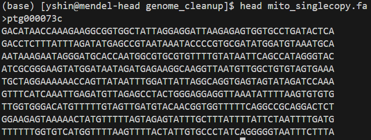

We can see that the header is the contig name. This is not ideal; let's change the header with species name:
```txt
sed 's/^>.*/>Gloydius_ussuriensis_mitogenome/' mito_singlecopy.fa > ussuri_mitogenome_ann.fa
head ussuri_mitogenome_ann.fa 
```


Now, scp this file to your local device.

__*The following steps are (mostly) run on a local device*__

Now that this step is done, we can annotate the assembled mitogenome using MITOS2 (https://usegalaxy.org/root?tool_id=toolshed.g2.bx.psu.edu%2Frepos%2Fiuc%2Fmitos2%2Fmitos2%2F2.1.3%20galaxy0).

Use the following settings:
1) Input file: ussuri_mitogenome_ann.fasta
2) In file uploads, use "auto-detect" and do not specify the reference
3) Use "Vertebrate (2)" genetic code and "RefSeq63 Metazoa" for reference data
4) Select BED, GFF, and nucleotide FASTA, and zipped raw results as outputs
5) Turn on email notification
6) Turn on "Attempt to re-use jobs with identical parameters?"

MITOS2 can be run through the run on the Galaxy Server. The window looks something like this:
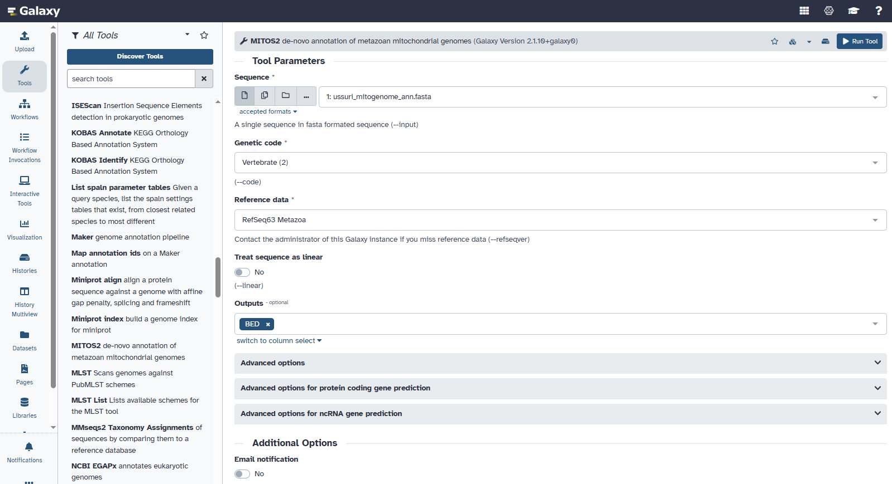

After MITOS2 run is complete, run a quick sanity check on the output GFF (annotation) file. First, download all output files in the "mitos2" directory in your local device and cd into it (in my case the directory in my local device is: /home/yshin/Gloydius_ussuriensis_genome_assembly/outfiles/mito_assembly/mitos2)
```txt
grep -v "^#" "Galaxy7-[MITOS2 on dataset 5_ GFF].gff" | cut -f3 | sort | uniq -c
```
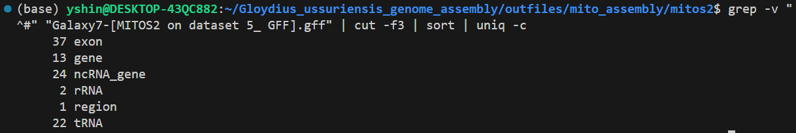

Looks good! Also check if the names of all 13 protein-coding genes:
```
grep -v "^#" "Galaxy7-[MITOS2 on dataset 5_ GFF].gff" | awk -F'\t' '$3=="gene"{print $9}' | \
  grep -Eo 'cox1|cox2|cox3|cob|cytb|atp6|atp8|nad1|nad2|nad3|nad4l|nad4|nad5|nad6' | sort | uniq -c
```
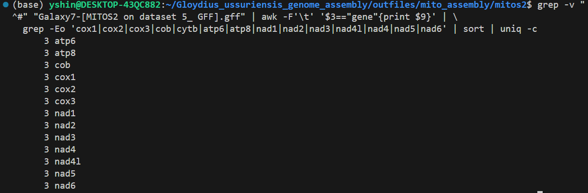

Sweet. Now let's rotate the mitogenome FASTA based on the location of tRNA-Phe (trnF)
```txt
grep -i -E "trnF|tRNA-Phe|phenylalanine" "Galaxy7-[MITOS2 on dataset 5_ GFF].gff" 
```


We can see that trnF starts at position 15284 and ends at position 15347. __BUT,__ because the orientation of this sequence is (-), this means that the actual 5' end is at position 15347 and the 3' is at position 15284. 

Now we can rotate the sequence based on this information. To do so, first install the "rotate" package under the mendel-nas1 directory:

```txt
###  this is run on the cluster
# install
git clone https://github.com/richarddurbin/rotate.git ; cd rotate ; make

# to run, cd into the folder containing rotate and then run:
./rotate
```

Once the package is installed, run it on the head node. Since the start position orientation is on the (-) strand, make position 15347 as the start position. In addition, because the strand orientation is (-), make sure to reverse complement when you rotate (use the -rc flag).

```txt
### run rotate with the input sequence
# path to seq 
path_to_seq=/home/yshin/mendel-nas1/snake_genome_ass/G_ussuriensis_Chromo/genome_cleanup

# output dir
out_dir=/home/yshin/mendel-nas1/snake_genome_ass/G_ussuriensis_Chromo/mt_genome

# run rotate. run this in the rotate directory under mendel-nas1/
./rotate -x 15347 -rc ${path_to_seq}/ussuri_mitogenome_ann.fa > ${out_dir}/ussuri_mt_rotated.fasta

# check stats
conda activate genome_assembly
seqkit stats ${out_dir}/ussuri_mt_rotated.fasta
```
The output should look something like this:
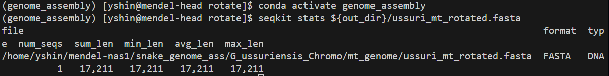

Awesome. Now, scp the rotated fasta the directory in your local device and re-run MITOS2 to get GFF of the rotated FASTA. Once this is done, run some final checks

```txt
###  this is run on a local device
# cd into mito assembly directory
cd outfiles/mito_assembly/rotated/

# make directory for the final output files
mkdir final

# copy the "ussuri_mt_rotated.fasta" and the .gff file to the "final" folder
cp ussuri_mt_rotated.fasta final/
cp *.gff final/

# change the gff file name
mv 'Galaxy28-[MITOS2 on dataset 26_ GFF].gff' annotation_rotated_final.gff

# cd into final folder and change file names and confirm gene content again
cd final/
grep -v "^#" *.gff | cut -f3 | sort | uniq -c
```
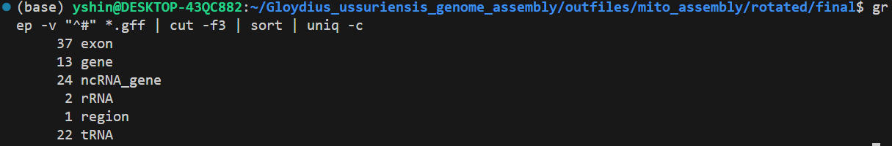

```
# check trnF position
grep -i -E "gene_trnF|Name=trnF|trnF" *.gff
```
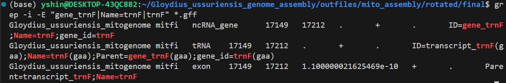

The trnF is now shown to span 1 bp - 64 bp.This is exactly what we expect from a correctly rotated sequence. Check the sequence stats in the local device using seqkit (install it if you need to).

```txt
seqkit stats ussuri_mt_rotated.fasta
```


Awesome! this can now be imported into Geneious for visualization.
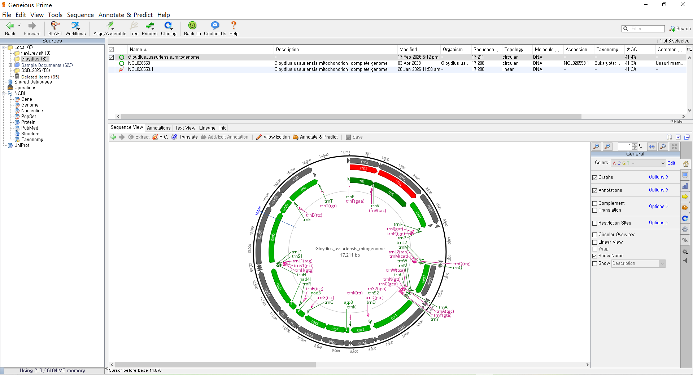

__Note:__ The steps outlined above already have a lot of manual work. But then it needs further manual curation to adjust annotation. But we don't have to go through all of this for this sample because MitoHiFi run we did in the "Contamination screening" step will automatically produce fully annotated mitogenome that requires minimal manual data processing.


From here, we only need to manually annotate the replication origin and two D-loop regions. I did this by extracting these sequences from the reference mitogenome and aligning them to the MitoHiFi assembly. The final output looks like this (after some name edits):


Note that this genome is also 17,211bp long, like the assembly generated through the steps in this subsection. But overall, MitoHiFi output produced a cleaner output. This is because the assembly we annotated with MITOS2 had some issues determining gene boundaries in some places. Let's look at this by comparing the MitoHiFi assembly, MITOS2 assembly, and the reference mitogenome:


Finally, recall that our mitogenome was contained in the contig ptg000073c and that this contig was 68,844 bp in length. Since our mitogenome is 17.211 bp in length, this mean that the contig has four complete mitogenomes stitched back to back four times. Let's make sure this is actually the case by splitting up this contig into four equal chunks and see if each of them is indeed a complete mitogenome.

First, let's cd into the "genome_cleanup" directory on Mendel, which is where the ptg000073c contig fasta file is located in. Activate the "genome_assembly" conda env and use seqkit to check the length of this contig:
```sh
# in the "genome_cleanup" directory
conda activate genome_assembly
seqkit stats ptg000073c.fa
```
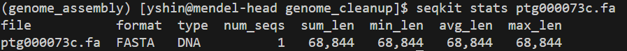

Now, let's create a "mito_chunks" directory under the current directory to store the split files, and use the samtools faidx command to slice this contig into four chunks, each exactlty 17,211 bp in length. 
```sh
# make the directory
mkdir mito_chunks

# copy the contig file into this directory
cp ptg000073c.fa mito_chunks

# cd into the mito_chunks directory
cd mito_chunks/

# index the fasta first
samtools faidx ptg000073c.fa

# set contig name as variable
c_name="ptg000073c"

# split
samtools faidx ptg000073c.fa ${c_name}:1-17211     > mito_part1.fa
samtools faidx ptg000073c.fa ${c_name}:17212-34422 > mito_part2.fa
samtools faidx ptg000073c.fa ${c_name}:34423-51633 > mito_part3.fa
samtools faidx ptg000073c.fa ${c_name}:51634-68844 > mito_part4.fa
```
Let's use seqkit to verify the size of each chunk
```sh
seqkit stats mito_part*
```
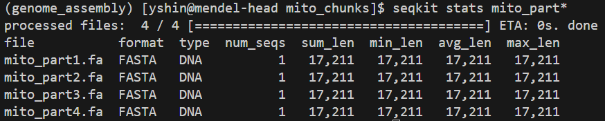

scp this folder to our local device and run blast on each of them. The results will show that they all match our *G. ussuriensis* reference mitogenome with > 99% percent identity with 100% query cover. This confirms that mitogenomes were stitched four times on to the contig ptg000073c. This likely happened because the assembler failed to recognize the circular nature of the mitogenome.

----------------------------------------------------------------------------------------------------
### Submitting mitogenome to GenBank
Let's submit the completed mitogenome assembly to GenBank. Prior to this step. I loaded the final mitogenome output from mitohifi on to Geneious Prime and manually annotated the two D-loops and replication origin. I did this by extracting these sequences from the conspecific reference mitogenome and mapping them to the assembled mitogenome using the "Map to reference" tool. I then downloaded this as a fasta file. This file is stored in a new directory at "/home/yshin/Gloydius_ussuriensis_genome_assembly/outfiles/mitogenome_GenBank_submission"

Let's also copy the "final_mitogenome.gb" file from the mitohifi output directory to this directory:
```sh
# cd into mitohifi output directory
cd /home/yshin/Gloydius_ussuriensis_genome_assembly/outfiles/mitohifi

# copy .gb file over to mitogenome submission directory
cp final_mitogenome.gb /home/yshin/Gloydius_ussuriensis_genome_assembly/outfiles/mitogenome_GenBank_submission

# cd into mitogenome submission directory
cd /home/yshin/Gloydius_ussuriensis_genome_assembly/outfiles/mitogenome_GenBank_submission
```

## 10) Telomere identification
```sh
conda create -n tidk
conda activate tidk
conda install -c bioconda tidk
```

Run tidk and search for vertebrate telomeric motifs [(TTAGGG)n] across scaffolds using the "search" command.
```sh
#!/bin/bash
#SBATCH --job-name=find_telomere
#SBATCH --nodes=1
#SBATCH --cpus-per-task=48
#SBATCH --mem=300G
#SBATCH --time=100:00:00
#SBATCH --partition=compute
#SBATCH --mail-type=ALL
#SBATCH --mail-user=yshin@amnh.org
#SBATCH --output=/home/yshin/mendel-nas1/snake_genome_ass/G_ussuriensis_Chromo/scripts/outfiles/slurm-%x_%j.out
#SBATCH --error=/home/yshin/mendel-nas1/snake_genome_ass/G_ussuriensis_Chromo/scripts/outfiles/slurm-%x_%j.err

# activate the conda env
source ~/.bash_profile
conda activate tidk

# set output dir
outdir="/home/yshin/mendel-nas1/snake_genome_ass/G_ussuriensis_Chromo/find_telomere"
mkdir -p ${outdir}
cd ${outdir}

# input scaffolded genome
GENOME="/home/yshin/mendel-nas1/snake_genome_ass/G_ussuriensis_Chromo/final_assembly/curated/Gloydius_ussuriensis_AMNH_21010_curated_scaffold11_split.fa"

# run tidk
echo "Running tidk search for vertebrate telomere repeat TTAGGG: $(date)"
tidk search \
  --string TTAGGG \
  --output Gloydius_ussuriensis_tidk \
  --dir ${outdir} \
  "$GENOME"
```
After this is done, go to the output directory and run the "plot" command to generate a plot from the output .tsv file.
```sh
# in the "find_telomere" direcrtory
tidk plot --tsv Gloydius_ussuriensis_tidk_telomeric_repeat_windows.tsv
```

Next, summarize this output and count the number of telomeric repeats in the first and last 50 Kb of each chromosome using the python script below. If there are >= 100 telomeric motifs present, interpret this as both ends having telomeres enriched.
```py
#!/usr/bin/env python3

import csv
import os
import sys
from collections import defaultdict

# ------------------------------------------------------------
# Summarize terminal telomeric repeat signal from TIDK output
# for the final curated Gloydius ussuriensis chromosome assembly.
#
# Usage:
#   python summarize_tidk_terminal_curated.py TIDK_WINDOWS_TSV
#
# Example:
#   python summarize_tidk_terminal_curated.py \
#     final_QC/tidk/Gloydius_curated_TTAGGG_telomeric_repeat_windows.tsv \
#     > final_QC/tidk/Gloydius_curated_terminal_telomere_summary.tsv
# ------------------------------------------------------------

# Required input: TIDK windows TSV generated from the curated assembly
if len(sys.argv) != 2:
    sys.stderr.write(
        "Usage:\n"
        "  python summarize_tidk_terminal_curated.py TIDK_WINDOWS_TSV\n\n"
        "Example:\n"
        "  python summarize_tidk_terminal_curated.py "
        "final_QC/tidk/Gloydius_curated_TTAGGG_telomeric_repeat_windows.tsv "
        "> final_QC/tidk/Gloydius_curated_terminal_telomere_summary.tsv\n"
    )
    sys.exit(1)

tidk_tsv = sys.argv[1]

# Final curated assembly index
curated_dir = "/home/yshin/mendel-nas1/snake_genome_ass/G_ussuriensis_Chromo/final_assembly/curated"
fai = os.path.join(
    curated_dir,
    "Gloydius_ussuriensis_AMNH_21010_curated_scaffold11_split.fa.fai"
)

# Settings
terminal_window = 50000   # summarize first and last 50 kb
threshold = 100           # counts >= this are treated as telomere-positive

# ------------------------------------------------------------
# Check input files
# ------------------------------------------------------------

if not os.path.exists(tidk_tsv):
    sys.stderr.write(f"ERROR: TIDK TSV not found:\n{tidk_tsv}\n")
    sys.exit(1)

if not os.path.exists(fai):
    sys.stderr.write(f"ERROR: FASTA index not found:\n{fai}\n")
    sys.stderr.write("Run: samtools faidx Gloydius_ussuriensis_AMNH_21010_curated_scaffold11_split.fa\n")
    sys.exit(1)

# ------------------------------------------------------------
# Read chromosome lengths from curated assembly .fai
# ------------------------------------------------------------

lengths = {}

with open(fai) as f:
    for line in f:
        fields = line.rstrip("\n").split("\t")
        if len(fields) < 2:
            continue
        lengths[fields[0]] = int(fields[1])

# ------------------------------------------------------------
# Store summed terminal repeat counts
# ------------------------------------------------------------

left_counts = defaultdict(int)
right_counts = defaultdict(int)

seen_ids = set()

with open(tidk_tsv) as f:
    reader = csv.DictReader(f, delimiter="\t")

    required_cols = {"id", "window", "forward_repeat_number", "reverse_repeat_number"}
    missing_cols = required_cols - set(reader.fieldnames or [])

    if missing_cols:
        sys.stderr.write("ERROR: TIDK TSV is missing required columns:\n")
        sys.stderr.write(", ".join(sorted(missing_cols)) + "\n")
        sys.stderr.write("Found columns:\n")
        sys.stderr.write(", ".join(reader.fieldnames or []) + "\n")
        sys.exit(1)

    for row in reader:
        chrom = row["id"]
        seen_ids.add(chrom)

        if chrom not in lengths:
            continue

        window_end = int(row["window"])
        count = int(row["forward_repeat_number"]) + int(row["reverse_repeat_number"])
        chrom_len = lengths[chrom]

        # First 50 kb
        if window_end <= terminal_window:
            left_counts[chrom] += count

        # Last 50 kb
        if window_end > chrom_len - terminal_window:
            right_counts[chrom] += count

# ------------------------------------------------------------
# Warn if TIDK names do not match curated FASTA names
# ------------------------------------------------------------

matched = set(lengths).intersection(seen_ids)

if len(matched) == 0:
    sys.stderr.write(
        "WARNING: No TIDK sequence IDs match the curated FASTA .fai names.\n"
        "This usually means the TIDK file was generated from the old 69-scaffold assembly.\n"
        "Rerun TIDK on the curated FASTA:\n"
        f"{os.path.join(curated_dir, 'Gloydius_ussuriensis_AMNH_21010_curated_scaffold11_split.fa')}\n"
    )

# ------------------------------------------------------------
# Print terminal telomere summary
# ------------------------------------------------------------

print(
    "chromosome\tlength_bp\tsize_Mb\t"
    "left_50kb_count\tright_50kb_count\t"
    "left_positive\tright_positive\tinterpretation"
)

for chrom, length in sorted(lengths.items(), key=lambda x: x[1], reverse=True):
    left = left_counts[chrom]
    right = right_counts[chrom]

    left_pos = left >= threshold
    right_pos = right >= threshold

    if left_pos and right_pos:
        interpretation = "both ends"
    elif left_pos and not right_pos:
        interpretation = "left end only"
    elif not left_pos and right_pos:
        interpretation = "right end only"
    else:
        interpretation = "no strong terminal signal"

    print(
        f"{chrom}\t{length}\t{length / 1e6:.2f}\t"
        f"{left}\t{right}\t"
        f"{left_pos}\t{right_pos}\t{interpretation}"
    )
```

Go to the Python scripts dir and run it like:
```
# in the tidk conda env
python summarize_tidk_tsv.py /home/yshin/mendel-nas1/snake_genome_ass/G_ussuriensis_Chromo/find_telomere/Gloydius_ussuriensis_tidk_telomeric_repeat_windows.tsv > /home/yshin/mendel-nas1/snake_genome_ass/G_ussuriensis_Chromo/find_telomere/Gloydius_curated_terminal_telomere_summary.tsv
```