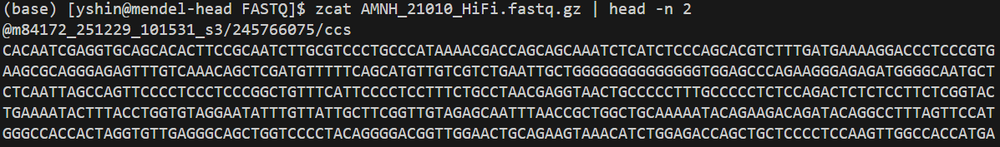
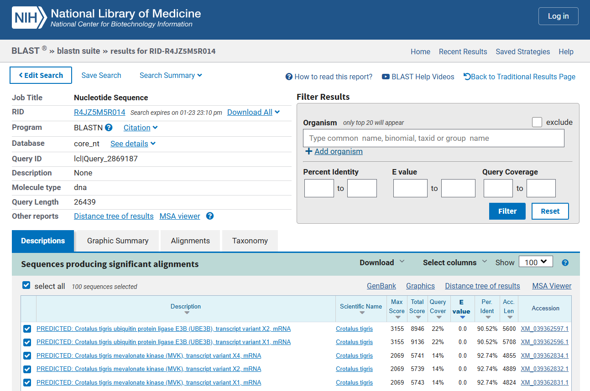

## 1) A quick sanity check on the dataset
Even before doing anything, let's do a very quick sanity check on the HiFi data to check the reads we have are actually from our target species. Let's take a chunk from the HiFi FASTQ file, after cd'ing into the directory containing the fastq.gz file:
```txt
zcat AMNH_21010_HiFi.fastq.gz | head -n 2
```

When you run the line above you will get a string of sequence read printed out:


Let's copy the whole chunk and paste it into NCBI BLAST. The result  will look something like this:


We can see that the top hits are from the Tiger Rattlesnake (*Crotalus tigris*). This is the expected result, although the species itself is not in the genus *Gloydius*. This is because our target species (*G. ussuriensis*) only have isolated, Sanger-sequenced mitochondrial and nuclear markers accessioned in GenBank. Since *C. tigris* is in the same subfamily as *Gloydius*, this means that our FASTQ file contains actual genome sequence reads from *G. ussuriensis*. 

Let's do the same for the RNA seq reads:
```txt
zcat AMNH_21010_Ht_1.fastq.gz | head -n 2
```
Repeat this for each tissue type and read, and you will see that all the hits come out to be snake mRNA genes. For the skin RNA reads, using the regular megablast option to optimize for highly similar sequences will print out a warning "No significant similarity found." However, switching to optimization for somewhat similar sequences (blastn) will print out hits for snake genes (from *Thamnophis* and *Candoia*).

Also, let's estimate the mean sequencing depth ("coverage") we got from the raw gzipped FASTQ file. We can get the coverage based on the number of bp in our FASTQ file divided by the estimated genome size. We don't know the genome size of *G. ussuriensis* yet, but we can use the genome size of related species as a proxy - here we will use the Shedao Pitviper (*Gloydius shedaoensis*) chromosome-level assembly for this purpose (1.52 Gb). 

```txt
# get the number of bp
zcat AMNH_21010_HiFi.fastq.gz | awk 'NR%4==2{bp+=length($0)} END{print bp/1e9 " Gb"}'
```
The output is 134.449 Gb. If we use the *G. shedaoensis* genome size, the coverage would be 134.449/1.52 = 88.4x.

Next, let's check the average read length. We can do so by running the "seqkit stats" command on our fastq.gz file:
```txt
# cd into the directory containing the .fastq.gz file
# cd /home/yshin/mendel-nas1/snake_genome_ass/G_ussuriensis_Chromo/PacBio_Revio/FASTQ

# activate the "genome_assembly" conda env to access seqkit / this conda env was already in place
# with seqkit installed
conda activate genome_assembly
seqkit stats AMNH_21010_HiFi.fastq.gz
```


## 2) *k*-mer analysis of raw reads using jellyfish
Conduct a *k*-mer count analysis on the raw reads using jellyfish. This can be useful to estimate the genome size, heterozygosity, etc. Use the following script to submit a job to the AMNH Mendel HPC cluster. The "zcat [...]" line first unpacks the HiFi fastq.gz file (without permanently extracting the content, because this file is massive), converts it into the FASTA format (dropping quality scores, etc.), and pipes that into jellyfish. The output .jf file is then fed into the "jellyfish histo" command to produce the .histo file for viewing.

```sh
#!/bin/bash
#SBATCH --job-name=kmer_ussuri
#SBATCH --nodes=1
#SBATCH --mem=100G
#SBATCH --partition=compute
#SBATCH --cpus-per-task=24
#SBATCH --time=06:00:00
#SBATCH --mail-type=ALL
#SBATCH --mail-user=yshin@amnh.org
#SBATCH --output=/home/yshin/mendel-nas1/snake_genome_ass/G_ussuriensis_Chromo/scripts/outfiles/slurm-%x_%j.out
#SBATCH --error=/home/yshin/mendel-nas1/snake_genome_ass/G_ussuriensis_Chromo/scripts/outfiles/slurm-%x_%j.err

# initiate conda and activate the conda environment
source ~/.bash_profile
conda activate genome_assembly

# make sure the script to fail fast and loudly if something is broken
set -euo pipefail

# path to sequence read
path_to_seq=/home/yshin/mendel-nas1/snake_genome_ass/G_ussuriensis_Chromo/PacBio_Revio/FASTQ

# specify output directory
outdir=/home/yshin/mendel-nas1/snake_genome_ass/G_ussuriensis_Chromo/PacBio_Revio/outfiles/

# run jellyfish
zcat ${path_to_seq}/AMNH_21010_HiFi.fastq.gz | awk 'NR%4==1{print ">"substr($0,2)} NR%4==2{print}' | jellyfish count -m 21 -s 10G -t ${SLURM_CPUS_PER_TASK} -C /dev/fd/0 -o ${outdir}/Gloydius_ussuriensis_kmer.jf
jellyfish histo ${outdir}/Gloydius_ussuriensis_kmer.jf -t ${SLURM_CPUS_PER_TASK} > ${outdir}/Gloydius_ussuriensis_kmer.histo
```

The output .histo file can be fed into GenomeScope 2.0 (http://genomescope.org/genomescope2.0/) to visualize the results, which look something like: 


The results suggest:
  - Estimated haploid genome size of 1.18 Gb
  - Estimated repeat content of 21.3%
  - High homozygosity (~99%)
  - Very low read error rate (~0.15%) 
  - Very high sequencing coverage/depth (~100x)
