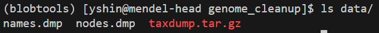
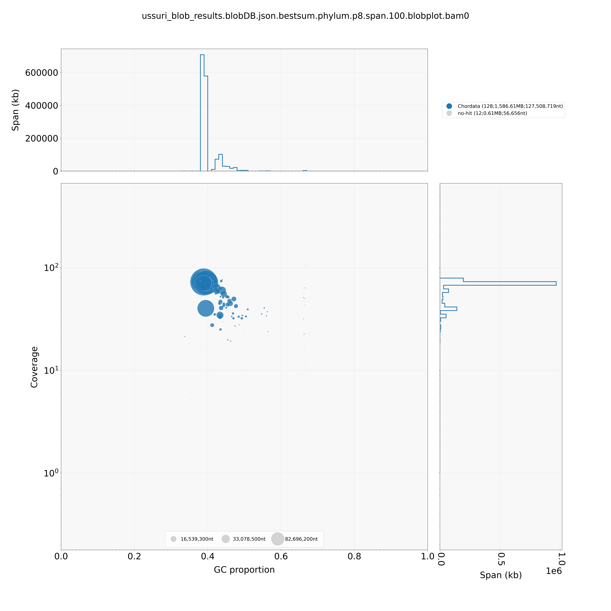
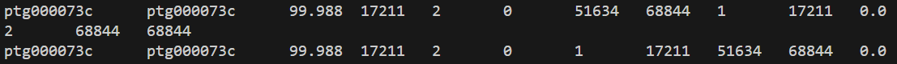
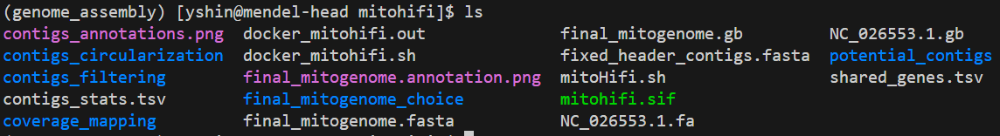

## 4) Contamination screening
The draft assembly likely contains mitochondrial contigs and/or potential microbial contaminants. So, it is always a good idea to check for these and "clean up" the genome before finalizing the assembly and publishing it. This section is based on https://github.com/amandamarkee/actias-luna-genome

Let's setup the workspace for this clean up step.
```
# make a directory for clean up work
mkdir genome_cleanup

# copy the draft assembly from its directory to the clean up workspace
cp Gloydius_ussuriensis_v1.asm.bp.p_ctg.fa /home/yshin/mendel-nas1/snake_genome_ass/G_ussuriensis_Chromo/genome_cleanup

# create a conda env for blobtools
conda create -n blobtools
conda activate blobtools

# install blobtools
conda install bioconda::blobtools

```

Let's start by getting the "pre-cleanup" stats
```
seqkit stats Gloydius_ussuriensis_v1.asm.bp.p_ctg.fa > preclean_stats.txt
cat preclean_stats.txt
```
We can see that there are 140 contigs total.

----------------------------------------------------------------------------------------------------
### Screening for potential non-vertebrate contaminants using blobtools
We will use blobtools to identify potential non-vertebrate (e.g., microbial) contaminants. To run blobtools, we need the following:
  - nodes.dmp and names.dmp files from NCBI taxdump
  - .bam file output from minimap2 and samtools
  - .nt blast hit file from ncbi megablast run

Let's prep these files. First, get nodes.dmp and names.dmp files from NCBI taxdump.
```
# activate the blobtools conda env to use blobtools
conda activate blobtools

# create a directory to store data
mkdir data

# download NCBI taxdump and create nodes.dmp and names.dmp
wget ftp://ftp.ncbi.nlm.nih.gov/pub/taxonomy/taxdump.tar.gz -P data/
tar zxf data/taxdump.tar.gz -C data/ nodes.dmp names.dmp
blobtools nodesdb --nodes data/nodes.dmp --names data/names.dmp
```
Then, if you do "ls data/" you should see something like:



To generate the blast hit file, we will use the Huxley cluster because it already has the database soft linked to /nas3. Blast is also available as a module on Huxley. But before running blast, there is one thing to consider - blasting a whole genome assembly againt the database will take a long time. The job will either fail due to insufficient computational resources or walltime. 

One loophole is to divide up the assembly fasta file and then running an array job (thanks Amanda for this tip!).

To divide up the assembly fasta file, navigate to the directory containing the assembled genome and run these commands in the console:

```txt
# make directory for split fasta files
mkdir asm_div

# spilit fasta
awk 'BEGIN {n_seq=0;} /^>/ \
{if(n_seq%50==0){file=sprintf("seq_%d.fa",n_seq);} \
print >> file; n_seq++; next;} { print >> file; }' < Gloydius_ussuriensis_v1.asm.bp.p_ctg.fa

# move split fastas to asm_div directory
mv seq_* asm_div/

# put split files into a list
cd asm_div/
ls *.fa > blast.list

# check the number of lines in the blast.list file to use as an input to the array command
wc -l blast.list
```

Then run the array job as below:
```sh
#!/bin/bash
#SBATCH --job-name=blobBlst_ussuri
#SBATCH --nodes=1
#SBATCH --mem=500G
#SBATCH --partition=bigmem
#SBATCH --cpus-per-task=32
#SBATCH --array=1-3
#SBATCH --time=7-00:00:00
#SBATCH --mail-type=ALL
#SBATCH --mail-user=yshin@amnh.org
#SBATCH --output=/home/yshin/nas4/G_ussuriensis_Chromo/slurm_logs/slurm-%x_%j.out
#SBATCH --error=/home/yshin/nas4/G_ussuriensis_Chromo/slurm_logs/slurm-%x_%j.err

# this is run on the AMNH Huxley cluster
# load module
module load BLAST/2.11.0-Linux_x86_64 

# path to genome cleanup directory
wdir=/home/yshin/nas4/G_ussuriensis_Chromo/genome_cleanup

# path to DB
export BLASTDB=/nas3/database/nt_2024_10_23
blastdbcmd -db nt -info

# path to assembly
path_to_asm=${wdir}/asm_div

# output dir
out_dir=/home/yshin/nas4/G_ussuriensis_Chromo/genome_cleanup/blast_out

# assign and print array ID
i=${SLURM_ARRAY_TASK_ID}
P=$(awk "NR==$i" ${path_to_asm}/blast.list)

# run blast
blastn \
  -db nt \
  -task megablast \
  -query ${path_to_asm}/${P} \
  -out ${out_dir}/${P}.blast.out \
  -max_target_seqs 10 \
  -max_hsps 1 \
  -evalue 1e-20 \
  -outfmt "6 qseqid staxids bitscore sseqid sskingdoms sscinames" \
  -num_threads=${SLURM_CPUS_PER_TASK}  
```

Once this job finishes running, navigate to the output directory and merge the three output files into a single .nt file to be used as an input for blobtools.
```
# the output dir is /home/yshin/nas4/G_ussuriensis_Chromo/genome_cleanup/blast_out
cat *.blast.out > Gloydius_megablast.nt
```
Now, send this file to Mendel so that it can be used as input for blobtools.

We also need mapping files as a final input. These can be made by mapping the raw fastq file back to the reference (i.e. draft assembly) using minimap2, and then converting the output SAM file into a BAM file and sorting and indexing them using samtools. Run the job script below on Mendel:

```sh
#!/bin/bash
#SBATCH --job-name=blobMapping_ussuri
#SBATCH --nodes=1
#SBATCH --mem=200G
#SBATCH --partition=compute
#SBATCH --cpus-per-task=32
#SBATCH --time=144:00:00
#SBATCH --mail-type=ALL
#SBATCH --mail-user=yshin@amnh.org
#SBATCH --output=/home/yshin/mendel-nas1/snake_genome_ass/G_ussuriensis_Chromo/scripts/outfiles/slurm-%x_%j.out
#SBATCH --error=/home/yshin/mendel-nas1/snake_genome_ass/G_ussuriensis_Chromo/scripts/outfiles/slurm-%x_%j.err

# activate conda env
source ~/.bash_profile
conda activate genome_assembly

# designate paths to assembly and fastq
path=/home/yshin/mendel-nas1/snake_genome_ass/G_ussuriensis_Chromo/genome_cleanup

# output directory
outdir=/home/yshin/mendel-nas1/snake_genome_ass/G_ussuriensis_Chromo/genome_cleanup/mapping

# mapping
# -@ 8 means "use 8 threads" 
minimap2 -t ${SLURM_CPUS_PER_TASK} -ax map-hifi ${path}/Gloydius_ussuriensis_v1.asm.bp.p_ctg.fa \
  ${path}/AMNH_21010_HiFi.fastq.gz | samtools view -@ 8 -b \
  | samtools sort -@ 8 -o ${outdir}/ussuri_aln_sorted.bam

# index BAM 
samtools index ${outdir}/ussuri_aln_sorted.bam 
```
Now we have all the input files required to run blobtools. Run blobtools with this script on Mendel:

```sh
#!/bin/bash
#SBATCH --job-name=blobView_ussuri
#SBATCH --nodes=1
#SBATCH --mem=200G
#SBATCH --partition=compute
#SBATCH --cpus-per-task=32
#SBATCH --time=144:00:00
#SBATCH --mail-type=ALL
#SBATCH --mail-user=yshin@amnh.org
#SBATCH --output=/home/yshin/mendel-nas1/snake_genome_ass/G_ussuriensis_Chromo/scripts/outfiles/slurm-%x_%j.out
#SBATCH --error=/home/yshin/mendel-nas1/snake_genome_ass/G_ussuriensis_Chromo/scripts/outfiles/slurm-%x_%j.err

# activate conda env
source ~/.bash_profile
conda activate blobtools

# set paths to different inputs
asm=/home/yshin/mendel-nas1/snake_genome_ass/G_ussuriensis_Chromo/genome_cleanup/Gloydius_ussuriensis_v1.asm.bp.p_ctg.fa
aln_sorted_bam=/home/yshin/mendel-nas1/snake_genome_ass/G_ussuriensis_Chromo/genome_cleanup/mapping/ussuri_aln_sorted.bam
megablast=/home/yshin/mendel-nas1/snake_genome_ass/G_ussuriensis_Chromo/genome_cleanup/blast_out/Gloydius_megablast.nt
nodes=/home/yshin/mendel-nas1/snake_genome_ass/G_ussuriensis_Chromo/genome_cleanup/data/nodes.dmp
names=/home/yshin/mendel-nas1/snake_genome_ass/G_ussuriensis_Chromo/genome_cleanup/data/names.dmp

# output dir
outdir=/home/yshin/mendel-nas1/snake_genome_ass/G_ussuriensis_Chromo/genome_cleanup/blob_out

# run blobtools
blobtools create -i ${asm} -b ${aln_sorted_bam} -t ${megablast} --nodes ${nodes} --names ${names} \
  -o ${outdir}/ussuri_blob_results
```

Now, run the lines below in the head node to generate output files and plots.
```
# activate blobtools conda env
conda activate blobtools

# cd into the blobtools output directory
# view blobtools results and plot
blobtools view -i ussuri_blob_results.blobDB.json
blobtools plot -i ussuri_blob_results.blobDB.json
```
This will generate a whole bunch of files:


Now, scp these files from the cluster to a local device for viewing.



We can see there are no obvious non-vertebrate contaminants.

----------------------------------------------------------------------------------------------------
### Identifying and removing mitochondrial contigs from the draft assembly
PacBio long-read assemblies usually contain complete mitogenomes as a sequencing bycatch, and it is a good idea to identify and remove them from primary assemblies in order to get a clean nuclear whole genome. This can be done by blasting the mitochondrial reference to the draft assembly. *G. ussuriensis* already has a couple assembled mitogenomes on GenBank. We will use one of them (NC_026553.1) as a mitocohndrial reference. Let's fetch this sequence from GenBank using entrez.

```txt
# create a directory to store mito reference
mkdir -p /home/yshin/mendel-nas1/snake_genome_ass/G_ussuriensis_Chromo/PacBio_Revio/mito_ref
cd /home/yshin/mendel-nas1/snake_genome_ass/G_ussuriensis_Chromo/PacBio_Revio/mito_ref

# install entrez to fetch seq from ncbi
conda activate genome_assembly
conda install -y -c bioconda entrez-direct

# fetch seq and annotation
ref_acc=NC_026553.1
echo ${ref_acc}

efetch -db nucleotide -id ${ref_acc} -format fasta > ${ref_acc}.fa
efetch -db nucleotide -id ${ref_acc} -format gbwithparts > ${ref_acc}.gb

# move the .fa file to the "genome_cleanup" directory
cp NC_026553.1.fa /home/yshin/mendel-nas1/snake_genome_ass/G_ussuriensis_Chromo/genome_cleanup
```
Once you get this file, we can run blast on Mendel with the script below. Note that we are creating a blast database internally in this script. The "-outfmt 6" flag means that the output format will be tabular. 
```sh
#!/bin/bash
#SBATCH --job-name=idMito_ussuri
#SBATCH --nodes=1
#SBATCH --mem=200G
#SBATCH --partition=compute
#SBATCH --cpus-per-task=32
#SBATCH --time=144:00:00
#SBATCH --mail-type=ALL
#SBATCH --mail-user=yshin@amnh.org
#SBATCH --output=/home/yshin/mendel-nas1/snake_genome_ass/G_ussuriensis_Chromo/scripts/outfiles/slurm-%x_%j.out
#SBATCH --error=/home/yshin/mendel-nas1/snake_genome_ass/G_ussuriensis_Chromo/scripts/outfiles/slurm-%x_%j.err

# load blast
module load NCBI/blast-2.10.1+

# set paths to input
mito_ref=/home/yshin/mendel-nas1/snake_genome_ass/G_ussuriensis_Chromo/genome_cleanup/NC_026553.1.fa
asm_fa=/home/yshin/mendel-nas1/snake_genome_ass/G_ussuriensis_Chromo/genome_cleanup/Gloydius_ussuriensis_v1.asm.bp.p_ctg.fa

# set output dir
outdir=/home/yshin/mendel-nas1/snake_genome_ass/G_ussuriensis_Chromo/genome_cleanup

# build DB in a dedicated folder with a proper prefix name
dbdir=${outdir}/blast_db_mito
mkdir -p "${dbdir}"
dbprefix="${dbdir}/ussuri_asm"

echo "Making BLAST DB:"
echo "  asm_fa   = ${asm_fa}"
echo "  dbprefix = ${dbprefix}"

makeblastdb -in "${asm_fa}" -dbtype nucl -out "${dbprefix}"

# sanity check DB
echo "DB files:"
ls -lh "${dbprefix}".n* || { echo "ERROR: DB files not found"; exit 1; }
blastdbcmd -db "${dbprefix}" -info || { echo "ERROR: blastdbcmd failed"; exit 1; }

# run blast
blastn \
-query "${mito_ref}" \
-db "${dbprefix}" \
-out ${outdir}/mito_contigs_blast.out \
-outfmt 6 \
-evalue 1e-20 \
-num_threads ${SLURM_CPUS_PER_TASK}

# convert output into csv
tr '\t' ',' < ${outdir}/mito_contigs_blast.out > ${outdir}/mito_contigs_blast.csv
```

The output should look something like this:


Let's break this down. 
- Column 1: "qseqid" (means "query sequence ID") - Shows the GenBank accession number of the mitogenome reference. 
- Column 2: "sseqid" (means "subject sequence ID") - Shows the contig names in the draft assembly. 
- Column 3: "pident" (percent identity) - Shows the percent match between the mitochondrial reference and contig. 
- Column 4: length - Shows the length of aligned region. 
- Column 5: mismatch - Shows the number of mismatched base pairs.
- Column 6: "gapopen" - Number of gaps in the alignment.
- Column 7: "qstart" - Start position on query (mitochondrial reference).
- Column 8: "qend" - End position on query.
- Column 9: "sstart" - Start position on subject (draft assembly). 
- Column 10: "send" - End position on subject.
- Column 11: "evalue" - evalue of 0 means that the probability the match is random is 0.
- Column 12: "bitscore" - Alignment score

Based on this, let's focus on the contig ptg000073c. This contig has a percent identity of 99% to the mitochondrial reference, the length of aligned region is 17,212bp, and mismatch is relatively small at 161bp over 17kb. The mitochondrial reference is 17,208bp. Based on this, this contig very likely contains the complete mitogenome, which is expected from PacBio long-read sequencing results. 

Let's look at this contig in more detail. First, let's check the length:
```
# make sure that you are working in the "genome_cleanup" directory
# activate conda env
conda activate genome_assembly

# check contig length
seqkit fx2tab -n -l Gloydius_ussuriensis_v1.asm.bp.p_ctg.fa | grep -w ptg000073c
```
This will show that the contig is 68.8Kb long, which is much longer than the actual mitogenome. But this likely because one whole mitogenome was repeated several time on the same contig. For example:

In the first three lines we can see that 17,212bp stretch is repeated three times, and the fourth line shows another 15,348bp region, and there are other, shorter hits. Combined, this is about 67Kb long. Also, 68.8Kb is about 17.2Kb x 4. 

We can verify this by blasting the putative mitochondrial contig to itself.
First, let's store this contig as a separate file.
```
# store mito contigs into a separate file
seqkit grep -p ptg000073c Gloydius_ussuriensis_v1.asm.bp.p_ctg.fa \
-o Gloydius_ussuriensis_AMNH_21010_mito.fa
```

Then, use the script below to run blast:
```sh
#!/bin/bash
#SBATCH --job-name=selfalignMito_ussuri
#SBATCH --nodes=1
#SBATCH --mem=50G
#SBATCH --partition=compute
#SBATCH --cpus-per-task=16
#SBATCH --time=04:00:00
#SBATCH --mail-type=ALL
#SBATCH --mail-user=yshin@amnh.org
#SBATCH --output=/home/yshin/mendel-nas1/snake_genome_ass/G_ussuriensis_Chromo/scripts/outfiles/slurm-%x_%j.out
#SBATCH --error=/home/yshin/mendel-nas1/snake_genome_ass/G_ussuriensis_Chromo/scripts/outfiles/slurm-%x_%j.err

# load modules
module load NCBI/blast-2.10.1+

# activate conda env
source ~/.bash_profile
conda activate genome_assembly

# inputs
mito_fa=/home/yshin/mendel-nas1/snake_genome_ass/G_ussuriensis_Chromo/genome_cleanup/Gloydius_ussuriensis_AMNH_21010_mito.fa
mito_contig="ptg000073c"

# output dir
outdir=/home/yshin/mendel-nas1/snake_genome_ass/G_ussuriensis_Chromo/genome_cleanup/selfalign_mito
mkdir -p "${outdir}"

# build BLAST DB from mito contig
dbdir="${outdir}/blast_db"
mkdir -p "${dbdir}"
dbprefix="${dbdir}/${mito_contig}"

echo "Making BLAST DB:"
echo "  mito_fa   = ${mito_fa}"
echo "  dbprefix  = ${dbprefix}"
makeblastdb -in "${mito_fa}" -dbtype nucl -out "${dbprefix}"

# sanity check DB
echo "DB info:"
blastdbcmd -db "${dbprefix}" -info || { echo "ERROR: blastdbcmd failed"; exit 1; }

# self-BLAST (mito vs mito)
# use stricter settings + filter to highlight tandem repeat structure
# include qlen/slen to help interpret offsets and copy structure.
tsv="${outdir}/${mito_contig}_selfblast.tsv"
csv="${outdir}/${mito_contig}_selfblast.csv"

blastn \
  -query "${mito_fa}" \
  -db "${dbprefix}" \
  -out "${tsv}" \
  -outfmt "6 qseqid sseqid pident length mismatch gapopen qstart qend sstart send evalue bitscore qlen slen" \
  -evalue 1e-50 \
  -num_threads "${SLURM_CPUS_PER_TASK}" \
  -dust no \
  -soft_masking false

# remove the trivial full-length self hit (diagonal) to make repeats obvious
# (keeps alignments where query and subject coordinates differ)
filtered_tsv="${outdir}/${mito_contig}_selfblast_filtered.tsv"
awk 'BEGIN{OFS="\t"} !($4==$13 && $7==1 && $8==$13 && $9==1 && $10==$13) {print}' "${tsv}" > "${filtered_tsv}"

# 5) convert to CSV (both full and filtered)
tr '\t' ',' < "${tsv}" > "${csv}"
tr '\t' ',' < "${filtered_tsv}" > "${outdir}/${mito_contig}_selfblast_filtered.csv"

echo "Done."
echo "Outputs:"
echo "  Full TSV      : ${tsv}"
echo "  Filtered TSV  : ${filtered_tsv}"
echo "  Full CSV      : ${csv}"
echo "  Filtered CSV  : ${outdir}/${mito_contig}_selfblast_filtered.csv"
```

Let's examine the output:
```
cat ptg000073c_selfblast_filtered.tsv
```


We can see that the alignment length here is 17,211bp. 17,211 x 4 is exactly 68,844bp. In the results, we can also see alignment lengths of 51,633bp (17,211 x 3) and 34,422bp (17,211 x 2). This basically means that the contig ptg000073c contains four tandem copies of the complete mitogenome.

Now that we identified the mitochondrial contig, let's snip it out from our draft assembly. This "no mito" assembly will be used in all downstream assembly steps.
```
# run on the head node
# set paths to input
asm=/home/yshin/mendel-nas1/snake_genome_ass/G_ussuriensis_Chromo/genome_cleanup/Gloydius_ussuriensis_v1.asm.bp.p_ctg.fa
mito_fa=/home/yshin/mendel-nas1/snake_genome_ass/G_ussuriensis_Chromo/genome_cleanup/ptg000073c.fa

# set output dir
outdir=/home/yshin/mendel-nas1/snake_genome_ass/G_ussuriensis_Chromo/PacBio_Revio/no_mito

# read the contig ID from the mito file
mito_id=$(grep -m1 "^>" "$mito_fa" | sed 's/^>//' | awk '{print $1}')
echo "mito contig ID = $mito_id"

# create the no-mito assembly
seqkit grep -v -p "$mito_id" "$asm" > "$outdir/Gloydius_ussuriensis_AMNH_21010_noMito.fa"

# sanity check == contig count should drop by 1
echo "original contigs:"; grep -c "^>" "$asm"
echo "no-mito contigs:"; grep -c "^>" "$outdir/Gloydius_ussuriensis_AMNH_21010_noMito.fa"
```
We can see that the total number of contigs went from 140 to 139 after removing the mito contig.

Also, let's store a single mitogenome copy for later use:
```
# run this in the "genome_cleanup" directory
seqkit grep -p ptg000073c Gloydius_ussuriensis_v1.asm.bp.p_ctg.fa > ptg000073c.fa
seqkit subseq -r 1:17211 ptg000073c.fa > mito_singlecopy.fa
seqkit stats mito_singlecopy.fa
```


This is exactly what we expect to see.

As one final step, let's verify that the mitochondrial contig is gone from our draft assembly. This can be done using MitoHiFi (https://github.com/marcelauliano/MitoHiFi), which is a pipeline that finds, circularises and annotates mitogenome from PacBio assemblies. Installing this can be quite tricky. So, instead of fighting my way through installation, I created a directory for mitohifi under the "/home/yshin/mendel-nas1/snake_genome_ass/G_ussuriensis_Chromo" directory just copied the mitohifi.sif file from Dani's directory on Mendel. Also, it is possible to run MitoHiFi through the Galaxy web server (https://galaxy-main.usegalaxy.org/).
```
# make mitohifi directory
cd /home/yshin/mendel-nas1/snake_genome_ass/G_ussuriensis_Chromo
mkdir -p mitohifi
cd mitohifi/

# copy mitohifi.sif file over to this directory
cp /home/dgarcia/mendel-nas1/PacBio/Helicops_angulatus_Aug2024/mitogenome_assembly/MitoHiFi/mitohifi.sif .
``` 
After this, run the script below. If we correctly eliminated the mitochondrial contig, __this run should fail because there are no mitochondrial reads to find and annotate__

```sh
#!/bin/bash
#SBATCH --job-name=checkNoMito_ussuri
#SBATCH --nodes=1
#SBATCH --cpus-per-task=32
#SBATCH --mem=180G
#SBATCH --time=48:00:00
#SBATCH --partition=compute
#SBATCH --mail-type=ALL
#SBATCH --mail-user=yshin@amnh.org
#SBATCH --output=/home/yshin/mendel-nas1/snake_genome_ass/G_ussuriensis_Chromo/scripts/outfiles/slurm-%x_%j.out
#SBATCH --error=/home/yshin/mendel-nas1/snake_genome_ass/G_ussuriensis_Chromo/scripts/outfiles/slurm-%x_%j.err

# use mitohifi to verify the mito contig is absent from the "cleaned" assembly
# if we correctly eliminated mito contig, this script should fail to run
# the mitohifi .sif image was copied from Dani's file directory

# load apptainer to run mitohifi
module load Apptainer/apptainer-1.2.5

# MitoHiFi flags
# -c: assembled contigs in .fasta (e.g. output from hifiasm) 
# -r: PacBio read .fasta
# -f: Close-related Mitogenome is fasta format
# -g: .gb file associated with the mitogenome reference provided with -c
# -o: genetic code // vertebrate = 2 
# -t: n threads

# make output dir
outdir=/home/yshin/mendel-nas1/snake_genome_ass/G_ussuriensis_Chromo/check_no_mito
mkdir -p ${outdir}

# copy mitohifi.sif into outdir
cp /home/yshin/mendel-nas1/snake_genome_ass/G_ussuriensis_Chromo/mitohifi/mitohifi.sif ${outdir}

# cd into working directory
cd ${outdir}

# set paths for inputs (use /mendel-nas1, not /home/yshin/mendel-nas1)
contigs=/home/yshin/mendel-nas1/snake_genome_ass/G_ussuriensis_Chromo/PacBio_Revio/no_mito/Gloydius_ussuriensis_AMNH_21010_noMito.fa
mito_ref=/home/yshin/mendel-nas1/snake_genome_ass/G_ussuriensis_Chromo/PacBio_Revio/mito_ref/NC_026553.1.fa
mito_gb=/home/yshin/mendel-nas1/snake_genome_ass/G_ussuriensis_Chromo/PacBio_Revio/mito_ref/NC_026553.1.gb

# in-container file visibility test
apptainer exec --bind "/home/yshin:/home/yshin" --bind "/mendel-nas1:/mendel-nas1" --pwd "$PWD" mitohifi.sif \
  bash -lc 'ls -lh /home/yshin/mendel-nas1/snake_genome_ass/G_ussuriensis_Chromo/mitohifi/NC_026553.1.fa'

# run mitohifi
apptainer exec --bind "/home/yshin:/home/yshin" --bind "/mendel-nas1:/mendel-nas1" --pwd "$PWD" \
  mitohifi.sif python3 /opt/MitoHiFi/src/mitohifi.py -c ${contigs} -f ${mito_ref} -g ${mito_gb} -o 2 -t ${SLURM_CPUS_PER_TASK}
``` 
The error log should look something like this:


In contrast, running MitoHiFi with the assembly still containing the mitochondrial contig will produce the full result, including the annotated mitogenome.
```sh
#!/bin/bash
#SBATCH --job-name=mitoHiFi_ussuri
#SBATCH --nodes=1
#SBATCH --cpus-per-task=32
#SBATCH --mem=180G
#SBATCH --time=48:00:00
#SBATCH --partition=compute
#SBATCH --mail-type=ALL
#SBATCH --mail-user=yshin@amnh.org
#SBATCH --output=/home/yshin/mendel-nas1/snake_genome_ass/G_ussuriensis_Chromo/scripts/outfiles/slurm-%x_%j.out
#SBATCH --error=/home/yshin/mendel-nas1/snake_genome_ass/G_ussuriensis_Chromo/scripts/outfiles/slurm-%x_%j.err

# use mitohifi to identify and assemble a mitogenome from pacbio assembly
# the mitohifi .sif image was copied from Dani's file directory

# load apptainer to run mitohifi
module load Apptainer/apptainer-1.2.5

# MitoHiFi flags
# -c: assembled contigs in .fasta (e.g. output from hifiasm) 
# -r: PacBio read .fasta
# -f: Close-related Mitogenome is fasta format
# -g: .gb file associated with the mitogenome reference provided with -c
# -o: genetic code // vertebrate = 2 
# -t: n threads

# cd into working directory (optional)
cd /home/yshin/mendel-nas1/snake_genome_ass/G_ussuriensis_Chromo/mitohifi

# set paths for inputs (use /mendel-nas1, not /home/yshin/mendel-nas1)
contigs=/home/yshin/mendel-nas1/snake_genome_ass/G_ussuriensis_Chromo/genome_cleanup/Gloydius_ussuriensis_v1.asm.bp.p_ctg.fa
mito_ref=/home/yshin/mendel-nas1/snake_genome_ass/G_ussuriensis_Chromo/mitohifi/NC_026553.1.fa
mito_gb=/home/yshin/mendel-nas1/snake_genome_ass/G_ussuriensis_Chromo/mitohifi/NC_026553.1.gb

# in-container file visibility test
apptainer exec --bind "/home/yshin:/home/yshin" --bind "/mendel-nas1:/mendel-nas1" --pwd "$PWD" mitohifi.sif \
  bash -lc 'ls -lh /home/yshin/mendel-nas1/snake_genome_ass/G_ussuriensis_Chromo/mitohifi/NC_026553.1.fa'

# run mitohifi
apptainer exec --bind "/home/yshin:/home/yshin" --bind "/mendel-nas1:/mendel-nas1" --pwd "$PWD" \
  mitohifi.sif python3 /opt/MitoHiFi/src/mitohifi.py -c ${contigs} -f ${mito_ref} -g ${mito_gb} -o 2 -t ${SLURM_CPUS_PER_TASK}
```


Let's scp this file into a local device and have a closer look.
```
# run this locally in "/home/yshin/Gloydius_ussuriensis_genome_assembly/outfiles" directory
mkdir mitohifi
scp -r yshin@mendel.sdmz.amnh.org:/home/yshin/mendel-nas1/snake_genome_ass/G_ussuriensis_Chromo/mitohifi .
```

----------------------------------------------------------------------------------------------------
### Genomewide mean sequencing coverage after contamination screening
The coverage we calculated above from the raw fastq file represents the coverage based on total sequencing yield (i.e., amount of bases sequenced), prior to contamination screening. This value is going to be somewhat different from the mean sequencing coverage based on the reads mapped back to the assembly cleaned of contaminants and mitochondrial contigs. To calculate the mean sequencing coverage, let's first minimap2 to map the reads to the "no mito" assembly to generate and index a bam file. We will then calculate the coverage from this bam file:
```sh
#!/bin/bash
#SBATCH --job-name=calcCov_ussuri
#SBATCH --nodes=1
#SBATCH --mem=150G
#SBATCH --cpus-per-task=32
#SBATCH --partition=compute
#SBATCH --time=20:00:00
#SBATCH --mail-type=ALL
#SBATCH --mail-user=yshin@amnh.org
#SBATCH --output=/home/yshin/mendel-nas1/snake_genome_ass/G_ussuriensis_Chromo/scripts/outfiles/slurm-%x_%j.out
#SBATCH --error=/home/yshin/mendel-nas1/snake_genome_ass/G_ussuriensis_Chromo/scripts/outfiles/slurm-%x_%j.err

# activate conda env for genome assembly
source ~/.bash_profile
conda activate genome_assembly

# set paths
no_mito_dir=/home/yshin/mendel-nas1/snake_genome_ass/G_ussuriensis_Chromo/PacBio_Revio/no_mito/Gloydius_ussuriensis_AMNH_21010_noMito.fa
reads_dir=/home/yshin/mendel-nas1/snake_genome_ass/G_ussuriensis_Chromo/genome_cleanup/AMNH_21010_HiFi.fastq.gz   
out_dir=/home/yshin/mendel-nas1/snake_genome_ass/G_ussuriensis_Chromo/PacBio_Revio/no_mito/cov
mkdir -p ${out_dir}

# index fasta
samtools faidx ${no_mito_dir}

# map HiFi reads
echo "start mapping....."
minimap2 -t ${SLURM_CPUS_PER_TASK} -ax map-hifi ${no_mito_dir} ${reads_dir} \
| samtools sort -@ 8 -o ${out_dir}/no_mito_hifi.bam

samtools index ${out_dir}/no_mito_hifi.bam

# activate a separate conda env for the newer samtools version
source ~/.bash_profile
conda activate samtools

echo "activated a separate conda env for the newer samtools version....."

# calculate mean genome wide coverage 
echo "calculate mean genome wide coverage....."
samtools coverage ${out_dir}/no_mito_hifi.bam \
| awk 'NR>1 {sum += $3*$7; len += $3} END {print "mean depth of coverage =", sum/len "x"}'

# calculate how much of the genome (%) is covered >= 20x, 30x, and 50x
echo "calculate how much of the genome (%) is covered >= 20x, 30x, and 50x....."
samtools depth -a ${out_dir}/no_mito_hifi.bam \
| awk '{
  total++;
  if($3>=20) c20++;
  if($3>=30) c30++;
  if($3>=50) c50++;
} END {
  print "≥20× =", 100*c20/total "%";
  print "≥30× =", 100*c30/total "%";
  print "≥50× =", 100*c50/total "%";
}'

echo "done"
```
The result shows:
- 83.3x genome-wide mean coverage 
- 99% of the genome has ≥20× coverage
- 97.4% of the genome has ≥30× coverage
- 85.2% of the genome has ≥50× coverage

