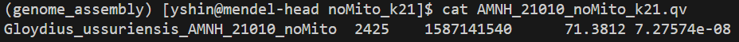

## 5) Draft assembly evaluation 
### Genome completeness using BUSCO
Now let's assess the completeness of our draft assembly output from hifiasm. BUSCO (Benchmarking Universal Single-Copy Orthologs) is a common metric to assess genome completeness. It uses a lineage-specific dataset to search for the presence/absence of highly conserved genes for that lineage in your genome assembly. We will use *compleasm* (https://github.com/huangnengCSU/compleasm) to assess genome completeness. This provides a faster alternative to the regular BUSCO package for large genome assemblies.

First, create a conda environment for *compleasm* and install the package:
```txt
# create a conda environment for compleasm and install it
conda create -n compleasm -c conda-forge -c bioconda compleasm
conda activate compleasm
compleasm -h
```

Run compleasm on Mendel with this script:
```sh
#!/bin/bash
#SBATCH --job-name=compleasm_ussuri
#SBATCH --nodes=1
#SBATCH --mem=200G
#SBATCH --partition=compute
#SBATCH --cpus-per-task=24
#SBATCH --time=12:00:00
#SBATCH --mail-type=ALL
#SBATCH --mail-user=yshin@amnh.org
#SBATCH --output=/home/yshin/mendel-nas1/snake_genome_ass/G_ussuriensis_Chromo/scripts/outfiles/slurm-%x_%j.out
#SBATCH --error=/home/yshin/mendel-nas1/snake_genome_ass/G_ussuriensis_Chromo/scripts/outfiles/slurm-%x_%j.err

# initiate conda and activate the conda environment
source ~/.bash_profile
conda activate compleasm

# set paths as variables
path_to_asm=/home/yshin/mendel-nas1/snake_genome_ass/G_ussuriensis_Chromo/PacBio_Revio/no_mito
out_path=/home/yshin/mendel-nas1/snake_genome_ass/G_ussuriensis_Chromo/PacBio_Revio/compleasm

# run compleasm
compleasm run -a ${path_to_asm}/Gloydius_ussuriensis_AMNH_21010_noMito.fa -o ${out_path} \
  -t ${SLURM_CPUS_PER_TASK} -l sauropsida --odb odb12
```

The script above should take only about 35 minutes to run. The results are:


Compleasm output can be visualized in R:
```r
######  visualize compleasem output

# clean working environment
rm(list = ls(all.names = T))
gc()

# load packages
library(ggplot2)


######   compleasm result categories

# S (Single Copy Complete Genes): The BUSCO genes that can be entirely aligned in the assembly, with only one copy present.
# D (Duplicated Complete Genes): The BUSCO genes that can be completely aligned in the assembly, with more than one copy present.
# F (Fragmented Genes, subclass 1): The BUSCO genes which only a portion of the gene is present in the assembly, and the rest of the gene cannot be aligned.
# I (Fragmented Genes, subclass 2): The BUSCO genes in which a section of the gene aligns to one position in the assembly,
#                                   while the remaining part aligns to another position.
# M (Missing Genes): The BUSCO genes with no alignment present in the assembly.


######   compleasm result dataframe
compl_res <- data.frame(category = c('S', 'M', 'D', 'F'),
                        count = c(5764, 285, 50, 19))

print(compl_res)

######   calculate proportion
compl_res$percentage <- round((compl_res$count / sum(compl_res$count)) * 100, digits = 2) 
print(compl_res)

######   plotting order
compl_res$category <- factor(compl_res$category, levels = c('S', 'D', 'F', 'M'))


######   plot
ggplot(compl_res, aes(x = 2, y = percentage, fill = category)) +
  geom_col(width = 1, color = 'white') +
  xlim(0.1, 3.5) +
  coord_polar(theta = 'y') +
  scale_fill_manual(values = c(S = '#B3E2CD',
                               D = '#FDCDAC',
                               F = "#FFF2AE",
                               M = '#CBD5E8')) +
  theme_void() +
  theme(legend.position = 'none')

######  export plot
ggsave('Rplots/compleasm_result.png', width = 21, height = 20, dpi = 800, units = 'cm')
```
----------------------------------------------------------------------------------------------------
### Genome assembly stats with QUAST
QUAST is a quality assessment tool for genome assemblies. Installing QUAST in the "genome_assembly" conda environment is not possible because of python version clashes - we need to create a separate conda environment for this package.

Install QUAST:
```txt
conda create -n quast
conda activate quast
conda install bioconda::quast
``` 

When this is done, run QUAST with the script below:

```sh
#!/bin/bash
#SBATCH --job-name=quast_ussuri
#SBATCH --nodes=1
#SBATCH --mem=60G
#SBATCH --partition=compute
#SBATCH --cpus-per-task=24
#SBATCH --time=12:00:00
#SBATCH --mail-type=ALL
#SBATCH --mail-user=yshin@amnh.org
#SBATCH --output=/home/yshin/mendel-nas1/snake_genome_ass/G_ussuriensis_Chromo/scripts/outfiles/slurm-%x_%j.out
#SBATCH --error=/home/yshin/mendel-nas1/snake_genome_ass/G_ussuriensis_Chromo/scripts/outfiles/slurm-%x_%j.err

# initiate conda and activate the quast conda environment
source ~/.bash_profile
conda activate quast

# path to assembly
path_to_asm=/home/yshin/mendel-nas1/snake_genome_ass/G_ussuriensis_Chromo/PacBio_Revio/no_mito

# output directory
out_dir=/home/yshin/mendel-nas1/snake_genome_ass/G_ussuriensis_Chromo/PacBio_Revio/quast
mkdir -p ${out_dir}

# run quast
quast.py -t ${SLURM_CPUS_PER_TASK} ${path_to_asm}/Gloydius_ussuriensis_AMNH_21010_noMito.fa -o ${out_dir} 
```
----------------------------------------------------------------------------------------------------
### *k*-mer based assembly evaluation with Merqury
Let's use Merqury as another assembly evaluation tool. Similar to jellyfish, this one is also based on *k*-mers. But unlike jellyfish we ran above (which was on raw read fastq), we are running merqury on the assembly. Basically, jellyfish just counts *k*-mers from on your reads. On the other hand, merqury is a framework to evaluate assemblies based on *k*-mer comparisons. It basically compares the assembly to reads. In other words, it checks whether the assembly faithfully represent the sequences that exist in the reads, using *k*-mers as evidence. It does so by computing assembly QV (sequence accuracy), *k*-mer completeness, etc. 

The genome size estimate based on jellyfish was 1.18Gb, but the size estimate from QUAST was 1.59Gb.
By comparing read k-mers and assembly k-mers, Merqury can tell you whether the genome size based on jellyfish output is an underestimation of the true genome size.

Let's begin by creating a separate conda environment for merqury. We also need to install one of the dependencies (meryl) separately in that conda environment.
```
# create a new conda env for merqury
conda create -n merqury
conda activate merqury

# install meryl
conda install bioconda::meryl==1.4.1

# install merqury
conda install bioconda::merqury
```
Then run Merqury like so:
```sh
#!/bin/bash
#SBATCH --job-name=merqury_ussuri
#SBATCH --nodes=1
#SBATCH --cpus-per-task=32
#SBATCH --mem=180G
#SBATCH --time=48:00:00
#SBATCH --partition=compute
#SBATCH --mail-type=ALL
#SBATCH --mail-user=yshin@amnh.org
#SBATCH --output=/home/yshin/mendel-nas1/snake_genome_ass/G_ussuriensis_Chromo/scripts/outfiles/slurm-%x_%j.out
#SBATCH --error=/home/yshin/mendel-nas1/snake_genome_ass/G_ussuriensis_Chromo/scripts/outfiles/slurm-%x_%j.err

# activate conda env 
source ~/.bash_profile
conda activate merqury

# inputs 
asm_dir=/home/yshin/mendel-nas1/snake_genome_ass/G_ussuriensis_Chromo/PacBio_Revio/no_mito/Gloydius_ussuriensis_AMNH_21010_noMito.fa
read_dir=/home/yshin/mendel-nas1/snake_genome_ass/G_ussuriensis_Chromo/PacBio_Revio/FASTQ/AMNH_21010_HiFi.fastq.gz

# parameters
K=21
THREADS=${SLURM_CPUS_PER_TASK}

# outputs 
out_dir=/home/yshin/mendel-nas1/snake_genome_ass/G_ussuriensis_Chromo/PacBio_Revio/merqury/noMito_k${K}
PREFIX=AMNH_21010_noMito_k${K}

mkdir -p "$out_dir"
cd "$out_dir"

echo "[INFO] Using K=$K threads=$THREADS"
echo "[INFO] Assembly: $asm_dir"
echo "[INFO] Reads:    $read_dir"
echo "[INFO] Output:   $out_dir/$PREFIX.*"

# sanity checks
command -v meryl >/dev/null 2>&1 || { echo "[ERROR] meryl not found in PATH"; exit 1; }
command -v merqury.sh >/dev/null 2>&1 || { echo "[ERROR] merqury.sh not found in PATH"; exit 1; }

# build read k-mer database
echo "[INFO] Counting k-mers in reads with meryl..."
meryl k=$K threads=$THREADS count "$read_dir" output reads.k${K}.meryl

# run Merqury == computes QV, completeness, spectra-cn, etc.
echo "[INFO] Running Merqury..."
merqury.sh reads.k${K}.meryl "$asm_dir" "$PREFIX" 2>&1 | tee "$PREFIX.merqury.log"

echo "[INFO] Done."
echo "[INFO] Key outputs to look at:"
echo "  - ${PREFIX}.qv            (assembly QV)"
echo "  - ${PREFIX}.completeness  (k-mer completeness)"
echo "  - ${PREFIX}.spectra-cn.*  (copy-number spectra plots/data)"
```
Check the results when the job finishes running. Let's check the .qv file first.
```
# cd into "/home/yshin/mendel-nas1/snake_genome_ass/G_ussuriensis_Chromo/PacBio_Revio/merqury/noMito_k21" dirctory"
cat AMNH_21010_noMito_k21.qv 
```


Let's break it down:
- Column 1: Assembly name
- Column 2: Error *k*-mers
- Column 3: Total bases
- Column 4: QV score
- Column 5: Error rate

We can see the QV score is very high (> 70) and error rate is very low. This means that the estimated genome size based on QUAST is unlikely to be an overestimation due to sequencing artifacts/errors. 

Let's also check the *k*-mer completeness.
```
cat AMNH_21010_noMito_k21.completeness.stats
```

- Column 1: Assembly name
- Column 2: Subset ("all" means that completeness was calculated from all read *k*-mers)
- Column 3: Total read *k*-mers found in the assembly
- Column 4: Total *k*-mers found in the reads
- Column 5: *k*-mer completeness (%)

So, the *k*-mer completeness is very high. The ~9.4% of the *k*-mers in the reads are not present in the assembly likely due to: 1) Repeat complexity, 2) *k*-mers specific to alternative alleles at heterozygous loci not present in collapsed primary assembly, 3) Filtering based on read coverage. This does not mean that ~9.4% of the genome is missing. For these reasons, the haploid genome size estimated by jellyfish (1.18Gb) is likely and underestimation of the true genome size (1.6Gb) due to repeats and heterozygosity.
