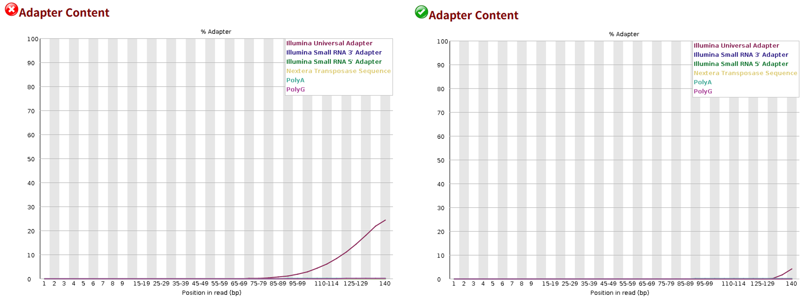
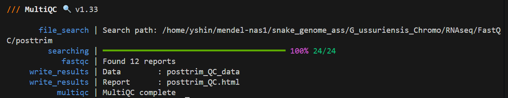
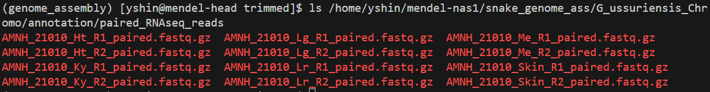

## 7) Genome annotation
### Setup
Let's create new conda environments for packages to be used in genome annotation. Trimmomatic will be used for trimming Illumina adaptera. The funannotation package provides an automated pipeline for gene prediction, annotation, and comparison. The Earl Grey package automates transposable element annotation.
```
### create a conda environment and install funannotate
# add channels
conda config --add channels defaults
conda config --add channels bioconda
conda config --add channels conda-forge

# create a conda env for trimmomatic and install it
conda create -n trimmomatic -c conda-forge -c bioconda trimmomatic

# create a conda env for funannotate and install it
conda create -n funannotate "python>=3.6,<3.9" funannotate
```
----------------------------------------------------------------------------------------------------
### RNA read QC (pre-trimming)
Run FastQC on raw, untrimmed reads.

```sh
#!/bin/bash
#SBATCH --job-name=rnaQC_ussuri
#SBATCH --nodes=1
#SBATCH --mem=200G
#SBATCH --partition=compute
#SBATCH --cpus-per-task=24
#SBATCH --time=10:00:00
#SBATCH --mail-type=ALL
#SBATCH --mail-user=yshin@amnh.org
#SBATCH --output=/home/yshin/mendel-nas1/snake_genome_ass/G_ussuriensis_Chromo/scripts/outfiles/slurm-%x_%j.out
#SBATCH --error=/home/yshin/mendel-nas1/snake_genome_ass/G_ussuriensis_Chromo/scripts/outfiles/slurm-%x_%j.err

# initiate conda and activate the conda environment
source ~/.bash_profile
conda activate genome_assembly

# path to the fastq file
path_to_seq=/home/yshin/mendel-nas1/snake_genome_ass/G_ussuriensis_Chromo/RNAseq/FASTQ

# output directory
out_dir=/home/yshin/mendel-nas1/snake_genome_ass/G_ussuriensis_Chromo/RNAseq/FastQC/pretrim

# run FastQC
fastqc -o ${out_dir} ${path_to_seq}/AMNH_21010_Ht_1.fastq.gz ${path_to_seq}/AMNH_21010_Ht_2.fastq.gz ${path_to_seq}/AMNH_21010_Ky_1.fastq.gz ${path_to_seq}/AMNH_21010_Ky_2.fastq.gz ${path_to_seq}/AMNH_21010_Lg_1.fastq.gz ${path_to_seq}/AMNH_21010_Lg_2.fastq.gz ${path_to_seq}/AMNH_21010_Lr_1.fastq.gz ${path_to_seq}/AMNH_21010_Lr_2.fastq.gz ${path_to_seq}/AMNH_21010_Me_1.fastq.gz ${path_to_seq}/AMNH_21010_Me_2.fastq.gz ${path_to_seq}/AMNH_21010_Skin_1.fastq.gz ${path_to_seq}/AMNH_21010_Skin_2.fastq.gz
``` 
----------------------------------------------------------------------------------------------------
### Adapter trimming & post-trimming QC 
Use trimmomatic to trim adapters and then run FastQC on the trimmed reads. The RNA sequencing was done on Illumina NovaSeq X in a paired-end mode. We will use trimmomatic to trim the Illumina adapters. Since we did paired end sequencing on six different tissues, there are a total of 12 FASTQ files. Repeating trimmomatic independently for each tissue type is not very effective. Instead, I wrote a simple for loop to do the trimming in one go:

```sh
#!/bin/bash
#SBATCH --job-name=adapterTrim_ussuri
#SBATCH --nodes=1
#SBATCH --mem=100G
#SBATCH --partition=compute
#SBATCH --cpus-per-task=30
#SBATCH --time=7-00:00:00
#SBATCH --mail-type=ALL
#SBATCH --mail-user=yshin@amnh.org
#SBATCH --output=/home/yshin/mendel-nas1/snake_genome_ass/G_ussuriensis_Chromo/scripts/outfiles/slurm-%x_%j.out
#SBATCH --error=/home/yshin/mendel-nas1/snake_genome_ass/G_ussuriensis_Chromo/scripts/outfiles/slurm-%x_%j.err

# initiate conda and activate the conda environment
source ~/.bash_profile
conda activate trimmomatic

# paths to input forward & reverse reads, adapters, and output trimmed reads 
path_to_seq=/home/yshin/mendel-nas1/snake_genome_ass/G_ussuriensis_Chromo/RNAseq/FASTQ
adapters=/home/yshin/mendel-nas1/snake_genome_ass/G_ussuriensis_Chromo/RNAseq/custom_adapters.fa
out_path=/home/yshin/mendel-nas1/snake_genome_ass/G_ussuriensis_Chromo/RNAseq/trimmed

# loop through the read files in the directory and run trimmomatic
# print this before looping
echo "start adapter trimming..."

# loop through the file in the directory and run trimmomatic
for f_read in ${path_to_seq}/*_1.fastq.gz; do
  
  # echo forward read
  echo "found a forward read: ${f_read##*/}"

  # designate reverse read
  r_read=${f_read/_1.fastq.gz/_2.fastq.gz}
  echo "found a corresponding reverse read: ${r_read##*/}"

  # print out a message on the type of tissue being processed
  tissue=${f_read%_1.fastq.gz}
  echo "Start adapter trimming ${tissue##*/} reads..."

  # run trimmomatic
  trimmomatic PE -threads ${SLURM_CPUS_PER_TASK} -phred33 \
    -Xmx80g \
    ${f_read} ${r_read} \
    ${tissue}_R1_paired.fastq.gz ${tissue}_R1_unpaired.fastq.gz \
    ${tissue}_R2_paired.fastq.gz ${tissue}_R2_unpaired.fastq.gz \
    ILLUMINACLIP:${adapters}:2:30:10 LEADING:3 TRAILING:3 SLIDINGWINDOW:4:15 MINLEN:36 
done

# move trimmed files to the output directory
echo "move trimmed files to output dir..."

mv ${path_to_seq}/*_R1_paired.fastq.gz ${out_path}
mv ${path_to_seq}/*_R2_paired.fastq.gz ${out_path}
mv ${path_to_seq}/*_R1_unpaired.fastq.gz ${out_path}
mv ${path_to_seq}/*_R2_unpaired.fastq.gz ${out_path}

echo "all files moved to output dir"

# print this at the end
echo "Trimming on all tissue types finished successfully"
```
This run will result in a total of 24 files, two files (paired & unpaired) for each read. Now run FastQC again on trimmed read files:

```sh
#!/bin/bash
#SBATCH --job-name=rnaQC_posttrim
#SBATCH --nodes=1
#SBATCH --mem=200G
#SBATCH --partition=compute
#SBATCH --cpus-per-task=24
#SBATCH --time=10:00:00
#SBATCH --mail-type=ALL
#SBATCH --mail-user=yshin@amnh.org
#SBATCH --output=/home/yshin/mendel-nas1/snake_genome_ass/G_ussuriensis_Chromo/scripts/outfiles/slurm-%x_%j.out
#SBATCH --error=/home/yshin/mendel-nas1/snake_genome_ass/G_ussuriensis_Chromo/scripts/outfiles/slurm-%x_%j.err

# initiate conda and activate the conda environment
source ~/.bash_profile
conda activate genome_assembly

# paths to the trimmed fastq files
path_to_trimmed=/home/yshin/mendel-nas1/snake_genome_ass/G_ussuriensis_Chromo/RNAseq/trimmed

# output directory
out_dir=/home/yshin/mendel-nas1/snake_genome_ass/G_ussuriensis_Chromo/RNAseq/FastQC/posttrim

# run FastQC
for file in ${path_to_trimmed}/*_paired.fastq.gz; do
  echo "running FastQC on $(basename "${file}")..."
  fastqc -o ${out_dir} -t ${SLURM_CPUS_PER_TASK} ${file}
  echo "FastQC on ${file##*/} completed"
done

# print when completed
echo "FastQC on all files completed"
```
Let's compare pre-trimming and post-trimming FastQC results, focusing on adapter content.
Let's open up the results for heart RNA reads:

We can see that the adapters are basically gone after trimming.
   
It can be annoying to look through all the different .html files containing QC results for each tissue type. MultiQC (https://github.com/MultiQC/MultiQC) is a really neat tool that enables the user to merge outputs from different bioinformatics software to generate one, clean QC output.

You only need to supply MultiQC some options and path to the files you want to merge (e.g., path to multiple FastQC outputs).
```sh
# set directories as variables
outdir=/home/yshin/mendel-nas1/snake_genome_ass/G_ussuriensis_Chromo/RNAseq/FastQC/multiqc
indir=/home/yshin/mendel-nas1/snake_genome_ass/G_ussuriensis_Chromo/RNAseq/FastQC

# run multiqc == can run this on the head node because it runs very fast
multiqc -o ${outdir} --filename "posttrim_QC" ${indir}/posttrim
```


The MultiQC output gives a single, neatly organized .html file:


----------------------------------------------------------------------------------------------------
### (Pre-Hi-C) RNA alignment to draft using HiSat2
Now that we have our RNA-seq reads trimmed of adapter sequences and QCed, we can go ahead and align these reads to our draft genome to obtain mapping quality, etc. 

Let's create a conda environment for HiSat2 and install the package in it:
```
conda create -n hisat2 -c bioconda hisat2
conda activate hisat2
```

Also, let's copy paired reads over to our annotation directory. This is not entirely necessary, but I did it to keep the files neatly organized for different tasks.
```
# create a directory for annotation under the main assembly directory
# which is "/home/yshin/mendel-nas1/snake_genome_ass/G_ussuriensis_Chromo"
cd /home/yshin/mendel-nas1/snake_genome_ass/G_ussuriensis_Chromo
mkdir -p annotation
mkdir -p annotation/paired_RNAseq_reads

# copy the files
cd /home/yshin/mendel-nas1/snake_genome_ass/G_ussuriensis_Chromo/RNAseq/trimmed
cp *_R1_paired.fastq.gz /home/yshin/mendel-nas1/snake_genome_ass/G_ussuriensis_Chromo/annotation/paired_RNAseq_reads
cp *_R2_paired.fastq.gz /home/yshin/mendel-nas1/snake_genome_ass/G_ussuriensis_Chromo/annotation/paired_RNAseq_reads

# check files
ls /home/yshin/mendel-nas1/snake_genome_ass/G_ussuriensis_Chromo/annotation/paired_RNAseq_reads
```


Now, let's run HiSat2 on Mendel with the script below
```sh
#!/bin/bash
#SBATCH --job-name=hisat2_preHiC
#SBATCH --nodes=1
#SBATCH --partition=compute
#SBATCH --cpus-per-task=48
#SBATCH --mem=200G
#SBATCH --time=180:00:00
#SBATCH --mail-type=ALL
#SBATCH --mail-user=yshin@amnh.org
#SBATCH --output=/home/yshin/mendel-nas1/snake_genome_ass/G_ussuriensis_Chromo/scripts/outfiles/slurm-%x_%j.out
#SBATCH --error=/home/yshin/mendel-nas1/snake_genome_ass/G_ussuriensis_Chromo/scripts/outfiles/slurm-%x_%j.err

# activate conda env
source ~/.bash_profile
export PATH=/home/yshin/mendel-nas1/miniconda3/bin:$PATH
conda activate hisat2

# set paths for draft genome and RNA reads
draft_fa=/home/yshin/mendel-nas1/snake_genome_ass/G_ussuriensis_Chromo/PacBio_Revio/no_mito/Gloydius_ussuriensis_AMNH_21010_noMito.fa
rna_path=/home/yshin/mendel-nas1/snake_genome_ass/G_ussuriensis_Chromo/annotation/paired_RNAseq_reads

# output directory; create these dirs if they dont exist
outpath=/home/yshin/mendel-nas1/snake_genome_ass/G_ussuriensis_Chromo/annotation/hisat2_preHiC
mkdir -p ${outpath}
mkdir -p ${outpath}/{index,bam,logs}

# make index prefix 
index_prefix=${outpath}/index/Gloydius_ussuriensis_AMNH_21010_noMito

# build hisat2 index, skip if it already exist
if [[ ! -e ${index_prefix}.1.ht2 && ! -e ${index_prefix}.1.ht2l ]]; then
  echo "[INFO] Building HISAT2 index..."
  hisat2-build -p ${SLURM_CPUS_PER_TASK} ${draft_fa} ${index_prefix}
else
  echo "[INFO] HISAT2 index exists. Skipping."
fi

# map RNA reads to draft genome
# print out message
echo "[INFO] Mapping RNA-seq reads in: ${rna_path}"

# prevent loop from running if there are no files with matching names
shopt -s nullglob

# loop over all R1 files, get sample names, and get R2 file names
for R1 in ${rna_path}/AMNH_21010_*_R1_paired.fastq.gz; do
  sample=$(basename ${R1} _R1_paired.fastq.gz)
  R2=${rna_path}/${sample}_R2_paired.fastq.gz

  # skip if R2 is missing
  if [[ ! -f ${R2} ]]; then
    echo "[WARN] Missing R2 for ${sample}. Skipping."
    continue
  fi
  
  # print out some helpful message
  echo "[INFO] Mapping: ${sample}"

  # define output files
  bam=${outpath}/bam/${sample}.sorted.bam
  log=${outpath}/logs/${sample}.hisat2.log

  # run hisat with parameters specified above and then sort using samtools
  # --dta: means "downstream transcriptome assembly"; alignment report optimized for StringTie
  # -x: draft genome
  # -1: read 1 file
  # -2: read 2 file
  # 2> ${log}: direct & store output stats into log file
  # | samtools sort: pipe hisat2 output directly into samtools sort command
  # -: means "take piped input"
  # samtools index: index the sorted bam file
  hisat2 -p ${SLURM_CPUS_PER_TASK} --dta \
    -x ${index_prefix} \
    -1 ${R1} -2 ${R2} \
    2> ${log} \
  | samtools sort -@ ${SLURM_CPUS_PER_TASK} -o ${bam} -

  samtools index ${bam}
done

# print when done
echo "[DONE] HISAT2 mapping complete."
echo "[INFO] BAMs in: ${outpath}/bam"
echo "[INFO] Logs in: ${outpath}/logs"
```

We can open up the log files to check the overall alignment rate per tissue type. This is as follows:
  - Heart: 64.79%
  - Lung: 78.11%
  - Kidney: 82.91%
  - Liver: 87.25%
  - Muscle: 88.53%
  - Skin: 85.89%

----------------------------------------------------------------------------------------------------
### (Pre-Hi-C) Draft-guided transcriptome assembly using StringTie
Now. let's use StringTie to conduct transcriptome assembly guided by the draft genome. Let's create a conda environment for StringTie and install the package:
```
conda create -n stringtie -c bioconda stringtie
```

Next, run StringTie on Mendel with the script below. 
```sh
#!/bin/bash
#SBATCH --job-name=stringtie_preHiC
#SBATCH --nodes=1
#SBATCH --partition=compute
#SBATCH --cpus-per-task=48
#SBATCH --mem=200G
#SBATCH --time=180:00:00
#SBATCH --mail-type=ALL
#SBATCH --mail-user=yshin@amnh.org
#SBATCH --output=/home/yshin/mendel-nas1/snake_genome_ass/G_ussuriensis_Chromo/scripts/outfiles/slurm-%x_%j.out
#SBATCH --error=/home/yshin/mendel-nas1/snake_genome_ass/G_ussuriensis_Chromo/scripts/outfiles/slurm-%x_%j.err

# activate conda env
source ~/.bash_profile
export PATH=/home/yshin/mendel-nas1/miniconda3/bin:$PATH
conda activate stringtie

# dir to bam files
bam_dir=/home/yshin/mendel-nas1/snake_genome_ass/G_ussuriensis_Chromo/annotation/hisat2_preHiC/bam

# output dir
out_dir=/home/yshin/mendel-nas1/snake_genome_ass/G_ussuriensis_Chromo/annotation/StringTie_preHiC
mkdir -p ${out_dir}
mkdir -p ${out_dir}/gtf ${out_dir}/merge 

# run stringtie // loop through file per tissue and assemble per tissue
# each loop takes one bam file (RNA alignment), assembles a transcriptome, and outputs a gtf file for a given tisue type
for bam in ${bam_dir}/*.sorted.bam; do
  sample=$(basename "$bam". sorted.bam)
  echo "assembling transcripts from ${sample}..."
  stringtie "$bam" -p ${SLURM_CPUS_PER_TASK} -o ${out_dir}/gtf/${sample}.gtf
  echo "done assembling transcripts from ${sample}..."
done

# merge gtf per tissue into a single gtf
echo "merging transcripts"
ls ${out_dir}/gtf/*.gtf > ${out_dir}/merge/gtf_list.txt
stringtie --merge -p ${SLURM_CPUS_PER_TASK} -o ${out_dir}/merge/merged.gtf ${out_dir}/merge/gtf_list.txt

# print when done
echo "DONE"
```
Now, let's see how many transcripts, exons, and genes we've got from this run:
```
# check the number of transcripts (counting the number of unique transcript_id) and number of exons
cut -f3 merged.gtf | sort | uniq -c | sort -nr | head

# check the number of genes (counting the number of unique gene_id)
awk '$3=="transcript" {match($0,/gene_id "[^"]+"/,a); if(a[0]!=""){gsub(/gene_id "|"/,"",a[0]); print a[0]}}' merged.gtf | sort -u | wc -l
```
The outputs will show that we have:
  - 381,058 exons
  - 37,147 transcripts
  - 20,527 genes

These results seem to be in great shape in terms of transcript evidence-building. We will put a pause here, finish Hi-C incorporation, and move on to final annotation once our assembly is at the scaffold level. 

----------------------------------------------------------------------------------------------------
### (Pre-Hi-C) Venom gland transcriptome data
Park et al. (2026) produced venom gland transcriptome data for the three *Gloydius* species found in South Korea. This can be useful for placing expressed venom gene candidates to specific scaffolds.

First, create a new directory under the annotation directory
```sh
mkdir -p venom_gland venom_gland/ncbi_seq venom_gland/fastq
```
Then, download NCBI SRA Toolkit on Mendel. Go to the following link (https://github.com/ncbi/sra-tools/wiki/01.-Downloading-SRA-Toolkit) and copy the link for AlmaLinux 64 bit architecture. Then:
```sh
wget https://ftp-trace.ncbi.nlm.nih.gov/sra/sdk/3.4.1/sratoolkit.3.4.1-alma_linux64.tar.gz
```
You should see a tar.gz file created under the annotation directory. Untar this file like so:
```sh
tar -xzvf sratoolkit.3.4.1-alma_linux64.tar.gz
rm *.tar.gz
```
Then add the executable to the PATH variable:
```sh
export PATH=$PWD/sratoolkit.3.4.1-alma_linux64/bin:$PATH
```

Then submit the script below to SLURM.
```sh
#!/bin/bash
#SBATCH --job-name=get_venom_data
#SBATCH --nodes=1
#SBATCH --partition=compute
#SBATCH --ntasks=1
#SBATCH --cpus-per-task=12
#SBATCH --mem=50G
#SBATCH --time=25:00:00
#SBATCH --mail-type=ALL
#SBATCH --mail-user=yshin@amnh.org
#SBATCH --output=/home/yshin/mendel-nas1/snake_genome_ass/G_ussuriensis_Chromo/scripts/outfiles/slurm-%x_%j.out
#SBATCH --error=/home/yshin/mendel-nas1/snake_genome_ass/G_ussuriensis_Chromo/scripts/outfiles/slurm-%x_%j.err

set -euo pipefail

### commands start here ###

# path to SRA toolkit
export PATH=$PWD/sratoolkit.3.4.1-alma_linux64/bin:$PATH

# set directories
basedir="/home/yshin/mendel-nas1/snake_genome_ass/G_ussuriensis_Chromo/annotation/venom_gland"
sradir="${basedir}/ncbi_seq"
fastqdir="${basedir}/fastq"
tmpdir="${basedir}/tmp"

mkdir -p "$sradir" "$fastqdir" "$tmpdir"

# download SRA files
prefetch SRR35908235 -O "$sradir"
prefetch SRR35908238 -O "$sradir"

# convert .sra files to FASTQ files
fasterq-dump "$sradir/SRR35908235/SRR35908235.sra" \
  --split-files \
  --threads 12 \
  --temp "$tmpdir" \
  -O "$fastqdir"

fasterq-dump "$sradir/SRR35908238/SRR35908238.sra" \
  --split-files \
  --threads 12 \
  --temp "$tmpdir" \
  -O "$fastqdir"

# gzip FASTQ files
gzip "$fastqdir"/*.fastq
```

After this, run a quick sanity check from the fastq directory.
```sh
# verify the files have sequences
zcat SRR35908235_1.fastq.gz | head -n 4
zcat SRR35908235_2.fastq.gz | head -n 4

zcat SRR35908238_1.fastq.gz | head -n 4
zcat SRR35908238_2.fastq.gz | head -n 4

# check file size == R1/R2 files should have the same size
ls -lh
```
Then QC the files using FastQC and MultiQC.
```sh
#!/bin/bash
#SBATCH --job-name=venom_gland_qc
#SBATCH --nodes=1
#SBATCH --partition=compute
#SBATCH --ntasks=1
#SBATCH --cpus-per-task=12
#SBATCH --mem=20G
#SBATCH --time=04:00:00
#SBATCH --mail-type=ALL
#SBATCH --mail-user=yshin@amnh.org
#SBATCH --output=/home/yshin/mendel-nas1/snake_genome_ass/G_ussuriensis_Chromo/scripts/outfiles/slurm-%x_%j.out
#SBATCH --error=/home/yshin/mendel-nas1/snake_genome_ass/G_ussuriensis_Chromo/scripts/outfiles/slurm-%x_%j.err

set -euo pipefail

# initiate conda and activate the conda environment
source ~/.bash_profile
conda activate genome_assembly

# set directory
basedir="/home/yshin/mendel-nas1/snake_genome_ass/G_ussuriensis_Chromo/annotation/venom_gland"
cd "$basedir"

# make output dir
mkdir -p qc_fastqc

# run fastqc
fastqc fastq/*.fastq.gz \
  -o qc_fastqc \
  -t 12

# activate multiqc conda env 
conda activate multiqc

# run multiqc
multiqc qc_fastqc \
  -o qc_fastqc
```

The MultiQC report shows considerable adapter content. Use fastp for automatic adapter detection and trimming for Illumina paired-end reads.
```sh
#!/bin/bash
#SBATCH --job-name=venom_trim
#SBATCH --nodes=1
#SBATCH --cpus-per-task=8
#SBATCH --mem=32G
#SBATCH --time=12:00:00
#SBATCH --partition=compute
#SBATCH --mail-type=ALL
#SBATCH --mail-user=yshin@amnh.org
#SBATCH --output=/home/yshin/mendel-nas1/snake_genome_ass/G_ussuriensis_Chromo/scripts/outfiles/slurm-%x_%j.out
#SBATCH --error=/home/yshin/mendel-nas1/snake_genome_ass/G_ussuriensis_Chromo/scripts/outfiles/slurm-%x_%j.err

source ~/.bash_profile
conda activate scaffolding

# set directories
basedir="/home/yshin/mendel-nas1/snake_genome_ass/G_ussuriensis_Chromo/annotation/venom_gland"
indir="${basedir}/fastq"
outdir="${basedir}/trimmed_fastq"
reportdir="${basedir}/fastp_reports"

mkdir -p "$outdir" "$reportdir"

ACCESSIONS=(
  SRR35908235
  SRR35908238
)

for acc in "${ACCESSIONS[@]}"; do
  echo "Trimming ${acc}"

  fastp \
    -i "${indir}/${acc}_1.fastq.gz" \
    -I "${indir}/${acc}_2.fastq.gz" \
    -o "${outdir}/${acc}_1.trimmed.fastq.gz" \
    -O "${outdir}/${acc}_2.trimmed.fastq.gz" \
    --detect_adapter_for_pe \
    --thread 8 \
    --html "${reportdir}/${acc}.fastp.html" \
    --json "${reportdir}/${acc}.fastp.json"

  echo "Finished ${acc}"
done
```

After this is done, run FastQC and MultiQC again on trimmed reads.
```sh
#!/bin/bash
#SBATCH --job-name=venom_gland_posttrim_qc
#SBATCH --nodes=1
#SBATCH --partition=compute
#SBATCH --ntasks=1
#SBATCH --cpus-per-task=12
#SBATCH --mem=20G
#SBATCH --time=04:00:00
#SBATCH --mail-type=ALL
#SBATCH --mail-user=yshin@amnh.org
#SBATCH --output=/home/yshin/mendel-nas1/snake_genome_ass/G_ussuriensis_Chromo/scripts/outfiles/slurm-%x_%j.out
#SBATCH --error=/home/yshin/mendel-nas1/snake_genome_ass/G_ussuriensis_Chromo/scripts/outfiles/slurm-%x_%j.err

# initiate conda and activate the conda environment
source ~/.bash_profile
conda activate genome_assembly

# set directory
basedir="/home/yshin/mendel-nas1/snake_genome_ass/G_ussuriensis_Chromo/annotation/venom_gland"
cd "$basedir"

# make output dir
mkdir -p postrrim_qc_fastqc

# run fastqc
fastqc trimmed_fastq/*.fastq.gz \
  -o postrrim_qc_fastqc \
  -t 12

# activate multiqc conda env 
conda activate multiqc

# run multiqc
multiqc postrrim_qc_fastqc \
  -o postrrim_qc_fastqc
```

----------------------------------------------------------------------------------------------------
### (Post-Hi-C) Repeat masking (soft masking) using Earl Grey
Before moving on to final annotation, it is necessary to annotate the repeats and soft mask the genome. We can do this using the Earl Grey pipeline (https://github.com/TobyBaril/EarlGrey), which is a fully-automated pipeline for transposable element (TE)/repeat annotation.

Let's start by creating a separate conda environment and install Earl Grey: 

```
# create a conda environment for Earl Grey and install it
conda create -n earlgrey -c conda-forge -c bioconda earlgrey=7.0.1
```

Once this is done, run Earl Grey with the script below on Mendel (make sure the input genome is the final, curated chromosome-level assembly):
```sh
#!/bin/bash
#SBATCH --job-name=earlGrey_ussuri
#SBATCH --nodes=1
#SBATCH --cpus-per-task=48
#SBATCH --mem=600G
#SBATCH --time=180:00:00
#SBATCH --partition=bigmem
#SBATCH --mail-type=ALL
#SBATCH --mail-user=yshin@amnh.org
#SBATCH --output=/home/yshin/mendel-nas1/snake_genome_ass/G_ussuriensis_Chromo/scripts/outfiles/slurm-%x_%j.out
#SBATCH --error=/home/yshin/mendel-nas1/snake_genome_ass/G_ussuriensis_Chromo/scripts/outfiles/slurm-%x_%j.err

# soft masking the scaffolded assembly with Earl Grey

# activate the conda env
source ~/.bash_profile
conda activate earlgrey

# set variables
GENOME="/home/yshin/mendel-nas1/snake_genome_ass/G_ussuriensis_Chromo/final_assembly/curated/Gloydius_ussuriensis_AMNH_21010_curated_scaffold11_split.fa"
SPECIES="Gloydius_ussuriensis"

# output path
outpath=/home/yshin/mendel-nas1/snake_genome_ass/G_ussuriensis_Chromo/annotation/soft_masked
mkdir -p $outpath

# run Earl Grey
echo "Starting EarlGrey: $(date)"

# -d flag == Create soft-masked genome at the end? (yes/no, Default: no)
earlGrey -g ${GENOME} -s ${SPECIES} -o ${outpath} -d yes -t ${SLURM_CPUS_PER_TASK}

echo "Finished EarlGrey: $(date)"

# list outputs
echo "EarlGrey output files:"
find "$outdir" -maxdepth 3 -type f | head -n 50

echo "Done: $(date)"
```
----------------------------------------------------------------------------------------------------
### (Post-Hi-C) Annotation using funannotate
The general annotation workflow is as follows:
```
1. funannotate train: organ tissue RNA-seq data + publicly available venom gland RNA-seq data
2. funannotate predict
3. funannotate update
4. funannotate fix
5. InterProScan on proteins predicted by funannotate predict
6. funannotate annotate
7. Final QC / manual curation
```

Let's start by symlinking the softmasked fasta for annotation.
```sh
# symlink softmasked fasta output from earl grey
ln -s /home/yshin/mendel-nas1/snake_genome_ass/G_ussuriensis_Chromo/annotation/soft_masked/Gloydius_ussuriensis_EarlGrey/Gloydius_ussuriensis_summaryFiles/Gloydius_ussuriensis.softmasked.fasta \
  Gloydius_ussuriensis.softmasked.fa
```
Then activate the funannotate conda env and install gffread.
```sh
conda activate funannotate
conda install bioconda::gffread
```

####  Setup funannotate 1: GeneMark
funannotate also requires an initial database setup step. Run setup as below:
```sh
# create db path
db_path="/home/yshin/mendel-nas1/snake_genome_ass/G_ussuriensis_Chromo/an
notation/funannotate_db"

mkdir -p ${db_path}

# check dependencies
funannotate check --show-versions

# setup db
funannotate setup -d ${db_path} -i all --wget

# run this once the setup is done
echo 'export FUNANNOTATE_DB=/home/yshin/mendel-nas1/snake_genome_ass/G_ussuriensis_Chromo/annotation/funannotate_db' >> ~/.bash_profile

# also set up BUSCO lineage db 
# this version of funannotate do not support the sauropsida lineage DB; use tetrapoda db instead 
export FUNANNOTATE_DB="/home/yshin/mendel-nas1/snake_genome_ass/G_ussuriensis_Chromo/annotation/funannotate_db"
funannotate setup -d "$FUNANNOTATE_DB" -b tetrapoda --wget
```
After this, if you run "funannotate check --show-versions", you'll see the current configuration is missing some key dependencies, such as eggnog mapper ("ERROR: emapper.py not installed"), GeneMark ("ERROR: gmes_petap.pl not installed"), and signalp ("ERROR: signalp not installed"). 

GeneMark cannot be installed through conda. We need to manually download the .tar.gz file from the GeneMark website and scp it to Mendel.
```
# on Mendel
mkdir -p "/home/yshin/mendel-nas1/gmes_linux_64"
cd "/home/yshin/mendel-nas1/gmes_linux_64"

# in local device
scp gmes_linux_64_4.tar.gz yshin@mendel.sdmz.amnh.org:/home/yshin/mendel-nas1/gmes_linux_64

# unzip on Mendel
tar -xvzf gmes_linux_64_4.tar.gz
```

Now, set the GeneMark path:
```
export GENEMARK_PATH="/home/yshin/mendel-nas1/gmes_linux_64/gmes_linux_64_4"
export PATH="$GENEMARK_PATH:$PATH"
```

Also, download the key file from the website (Linux 64 bit) and scp it to the Mendel home directory. After that, run:
```
zcat gm_key_64.gz > ~/.gm_key
chmod 600 ~/.gm_key
```

Then, run a full check
```sh
conda activate funannotate

export FUNANNOTATE_DB="/home/yshin/mendel-nas1/snake_genome_ass/G_ussuriensis_Chromo/annotation/funannotate_db"
export GENEMARK_PATH="/home/yshin/mendel-nas1/gmes_linux_64/gmes_linux_64_4"
export PATH="$GENEMARK_PATH:$PATH"

funannotate check --show-versions
```
Now you shouldn't see the GeneMark error.

####  Setup funannotate 2: eggNOG-mapper
```
# in the funannotate conda env 
conda install -c conda-forge -c bioconda eggnog-mapper

# download eggnog db
export EGGNOG_DATA_DIR="/home/yshin/mendel-nas1/eggnog_db"
mkdir -p "$EGGNOG_DATA_DIR"
cd "$EGGNOG_DATA_DIR"

BASE="http://eggnog5.embl.de/download/emapperdb-5.0.2"

wget -c -O eggnog.db.gz "$BASE/eggnog.db.gz"
wget -c -O eggnog.taxa.tar.gz "$BASE/eggnog.taxa.tar.gz"
wget -c -O eggnog_proteins.dmnd.gz "$BASE/eggnog_proteins.dmnd.gz"

# decompress
gunzip -f eggnog.db.gz
gunzip -f eggnog_proteins.dmnd.gz
tar -xvzf eggnog.taxa.tar.gz
rm -f eggnog.taxa.tar.gz

# check installation
which emapper.py
emapper.py --version
```

####  Setup funannotate 3: SignalP
Install signalp from the software website and scp it to Mendel. After that:
```
# make install directory
mkdir -p /home/yshin/mendel-nas1/signalp

# unpack
tar -xvzf /home/yshin/mendel-nas1/signalp-6.0i.fast.tar.gz -C /home/yshin/mendel-nas1/signalp

# cd into the package dir
/home/yshin/mendel-nas1/signalp/signalp6_fast/signalp-6-package

# put pip cache and temp files on nas, not /home, to prevent disk quota error
mkdir -p /home/yshin/mendel-nas1/tmp/pip_cache
mkdir -p /home/yshin/mendel-nas1/tmp/pip_tmp

export PIP_CACHE_DIR="/home/yshin/mendel-nas1/tmp/pip_cache"
export TMPDIR="/home/yshin/mendel-nas1/tmp/pip_tmp"

# install
python -m pip install --no-cache-dir .

# symlink for funannotate
export LD_LIBRARY_PATH="$CONDA_PREFIX/lib:$LD_LIBRARY_PATH"

cd "$CONDA_PREFIX/bin"
ln -sf signalp6 signalp
```

Then run a final check. This should print "All 37 external dependencies are installed" at the end.
```
funannotate check --show-versions
```
Also, copy the "distilled_model_signalp6.pt" file into the signalp installation "model_weights" dir.
```sh
cp -av \
/home/yshin/mendel-nas1/signalp/signalp6_fast/signalp-6-package/models/distilled_model_signalp6.pt \
/home/yshin/mendel-nas1/miniconda3/envs/funannotate/lib/python3.8/site-packages/signalp/model_weights/
```

Check whether the file is correctly copied.
```sh
ls -lh \
/home/yshin/mendel-nas1/miniconda3/envs/funannotate/lib/python3.8/site-packages/signalp/model_weights/
```

####  Install InterProScan
First, create a new directory to store interproscan
```sh
cd /home/yshin/mendel-nas1

mkdir -p interproscan
cd interproscan
```
Next, install interproscan and checksum files.
```sh
# download interproscan
wget https://ftp.ebi.ac.uk/pub/software/unix/iprscan/5/5.78-109.0/interproscan-5.78-109.0-64-bit.tar.gz

# download checksum
wget https://ftp.ebi.ac.uk/pub/software/unix/iprscan/5/5.78-109.0/interproscan-5.78-109.0-64-bit.tar.gz.md5
```
Check download:
```
md5sum -c interproscan-5.78-109.0-64-bit.tar.gz.md5
```

Extract the file while preserving permissions:
```sh
# extract
tar -pxvzf interproscan-5.78-109.0-64-bit.tar.gz

# check script
ls -lh /home/yshin/mendel-nas1/interproscan/interproscan-5.78-109.0/interproscan.sh
```

Also check the runtime requirements. What we want is Java 11 or above.
```sh
java -version
python3 --version
perl -version | head
echo "$JAVA_HOME"
```

####  funannotate step 1: Train
Run with the script below.
```sh
#!/bin/bash
#SBATCH --job-name=funannotate_train
#SBATCH --nodes=1
#SBATCH --partition=compute
#SBATCH --ntasks=1
#SBATCH --cpus-per-task=32
#SBATCH --mem=300G
#SBATCH --time=120:00:00
#SBATCH --mail-type=ALL
#SBATCH --mail-user=yshin@amnh.org
#SBATCH --output=/home/yshin/mendel-nas1/snake_genome_ass/G_ussuriensis_Chromo/scripts/outfiles/slurm-%x_%j.out
#SBATCH --error=/home/yshin/mendel-nas1/snake_genome_ass/G_ussuriensis_Chromo/scripts/outfiles/slurm-%x_%j.err

# activate environment and set up analyses
source ~/.bash_profile
conda activate funannotate
set -euo pipefail

# make TransDecoder utilities available to PASA
export PATH="$CONDA_PREFIX/opt/transdecoder:$CONDA_PREFIX/opt/transdecoder/util:$PATH"

# avoid system library conflicts
export LD_LIBRARY_PATH="${CONDA_PREFIX}/lib:${LD_LIBRARY_PATH:-}"

# funannotate databases and external tools
export FUNANNOTATE_DB="/home/yshin/mendel-nas1/snake_genome_ass/G_ussuriensis_Chromo/annotation/funannotate_db"
export GENEMARK_PATH="/home/yshin/mendel-nas1/gmes_linux_64/gmes_linux_64_4"
export PATH="$GENEMARK_PATH:$PATH"
export EGGNOG_DATA_DIR="/home/yshin/mendel-nas1/eggnog_db"

# use a short temporary directory and clean it up on exit
export TMPDIR="/tmp/yshin_fun_${SLURM_JOB_ID}"
export TEMP="$TMPDIR"
export TMP="$TMPDIR"
mkdir -p "$TMPDIR"

trap 'rm -rf "$TMPDIR"' EXIT

# set paths for input and output
# softmakesked genome assembly
genome="/home/yshin/mendel-nas1/snake_genome_ass/G_ussuriensis_Chromo/annotation/soft_masked/Gloydius_ussuriensis_EarlGrey/Gloydius_ussuriensis_summaryFiles/Gloydius_ussuriensis.softmasked.fasta"

# path to paired-end RNA-seq reads from organ tissues and venom gland
tissue_reads="/home/yshin/mendel-nas1/snake_genome_ass/G_ussuriensis_Chromo/annotation/paired_RNAseq_reads"
venom_reads="/home/yshin/mendel-nas1/snake_genome_ass/G_ussuriensis_Chromo/annotation/venom_gland/trimmed_fastq"

# make output dir for all funannotate results
outdir="/home/yshin/mendel-nas1/snake_genome_ass/G_ussuriensis_Chromo/annotation/funannotate/"
mkdir -p "$outdir"

# Train to align RNA-seq data, run Trinity, and then run PASA
funannotate train -i ${genome} -o ${outdir} \
    --left ${tissue_reads}/AMNH_21010_Ht_R1_paired.fastq.gz ${tissue_reads}/AMNH_21010_Lr_R1_paired.fastq.gz ${tissue_reads}/AMNH_21010_Ky_R1_paired.fastq.gz ${tissue_reads}/AMNH_21010_Me_R1_paired.fastq.gz ${tissue_reads}/AMNH_21010_Lg_R1_paired.fastq.gz ${tissue_reads}/AMNH_21010_Skin_R1_paired.fastq.gz ${venom_reads}/SRR35908235_1.trimmed.fastq.gz \
    --right ${tissue_reads}/AMNH_21010_Ht_R2_paired.fastq.gz ${tissue_reads}/AMNH_21010_Lr_R2_paired.fastq.gz ${tissue_reads}/AMNH_21010_Ky_R2_paired.fastq.gz ${tissue_reads}/AMNH_21010_Me_R2_paired.fastq.gz ${tissue_reads}/AMNH_21010_Lg_R2_paired.fastq.gz ${tissue_reads}/AMNH_21010_Skin_R2_paired.fastq.gz ${venom_reads}/SRR35908235_2.trimmed.fastq.gz \
    --species "Gloydius ussuriensis" \
    --isolate AMNH_21010 \
    --stranded RF \
    --max_intronlen 100000 \
    --cpus "$SLURM_CPUS_PER_TASK" \
    --memory 250G \
    --no_trimmomatic
```

####  funannotate step 2: Predict
```sh
#!/bin/bash
#SBATCH --job-name=funannotate_predict
#SBATCH --nodes=1
#SBATCH --partition=compute
#SBATCH --ntasks=1
#SBATCH --cpus-per-task=32
#SBATCH --mem=300G
#SBATCH --time=300:00:00
#SBATCH --mail-type=ALL
#SBATCH --mail-user=yshin@amnh.org
#SBATCH --output=/home/yshin/mendel-nas1/snake_genome_ass/G_ussuriensis_Chromo/scripts/outfiles/slurm-%x_%j.out
#SBATCH --error=/home/yshin/mendel-nas1/snake_genome_ass/G_ussuriensis_Chromo/scripts/outfiles/slurm-%x_%j.err

# activate environment and set up analyses
source ~/.bash_profile
conda activate funannotate
set -euo pipefail

# avoid system library conflicts
export LD_LIBRARY_PATH="${CONDA_PREFIX}/lib:${LD_LIBRARY_PATH:-}"

# funannotate databases and external tools
export FUNANNOTATE_DB="/home/yshin/mendel-nas1/snake_genome_ass/G_ussuriensis_Chromo/annotation/funannotate_db"
export GENEMARK_PATH="/home/yshin/mendel-nas1/gmes_linux_64/gmes_linux_64_4"
export PATH="$GENEMARK_PATH:$PATH"
export EGGNOG_DATA_DIR="/home/yshin/mendel-nas1/eggnog_db"

# use a short temporary directory and clean it up on exit
export TMPDIR="/tmp/yshin_fun_${SLURM_JOB_ID}"
export TEMP="$TMPDIR"
export TMP="$TMPDIR"
mkdir -p "$TMPDIR"

trap 'rm -rf "$TMPDIR"' EXIT

# set paths for input and output
# softmakesked genome assembly
genome="/home/yshin/mendel-nas1/snake_genome_ass/G_ussuriensis_Chromo/annotation/soft_masked/Gloydius_ussuriensis_EarlGrey/Gloydius_ussuriensis_summaryFiles/Gloydius_ussuriensis.softmasked.fasta"

# output directory for funannotate results
outdir="/home/yshin/mendel-nas1/snake_genome_ass/G_ussuriensis_Chromo/annotation/funannotate/"

# run funannotate predict
funannotate predict \
    -i ${genome} \
    -o ${outdir} \
    --species "Gloydius ussuriensis" \
    --isolate AMNH_21010 \
    --busco_db tetrapoda \
    --organism other \
    --busco_seed_species Taeniopygia_guttata \
    --max_intronlen 100000 \
    --repeats2evm \
    --cpus "$SLURM_CPUS_PER_TASK"
```

####  funannotate step 3: Update
```sh
#!/bin/bash
#SBATCH --job-name funannotate_update
#SBATCH --nodes=1
#SBATCH --partition=compute
#SBATCH --ntasks=1
#SBATCH --cpus-per-task=32
#SBATCH --mem=300G
#SBATCH --time=300:00:00
#SBATCH --mail-type=ALL
#SBATCH --mail-user=yshin@amnh.org
#SBATCH --output=/home/yshin/mendel-nas1/snake_genome_ass/G_ussuriensis_Chromo/scripts/outfiles/slurm-%x_%j.out
#SBATCH --error=/home/yshin/mendel-nas1/snake_genome_ass/G_ussuriensis_Chromo/scripts/outfiles/slurm-%x_%j.err

# activate environment and set up analyses
source ~/.bash_profile
conda activate funannotate
set -euo pipefail

# avoid system library conflicts
export LD_LIBRARY_PATH="${CONDA_PREFIX}/lib:${LD_LIBRARY_PATH:-}"

# funannotate databases and external tools
export FUNANNOTATE_DB="/home/yshin/mendel-nas1/snake_genome_ass/G_ussuriensis_Chromo/annotation/funannotate_db"
export GENEMARK_PATH="/home/yshin/mendel-nas1/gmes_linux_64/gmes_linux_64_4"
export PATH="$GENEMARK_PATH:$PATH"
export EGGNOG_DATA_DIR="/home/yshin/mendel-nas1/eggnog_db"

# use a short temporary directory and clean it up on exit
export TMPDIR="/tmp/yshin_fun_${SLURM_JOB_ID}"
export TEMP="$TMPDIR"
export TMP="$TMPDIR"
mkdir -p "$TMPDIR"

trap 'rm -rf "$TMPDIR"' EXIT

# output directory for funannotate results
outdir="/home/yshin/mendel-nas1/snake_genome_ass/G_ussuriensis_Chromo/annotation/funannotate/"

# run funannotate update
funannotate update -i ${outdir} --cpus $SLURM_CPUS_PER_TASK
```
####  funannotate step 4: Fix
```sh
#!/bin/bash
#SBATCH --job-name funannotate_fix
#SBATCH --nodes=1
#SBATCH --partition=compute
#SBATCH --ntasks=1
#SBATCH --cpus-per-task=32
#SBATCH --mem=300G
#SBATCH --time=300:00:00
#SBATCH --mail-type=ALL
#SBATCH --mail-user=yshin@amnh.org
#SBATCH --output=/home/yshin/mendel-nas1/snake_genome_ass/G_ussuriensis_Chromo/scripts/outfiles/slurm-%x_%j.out
#SBATCH --error=/home/yshin/mendel-nas1/snake_genome_ass/G_ussuriensis_Chromo/scripts/outfiles/slurm-%x_%j.err

# activate environment and set up analyses
source ~/.bash_profile
conda activate funannotate
set -euo pipefail

# avoid system library conflicts
export LD_LIBRARY_PATH="${CONDA_PREFIX}/lib:${LD_LIBRARY_PATH:-}"

# funannotate databases and external tools
export FUNANNOTATE_DB="/home/yshin/mendel-nas1/snake_genome_ass/G_ussuriensis_Chromo/annotation/funannotate_db"
export GENEMARK_PATH="/home/yshin/mendel-nas1/gmes_linux_64/gmes_linux_64_4"
export PATH="$GENEMARK_PATH:$PATH"
export EGGNOG_DATA_DIR="/home/yshin/mendel-nas1/eggnog_db"

# use a short temporary directory and clean it up on exit
export TMPDIR="/tmp/yshin_fun_${SLURM_JOB_ID}"
export TEMP="$TMPDIR"
export TMP="$TMPDIR"
mkdir -p "$TMPDIR"

trap 'rm -rf "$TMPDIR"' EXIT

# output directory for funannotate results
outdir="/home/yshin/mendel-nas1/snake_genome_ass/G_ussuriensis_Chromo/annotation/funannotate/"

# run funannotate fix
funannotate fix -i ${outdir}/update_results/Gloydius_ussuriensis.gbk -t ${outdir}/update_results/Gloydius_ussuriensis.tbl
```

####  funannotate step 5: InterProScan
Run interproscan through "funannotate iprscan" using the script below:
```sh
#!/bin/bash
#SBATCH --job-name=iprscan
#SBATCH --nodes=1
#SBATCH --partition=compute
#SBATCH --ntasks=1
#SBATCH --cpus-per-task=32
#SBATCH --mem=300G
#SBATCH --time=168:00:00
#SBATCH --mail-type=ALL
#SBATCH --mail-user=yshin@amnh.org
#SBATCH --output=/home/yshin/mendel-nas1/snake_genome_ass/G_ussuriensis_Chromo/scripts/outfiles/slurm-%x_%j.out
#SBATCH --error=/home/yshin/mendel-nas1/snake_genome_ass/G_ussuriensis_Chromo/scripts/outfiles/slurm-%x_%j.err

# activate conda env
source ~/.bash_profile
conda activate funannotate

set -euo pipefail


# set paths
workdir="/home/yshin/mendel-nas1/snake_genome_ass/G_ussuriensis_Chromo/annotation/funannotate"
outdir="${workdir}/G_ussuriensis_funannotate"
iprdir="/home/yshin/mendel-nas1/interproscan/interproscan-5.78-109.0"
iprscan="${iprdir}/interproscan.sh"

# run interproscan
cd "$workdir"

funannotate iprscan \
    -i "$outdir" \
    -m local \
    --iprscan_path "$iprscan" \
    -c 4 \
    --debug
```

####  funannotate step 6: Annotate 
Using the outputs from "funannotate predict" and interproscan runs, now run funannotate annotate step:
```sh
#!/bin/bash
#SBATCH --job-name=funannotate_annotate
#SBATCH --nodes=1
#SBATCH --partition=compute
#SBATCH --ntasks=1
#SBATCH --cpus-per-task=32
#SBATCH --mem=350G
#SBATCH --time=168:00:00
#SBATCH --mail-type=ALL
#SBATCH --mail-user=yshin@amnh.org
#SBATCH --output=/home/yshin/mendel-nas1/snake_genome_ass/G_ussuriensis_Chromo/scripts/outfiles/slurm-%x_%j.out
#SBATCH --error=/home/yshin/mendel-nas1/snake_genome_ass/G_ussuriensis_Chromo/scripts/outfiles/slurm-%x_%j.err


# activate conda anv
source ~/.bash_profile
conda activate funannotate

set -euo pipefail

# avoid system libstdc++ conflict with SignalP / PIL
export LD_LIBRARY_PATH="${CONDA_PREFIX}/lib:${LD_LIBRARY_PATH:-}"

# funannotate databases
export FUNANNOTATE_DB="/home/yshin/mendel-nas1/snake_genome_ass/G_ussuriensis_Chromo/annotation/funannotate_db"
export EGGNOG_DATA_DIR="/home/yshin/mendel-nas1/eggnog_db"

# create temporary directory 
export TMPDIR="/tmp/yshin_funannotate_${SLURM_JOB_ID}"
export TEMP="$TMPDIR"
export TMP="$TMPDIR"

mkdir -p "$TMPDIR"

trap 'rm -rf "$TMPDIR"' EXIT


# existing funannotate output
outdir="/home/yshin/mendel-nas1/snake_genome_ass/G_ussuriensis_Chromo/annotation/funannotate"

# verify InterProScan output
iprxml="${outdir}/annotate_misc/iprscan.xml"

if [ ! -s "$iprxml" ]; then
    echo "ERROR: InterProScan XML is missing or empty:"
    echo "$iprxml"
    exit 1
fi

echo
echo "InterProScan XML found:"
ls -lh "$iprxml"
echo

# verify SignalP installation/model
echo "Checking SignalP..."
command -v signalp6

SIGNALP_DIR="${CONDA_PREFIX}/lib/python3.8/site-packages/signalp"
SIGNALP_MODEL="${SIGNALP_DIR}/model_weights/distilled_model_signalp6.pt"

if [ ! -s "$SIGNALP_MODEL" ]; then
    echo
    echo "ERROR: SignalP fast model is missing:"
    echo "$SIGNALP_MODEL"
    exit 1
fi

echo
echo "SignalP model found:"
ls -lh "$SIGNALP_MODEL"
echo

# run funannotate annotate
funannotate annotate \
    -i "$outdir" \
    -s "Gloydius ussuriensis" \
    --isolate AMNH_21010 \
    --cpus 32 \
    --busco_db tetrapoda \
    --database "$FUNANNOTATE_DB" \
    --iprscan "$iprxml" \
    --tmpdir "$TMPDIR"
```

#### Post-annotation checks
The annotation outputs are stored in the following directory: annotation/funannotate/G_ussuriensis_funannotate/annotate_results

First, inspect annotation stats by running the following:
```sh
# in the "annotation/funannotate/G_ussuriensis_funannotate/annotate_results" directory
cat Gloydius_ussuriensis_AMNH_21010.stats.json
```

----------------------------------------------------------------------------------------------------
### (Post-Hi-C) Toxin gene annotation using ToxCodAn-Genome
Snake toxin gene annotation can be tricky. [...]

Install ToxCodAn-Genome and its dependencies.
```sh
# create conda env and install dependencies
conda create -n ToxcodanGenome -c bioconda python biopython pandas blast exonerate miniprot gffread hisat2 samtools stringtie trinity spades

# install ToxCodAn-Genome from github and add to PATH
cd mendel-nas1/
git clone https://github.com/pedronachtigall/ToxCodAn-Genome.git
echo "export PATH=$PATH:$PWD/ToxCodAn-Genome/bin/" >> ~/.bashrc

# test
conda activate ToxcodanGenome
cd ToxCodAn-Genome/bin/
python toxcodan-genome.py -h

# apply permission to all executables
chmod +x /home/yshin/mendel-nas1/ToxCodAn-Genome/bin/*
```
Also, create a separate conda env and install ToxCodAn to be used for transcriptome annotation.
```sh
# setup conda env
conda create -n Toxcodan \
  --strict-channel-priority \
  -c conda-forge \
  -c bioconda \
  python=3.10 \
  codan=1.2 \
  blast \
  hmmer

# git clone toxcodan from repo
git clone https://github.com/pedronachtigall/ToxCodAn.git
export PATH=$PATH:path/to/ToxCodAn/bin/

# unzip models (in "/home/yshin/mendel-nas1/ToxCodAn" dir)
unzip models.zip

# download the SignalP-4.1 from its website, decompress, and add it to PATH:
tar -xzf signalp-4.1g.Linux.tar.gz
export PATH="$PATH:/home/yshin/mendel-nas1/signalp-4.1"

### signalp 4.1 setup
# cd into dir
cd /home/yshin/mendel-nas1/signalp-4.1

# confirm that the required Perl module exists
ls -l lib/FASTA.pm
$ENV{SIGNALP} = '/home/yshin/mendel-nas1/signalp-4.1/';

# back up and fix the script
cp signalp signalp.original

sed -i \
  's|/usr/opt/www/pub/CBS/services/SignalP-4.1/signalp-4.1|/home/yshin/mendel-nas1/signalp-4.1|g' \
  signalp

# verify that the correct path is now embedded
grep -n 'ENV{SIGNALP}' signalp

### apply "execution permission" to all bin executables
chmod 777 /home/yshin/mendel-nas1/ToxCodAn/bin/*
```

First, run TRassembly.py included in the ToxCodAn-Genome package for venom gland transcriptome assembly.

Before running TRassembly, make sure the jellyfish k-mer counter is installed and accessible by Trinity (which is part of the TRassembly script). In my case, jellyfish was not installed in the ToxcodanGenome conda env and this caused TRassembly script to crash as soon as it entered the de novo transcriptome assembly step. Also, install bowtie/bowtie2 and salmon alongside jellyfish.
```sh
# activate conda env
conda activate ToxcodanGenome

# install
conda install --freeze-installed \
    -c conda-forge \
    -c bioconda \
    bioconda::kmer-jellyfish \
    bioconda::bowtie2 \
    bioconda::bowtie \
    bioconda::salmon
```
Now, run the TRassembly.py script:
```sh
#!/bin/bash
#SBATCH --job-name=TRassembly
#SBATCH --nodes=1
#SBATCH --mem=300G
#SBATCH --cpus-per-task=32
#SBATCH --partition=compute
#SBATCH --time=300:00:00
#SBATCH --mail-type=ALL
#SBATCH --mail-user=yshin@amnh.org
#SBATCH --output=/home/yshin/mendel-nas1/snake_genome_ass/G_ussuriensis_Chromo/scripts/outfiles/slurm-%x_%j.out
#SBATCH --error=/home/yshin/mendel-nas1/snake_genome_ass/G_ussuriensis_Chromo/scripts/outfiles/slurm-%x_%j.err

# activate conda env 
# TRassembly.py is a part of ToxCodAn-Genome
source ~/.bash_profile
conda activate ToxcodanGenome

# force UTF-8 output in non-interactive SLURM jobs
# locale available on all standard Linux nodes
export LANG=C
export LC_ALL=C

# force Python itself to use UTF-8
export PYTHONIOENCODING=UTF-8
export PYTHONUTF8=1

set -euo pipefail

# set TRassembly path and cd into it
dir_TRassembly="/home/yshin/mendel-nas1/ToxCodAn-Genome/bin"
cd ${dir_TRassembly}

# output dir
outdir="/home/yshin/mendel-nas1/snake_genome_ass/G_ussuriensis_Chromo/annotation/toxin_gene_annotation_RNAdata_added"
mkdir -p ${outdir}
mkdir -p ${outdir}/SRR35908235_TRassembly

# input dir
genome="/home/yshin/mendel-nas1/snake_genome_ass/G_ussuriensis_Chromo/annotation/soft_masked/Gloydius_ussuriensis_EarlGrey/Gloydius_ussuriensis_summaryFiles/Gloydius_ussuriensis.softmasked.fasta"
venom_read_1="/home/yshin/mendel-nas1/snake_genome_ass/G_ussuriensis_Chromo/annotation/venom_gland/trimmed_fastq/SRR35908235_1.trimmed.fastq.gz"
venom_read_2="/home/yshin/mendel-nas1/snake_genome_ass/G_ussuriensis_Chromo/annotation/venom_gland/trimmed_fastq/SRR35908235_2.trimmed.fastq.gz"

# run TRassembly.py to assemble venom gland RNA-seq reads
python TRassembly.py \
    -g ${genome} \
    -r ${venom_read_1},${venom_read_2} \
    -o ${outdir}/SRR35908235_TRassembly \
    -c ${SLURM_CPUS_PER_TASK} \
    -M 250G

# echo the following message when done
echo "TRassembly completed successfully."
echo "The output files are located in ${outdir}/SRR35908235_TRassembly"
ls ${outdir}/SRR35908235_TRassembly
```

Next, run toxcodan.py, which is the main script of ToxCodAn (*NOT* the same as ToxCodAn-Genome!!), for transcriptome annotation:
```sh
#!/bin/bash
#SBATCH --job-name=ToxCodAn
#SBATCH --nodes=1
#SBATCH --mem=300G
#SBATCH --cpus-per-task=32
#SBATCH --partition=compute
#SBATCH --time=300:00:00
#SBATCH --mail-type=ALL
#SBATCH --mail-user=yshin@amnh.org
#SBATCH --output=/home/yshin/mendel-nas1/snake_genome_ass/G_ussuriensis_Chromo/scripts/outfiles/slurm-%x_%j.out
#SBATCH --error=/home/yshin/mendel-nas1/snake_genome_ass/G_ussuriensis_Chromo/scripts/outfiles/slurm-%x_%j.err

# activate conda env for mapping
source ~/.bash_profile
conda activate Toxcodan

# force UTF-8 output in non-interactive SLURM jobs
# locale available on all standard Linux nodes
export LANG=C
export LC_ALL=C

# force Python itself to use UTF-8
export PYTHONIOENCODING=UTF-8
export PYTHONUTF8=1

set -euo pipefail

# set toxcodan and signalp paths
dir_toxcodan="/home/yshin/mendel-nas1/ToxCodAn/bin"
signalp_dir="/home/yshin/mendel-nas1/signalp-4.1"

# make toxcodan and signalp available in the PATH
export PATH="${dir_toxcodan}:${signalp_dir}:${PATH}"
hash -r

# set input paths
models_dir="/home/yshin/mendel-nas1/ToxCodAn/models"

# output dir for all toxin gene annotation steps
outdir="/home/yshin/mendel-nas1/snake_genome_ass/G_ussuriensis_Chromo/annotation/toxin_gene_annotation_RNAdata_added"
mkdir -p ${outdir}

# output dir for ToxCodAn
mkdir -p ${outdir}/SRR35908235_ToxCodAn

# run ToxCodAn to annotate the transcriptome
python "${dir_toxcodan}/toxcodan.py" \
    -s SRR35908235 \
    -t ${outdir}/SRR35908235_TRassembly/transcripts.fasta \
    -m ${models_dir} \
    -o ${outdir}/SRR35908235_ToxCodAn \
    -c ${SLURM_CPUS_PER_TASK}

cat ${outdir}/SRR35908235_ToxCodAn/SRR35908235_Toxins_cds_RedundancyFiltered.fasta ${outdir}/SRR35908235_ToxCodAn/SRR35908235_PutativeToxins_cds_SPfiltered.fasta > ${outdir}/G_ussuriensis_VG_toxins.toxcodan.fasta

echo "ToxCodAn completed successfully."
echo "The output files are located in ${outdir}/SRR35908235_ToxCodAn"
ls ${outdir}/SRR35908235_ToxCodAn       
```

Finally, run toxcodan-genome.py (the main script of ToxCodAn-Genome) for toxin gene annotation of the genome:
```sh
#!/bin/bash
#SBATCH --job-name=ToxCodAn-Genome
#SBATCH --nodes=1
#SBATCH --mem=300G
#SBATCH --cpus-per-task=32
#SBATCH --partition=compute
#SBATCH --time=300:00:00
#SBATCH --mail-type=ALL
#SBATCH --mail-user=yshin@amnh.org
#SBATCH --output=/home/yshin/mendel-nas1/snake_genome_ass/G_ussuriensis_Chromo/scripts/outfiles/slurm-%x_%j.out
#SBATCH --error=/home/yshin/mendel-nas1/snake_genome_ass/G_ussuriensis_Chromo/scripts/outfiles/slurm-%x_%j.err

# activate conda env for mapping
source ~/.bash_profile
conda activate ToxcodanGenome

# force UTF-8 output in non-interactive SLURM jobs
# locale available on all standard Linux nodes
export LANG=C
export LC_ALL=C

# force Python itself to use UTF-8
export PYTHONIOENCODING=UTF-8
export PYTHONUTF8=1

set -euo pipefail

# set toxcodan-genome path
dir_toxcodan_genome="/home/yshin/mendel-nas1/ToxCodAn-Genome/bin"

# allow ToxCodAn-Genome to find helper scripts
export PATH="${dir_toxcodan_genome}:${PATH}"

# set input paths
genome="/home/yshin/mendel-nas1/snake_genome_ass/G_ussuriensis_Chromo/annotation/soft_masked/Gloydius_ussuriensis_EarlGrey/Gloydius_ussuriensis_summaryFiles/Gloydius_ussuriensis.softmasked.fasta"
db_dir="/home/yshin/mendel-nas1/ToxCodAn-Genome/Databases/Viperidae_db_appended.fasta"

# output dir for all toxin gene annotation steps
outdir="/home/yshin/mendel-nas1/snake_genome_ass/G_ussuriensis_Chromo/annotation/toxin_gene_annotation_RNAdata_added"
mkdir -p ${outdir}

# output dir for ToxCodAn-Genome
mkdir -p ${outdir}/SRR35908235_ToxCodAn-Genome

# run ToxCodAn-Genome
python ${dir_toxcodan_genome}/toxcodan-genome.py \
    -g ${genome} \
    -d ${db_dir} \
    -C ${outdir}/G_ussuriensis_VG_toxins.toxcodan.fasta \
    -o ${outdir}/SRR35908235_ToxCodAn-Genome \
    -c ${SLURM_CPUS_PER_TASK}

echo "ToxCodAn-Genome completed successfully."
echo "The output files are located in ${outdir}/SRR35908235_ToxCodAn-Genome"
ls ${outdir}/SRR35908235_ToxCodAn-Genome
```

After this finishes running, convert the output annotation .gtf file to a .tsv file using "fromCDStoGENE.py" script.
```sh
# from "/home/yshin/mendel-nas1/ToxCodAn-Genome/bin" dir
python3 fromCDStoGENE.py /home/yshin/mendel-nas1/snake_genome_ass/G_ussuriensis_Chromo/annotation/toxin_gene_annotation_RNAdata_added/SRR35908235_ToxCodAn-Genome/toxin_annotation.gtf  /home/yshin/mendel-nas1/snake_genome_ass/G_ussuriensis_Chromo/annotation/toxin_gene_annotation_RNAdata_added/SRR35908235_ToxCodAn-Genome/toxin_annotation.tsv
```  
After the .tsv is created, plot annotation using "PlotToxinLoci.R" script. First, install R and required packages on the conda env.
```sh
conda install conda-forge::r-base
conda install -c conda-forge r-tidyverse r-ggplot2 r-gggenes r-ggrepel r-argparse
```
Then, run "PlotToxinLoci.R"
```sh
# make a plot dir
mkdir -p \
  /home/yshin/mendel-nas1/snake_genome_ass/G_ussuriensis_Chromo/annotation/toxin_gene_annotation_RNAdata_added/SRR35908235_ToxCodAn-Genome/plots

# cd to toxcodan genome dir
cd /home/yshin/mendel-nas1/ToxCodAn-Genome/bin/

# run plotting script
Rscript \
  PlotToxinLoci.R \
  -i /home/yshin/mendel-nas1/snake_genome_ass/G_ussuriensis_Chromo/annotation/toxin_gene_annotation_RNAdata_added/SRR35908235_ToxCodAn-Genome/toxin_annotation.tsv \
  -o /home/yshin/mendel-nas1/snake_genome_ass/G_ussuriensis_Chromo/annotation/toxin_gene_annotation_RNAdata_added/SRR35908235_ToxCodAn-Genome/plots/Gloydius_ussuriensis_toxin_annotation
```
