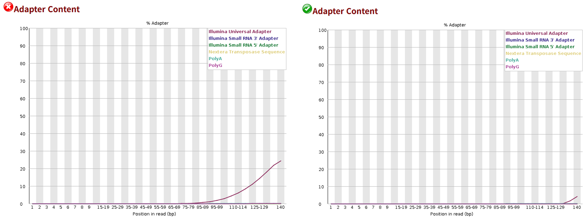
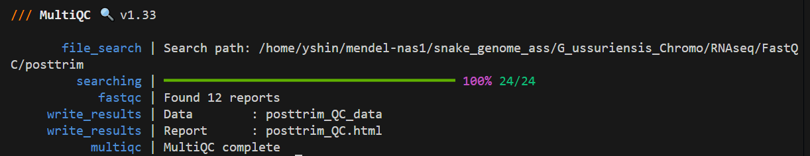
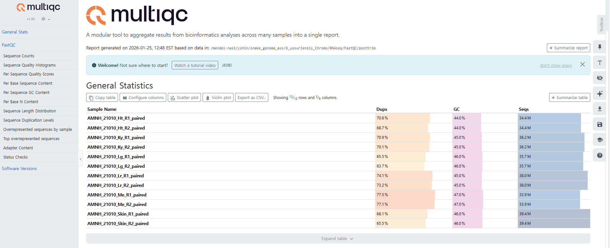
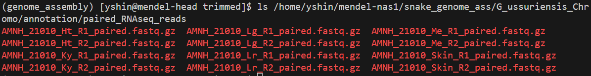
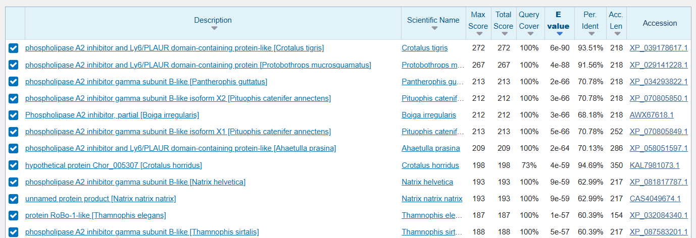

## 7) Genome annotation
### Setup
Let's create new conda environments for packages to be used in genome annotation. Trimmomatic will be used for trimming Illumina adaptera. The funannotation package provides an automated pipeline for gene prediction, annotation, and comparison. The Earl Grey package automates transposable element annotation.
```
### create a conda environment and install funannotate
# add channels
conda config --add channels defaults
conda config --add channels bioconda
conda config --add channels conda-forge

# create a conda env for trimmomatic and install it
conda create -n trimmomatic -c conda-forge -c bioconda trimmomatic

# create a conda env for funannotate and install it
conda create -n funannotate "python>=3.6,<3.9" funannotate
```
----------------------------------------------------------------------------------------------------
### RNA read QC (pre-trimming)
Run FastQC on raw, untrimmed reads.

```sh
#!/bin/bash
#SBATCH --job-name=rnaQC_ussuri
#SBATCH --nodes=1
#SBATCH --mem=200G
#SBATCH --partition=compute
#SBATCH --cpus-per-task=24
#SBATCH --time=10:00:00
#SBATCH --mail-type=ALL
#SBATCH --mail-user=yshin@amnh.org
#SBATCH --output=/home/yshin/mendel-nas1/snake_genome_ass/G_ussuriensis_Chromo/scripts/outfiles/slurm-%x_%j.out
#SBATCH --error=/home/yshin/mendel-nas1/snake_genome_ass/G_ussuriensis_Chromo/scripts/outfiles/slurm-%x_%j.err

# initiate conda and activate the conda environment
source ~/.bash_profile
conda activate genome_assembly

# path to the fastq file
path_to_seq=/home/yshin/mendel-nas1/snake_genome_ass/G_ussuriensis_Chromo/RNAseq/FASTQ

# output directory
out_dir=/home/yshin/mendel-nas1/snake_genome_ass/G_ussuriensis_Chromo/RNAseq/FastQC/pretrim

# run FastQC
fastqc -o ${out_dir} ${path_to_seq}/AMNH_21010_Ht_1.fastq.gz ${path_to_seq}/AMNH_21010_Ht_2.fastq.gz ${path_to_seq}/AMNH_21010_Ky_1.fastq.gz ${path_to_seq}/AMNH_21010_Ky_2.fastq.gz ${path_to_seq}/AMNH_21010_Lg_1.fastq.gz ${path_to_seq}/AMNH_21010_Lg_2.fastq.gz ${path_to_seq}/AMNH_21010_Lr_1.fastq.gz ${path_to_seq}/AMNH_21010_Lr_2.fastq.gz ${path_to_seq}/AMNH_21010_Me_1.fastq.gz ${path_to_seq}/AMNH_21010_Me_2.fastq.gz ${path_to_seq}/AMNH_21010_Skin_1.fastq.gz ${path_to_seq}/AMNH_21010_Skin_2.fastq.gz
``` 
----------------------------------------------------------------------------------------------------
### Adapter trimming & post-trimming QC 
Use trimmomatic to trim adapters and then run FastQC on the trimmed reads. The RNA sequencing was done on Illumina NovaSeq X in a paired-end mode. We will use trimmomatic to trim the Illumina adapters. Since we did paired end sequencing on six different tissues, there are a total of 12 FASTQ files. Repeating trimmomatic independently for each tissue type is not very effective. Instead, I wrote a simple for loop to do the trimming in one go:

```sh
#!/bin/bash
#SBATCH --job-name=adapterTrim_ussuri
#SBATCH --nodes=1
#SBATCH --mem=100G
#SBATCH --partition=compute
#SBATCH --cpus-per-task=30
#SBATCH --time=7-00:00:00
#SBATCH --mail-type=ALL
#SBATCH --mail-user=yshin@amnh.org
#SBATCH --output=/home/yshin/mendel-nas1/snake_genome_ass/G_ussuriensis_Chromo/scripts/outfiles/slurm-%x_%j.out
#SBATCH --error=/home/yshin/mendel-nas1/snake_genome_ass/G_ussuriensis_Chromo/scripts/outfiles/slurm-%x_%j.err

# initiate conda and activate the conda environment
source ~/.bash_profile
conda activate trimmomatic

# paths to input forward & reverse reads, adapters, and output trimmed reads 
path_to_seq=/home/yshin/mendel-nas1/snake_genome_ass/G_ussuriensis_Chromo/RNAseq/FASTQ
adapters=/home/yshin/mendel-nas1/snake_genome_ass/G_ussuriensis_Chromo/RNAseq/custom_adapters.fa
out_path=/home/yshin/mendel-nas1/snake_genome_ass/G_ussuriensis_Chromo/RNAseq/trimmed

# loop through the read files in the directory and run trimmomatic
# print this before looping
echo "start adapter trimming..."

# loop through the file in the directory and run trimmomatic
for f_read in ${path_to_seq}/*_1.fastq.gz; do
  
  # echo forward read
  echo "found a forward read: ${f_read##*/}"

  # designate reverse read
  r_read=${f_read/_1.fastq.gz/_2.fastq.gz}
  echo "found a corresponding reverse read: ${r_read##*/}"

  # print out a message on the type of tissue being processed
  tissue=${f_read%_1.fastq.gz}
  echo "Start adapter trimming ${tissue##*/} reads..."

  # run trimmomatic
  trimmomatic PE -threads ${SLURM_CPUS_PER_TASK} -phred33 \
    -Xmx80g \
    ${f_read} ${r_read} \
    ${tissue}_R1_paired.fastq.gz ${tissue}_R1_unpaired.fastq.gz \
    ${tissue}_R2_paired.fastq.gz ${tissue}_R2_unpaired.fastq.gz \
    ILLUMINACLIP:${adapters}:2:30:10 LEADING:3 TRAILING:3 SLIDINGWINDOW:4:15 MINLEN:36 
done

# move trimmed files to the output directory
echo "move trimmed files to output dir..."

mv ${path_to_seq}/*_R1_paired.fastq.gz ${out_path}
mv ${path_to_seq}/*_R2_paired.fastq.gz ${out_path}
mv ${path_to_seq}/*_R1_unpaired.fastq.gz ${out_path}
mv ${path_to_seq}/*_R2_unpaired.fastq.gz ${out_path}

echo "all files moved to output dir"

# print this at the end
echo "Trimming on all tissue types finished successfully"
```
This run will result in a total of 24 files, two files (paired & unpaired) for each read. Now run FastQC again on trimmed read files:

```sh
#!/bin/bash
#SBATCH --job-name=rnaQC_posttrim
#SBATCH --nodes=1
#SBATCH --mem=200G
#SBATCH --partition=compute
#SBATCH --cpus-per-task=24
#SBATCH --time=10:00:00
#SBATCH --mail-type=ALL
#SBATCH --mail-user=yshin@amnh.org
#SBATCH --output=/home/yshin/mendel-nas1/snake_genome_ass/G_ussuriensis_Chromo/scripts/outfiles/slurm-%x_%j.out
#SBATCH --error=/home/yshin/mendel-nas1/snake_genome_ass/G_ussuriensis_Chromo/scripts/outfiles/slurm-%x_%j.err

# initiate conda and activate the conda environment
source ~/.bash_profile
conda activate genome_assembly

# paths to the trimmed fastq files
path_to_trimmed=/home/yshin/mendel-nas1/snake_genome_ass/G_ussuriensis_Chromo/RNAseq/trimmed

# output directory
out_dir=/home/yshin/mendel-nas1/snake_genome_ass/G_ussuriensis_Chromo/RNAseq/FastQC/posttrim

# run FastQC
for file in ${path_to_trimmed}/*_paired.fastq.gz; do
  echo "running FastQC on $(basename "${file}")..."
  fastqc -o ${out_dir} -t ${SLURM_CPUS_PER_TASK} ${file}
  echo "FastQC on ${file##*/} completed"
done

# print when completed
echo "FastQC on all files completed"
```
Let's compare pre-trimming and post-trimming FastQC results, focusing on adapter content.
Let's open up the results for heart RNA reads:

We can see that the adapters are basically gone after trimming.
   
It can be annoying to look through all the different .html files containing QC results for each tissue type. MultiQC (https://github.com/MultiQC/MultiQC) is a really neat tool that enables the user to merge outputs from different bioinformatics software to generate one, clean QC output.

You only need to supply MultiQC some options and path to the files you want to merge (e.g., path to multiple FastQC outputs).
```sh
# set directories as variables
outdir=/home/yshin/mendel-nas1/snake_genome_ass/G_ussuriensis_Chromo/RNAseq/FastQC/multiqc
indir=/home/yshin/mendel-nas1/snake_genome_ass/G_ussuriensis_Chromo/RNAseq/FastQC

# run multiqc == can run this on the head node because it runs very fast
multiqc -o ${outdir} --filename "posttrim_QC" ${indir}/posttrim
```


The MultiQC output gives a single, neatly organized .html file:


----------------------------------------------------------------------------------------------------
### (Pre-Hi-C) RNA alignment to draft using HiSat2
Now that we have our RNA-seq reads trimmed of adapter sequences and QCed, we can go ahead and align these reads to our draft genome to obtain mapping quality, etc. 

Let's create a conda environment for HiSat2 and install the package in it:
```
conda create -n hisat2 -c bioconda hisat2
conda activate hisat2
```

Also, let's copy paired reads over to our annotation directory. This is not entirely necessary, but I did it to keep the files neatly organized for different tasks.
```
# create a directory for annotation under the main assembly directory
# which is "/home/yshin/mendel-nas1/snake_genome_ass/G_ussuriensis_Chromo"
cd /home/yshin/mendel-nas1/snake_genome_ass/G_ussuriensis_Chromo
mkdir -p annotation
mkdir -p annotation/paired_RNAseq_reads

# copy the files
cd /home/yshin/mendel-nas1/snake_genome_ass/G_ussuriensis_Chromo/RNAseq/trimmed
cp *_R1_paired.fastq.gz /home/yshin/mendel-nas1/snake_genome_ass/G_ussuriensis_Chromo/annotation/paired_RNAseq_reads
cp *_R2_paired.fastq.gz /home/yshin/mendel-nas1/snake_genome_ass/G_ussuriensis_Chromo/annotation/paired_RNAseq_reads

# check files
ls /home/yshin/mendel-nas1/snake_genome_ass/G_ussuriensis_Chromo/annotation/paired_RNAseq_reads
```


Now, let's run HiSat2 on Mendel with the script below
```sh
#!/bin/bash
#SBATCH --job-name=hisat2_preHiC
#SBATCH --nodes=1
#SBATCH --partition=compute
#SBATCH --cpus-per-task=48
#SBATCH --mem=200G
#SBATCH --time=180:00:00
#SBATCH --mail-type=ALL
#SBATCH --mail-user=yshin@amnh.org
#SBATCH --output=/home/yshin/mendel-nas1/snake_genome_ass/G_ussuriensis_Chromo/scripts/outfiles/slurm-%x_%j.out
#SBATCH --error=/home/yshin/mendel-nas1/snake_genome_ass/G_ussuriensis_Chromo/scripts/outfiles/slurm-%x_%j.err

# activate conda env
source ~/.bash_profile
export PATH=/home/yshin/mendel-nas1/miniconda3/bin:$PATH
conda activate hisat2

# set paths for draft genome and RNA reads
draft_fa=/home/yshin/mendel-nas1/snake_genome_ass/G_ussuriensis_Chromo/PacBio_Revio/no_mito/Gloydius_ussuriensis_AMNH_21010_noMito.fa
rna_path=/home/yshin/mendel-nas1/snake_genome_ass/G_ussuriensis_Chromo/annotation/paired_RNAseq_reads

# output directory; create these dirs if they dont exist
outpath=/home/yshin/mendel-nas1/snake_genome_ass/G_ussuriensis_Chromo/annotation/hisat2_preHiC
mkdir -p ${outpath}
mkdir -p ${outpath}/{index,bam,logs}

# make index prefix 
index_prefix=${outpath}/index/Gloydius_ussuriensis_AMNH_21010_noMito

# build hisat2 index, skip if it already exist
if [[ ! -e ${index_prefix}.1.ht2 && ! -e ${index_prefix}.1.ht2l ]]; then
  echo "[INFO] Building HISAT2 index..."
  hisat2-build -p ${SLURM_CPUS_PER_TASK} ${draft_fa} ${index_prefix}
else
  echo "[INFO] HISAT2 index exists. Skipping."
fi

# map RNA reads to draft genome
# print out message
echo "[INFO] Mapping RNA-seq reads in: ${rna_path}"

# prevent loop from running if there are no files with matching names
shopt -s nullglob

# loop over all R1 files, get sample names, and get R2 file names
for R1 in ${rna_path}/AMNH_21010_*_R1_paired.fastq.gz; do
  sample=$(basename ${R1} _R1_paired.fastq.gz)
  R2=${rna_path}/${sample}_R2_paired.fastq.gz

  # skip if R2 is missing
  if [[ ! -f ${R2} ]]; then
    echo "[WARN] Missing R2 for ${sample}. Skipping."
    continue
  fi
  
  # print out some helpful message
  echo "[INFO] Mapping: ${sample}"

  # define output files
  bam=${outpath}/bam/${sample}.sorted.bam
  log=${outpath}/logs/${sample}.hisat2.log

  # run hisat with parameters specified above and then sort using samtools
  # --dta: means "downstream transcriptome assembly"; alignment report optimized for StringTie
  # -x: draft genome
  # -1: read 1 file
  # -2: read 2 file
  # 2> ${log}: direct & store output stats into log file
  # | samtools sort: pipe hisat2 output directly into samtools sort command
  # -: means "take piped input"
  # samtools index: index the sorted bam file
  hisat2 -p ${SLURM_CPUS_PER_TASK} --dta \
    -x ${index_prefix} \
    -1 ${R1} -2 ${R2} \
    2> ${log} \
  | samtools sort -@ ${SLURM_CPUS_PER_TASK} -o ${bam} -

  samtools index ${bam}
done

# print when done
echo "[DONE] HISAT2 mapping complete."
echo "[INFO] BAMs in: ${outpath}/bam"
echo "[INFO] Logs in: ${outpath}/logs"
```

We can open up the log files to check the overall alignment rate per tissue type. This is as follows:
  - Heart: 64.79%
  - Lung: 78.11%
  - Kidney: 82.91%
  - Liver: 87.25%
  - Muscle: 88.53%
  - Skin: 85.89%

----------------------------------------------------------------------------------------------------
### (Pre-Hi-C) Draft-guided transcriptome assembly using StringTie
Now. let's use StringTie to conduct transcriptome assembly guided by the draft genome. Let's create a conda environment for StringTie and install the package:
```
conda create -n stringtie -c bioconda stringtie
```

Next, run StringTie on Mendel with the script below. 
```sh
#!/bin/bash
#SBATCH --job-name=stringtie_preHiC
#SBATCH --nodes=1
#SBATCH --partition=compute
#SBATCH --cpus-per-task=48
#SBATCH --mem=200G
#SBATCH --time=180:00:00
#SBATCH --mail-type=ALL
#SBATCH --mail-user=yshin@amnh.org
#SBATCH --output=/home/yshin/mendel-nas1/snake_genome_ass/G_ussuriensis_Chromo/scripts/outfiles/slurm-%x_%j.out
#SBATCH --error=/home/yshin/mendel-nas1/snake_genome_ass/G_ussuriensis_Chromo/scripts/outfiles/slurm-%x_%j.err

# activate conda env
source ~/.bash_profile
export PATH=/home/yshin/mendel-nas1/miniconda3/bin:$PATH
conda activate stringtie

# dir to bam files
bam_dir=/home/yshin/mendel-nas1/snake_genome_ass/G_ussuriensis_Chromo/annotation/hisat2_preHiC/bam

# output dir
out_dir=/home/yshin/mendel-nas1/snake_genome_ass/G_ussuriensis_Chromo/annotation/StringTie_preHiC
mkdir -p ${out_dir}
mkdir -p ${out_dir}/gtf ${out_dir}/merge 

# run stringtie // loop through file per tissue and assemble per tissue
# each loop takes one bam file (RNA alignment), assembles a transcriptome, and outputs a gtf file for a given tisue type
for bam in ${bam_dir}/*.sorted.bam; do
  sample=$(basename "$bam". sorted.bam)
  echo "assembling transcripts from ${sample}..."
  stringtie "$bam" -p ${SLURM_CPUS_PER_TASK} -o ${out_dir}/gtf/${sample}.gtf
  echo "done assembling transcripts from ${sample}..."
done

# merge gtf per tissue into a single gtf
echo "merging transcripts"
ls ${out_dir}/gtf/*.gtf > ${out_dir}/merge/gtf_list.txt
stringtie --merge -p ${SLURM_CPUS_PER_TASK} -o ${out_dir}/merge/merged.gtf ${out_dir}/merge/gtf_list.txt

# print when done
echo "DONE"
```
Now, let's see how many transcripts, exons, and genes we've got from this run:
```
# check the number of transcripts (counting the number of unique transcript_id) and number of exons
cut -f3 merged.gtf | sort | uniq -c | sort -nr | head

# check the number of genes (counting the number of unique gene_id)
awk '$3=="transcript" {match($0,/gene_id "[^"]+"/,a); if(a[0]!=""){gsub(/gene_id "|"/,"",a[0]); print a[0]}}' merged.gtf | sort -u | wc -l
```
The outputs will show that we have:
  - 381,058 exons
  - 37,147 transcripts
  - 20,527 genes

These results seem to be in great shape in terms of transcript evidence-building. We will put a pause here, finish Hi-C incorporation, and move on to final annotation once our assembly is at the scaffold level. 

----------------------------------------------------------------------------------------------------
### (Pre-Hi-C) Venom gland transcriptome data
Park et al. (2026) produced venom gland transcriptome data for the three *Gloydius* species found in South Korea. This can be useful for placing expressed venom gene candidates to specific scaffolds.

First, create a new directory under the annotation directory
```sh
mkdir -p venom_gland venom_gland/ncbi_seq venom_gland/fastq
```
Then, download NCBI SRA Toolkit on Mendel. Go to the following link (https://github.com/ncbi/sra-tools/wiki/01.-Downloading-SRA-Toolkit) and copy the link for AlmaLinux 64 bit architecture. Then:
```sh
wget https://ftp-trace.ncbi.nlm.nih.gov/sra/sdk/3.4.1/sratoolkit.3.4.1-alma_linux64.tar.gz
```
You should see a tar.gz file created under the annotation directory. Untar this file like so:
```sh
tar -xzvf sratoolkit.3.4.1-alma_linux64.tar.gz
rm *.tar.gz
```
Then add the executable to the PATH variable:
```sh
export PATH=$PWD/sratoolkit.3.4.1-alma_linux64/bin:$PATH
```

Then submit the script below to SLURM.
```sh
#!/bin/bash
#SBATCH --job-name=get_venom_data
#SBATCH --nodes=1
#SBATCH --partition=compute
#SBATCH --ntasks=1
#SBATCH --cpus-per-task=12
#SBATCH --mem=50G
#SBATCH --time=25:00:00
#SBATCH --mail-type=ALL
#SBATCH --mail-user=yshin@amnh.org
#SBATCH --output=/home/yshin/mendel-nas1/snake_genome_ass/G_ussuriensis_Chromo/scripts/outfiles/slurm-%x_%j.out
#SBATCH --error=/home/yshin/mendel-nas1/snake_genome_ass/G_ussuriensis_Chromo/scripts/outfiles/slurm-%x_%j.err

set -euo pipefail

### commands start here ###

# path to SRA toolkit
export PATH=$PWD/sratoolkit.3.4.1-alma_linux64/bin:$PATH

# set directories
basedir="/home/yshin/mendel-nas1/snake_genome_ass/G_ussuriensis_Chromo/annotation/venom_gland"
sradir="${basedir}/ncbi_seq"
fastqdir="${basedir}/fastq"
tmpdir="${basedir}/tmp"

mkdir -p "$sradir" "$fastqdir" "$tmpdir"

# download SRA files
prefetch SRR35908235 -O "$sradir"
prefetch SRR35908238 -O "$sradir"

# convert .sra files to FASTQ files
fasterq-dump "$sradir/SRR35908235/SRR35908235.sra" \
  --split-files \
  --threads 12 \
  --temp "$tmpdir" \
  -O "$fastqdir"

fasterq-dump "$sradir/SRR35908238/SRR35908238.sra" \
  --split-files \
  --threads 12 \
  --temp "$tmpdir" \
  -O "$fastqdir"

# gzip FASTQ files
gzip "$fastqdir"/*.fastq
```

After this, run a quick sanity check from the fastq directory.
```sh
# verify the files have sequences
zcat SRR35908235_1.fastq.gz | head -n 4
zcat SRR35908235_2.fastq.gz | head -n 4

zcat SRR35908238_1.fastq.gz | head -n 4
zcat SRR35908238_2.fastq.gz | head -n 4

# check file size == R1/R2 files should have the same size
ls -lh
```
Then QC the files using FastQC and MultiQC.
```sh
#!/bin/bash
#SBATCH --job-name=venom_gland_qc
#SBATCH --nodes=1
#SBATCH --partition=compute
#SBATCH --ntasks=1
#SBATCH --cpus-per-task=12
#SBATCH --mem=20G
#SBATCH --time=04:00:00
#SBATCH --mail-type=ALL
#SBATCH --mail-user=yshin@amnh.org
#SBATCH --output=/home/yshin/mendel-nas1/snake_genome_ass/G_ussuriensis_Chromo/scripts/outfiles/slurm-%x_%j.out
#SBATCH --error=/home/yshin/mendel-nas1/snake_genome_ass/G_ussuriensis_Chromo/scripts/outfiles/slurm-%x_%j.err

set -euo pipefail

# initiate conda and activate the conda environment
source ~/.bash_profile
conda activate genome_assembly

# set directory
basedir="/home/yshin/mendel-nas1/snake_genome_ass/G_ussuriensis_Chromo/annotation/venom_gland"
cd "$basedir"

# make output dir
mkdir -p qc_fastqc

# run fastqc
fastqc fastq/*.fastq.gz \
  -o qc_fastqc \
  -t 12

# activate multiqc conda env 
conda activate multiqc

# run multiqc
multiqc qc_fastqc \
  -o qc_fastqc
```

The MultiQC report shows considerable adapter content. Use fastp for automatic adapter detection and trimming for Illumina paired-end reads.
```sh
#!/bin/bash
#SBATCH --job-name=venom_trim
#SBATCH --nodes=1
#SBATCH --cpus-per-task=8
#SBATCH --mem=32G
#SBATCH --time=12:00:00
#SBATCH --partition=compute
#SBATCH --mail-type=ALL
#SBATCH --mail-user=yshin@amnh.org
#SBATCH --output=/home/yshin/mendel-nas1/snake_genome_ass/G_ussuriensis_Chromo/scripts/outfiles/slurm-%x_%j.out
#SBATCH --error=/home/yshin/mendel-nas1/snake_genome_ass/G_ussuriensis_Chromo/scripts/outfiles/slurm-%x_%j.err

source ~/.bash_profile
conda activate scaffolding

# set directories
basedir="/home/yshin/mendel-nas1/snake_genome_ass/G_ussuriensis_Chromo/annotation/venom_gland"
indir="${basedir}/fastq"
outdir="${basedir}/trimmed_fastq"
reportdir="${basedir}/fastp_reports"

mkdir -p "$outdir" "$reportdir"

ACCESSIONS=(
  SRR35908235
  SRR35908238
)

for acc in "${ACCESSIONS[@]}"; do
  echo "Trimming ${acc}"

  fastp \
    -i "${indir}/${acc}_1.fastq.gz" \
    -I "${indir}/${acc}_2.fastq.gz" \
    -o "${outdir}/${acc}_1.trimmed.fastq.gz" \
    -O "${outdir}/${acc}_2.trimmed.fastq.gz" \
    --detect_adapter_for_pe \
    --thread 8 \
    --html "${reportdir}/${acc}.fastp.html" \
    --json "${reportdir}/${acc}.fastp.json"

  echo "Finished ${acc}"
done
```

After this is done, run FastQC and MultiQC again on trimmed reads.
```sh
#!/bin/bash
#SBATCH --job-name=venom_gland_posttrim_qc
#SBATCH --nodes=1
#SBATCH --partition=compute
#SBATCH --ntasks=1
#SBATCH --cpus-per-task=12
#SBATCH --mem=20G
#SBATCH --time=04:00:00
#SBATCH --mail-type=ALL
#SBATCH --mail-user=yshin@amnh.org
#SBATCH --output=/home/yshin/mendel-nas1/snake_genome_ass/G_ussuriensis_Chromo/scripts/outfiles/slurm-%x_%j.out
#SBATCH --error=/home/yshin/mendel-nas1/snake_genome_ass/G_ussuriensis_Chromo/scripts/outfiles/slurm-%x_%j.err

# initiate conda and activate the conda environment
source ~/.bash_profile
conda activate genome_assembly

# set directory
basedir="/home/yshin/mendel-nas1/snake_genome_ass/G_ussuriensis_Chromo/annotation/venom_gland"
cd "$basedir"

# make output dir
mkdir -p postrrim_qc_fastqc

# run fastqc
fastqc trimmed_fastq/*.fastq.gz \
  -o postrrim_qc_fastqc \
  -t 12

# activate multiqc conda env 
conda activate multiqc

# run multiqc
multiqc postrrim_qc_fastqc \
  -o postrrim_qc_fastqc
```

----------------------------------------------------------------------------------------------------
### (Post-Hi-C) Repeat masking (soft masking) using Earl Grey
Before moving on to final annotation, it is necessary to annotate the repeats and soft mask the genome. We can do this using the Earl Grey pipeline (https://github.com/TobyBaril/EarlGrey), which is a fully-automated pipeline for transposable element (TE)/repeat annotation.

Let's start by creating a separate conda environment and install Earl Grey: 

```
# create a conda environment for Earl Grey and install it
conda create -n earlgrey -c conda-forge -c bioconda earlgrey=7.0.1
```

Once this is done, run Earl Grey with the script below on Mendel (make sure the input genome is the final, curated chromosome-level assembly):
```sh
#!/bin/bash
#SBATCH --job-name=earlGrey_ussuri
#SBATCH --nodes=1
#SBATCH --cpus-per-task=48
#SBATCH --mem=600G
#SBATCH --time=180:00:00
#SBATCH --partition=bigmem
#SBATCH --mail-type=ALL
#SBATCH --mail-user=yshin@amnh.org
#SBATCH --output=/home/yshin/mendel-nas1/snake_genome_ass/G_ussuriensis_Chromo/scripts/outfiles/slurm-%x_%j.out
#SBATCH --error=/home/yshin/mendel-nas1/snake_genome_ass/G_ussuriensis_Chromo/scripts/outfiles/slurm-%x_%j.err

# soft masking the scaffolded assembly with Earl Grey

# activate the conda env
source ~/.bash_profile
conda activate earlgrey

# set variables
GENOME="/home/yshin/mendel-nas1/snake_genome_ass/G_ussuriensis_Chromo/final_assembly/curated/Gloydius_ussuriensis_AMNH_21010_curated_scaffold11_split.fa"
SPECIES="Gloydius_ussuriensis"

# output path
outpath=/home/yshin/mendel-nas1/snake_genome_ass/G_ussuriensis_Chromo/annotation/soft_masked
mkdir -p $outpath

# run Earl Grey
echo "Starting EarlGrey: $(date)"

# -d flag == Create soft-masked genome at the end? (yes/no, Default: no)
earlGrey -g ${GENOME} -s ${SPECIES} -o ${outpath} -d yes -t ${SLURM_CPUS_PER_TASK}

echo "Finished EarlGrey: $(date)"

# list outputs
echo "EarlGrey output files:"
find "$outdir" -maxdepth 3 -type f | head -n 50

echo "Done: $(date)"
```
----------------------------------------------------------------------------------------------------
### (Post-Hi-C) Annotation using funannotate
The general annotation workflow is as follows:
```
1. funannotate train: organ tissue RNA-seq data + publicly available venom gland RNA-seq data
2. funannotate predict
3. funannotate update
4. funannotate fix
5. InterProScan on proteins predicted by funannotate predict
6. funannotate annotate
7. Final QC / manual curation
```

Let's start by symlinking the softmasked fasta for annotation.
```sh
# symlink softmasked fasta output from earl grey
ln -s /home/yshin/mendel-nas1/snake_genome_ass/G_ussuriensis_Chromo/annotation/soft_masked/Gloydius_ussuriensis_EarlGrey/Gloydius_ussuriensis_summaryFiles/Gloydius_ussuriensis.softmasked.fasta \
  Gloydius_ussuriensis.softmasked.fa
```
Then activate the funannotate conda env and install gffread.
```sh
conda activate funannotate
conda install bioconda::gffread
```

####  Setup funannotate 1: GeneMark
funannotate also requires an initial database setup step. Run setup as below:
```sh
# create db path
db_path="/home/yshin/mendel-nas1/snake_genome_ass/G_ussuriensis_Chromo/an
notation/funannotate_db"

mkdir -p ${db_path}

# check dependencies
funannotate check --show-versions

# setup db
funannotate setup -d ${db_path} -i all --wget

# run this once the setup is done
echo 'export FUNANNOTATE_DB=/home/yshin/mendel-nas1/snake_genome_ass/G_ussuriensis_Chromo/annotation/funannotate_db' >> ~/.bash_profile

# also set up BUSCO lineage db 
# this version of funannotate do not support the sauropsida lineage DB; use tetrapoda db instead 
export FUNANNOTATE_DB="/home/yshin/mendel-nas1/snake_genome_ass/G_ussuriensis_Chromo/annotation/funannotate_db"
funannotate setup -d "$FUNANNOTATE_DB" -b tetrapoda --wget
```
After this, if you run "funannotate check --show-versions", you'll see the current configuration is missing some key dependencies, such as eggnog mapper ("ERROR: emapper.py not installed"), GeneMark ("ERROR: gmes_petap.pl not installed"), and signalp ("ERROR: signalp not installed"). 

GeneMark cannot be installed through conda. We need to manually download the .tar.gz file from the GeneMark website and scp it to Mendel.
```
# on Mendel
mkdir -p "/home/yshin/mendel-nas1/gmes_linux_64"
cd "/home/yshin/mendel-nas1/gmes_linux_64"

# in local device
scp gmes_linux_64_4.tar.gz yshin@mendel.sdmz.amnh.org:/home/yshin/mendel-nas1/gmes_linux_64

# unzip on Mendel
tar -xvzf gmes_linux_64_4.tar.gz
```

Now, set the GeneMark path:
```
export GENEMARK_PATH="/home/yshin/mendel-nas1/gmes_linux_64/gmes_linux_64_4"
export PATH="$GENEMARK_PATH:$PATH"
```

Also, download the key file from the website (Linux 64 bit) and scp it to the Mendel home directory. After that, run:
```
zcat gm_key_64.gz > ~/.gm_key
chmod 600 ~/.gm_key
```

Then, run a full check
```sh
conda activate funannotate

export FUNANNOTATE_DB="/home/yshin/mendel-nas1/snake_genome_ass/G_ussuriensis_Chromo/annotation/funannotate_db"
export GENEMARK_PATH="/home/yshin/mendel-nas1/gmes_linux_64/gmes_linux_64_4"
export PATH="$GENEMARK_PATH:$PATH"

funannotate check --show-versions
```
Now you shouldn't see the GeneMark error.

####  Setup funannotate 2: eggNOG-mapper
```
# in the funannotate conda env 
conda install -c conda-forge -c bioconda eggnog-mapper

# download eggnog db
export EGGNOG_DATA_DIR="/home/yshin/mendel-nas1/eggnog_db"
mkdir -p "$EGGNOG_DATA_DIR"
cd "$EGGNOG_DATA_DIR"

BASE="http://eggnog5.embl.de/download/emapperdb-5.0.2"

wget -c -O eggnog.db.gz "$BASE/eggnog.db.gz"
wget -c -O eggnog.taxa.tar.gz "$BASE/eggnog.taxa.tar.gz"
wget -c -O eggnog_proteins.dmnd.gz "$BASE/eggnog_proteins.dmnd.gz"

# decompress
gunzip -f eggnog.db.gz
gunzip -f eggnog_proteins.dmnd.gz
tar -xvzf eggnog.taxa.tar.gz
rm -f eggnog.taxa.tar.gz

# check installation
which emapper.py
emapper.py --version
```

####  Setup funannotate 3: SignalP
Install signalp from the software website and scp it to Mendel. After that:
```
# make install directory
mkdir -p /home/yshin/mendel-nas1/signalp

# unpack
tar -xvzf /home/yshin/mendel-nas1/signalp-6.0i.fast.tar.gz -C /home/yshin/mendel-nas1/signalp

# cd into the package dir
/home/yshin/mendel-nas1/signalp/signalp6_fast/signalp-6-package

# put pip cache and temp files on nas, not /home, to prevent disk quota error
mkdir -p /home/yshin/mendel-nas1/tmp/pip_cache
mkdir -p /home/yshin/mendel-nas1/tmp/pip_tmp

export PIP_CACHE_DIR="/home/yshin/mendel-nas1/tmp/pip_cache"
export TMPDIR="/home/yshin/mendel-nas1/tmp/pip_tmp"

# install
python -m pip install --no-cache-dir .

# symlink for funannotate
export LD_LIBRARY_PATH="$CONDA_PREFIX/lib:$LD_LIBRARY_PATH"

cd "$CONDA_PREFIX/bin"
ln -sf signalp6 signalp
```

Then run a final check. This should print "All 37 external dependencies are installed" at the end.
```
funannotate check --show-versions
```
Also, copy the "distilled_model_signalp6.pt" file into the signalp installation "model_weights" dir.
```sh
cp -av \
/home/yshin/mendel-nas1/signalp/signalp6_fast/signalp-6-package/models/distilled_model_signalp6.pt \
/home/yshin/mendel-nas1/miniconda3/envs/funannotate/lib/python3.8/site-packages/signalp/model_weights/
```

Check whether the file is correctly copied.
```sh
ls -lh \
/home/yshin/mendel-nas1/miniconda3/envs/funannotate/lib/python3.8/site-packages/signalp/model_weights/
```

####  Install InterProScan
First, create a new directory to store interproscan
```sh
cd /home/yshin/mendel-nas1

mkdir -p interproscan
cd interproscan
```
Next, install interproscan and checksum files.
```sh
# download interproscan
wget https://ftp.ebi.ac.uk/pub/software/unix/iprscan/5/5.78-109.0/interproscan-5.78-109.0-64-bit.tar.gz

# download checksum
wget https://ftp.ebi.ac.uk/pub/software/unix/iprscan/5/5.78-109.0/interproscan-5.78-109.0-64-bit.tar.gz.md5
```
Check download:
```
md5sum -c interproscan-5.78-109.0-64-bit.tar.gz.md5
```

Extract the file while preserving permissions:
```sh
# extract
tar -pxvzf interproscan-5.78-109.0-64-bit.tar.gz

# check script
ls -lh /home/yshin/mendel-nas1/interproscan/interproscan-5.78-109.0/interproscan.sh
```

Also check the runtime requirements. What we want is Java 11 or above.
```sh
java -version
python3 --version
perl -version | head
echo "$JAVA_HOME"
```

####  funannotate step 1: Train
Run with the script below.
```sh
#!/bin/bash
#SBATCH --job-name=funannotate_train
#SBATCH --nodes=1
#SBATCH --partition=compute
#SBATCH --ntasks=1
#SBATCH --cpus-per-task=32
#SBATCH --mem=300G
#SBATCH --time=120:00:00
#SBATCH --mail-type=ALL
#SBATCH --mail-user=yshin@amnh.org
#SBATCH --output=/home/yshin/mendel-nas1/snake_genome_ass/G_ussuriensis_Chromo/scripts/outfiles/slurm-%x_%j.out
#SBATCH --error=/home/yshin/mendel-nas1/snake_genome_ass/G_ussuriensis_Chromo/scripts/outfiles/slurm-%x_%j.err

# activate environment and set up analyses
source ~/.bash_profile
conda activate funannotate
set -euo pipefail

# make TransDecoder utilities available to PASA
export PATH="$CONDA_PREFIX/opt/transdecoder:$CONDA_PREFIX/opt/transdecoder/util:$PATH"

# avoid system library conflicts
export LD_LIBRARY_PATH="${CONDA_PREFIX}/lib:${LD_LIBRARY_PATH:-}"

# funannotate databases and external tools
export FUNANNOTATE_DB="/home/yshin/mendel-nas1/snake_genome_ass/G_ussuriensis_Chromo/annotation/funannotate_db"
export GENEMARK_PATH="/home/yshin/mendel-nas1/gmes_linux_64/gmes_linux_64_4"
export PATH="$GENEMARK_PATH:$PATH"
export EGGNOG_DATA_DIR="/home/yshin/mendel-nas1/eggnog_db"

# use a short temporary directory and clean it up on exit
export TMPDIR="/tmp/yshin_fun_${SLURM_JOB_ID}"
export TEMP="$TMPDIR"
export TMP="$TMPDIR"
mkdir -p "$TMPDIR"

trap 'rm -rf "$TMPDIR"' EXIT

# set paths for input and output
# softmakesked genome assembly
genome="/home/yshin/mendel-nas1/snake_genome_ass/G_ussuriensis_Chromo/annotation/soft_masked/Gloydius_ussuriensis_EarlGrey/Gloydius_ussuriensis_summaryFiles/Gloydius_ussuriensis.softmasked.fasta"

# path to paired-end RNA-seq reads from organ tissues and venom gland
tissue_reads="/home/yshin/mendel-nas1/snake_genome_ass/G_ussuriensis_Chromo/annotation/paired_RNAseq_reads"
venom_reads="/home/yshin/mendel-nas1/snake_genome_ass/G_ussuriensis_Chromo/annotation/venom_gland/trimmed_fastq"

# make output dir for all funannotate results
outdir="/home/yshin/mendel-nas1/snake_genome_ass/G_ussuriensis_Chromo/annotation/funannotate/"
mkdir -p "$outdir"

# Train to align RNA-seq data, run Trinity, and then run PASA
funannotate train -i ${genome} -o ${outdir} \
    --left ${tissue_reads}/AMNH_21010_Ht_R1_paired.fastq.gz ${tissue_reads}/AMNH_21010_Lr_R1_paired.fastq.gz ${tissue_reads}/AMNH_21010_Ky_R1_paired.fastq.gz ${tissue_reads}/AMNH_21010_Me_R1_paired.fastq.gz ${tissue_reads}/AMNH_21010_Lg_R1_paired.fastq.gz ${tissue_reads}/AMNH_21010_Skin_R1_paired.fastq.gz ${venom_reads}/SRR35908235_1.trimmed.fastq.gz \
    --right ${tissue_reads}/AMNH_21010_Ht_R2_paired.fastq.gz ${tissue_reads}/AMNH_21010_Lr_R2_paired.fastq.gz ${tissue_reads}/AMNH_21010_Ky_R2_paired.fastq.gz ${tissue_reads}/AMNH_21010_Me_R2_paired.fastq.gz ${tissue_reads}/AMNH_21010_Lg_R2_paired.fastq.gz ${tissue_reads}/AMNH_21010_Skin_R2_paired.fastq.gz ${venom_reads}/SRR35908235_2.trimmed.fastq.gz \
    --species "Gloydius ussuriensis" \
    --isolate AMNH_21010 \
    --stranded RF \
    --max_intronlen 100000 \
    --cpus "$SLURM_CPUS_PER_TASK" \
    --memory 250G \
    --no_trimmomatic
```

####  funannotate step 2: Predict
```sh
#!/bin/bash
#!/bin/bash
#SBATCH --job-name=funannotate_predict
#SBATCH --nodes=1
#SBATCH --partition=bigmem
#SBATCH --ntasks=1
#SBATCH --cpus-per-task=16
#SBATCH --mem=500G
#SBATCH --time=300:00:00
#SBATCH --mail-type=ALL
#SBATCH --mail-user=yshin@amnh.org
#SBATCH --output=/home/yshin/mendel-nas1/snake_genome_ass/G_ussuriensis_Chromo/scripts/outfiles/slurm-%x_%j.out
#SBATCH --error=/home/yshin/mendel-nas1/snake_genome_ass/G_ussuriensis_Chromo/scripts/outfiles/slurm-%x_%j.err


# ============================================================
# funannotate predict
#
# GlimmerHMM is disabled because the previous run produced
# 431,192 GlimmerHMM predictions, causing an excessively large
# EVM input and contributing to an OOM failure.
# ============================================================

# activate environment
source ~/.bash_profile
conda activate funannotate

set -euo pipefail

# avoid system library conflicts
export LD_LIBRARY_PATH="${CONDA_PREFIX}/lib:${LD_LIBRARY_PATH:-}"

# funannotate databases and external tools
export FUNANNOTATE_DB="/home/yshin/mendel-nas1/snake_genome_ass/G_ussuriensis_Chromo/annotation/funannotate_db"
export GENEMARK_PATH="/home/yshin/mendel-nas1/gmes_linux_64/gmes_linux_64_4"
export PATH="${GENEMARK_PATH}:${PATH}"
export EGGNOG_DATA_DIR="/home/yshin/mendel-nas1/eggnog_db"

# temporary directory
export TMPDIR="/tmp/yshin_fun_${SLURM_JOB_ID}"
export TEMP="${TMPDIR}"
export TMP="${TMPDIR}"

mkdir -p "${TMPDIR}"
trap 'rm -rf "${TMPDIR}"' EXIT


### set paths for input and output
# input genome
genome="/home/yshin/mendel-nas1/snake_genome_ass/G_ussuriensis_Chromo/annotation/soft_masked/Gloydius_ussuriensis_EarlGrey/Gloydius_ussuriensis_summaryFiles/Gloydius_ussuriensis.softmasked.fasta"

# output directory
outdir="/home/yshin/mendel-nas1/snake_genome_ass/G_ussuriensis_Chromo/annotation/funannotate"

# run funannotate predict
echo
echo "============================================================"
echo "Starting funannotate predict"
echo "GlimmerHMM weight = 0 (disabled)"
echo "============================================================"
echo

funannotate predict \
    -i "${genome}" \
    -o "${outdir}" \
    --species "Gloydius ussuriensis" \
    --isolate AMNH_21010 \
    --busco_db tetrapoda \
    --organism other \
    --busco_seed_species Taeniopygia_guttata \
    --max_intronlen 100000 \
    --repeats2evm \
    --weights glimmerhmm:0 \
    --cpus "${SLURM_CPUS_PER_TASK}"

# print when finished
echo
echo "============================================================"
echo "funannotate predict completed successfully"
echo "End time: $(date)"
echo "============================================================"
```

####  funannotate step 3: Update
```sh
#!/bin/bash
#SBATCH --job-name funannotate_update
#SBATCH --nodes=1
#SBATCH --partition=compute
#SBATCH --ntasks=1
#SBATCH --cpus-per-task=32
#SBATCH --mem=300G
#SBATCH --time=300:00:00
#SBATCH --mail-type=ALL
#SBATCH --mail-user=yshin@amnh.org
#SBATCH --output=/home/yshin/mendel-nas1/snake_genome_ass/G_ussuriensis_Chromo/scripts/outfiles/slurm-%x_%j.out
#SBATCH --error=/home/yshin/mendel-nas1/snake_genome_ass/G_ussuriensis_Chromo/scripts/outfiles/slurm-%x_%j.err

# activate environment and set up analyses
source ~/.bash_profile
conda activate funannotate
set -euo pipefail

# avoid system library conflicts
export LD_LIBRARY_PATH="${CONDA_PREFIX}/lib:${LD_LIBRARY_PATH:-}"

# funannotate databases and external tools
export FUNANNOTATE_DB="/home/yshin/mendel-nas1/snake_genome_ass/G_ussuriensis_Chromo/annotation/funannotate_db"
export GENEMARK_PATH="/home/yshin/mendel-nas1/gmes_linux_64/gmes_linux_64_4"
export PATH="$GENEMARK_PATH:$PATH"
export EGGNOG_DATA_DIR="/home/yshin/mendel-nas1/eggnog_db"

# use a short temporary directory and clean it up on exit
export TMPDIR="/tmp/yshin_fun_${SLURM_JOB_ID}"
export TEMP="$TMPDIR"
export TMP="$TMPDIR"
mkdir -p "$TMPDIR"

trap 'rm -rf "$TMPDIR"' EXIT

# output directory for funannotate results
outdir="/home/yshin/mendel-nas1/snake_genome_ass/G_ussuriensis_Chromo/annotation/funannotate/"

# run funannotate update
funannotate update -i ${outdir} --cpus $SLURM_CPUS_PER_TASK
```

####  funannotate step 4: InterProScan
Run interproscan through "funannotate iprscan" using the script below:
```sh
#!/bin/bash
#SBATCH --job-name=funannotate_iprscan
#SBATCH --nodes=1
#SBATCH --partition=compute
#SBATCH --ntasks=1
#SBATCH --cpus-per-task=32
#SBATCH --mem=300G
#SBATCH --time=720:00:00
#SBATCH --mail-type=ALL
#SBATCH --mail-user=yshin@amnh.org
#SBATCH --output=/home/yshin/mendel-nas1/snake_genome_ass/G_ussuriensis_Chromo/scripts/outfiles/slurm-%x_%j.out
#SBATCH --error=/home/yshin/mendel-nas1/snake_genome_ass/G_ussuriensis_Chromo/scripts/outfiles/slurm-%x_%j.err

# activate conda environment
source ~/.bash_profile
conda activate funannotate

set -euo pipefail


# ------------------------------------------------------------
# set paths
# ------------------------------------------------------------

FUN_DIR="/home/yshin/mendel-nas1/snake_genome_ass/G_ussuriensis_Chromo/annotation/funannotate"
IPR_DIR="/home/yshin/mendel-nas1/interproscan/interproscan-5.78-109.0"
IPRSCAN="${IPR_DIR}/interproscan.sh"


# ------------------------------------------------------------
# run InterProScan through funannotate
# ------------------------------------------------------------

cd "${FUN_DIR}"

echo "Starting InterProScan: $(date)"

funannotate iprscan \
    -i "${FUN_DIR}" \
    -m local \
    --iprscan_path "${IPRSCAN}" \
    -c 4


# ------------------------------------------------------------
# verify output
# ------------------------------------------------------------

IPR_XML="${FUN_DIR}/annotate_misc/iprscan.xml"

echo
echo "============================================================"

if [[ -s "${IPR_XML}" ]]; then
    echo "InterProScan completed successfully."
    echo "Output:"
    ls -lh "${IPR_XML}"
else
    echo "ERROR: Expected InterProScan XML was not produced:"
    echo "${IPR_XML}"
    exit 1
fi


# ------------------------------------------------------------
# print when finished
# ------------------------------------------------------------

echo "Finished: $(date)"
echo "============================================================"
```

####  funannotate step 5: Annotate 
Using the outputs from "funannotate predict" and interproscan runs, now run funannotate annotate step:
```sh
#!/bin/bash
#SBATCH --job-name=funannotate_annotate
#SBATCH --nodes=1
#SBATCH --partition=compute
#SBATCH --ntasks=1
#SBATCH --cpus-per-task=32
#SBATCH --mem=350G
#SBATCH --time=168:00:00
#SBATCH --mail-type=ALL
#SBATCH --mail-user=yshin@amnh.org
#SBATCH --output=/home/yshin/mendel-nas1/snake_genome_ass/G_ussuriensis_Chromo/scripts/outfiles/slurm-%x_%j.out
#SBATCH --error=/home/yshin/mendel-nas1/snake_genome_ass/G_ussuriensis_Chromo/scripts/outfiles/slurm-%x_%j.err


# ------------------------------------------------------------
# activate conda environment
# ------------------------------------------------------------

source ~/.bash_profile
conda activate funannotate

set -euo pipefail


# ------------------------------------------------------------
# environment
# ------------------------------------------------------------

# avoid system libstdc++ conflict
export LD_LIBRARY_PATH="${CONDA_PREFIX}/lib:${LD_LIBRARY_PATH:-}"

# Funannotate databases
export FUNANNOTATE_DB="/home/yshin/mendel-nas1/snake_genome_ass/G_ussuriensis_Chromo/annotation/funannotate_db"

# EggNOG database
export EGGNOG_DATA_DIR="/home/yshin/mendel-nas1/eggnog_db"


# ------------------------------------------------------------
# temporary directory
# ------------------------------------------------------------

export TMPDIR="/tmp/yshin_funannotate_${SLURM_JOB_ID}"
export TEMP="${TMPDIR}"
export TMP="${TMPDIR}"

mkdir -p "${TMPDIR}"
trap 'rm -rf "${TMPDIR}"' EXIT


# ------------------------------------------------------------
# set paths
# ------------------------------------------------------------

FUN_DIR="/home/yshin/mendel-nas1/snake_genome_ass/G_ussuriensis_Chromo/annotation/funannotate"
IPR_XML="${FUN_DIR}/annotate_misc/iprscan.xml"
PROTEINS="${FUN_DIR}/update_results/Gloydius_ussuriensis_AMNH_21010.proteins.fa"


# ------------------------------------------------------------
# run Funannotate annotate
# ------------------------------------------------------------

cd "${FUN_DIR}"

echo "============================================================"
echo "Starting funannotate annotate"
echo "Date: $(date)"
echo "============================================================"
echo

funannotate annotate \
    -i "${FUN_DIR}" \
    -s "Gloydius ussuriensis" \
    --isolate AMNH_21010 \
    --cpus "${SLURM_CPUS_PER_TASK}" \
    --busco_db tetrapoda \
    --database "${FUNANNOTATE_DB}" \
    --tmpdir "${TMPDIR}"


# ------------------------------------------------------------
# verify annotation output
# ------------------------------------------------------------

ANNOTATE_DIR="${FUN_DIR}/annotate_results"

echo
echo "============================================================"
echo "Checking Funannotate annotation output"
echo "============================================================"
echo

if [[ ! -d "${ANNOTATE_DIR}" ]]; then
    echo "ERROR: annotate_results directory was not created:"
    echo "${ANNOTATE_DIR}"
    exit 1
fi

echo "annotate_results created successfully:"
ls -lh "${ANNOTATE_DIR}"

echo
echo "============================================================"
echo "Funannotate annotate completed"
echo "Finished: $(date)"
echo "============================================================"
```

#### Post-annotation checks
Run the following script to QC the annotation results:
```sh
funannotate_final_qc.sh
```

__NOTE:__ This script uses a newer compleasm version, which is installed in a separate conda env created as:
```sh
conda create -n compleasm_v0.2.9 \
    -c conda-forge \
    -c bioconda \
    compleasm=0.2.9
```

----------------------------------------------------------------------------------------------------
### (Post-Hi-C) Toxin gene annotation using ToxCodAn-Genome
Snake toxin gene annotation can be tricky. [...]

Install ToxCodAn-Genome and its dependencies.
```sh
# create conda env and install dependencies
conda create -n ToxcodanGenome -c bioconda python biopython pandas blast exonerate miniprot gffread hisat2 samtools stringtie trinity spades

# install ToxCodAn-Genome from github and add to PATH
cd mendel-nas1/
git clone https://github.com/pedronachtigall/ToxCodAn-Genome.git
echo "export PATH=$PATH:$PWD/ToxCodAn-Genome/bin/" >> ~/.bashrc

# test
conda activate ToxcodanGenome
cd ToxCodAn-Genome/bin/
python toxcodan-genome.py -h

# apply permission to all executables
chmod +x /home/yshin/mendel-nas1/ToxCodAn-Genome/bin/*
```
Also, create a separate conda env and install ToxCodAn to be used for transcriptome annotation.
```sh
# setup conda env
conda create -n Toxcodan \
  --strict-channel-priority \
  -c conda-forge \
  -c bioconda \
  python=3.10 \
  codan=1.2 \
  blast \
  hmmer

# git clone toxcodan from repo
git clone https://github.com/pedronachtigall/ToxCodAn.git
export PATH=$PATH:path/to/ToxCodAn/bin/

# unzip models (in "/home/yshin/mendel-nas1/ToxCodAn" dir)
unzip models.zip

# download the SignalP-4.1 from its website, decompress, and add it to PATH:
tar -xzf signalp-4.1g.Linux.tar.gz
export PATH="$PATH:/home/yshin/mendel-nas1/signalp-4.1"

### signalp 4.1 setup
# cd into dir
cd /home/yshin/mendel-nas1/signalp-4.1

# confirm that the required Perl module exists
ls -l lib/FASTA.pm
$ENV{SIGNALP} = '/home/yshin/mendel-nas1/signalp-4.1/';

# back up and fix the script
cp signalp signalp.original

sed -i \
  's|/usr/opt/www/pub/CBS/services/SignalP-4.1/signalp-4.1|/home/yshin/mendel-nas1/signalp-4.1|g' \
  signalp

# verify that the correct path is now embedded
grep -n 'ENV{SIGNALP}' signalp

### apply "execution permission" to all bin executables
chmod 777 /home/yshin/mendel-nas1/ToxCodAn/bin/*
```

First, run TRassembly.py included in the ToxCodAn-Genome package for venom gland transcriptome assembly.

Before running TRassembly, make sure the jellyfish k-mer counter is installed and accessible by Trinity (which is part of the TRassembly script). In my case, jellyfish was not installed in the ToxcodanGenome conda env and this caused TRassembly script to crash as soon as it entered the de novo transcriptome assembly step. Also, install bowtie/bowtie2 and salmon alongside jellyfish.
```sh
# activate conda env
conda activate ToxcodanGenome

# install
conda install --freeze-installed \
    -c conda-forge \
    -c bioconda \
    bioconda::kmer-jellyfish \
    bioconda::bowtie2 \
    bioconda::bowtie \
    bioconda::salmon
```
Now, run the TRassembly.py script:
```sh
#!/bin/bash
#SBATCH --job-name=TRassembly
#SBATCH --nodes=1
#SBATCH --mem=300G
#SBATCH --cpus-per-task=32
#SBATCH --partition=compute
#SBATCH --time=300:00:00
#SBATCH --mail-type=ALL
#SBATCH --mail-user=yshin@amnh.org
#SBATCH --output=/home/yshin/mendel-nas1/snake_genome_ass/G_ussuriensis_Chromo/scripts/outfiles/slurm-%x_%j.out
#SBATCH --error=/home/yshin/mendel-nas1/snake_genome_ass/G_ussuriensis_Chromo/scripts/outfiles/slurm-%x_%j.err

# activate conda env 
# TRassembly.py is a part of ToxCodAn-Genome
source ~/.bash_profile
conda activate ToxcodanGenome

# force UTF-8 output in non-interactive SLURM jobs
# locale available on all standard Linux nodes
export LANG=C
export LC_ALL=C

# force Python itself to use UTF-8
export PYTHONIOENCODING=UTF-8
export PYTHONUTF8=1

set -euo pipefail

# set TRassembly path and cd into it
dir_TRassembly="/home/yshin/mendel-nas1/ToxCodAn-Genome/bin"
cd ${dir_TRassembly}

# output dir
outdir="/home/yshin/mendel-nas1/snake_genome_ass/G_ussuriensis_Chromo/annotation/toxin_gene_annotation_RNAdata_added"
mkdir -p ${outdir}
mkdir -p ${outdir}/SRR35908235_TRassembly

# input dir
genome="/home/yshin/mendel-nas1/snake_genome_ass/G_ussuriensis_Chromo/annotation/soft_masked/Gloydius_ussuriensis_EarlGrey/Gloydius_ussuriensis_summaryFiles/Gloydius_ussuriensis.softmasked.fasta"
venom_read_1="/home/yshin/mendel-nas1/snake_genome_ass/G_ussuriensis_Chromo/annotation/venom_gland/trimmed_fastq/SRR35908235_1.trimmed.fastq.gz"
venom_read_2="/home/yshin/mendel-nas1/snake_genome_ass/G_ussuriensis_Chromo/annotation/venom_gland/trimmed_fastq/SRR35908235_2.trimmed.fastq.gz"

# run TRassembly.py to assemble venom gland RNA-seq reads
python TRassembly.py \
    -g ${genome} \
    -r ${venom_read_1},${venom_read_2} \
    -o ${outdir}/SRR35908235_TRassembly \
    -c ${SLURM_CPUS_PER_TASK} \
    -M 250G

# echo the following message when done
echo "TRassembly completed successfully."
echo "The output files are located in ${outdir}/SRR35908235_TRassembly"
ls ${outdir}/SRR35908235_TRassembly
```

Next, run toxcodan.py, which is the main script of ToxCodAn (*NOT* the same as ToxCodAn-Genome!!), for transcriptome annotation:
```sh
#!/bin/bash
#SBATCH --job-name=ToxCodAn
#SBATCH --nodes=1
#SBATCH --mem=300G
#SBATCH --cpus-per-task=32
#SBATCH --partition=compute
#SBATCH --time=300:00:00
#SBATCH --mail-type=ALL
#SBATCH --mail-user=yshin@amnh.org
#SBATCH --output=/home/yshin/mendel-nas1/snake_genome_ass/G_ussuriensis_Chromo/scripts/outfiles/slurm-%x_%j.out
#SBATCH --error=/home/yshin/mendel-nas1/snake_genome_ass/G_ussuriensis_Chromo/scripts/outfiles/slurm-%x_%j.err

# activate conda env for mapping
source ~/.bash_profile
conda activate Toxcodan

# force UTF-8 output in non-interactive SLURM jobs
# locale available on all standard Linux nodes
export LANG=C
export LC_ALL=C

# force Python itself to use UTF-8
export PYTHONIOENCODING=UTF-8
export PYTHONUTF8=1

set -euo pipefail

# set toxcodan and signalp paths
dir_toxcodan="/home/yshin/mendel-nas1/ToxCodAn/bin"
signalp_dir="/home/yshin/mendel-nas1/signalp-4.1"

# make toxcodan and signalp available in the PATH
export PATH="${dir_toxcodan}:${signalp_dir}:${PATH}"
hash -r

# set input paths
models_dir="/home/yshin/mendel-nas1/ToxCodAn/models"

# output dir for all toxin gene annotation steps
outdir="/home/yshin/mendel-nas1/snake_genome_ass/G_ussuriensis_Chromo/annotation/toxin_gene_annotation_RNAdata_added"
mkdir -p ${outdir}

# output dir for ToxCodAn
mkdir -p ${outdir}/SRR35908235_ToxCodAn

# run ToxCodAn to annotate the transcriptome
python "${dir_toxcodan}/toxcodan.py" \
    -s SRR35908235 \
    -t ${outdir}/SRR35908235_TRassembly/transcripts.fasta \
    -m ${models_dir} \
    -o ${outdir}/SRR35908235_ToxCodAn \
    -c ${SLURM_CPUS_PER_TASK}

cat ${outdir}/SRR35908235_ToxCodAn/SRR35908235_Toxins_cds_RedundancyFiltered.fasta ${outdir}/SRR35908235_ToxCodAn/SRR35908235_PutativeToxins_cds_SPfiltered.fasta > ${outdir}/G_ussuriensis_VG_toxins.toxcodan.fasta

echo "ToxCodAn completed successfully."
echo "The output files are located in ${outdir}/SRR35908235_ToxCodAn"
ls ${outdir}/SRR35908235_ToxCodAn       
```

Finally, run toxcodan-genome.py (the main script of ToxCodAn-Genome) for toxin gene annotation of the genome:
```sh
#!/bin/bash
#SBATCH --job-name=ToxCodAn-Genome
#SBATCH --nodes=1
#SBATCH --mem=300G
#SBATCH --cpus-per-task=32
#SBATCH --partition=compute
#SBATCH --time=300:00:00
#SBATCH --mail-type=ALL
#SBATCH --mail-user=yshin@amnh.org
#SBATCH --output=/home/yshin/mendel-nas1/snake_genome_ass/G_ussuriensis_Chromo/scripts/outfiles/slurm-%x_%j.out
#SBATCH --error=/home/yshin/mendel-nas1/snake_genome_ass/G_ussuriensis_Chromo/scripts/outfiles/slurm-%x_%j.err

# activate conda env for mapping
source ~/.bash_profile
conda activate ToxcodanGenome

# force UTF-8 output in non-interactive SLURM jobs
# locale available on all standard Linux nodes
export LANG=C
export LC_ALL=C

# force Python itself to use UTF-8
export PYTHONIOENCODING=UTF-8
export PYTHONUTF8=1

set -euo pipefail

# set toxcodan-genome path
dir_toxcodan_genome="/home/yshin/mendel-nas1/ToxCodAn-Genome/bin"

# allow ToxCodAn-Genome to find helper scripts
export PATH="${dir_toxcodan_genome}:${PATH}"

# set input paths
genome="/home/yshin/mendel-nas1/snake_genome_ass/G_ussuriensis_Chromo/annotation/soft_masked/Gloydius_ussuriensis_EarlGrey/Gloydius_ussuriensis_summaryFiles/Gloydius_ussuriensis.softmasked.fasta"
db_dir="/home/yshin/mendel-nas1/ToxCodAn-Genome/Databases/Viperidae_db_appended.fasta"

# output dir for all toxin gene annotation steps
outdir="/home/yshin/mendel-nas1/snake_genome_ass/G_ussuriensis_Chromo/annotation/toxin_gene_annotation_RNAdata_added"
mkdir -p ${outdir}

# output dir for ToxCodAn-Genome
mkdir -p ${outdir}/SRR35908235_ToxCodAn-Genome

# run ToxCodAn-Genome
python ${dir_toxcodan_genome}/toxcodan-genome.py \
    -g ${genome} \
    -d ${db_dir} \
    -C ${outdir}/G_ussuriensis_VG_toxins.toxcodan.fasta \
    -o ${outdir}/SRR35908235_ToxCodAn-Genome \
    -c ${SLURM_CPUS_PER_TASK}

echo "ToxCodAn-Genome completed successfully."
echo "The output files are located in ${outdir}/SRR35908235_ToxCodAn-Genome"
ls ${outdir}/SRR35908235_ToxCodAn-Genome
```

After this finishes running, convert the output annotation .gtf file to a .tsv file using "fromCDStoGENE.py" script.
```sh
# from "/home/yshin/mendel-nas1/ToxCodAn-Genome/bin" dir
python3 fromCDStoGENE.py /home/yshin/mendel-nas1/snake_genome_ass/G_ussuriensis_Chromo/annotation/toxin_gene_annotation_RNAdata_added/SRR35908235_ToxCodAn-Genome/toxin_annotation.gtf  /home/yshin/mendel-nas1/snake_genome_ass/G_ussuriensis_Chromo/annotation/toxin_gene_annotation_RNAdata_added/SRR35908235_ToxCodAn-Genome/toxin_annotation.tsv
```  
After the .tsv is created, plot annotation using "PlotToxinLoci.R" script. First, install R and required packages on the conda env.
```sh
conda install conda-forge::r-base
conda install -c conda-forge r-tidyverse r-ggplot2 r-gggenes r-ggrepel r-argparse
```
Then, run "PlotToxinLoci.R"
```sh
# make a plot dir
mkdir -p \
  /home/yshin/mendel-nas1/snake_genome_ass/G_ussuriensis_Chromo/annotation/toxin_gene_annotation_RNAdata_added/SRR35908235_ToxCodAn-Genome/plots

# cd to toxcodan genome dir
cd /home/yshin/mendel-nas1/ToxCodAn-Genome/bin/

# run plotting script
Rscript \
  PlotToxinLoci.R \
  -i /home/yshin/mendel-nas1/snake_genome_ass/G_ussuriensis_Chromo/annotation/toxin_gene_annotation_RNAdata_added/SRR35908235_ToxCodAn-Genome/toxin_annotation.tsv \
  -o /home/yshin/mendel-nas1/snake_genome_ass/G_ussuriensis_Chromo/annotation/toxin_gene_annotation_RNAdata_added/SRR35908235_ToxCodAn-Genome/plots/Gloydius_ussuriensis_toxin_annotation
```

### (Post-Hi-C) Finalizing non-toxin gene annotation

### (Post-Hi-C) Finalizing toxin gene annotation
```sh
#cd into output dir
cd /home/yshin/mendel-nas1/snake_genome_ass/G_ussuriensis_Chromo/annotation/toxin_gene_annotation_RNAdata_added/SRR35908235_ToxCodAn-Genome

# warning / removed counts == 7 warnings and 48 removed
wc -l annotation_warning.txt
wc -l annotation_removed.txt

# GTF feature types
grep -v '^#' toxin_annotation.gtf | cut -f3 | sort | uniq -c

# CDS count
grep -c '^>' toxin_annotation_cds.fasta

# protein count
grep -c '^>' toxin_annotation_pep.fasta

# check TSV
head -20 toxin_annotation.tsv
```

Next, check the annotations that are removed and flagged with warnings:
```sh
cat annotation_warning.txt
cat annotation_removed.txt
```

The removed candidate gene models were:
```sh
- Ficolin-Partial-4
- SVSP-Partial-8
- CTL-Partial-7
- CTL-Partial-10
- SVMP-Partial-5
```

The annotations flagged for manual inspection were:
```sh
- SVSP-1
- SVSP-16
- Ficolin-4
- PLA2-4
- CTL-10
- HYAL-4
- CTL-16
```

So, there are five gene models what were removed, and seven that were retained with warnings. Now, let's inspect these flagged models.
```sh
awk -F '\t' '
$1=="SVSP-1" ||
$1=="SVSP-16" ||
$1=="Ficolin-4" ||
$1=="PLA2-4" ||
$1=="CTL-10" ||
$1=="HYAL-4" ||
$1=="CTL-16"
' toxin_annotation.tsv
```

The output will look like this:
```sh
|toxin_ID   |  toxin_family    |      chromosome   |     start  |       end   |  strand|
|-----------|------------------|-------------------|------------|-------------|--------|
|SVSP-1     |          SVSP    |   G_ussuri_chr1   |  16190589  |  16212840   |       -|
|SVSP-16    |          SVSP    |  G_ussuri_chr10   |  18308689  |  18312041   |       -|
|Ficolin-4  |       Ficolin    |  G_ussuri_chr15   |  10789984  |  10801121   |       -|
|PLA2-4     |          PLA2    |  G_ussuri_chr16   |    285580  |    286640   |       +|
|CTL-10     |           CTL    |   G_ussuri_chr6   |   1351446  |   1355701   |       +|
|HYAL-4     |          HYAL    |   G_ussuri_chr6   |  72034421  |  72039204   |       +|
|CTL-16     |           CTL    |   G_ussuri_chrZ   | 119509275  | 119512397   |       +|
```

Now, let's verify that all seven are present in both the CDS and protein FASTA outputs, then inspect their protein lengths.
```sh
echo "===== WARNED CDS HEADERS ====="

grep '^>' toxin_annotation_cds.fasta | \
grep -E 'SVSP-1($|[[:space:]])|SVSP-16($|[[:space:]])|Ficolin-4($|[[:space:]])|PLA2-4($|[[:space:]])|CTL-10($|[[:space:]])|HYAL-4($|[[:space:]])|CTL-16($|[[:space:]])'

echo
echo "===== WARNED PROTEIN HEADERS ====="

grep '^>' toxin_annotation_pep.fasta | \
grep -E 'SVSP-1($|[[:space:]])|SVSP-16($|[[:space:]])|Ficolin-4($|[[:space:]])|PLA2-4($|[[:space:]])|CTL-10($|[[:space:]])|HYAL-4($|[[:space:]])|CTL-16($|[[:space:]])'
```

Then get the protein lengths for the full toxin set, with the seven warning models labeled:
```sh
awk '
BEGIN {
    warn["SVSP-1"]=1
    warn["SVSP-16"]=1
    warn["Ficolin-4"]=1
    warn["PLA2-4"]=1
    warn["CTL-10"]=1
    warn["HYAL-4"]=1
    warn["CTL-16"]=1
}
/^>/ {
    if (id != "") {
        status = (id in warn ? "WARNING" : "")
        print id, length(seq), status
    }

    id = substr($1, 2)
    seq = ""
    next
}
{
    seq = seq $0
}
END {
    if (id != "") {
        status = (id in warn ? "WARNING" : "")
        print id, length(seq), status
    }
}
' OFS='\t' toxin_annotation_pep.fasta | column -t
```

The outputs of above scripts will show that all seven warned models are retained consistently in both the CDS and protein FASTA outputs, and that the protein lengths by themselves do not make any of the seven look obviously truncated. Therefore, retain all seven for now and move to sequence-integrity QC. We need to check whether their CDSs have proper starts/stops and whether the translated proteins contain internal stop codons.

Run this first:
```sh
awk '
BEGIN {
    warn["SVSP-1"]=1
    warn["SVSP-16"]=1
    warn["Ficolin-4"]=1
    warn["PLA2-4"]=1
    warn["CTL-10"]=1
    warn["HYAL-4"]=1
    warn["CTL-16"]=1
}
/^>/ {
    if (id != "" && id in warn) {
        start = substr(seq,1,3)
        stop = substr(seq,length(seq)-2,3)
        print id, length(seq), length(seq)%3, start, stop
    }
    id = substr($1,2)
    seq = ""
    next
}
{
    seq = seq $0
}
END {
    if (id != "" && id in warn) {
        start = substr(seq,1,3)
        stop = substr(seq,length(seq)-2,3)
        print id, length(seq), length(seq)%3, start, stop
    }
}
' OFS='\t' toxin_annotation_cds.fasta | column -t
```

The output will look like this:
```sh
gene        CDS_length    length_mod_3    first_codon    last_codon
SVSP-1             798               0            ATG           tag
SVSP-16            810               0            atg           tga
Ficolin-4         1113               0            ATG           TAG
PLA2-4             417               0            ATG           TAA
CTL-10             531               0            ATG           TGA
HYAL-4            1626               0            ATG           TGA
CTL-16             585               0            ATG           TAA
```

Also run:
```sh
awk '
BEGIN {
    warn["SVSP-1"]=1
    warn["SVSP-16"]=1
    warn["Ficolin-4"]=1
    warn["PLA2-4"]=1
    warn["CTL-10"]=1
    warn["HYAL-4"]=1
    warn["CTL-16"]=1
}
/^>/ {
    if (id != "" && id in warn) {
        tmp = seq
        nstop = gsub(/\*/, "", tmp)

        tmp = seq
        nx = gsub(/[Xx]/, "", tmp)

        first = substr(seq,1,1)
        last = substr(seq,length(seq),1)

        print id, length(seq), first, last, nstop, nx
    }
    id = substr($1,2)
    seq = ""
    next
}
{
    seq = seq $0
}
END {
    if (id != "" && id in warn) {
        tmp = seq
        nstop = gsub(/\*/, "", tmp)

        tmp = seq
        nx = gsub(/[Xx]/, "", tmp)

        first = substr(seq,1,1)
        last = substr(seq,length(seq),1)

        print id, length(seq), first, last, nstop, nx
    }
}
' OFS='\t' toxin_annotation_pep.fasta | column -t
```

The output will look like this:
```sh
gene        protein_length    first_AA    last_AA    number_of_*    number_of_X
SVSP-1                 266           M          *              2              0
SVSP-16                270           M          *              7              0
Ficolin-4              371           M          *              3              0
PLA2-4                 139           M          *              2              0
CTL-10                 177           M          *              2              0
HYAL-4                 542           M          *              2              0
CTL-16                 195           M          *              3              0
```

This reveals some important clues:
 1) CDS length is divisible by 3 for every model.
 2) All begin with ATG; case differences are irrelevant.
 3) All end with a canonical stop codon.
 4) No proteins contain X.
 5) BUT, every warned protein contains at least one premature/internal stop codon (*) in addition to the normal terminal stop.

SVSP-16 is immediately the most suspicious because it has six internal stops. The others may still represent pseudogenes, truncated paralogs, or gene-model boundary issues.

Next, let's locate the exact amino-acid positions of those internal stops.

Run this:
```sh
awk '
BEGIN {
    warn["SVSP-1"]=1
    warn["SVSP-16"]=1
    warn["Ficolin-4"]=1
    warn["PLA2-4"]=1
    warn["CTL-10"]=1
    warn["HYAL-4"]=1
    warn["CTL-16"]=1
}
function report() {
    if (id != "" && id in warn) {
        for (i=1; i<=length(seq); i++) {
            if (substr(seq,i,1)=="*") {
                status = (i==length(seq) ? "terminal" : "INTERNAL")
                print id, i, status
            }
        }
    }
}
/^>/ {
    report()
    id=substr($1,2)
    seq=""
    next
}
{
    seq=seq $0
}
END {
    report()
}
' OFS='\t' toxin_annotation_pep.fasta | column -t
```

The output will look like this:
```sh
SVSP-1     265  INTERNAL
SVSP-1     266  terminal
SVSP-16    56   INTERNAL
SVSP-16    59   INTERNAL
SVSP-16    68   INTERNAL
SVSP-16    70   INTERNAL
SVSP-16    72   INTERNAL
SVSP-16    93   INTERNAL
SVSP-16    270  terminal
Ficolin-4  334  INTERNAL
Ficolin-4  349  INTERNAL
Ficolin-4  371  terminal
PLA2-4     113  INTERNAL
PLA2-4     139  terminal
CTL-10     143  INTERNAL
CTL-10     177  terminal
HYAL-4     443  INTERNAL
HYAL-4     542  terminal
CTL-16     75   INTERNAL
CTL-16     121  INTERNAL
CTL-16     195  terminal
```

The output suggests that SVSP-1 is the least alarming: its internal stop is at aa 265 of 266, immediately before the terminal stop. Ficolin-4, PLA2-4, CTL-10, and HYAL-4 also have relatively late disruptions. CTL-16 is more concerning because its two stops are at aa 75 and 121, and SVSP-16 is the strongest pseudogene/error candidate because it has six clustered stops between aa 56–93.

The next step is to map these premature stops back onto the genomic CDS exons. That will tell us whether they sit inside ordinary exons or near problematic splice boundaries.

Run:
```sh
python3 - <<'PY'
import re
from collections import defaultdict

warned = {
    "SVSP-1",
    "SVSP-16",
    "Ficolin-4",
    "PLA2-4",
    "CTL-10",
    "HYAL-4",
    "CTL-16"
}

# read CDS FASTA
cds = {}
current = None

with open("toxin_annotation_cds.fasta") as f:
    for line in f:
        line = line.strip()
        if line.startswith(">"):
            current = line[1:].split()[0]
            cds[current] = []
        elif current is not None:
            cds[current].append(line)

cds = {k: "".join(v).upper() for k, v in cds.items()}

# read protein FASTA
pep = {}
current = None

with open("toxin_annotation_pep.fasta") as f:
    for line in f:
        line = line.strip()
        if line.startswith(">"):
            current = line[1:].split()[0]
            pep[current] = []
        elif current is not None:
            pep[current].append(line)

pep = {k: "".join(v) for k, v in pep.items()}

# read GTF CDS features
features = defaultdict(list)

with open("toxin_annotation.gtf") as f:
    for line in f:
        if line.startswith("#") or not line.strip():
            continue

        fields = line.rstrip().split("\t")

        if len(fields) < 9 or fields[2] != "CDS":
            continue

        chrom = fields[0]
        start = int(fields[3])
        end = int(fields[4])
        strand = fields[6]
        phase = fields[7]
        attributes = fields[8]

        m = re.search(r'gene_id "([^"]+)"', attributes)
        if not m:
            continue

        gene = m.group(1)

        if gene not in warned:
            continue

        features[gene].append({
            "chrom": chrom,
            "start": start,
            "end": end,
            "strand": strand,
            "phase": phase
        })

print(
    "gene",
    "aa_position",
    "protein_length",
    "codon",
    "chromosome",
    "genomic_positions",
    "exon_rank",
    "strand",
    sep="\t"
)

for gene in sorted(warned):

    sequence = cds[gene]
    protein = pep[gene]
    segs = features[gene]

    strand = segs[0]["strand"]

    if strand == "+":
        segs = sorted(segs, key=lambda x: x["start"])
    else:
        segs = sorted(segs, key=lambda x: x["start"], reverse=True)

    nt_to_genome = {}
    nt_to_exon = {}

    cds_pos = 1

    for exon_rank, seg in enumerate(segs, start=1):

        if strand == "+":
            coords = range(seg["start"], seg["end"] + 1)
        else:
            coords = range(seg["end"], seg["start"] - 1, -1)

        for genomic_pos in coords:
            nt_to_genome[cds_pos] = genomic_pos
            nt_to_exon[cds_pos] = exon_rank
            cds_pos += 1

    internal_stops = [
        i + 1
        for i, aa in enumerate(protein)
        if aa == "*" and i + 1 < len(protein)
    ]

    for aa_pos in internal_stops:

        nt_start = (aa_pos - 1) * 3 + 1
        nt_positions = [nt_start, nt_start + 1, nt_start + 2]

        codon = sequence[nt_start - 1:nt_start + 2]

        genomic_positions = [
            str(nt_to_genome.get(x, "NA"))
            for x in nt_positions
        ]

        exon_ranks = sorted({
            nt_to_exon.get(x, "NA")
            for x in nt_positions
        }, key=str)

        print(
            gene,
            aa_pos,
            len(protein),
            codon,
            segs[0]["chrom"],
            ",".join(genomic_positions),
            ",".join(map(str, exon_ranks)),
            strand,
            sep="\t"
        )
PY
```

The output of the above script confirms that every premature stop codon is contained entirely within a single CDS exon; none is produced by a codon spanning an exon junction.

The patterns are:
- SVSP-1: one stop in exon 5, essentially at the very end of the protein.
- SVSP-16: all six stops cluster in exon 1.
- Ficolin-4: both stops are in exon 9.
- PLA2-4: one stop in exon 4.
- CTL-10: one stop in exon 4.
- HYAL-4: one stop in exon 4.
- CTL-16: both stops are in exon 3.

So SVSP-16 and CTL-16 remain the most suspicious structurally, whereas SVSP-1 may simply have a terminal-boundary issue.

Next, inspect the complete CDS/exon structures for these seven models. 

Run:
```sh
for gene in SVSP-1 SVSP-16 Ficolin-4 PLA2-4 CTL-10 HYAL-4 CTL-16
do
    echo
    echo "===== ${gene} ====="
    grep "gene_id \"${gene}\"" toxin_annotation.gtf
done
```

The output of this script will provide some provisional results: SVSP-1 has its stop essentially at the end of the final CDS exon, so a terminal-boundary issue is most likely. Ficolin-4, PLA2-4, and CTL-10 also have stops in their final CDS exon, but farther upstream. HYAL-4 is more concerning because its stop is in exon 4 of 5. CTL-16 is clearly more suspicious because both stops occur in exon 3 of 5. SVSP-16 is the strongest disruption candidate because all six premature stops occur early in exon 1.

Now we should bring in the evidence ToxCodAn used to construct these models. Rather than searching by final names, search matched_regions.gtf by genomic overlap:
```sh
awk -F '\t' '
($1=="G_ussuri_chr1"  && $4<=16212840  && $5>=16190589) ||
($1=="G_ussuri_chr10" && $4<=18312041  && $5>=18308689) ||
($1=="G_ussuri_chr15" && $4<=10801121  && $5>=10789984) ||
($1=="G_ussuri_chr16" && $4<=286640    && $5>=285580) ||
($1=="G_ussuri_chr6"  && $4<=1355701   && $5>=1351446) ||
($1=="G_ussuri_chr6"  && $4<=72039204  && $5>=72034421) ||
($1=="G_ussuri_chrZ"  && $4<=119512397 && $5>=119509275)
' matched_regions.gtf
```

Then, separately, identify the matched-GTF files corresponding to those loci:
```sh
for region in \
"G_ussuri_chr1--161905" \
"G_ussuri_chr10--183086" \
"G_ussuri_chr15--107899" \
"G_ussuri_chr16--285580" \
"G_ussuri_chr6--1351446" \
"G_ussuri_chr6--72034421" \
"G_ussuri_chrZ--119509275"
do
    echo
    echo "===== ${region} ====="
    ls matched_GTFs | grep "$region"
done
```

The output will show that three loci have clear transcript-derived support in matched_regions.gtf:
 - SVSP-1 has multiple independent transcript assemblies (TRINITY, STRG, and NODE) covering essentially the same   locus, from 16190592–16212840.   
 - SVSP-16 has extensive transcript evidence: Trinity, several StringTie (STRG) transcripts, and numerous NODE assemblies all map to this locus.
 - PLA2-4 has several transcript-derived matches, including a very high-coverage NODE_11840... hit from 285580–286562, plus another NODE, STRG, and Trinity transcript.

By contrast, the evidence shown for Ficolin-4, CTL-10, HYAL-4, and CTL-16 is toxin-database homology (Viperidae_Toxin_*) rather than transcript-derived evidence.

There are also two particularly interesting boundary clues.

For SVSP-1, the transcript-supported region begins at 16190592, exactly where its premature stop codon sits on the minus strand (16190594–16190592). The final ToxCodAn model extends three nucleotides farther to 16190589. That makes a terminal-boundary artifact quite plausible rather than a genuine disrupted gene.

For PLA2-4, the strongest transcript-derived hit ends at 286562, exactly where the premature TGA is located (286560–286562). Meanwhile, homology models extend the locus through 286640. Again, that strongly suggests we may be looking at competing terminal boundaries rather than automatically at a pseudogene.

SVSP-16 is different. It has abundant transcript evidence, yet six premature stops occur early in exon 1. So expression alone does not rescue it; this remains our strongest candidate for a transcribed pseudogene or erroneous CDS model.

Another thing to note, CTL-16 (which is based on database homology matches) being located on the Z chromosome is rather suspicious given toxin gene annotations in other snake species. So this one also deserves careful inspection. 

The next thing to do is to inspect the actual seven matched_GTFs files, because those tell us which model ToxCodAn selected as the best gene structure.

Run:
```sh
for f in \
matched_GTFs/G_ussuri_chr1--16190592-16212840.gtf \
matched_GTFs/G_ussuri_chr10--18308689-18313198.gtf \
matched_GTFs/G_ussuri_chr15--10789984-10801121.gtf \
matched_GTFs/G_ussuri_chr16--285580-286562.gtf \
matched_GTFs/G_ussuri_chr6--1351446-1355701.gtf \
matched_GTFs/G_ussuri_chr6--72034421-72039204.gtf \
matched_GTFs/G_ussuri_chrZ--119509275-119512397.gtf
do
    echo
    echo "===== $f ====="
    cat "$f"
done
```

The output can be summarized like so:
```txt
1) SVSP-1: Selected best hit = STRG.279.1; internal codon located at aa 265/266. This gene CDS is supported by RNA transcript-supported CDS, but penultimate codon is a stop. This annotation is mildly suspicious; could be a tiny terminal modeling issue.

2) SVSP-16: Selected best hit =	NODE_12577;	it is supported by transcript evidence but has 6 stops, spanning aa 56–93. This annotation is	highly suspicious; likely disrupted/transcribed pseudogene or bad model.

3) Ficolin-4: Selected best hit = Viperidae_Toxin_745; internal stop codon located at	aa 334, 349/371. Therefore, this annotation is a homology-only model with two late stops.

4) PLA2-4: Selected best hit = Viperidae_Toxin_1149; internal stop codon located at aa 113/139. This annotation is based on a homology model, but independent RNA evidence exists and one transcript ends at the internal stop.

5) CTL-10: Selected best hit = Viperidae_Toxin_515;	internal stop codon located at aa 143/177. This is a homology-only disrupted model.

6) HYAL-4: Selected best hit = Viperidae_Toxin_686; internal stop codon located at aa 443/542, exon 4/5. This is more concerning because substantial CDS follows the internal stop codon.

7) CTL-16: Selected best hit = Viperidae_Toxin_739;	internal stop codon located at aa 75, 121/195, exon 3/5. This is highly suspicious, especially given its location on the Z chromosome.
```

For SVSP-1, the selected RNA-derived model itself contains exactly the same five CDS exons as the final ToxCodAn annotation. So the stop at aa 265 is not something ToxCodAn added after choosing the RNA model. The transcript-supported model itself produces that stop.

SVSP-16 is even clearer. ToxCodAn selected a transcript-derived NODE model, and the final exon coordinates are identical. Yet six stop codons occur in its first coding exon. For now, we will put SVSP-16 in the pseudogene/problematic-model bucket, pending sequence validation.

For PLA2-4, the situation is more nuanced. The selected model is actually the database-derived Viperidae_Toxin_1149_PLA2, extending through 286640. But independently, we have an RNA-derived NODE match ending at 286562, exactly where the apparent internal TGA occurs. So PLA2-4 deserves specific RNA inspection before we classify it. There may genuinely be a shorter expressed transcript ending at that stop.

CTL-16 is looking increasingly questionable: database-only best hit, two internal stops in the middle of the gene, substantial coding sequence downstream, and its location on the Z chromosome. The Z location alone is not disqualifying, but combined with everything else it raises the possibility that this is a degraded/general C-type lectin-like locus that ToxCodAn matched to its toxin database rather than a functional venom CTL.

Before going to raw-read validation, The cleanest next check would be to inspect the genomic context. Let's see whether these warning genes sit with the other members of their toxin families or are genomic outliers. 

Run:
```sh
awk -F '\t' '
BEGIN {
    OFS="\t"
}
$2=="SVSP" ||
$2=="Ficolin" ||
$2=="PLA2" ||
$2=="CTL" ||
$2=="SNACLEC" ||
$2=="HYAL" {
    print $1,$2,$3,$4,$5,$6
}
' toxin_annotation.tsv | sort -k2,2 -k3,3V -k4,4n | column -t
```

The output will look like this:
```sh
> ' toxin_annotation.tsv | sort -k2,2 -k3,3V -k4,4n | column -t
CTL-1      CTL      G_ussuri_chr1   111265878  111272415  -
CTL-2      CTL      G_ussuri_chr5   95628854   95631475   -
CTL-3      CTL      G_ussuri_chr6   448197     450286     +
CTL-4      CTL      G_ussuri_chr6   867856     872443     +
CTL-5      CTL      G_ussuri_chr6   1016550    1022773    -
CTL-6      CTL      G_ussuri_chr6   1046375    1053967    +
CTL-7      CTL      G_ussuri_chr6   1292124    1325647    +
CTL-8      CTL      G_ussuri_chr6   1298499    1305085    +
CTL-9      CTL      G_ussuri_chr6   1332993    1343087    -
CTL-10     CTL      G_ussuri_chr6   1351446    1355701    +
CTL-11     CTL      G_ussuri_chr6   1365922    1371014    -
CTL-12     CTL      G_ussuri_chr6   1374967    1377991    +
CTL-13     CTL      G_ussuri_chr6   1416996    1422999    -
CTL-14     CTL      G_ussuri_chr6   1427637    1432276    +
CTL-15     CTL      G_ussuri_chrZ   53703611   53706064   -
CTL-16     CTL      G_ussuri_chrZ   119509275  119512397  +
CTL-17     CTL      G_ussuri_chrZ   119519092  119521350  -
CTL-18     CTL      G_ussuri_chrZ   133429644  133435453  -
Ficolin-1  Ficolin  G_ussuri_chr1   107463308  107476757  +
Ficolin-2  Ficolin  G_ussuri_chr1   107493750  107504245  +
Ficolin-3  Ficolin  G_ussuri_chr1   107517199  107526160  +
Ficolin-4  Ficolin  G_ussuri_chr15  10789984   10801121   -
HYAL-1     HYAL     G_ussuri_chr2   202028395  202036528  -
HYAL-2     HYAL     G_ussuri_chr6   71969588   71980263   +
HYAL-3     HYAL     G_ussuri_chr6   72004412   72016075   +
HYAL-4     HYAL     G_ussuri_chr6   72034421   72039204   +
PLA2-1     PLA2     G_ussuri_chr10  20681231   20685339   +
PLA2-2     PLA2     G_ussuri_chr16  278191     278997     +
PLA2-3     PLA2     G_ussuri_chr16  281098     282719     -
PLA2-4     PLA2     G_ussuri_chr16  285580     286640     +
PLA2-5     PLA2     G_ussuri_chr16  293721     295345     +
PLA2-6     PLA2     G_ussuri_chr16  302420     304043     +
PLA2-7     PLA2     G_ussuri_chr16  311102     312734     +
SNACLEC-1  SNACLEC  G_ussuri_chr6   1385725    1389251    -
SNACLEC-2  SNACLEC  G_ussuri_chr6   1404163    1409516    +
SVSP-1     SVSP     G_ussuri_chr1   16190589   16212840   -
SVSP-21    SVSP     G_ussuri_chr2   24809373   24816201   +
SVSP-22    SVSP     G_ussuri_chr2   137498143  137506778  +
SVSP-2     SVSP     G_ussuri_chr10  17846269   17853935   -
SVSP-3     SVSP     G_ussuri_chr10  17897988   17916218   -
SVSP-4     SVSP     G_ussuri_chr10  17933543   17943451   -
SVSP-5     SVSP     G_ussuri_chr10  17934046   17943451   -
SVSP-6     SVSP     G_ussuri_chr10  17988255   17993030   -
SVSP-7     SVSP     G_ussuri_chr10  18042288   18046724   -
SVSP-8     SVSP     G_ussuri_chr10  18091907   18096890   -
SVSP-9     SVSP     G_ussuri_chr10  18108802   18115307   -
SVSP-10    SVSP     G_ussuri_chr10  18138584   18149575   -
SVSP-11    SVSP     G_ussuri_chr10  18155360   18162289   -
SVSP-12    SVSP     G_ussuri_chr10  18170088   18175096   -
SVSP-13    SVSP     G_ussuri_chr10  18182232   18199625   -
SVSP-14    SVSP     G_ussuri_chr10  18222991   18230561   -
SVSP-15    SVSP     G_ussuri_chr10  18278654   18282773   -
SVSP-16    SVSP     G_ussuri_chr10  18308689   18312041   -
SVSP-17    SVSP     G_ussuri_chr10  18319874   18325066   -
SVSP-18    SVSP     G_ussuri_chr10  18341314   18354244   -
SVSP-19    SVSP     G_ussuri_chr10  18372679   18386109   -
SVSP-20    SVSP     G_ussuri_chr10  18401912   18415458   -
```
This shows that the location of CTL-16 on the Z chromosome is not inherently suspicious after all. There are four CTL annotations on Z. More importantly, CTL-16 and CTL-17 are only ~6.7 kb apart, so CTL-16 sits next to another CTL-family member. That strongly supports this being a genuine CTL-family locus rather than a random spurious homology hit. What remains suspicious is its functionality: CTL-16 alone has two internal stops at aa 75 and 121.

The same context is informative for the other warnings:
 - SVSP-16 sits right inside the large chr10 SVSP tandem cluster (SVSP-2 through SVSP-20). So its identity as an SVSP-family locus is very convincing; the six internal stops make it look more like a pseudogenized SVSP paralog than a false annotation.
 - PLA2-4 sits squarely inside the chr16 PLA2 cluster (PLA2-2 through PLA2-7). Again, family identity is strong; the issue is whether it is intact or pseudogenized.
 - HYAL-4 is immediately downstream of HYAL-2 and HYAL-3 on chr6, so its HYAL identity is also well supported.
 - CTL-10 is embedded inside the huge chr6 CTL/SNACLEC cluster, so it is almost certainly a real CTL-family locus.
 - Ficolin-4 is the odd one: Ficolin-1–3 form a cluster on chr1, whereas Ficolin-4 is isolated on chr15. That doesn't make it false, but it deserves a higher bar.
 - SVSP-1 is likewise isolated on chr1 while most SVSPs form the chr10 cluster.

So at this point, there are two separate questions:

__1) Is this really a member of the toxin-gene family?__
For SVSP-16, PLA2-4, CTL-10, HYAL-4, and probably CTL-16, genomic context says yes, very plausibly.

__2) Is the locus an intact functional toxin gene?__
This is still unresolved, and the internal stops are the problem.

For CTL-16 specifically, the next clean check should be to compare it directly with its nearby Z-linked paralog CTL-17.

Run:
```sh
for gene in CTL-15 CTL-16 CTL-17 CTL-18
do
    echo
    echo "===== ${gene} GTF ====="
    grep "gene_id \"${gene}\"" toxin_annotation.gtf

    echo
    echo "===== ${gene} PROTEIN ====="
    awk -v gene="$gene" '
    /^>/ {
        if (p) exit
        if ($1==">"gene) {
            p=1
            print
            next
        }
    }
    p {print}
    ' toxin_annotation_pep.fasta
done
```

This comparison makes CTL-16 substantially more suspicious as a toxin annotation, and for a reason beyond the two premature stops.

For example, CTL-17 looks exactly like a secreted venom C-type lectin/SNACLEC-like protein: it is ~155 aa in length and begins with a strongly hydrophobic N-terminal signal peptide:
```txt
MRPLAYSSLWLLGFFMAVSQAAF...
```
Then it transitions directly into a cysteine-rich lectin-like mature protein.

CTL-16 looks quite different; the conspicuous hydrophobic stretch is not right at the N-terminus; it appears around aa ~50–70. This looks much more like a transmembrane helix than a conventional secretory signal peptide. 

Combined with:
- 195 aa length, longer than the nearby intact CTL-17;
- two internal stop codons at aa 75 and 121;
- five-exon structure;
- database-only rather than transcript-derived ToxCodAn support;
- location next to another CTL-like gene on the Z;

The most likely conclusion is that the annotated CTL-16 is a genuine C-type lectin-domain-family locus, but probably not a functional secreted venom CTL. It could be a degraded membrane-associated CTL-like paralog/pseudogene that happens to match the toxin database.

Another interesting pattern is that CTL-15 and CTL-18 also don't immediately resemble canonical secreted venom CTLs at their N-termini, whereas CTL-17 does. So the Z may contain a broader CTL-domain gene family, only some members of which should necessarily be considered venom toxins.

The next useful check is very focused: inspect whether the autosomal chr6 CTLs have the expected short N-terminal signal peptides. Let's print all CTL proteins in one compact form, first 40 aa plus total length:
```sh
awk '
function print_record() {
    if (id ~ /^CTL-/) {
        print id, length(seq), substr(seq,1,40)
    }
}

/^>/ {
    print_record()

    id = substr($1,2)
    seq = ""
    next
}

{
    seq = seq $0
}

END {
    print_record()
}
' OFS='\t' toxin_annotation_pep.fasta | column -t
```

The output looks like this:
```sh
CTL-1   178  MCSWLFICAFLGITFMQDVSAQTCLCAQGFCASGWVQYKS
CTL-2   167  MRLILLSSLLLLGTFLANGHETDPDGHVLNSLMLTVLRLQ
CTL-3   168  MASFSLGLFLGLVLAPLAANAQADPCPSGWLAYNGHCYGY
CTL-4   165  MFLITCFIFGVLGSLTWAGPSVRTVCPSGTFVYKDGSQWY
CTL-5   167  MFLITCFIFGVLGSLTWAGPSVRTVCPSGTFAYKDRNQWY
CTL-6   159  MGRLIFMSFGLLVVFLSLSGVKGCCCPRDWLPMNGLCYKV
CTL-7   147  MGRFIFVSFGLLVVFLSLGGTGADCPSGWSSFEGHCYRVF
CTL-8   139  MGRFIFMSFGLLVVFLSLRIGGNHHCPFGWFFHNASCYKL
CTL-9   101  MGRFIFVSFGLLVLFLSLSGTAADCPSGWSSYEGHCYQPF
CTL-10  177  MGRFIFVSFGLLVVFLSLSGTGADCPSDWSSYEGHCYKTF
CTL-11  159  MGRFIFVSFSLLVVFLSLSGAEDDFDCPSDWPSNGRFCYK
CTL-12  101  MGRLIFVSFGLLVVFLSLSGTGADCPSDWSSYEGHCYRIF
CTL-13  159  MGRFIFVSFGLLVLFLSLSGTGADFDCPPGWSAYDRYCYQ
CTL-14  151  MGRFIFVSFGLLVVAISLSGTGAGFCCPMGWSSYDQHCYR
CTL-15  161  MIEELKEQLDNLSQEVALLKEKQALQTVCLKGTKINLKCV
CTL-16  195  MLLHICLRLYKATAQKVREYLRGIQLDSPPLLSIQKEKTI
CTL-17  155  MRPLAYSSLWLLGFFMAVSQAAFCPREWLRYQRNCYGLFH
CTL-18  165  MKLTQAQLETMEQNSRALNCEIIEMKSNGSKSGCCPRGWL
```
This comparison is quite revealing. The chr6 CTLs (CTL-3 through CTL-14) are extremely consistent: nearly all begin with a strongly hydrophobic N-terminal signal peptide. CTL-17 on Z also fits this pattern. But CTL-15, CTL-16, and CTL-18 do not match this pattern.

For CTL-16, this is especially problematic because it additionally has two internal stops and a hydrophobic stretch appearing much later in the sequence. So we would now treat this annotation as very unlikely to represent an intact secreted venom CTL. More likely it is a CTL-like paralog/pseudogene or a non-toxin CTL-family locus that ToxCodAn picked up based database homology.

But this also uncovers something broader: CTL-15 and CTL-18 deserve review too, even though ToxCodAn did not flag them. The automated warning set is therefore not sufficient by itself for final curation.

The next useful step is to inspect whether the stop codons in the warned models are genuinely encoded in the genome or could reflect assembly/model errors. Let's check the reference bases first at the exact stop positions.

Run:
```sh
samtools faidx \
/home/yshin/mendel-nas1/snake_genome_ass/G_ussuriensis_Chromo/annotation/soft_masked/Gloydius_ussuriensis_EarlGrey/Gloydius_ussuriensis_summaryFiles/Gloydius_ussuriensis.softmasked.fasta \
G_ussuri_chr6:1355590-1355605 \
G_ussuri_chrZ:119511508-119511662 \
G_ussuri_chr15:10790040-10790105 \
G_ussuri_chr6:72038492-72038508 \
G_ussuri_chr16:286553-286569 \
G_ussuri_chr1:16190585-16190600 \
G_ussuri_chr10:18311755-18311885 \
G_ussuri_chrZ:53705975-53706070 \
G_ussuri_chrZ:133435360-133435460
```

This confirms that the premature stops are genuinely present in the reference assembly sequence; they are not artifacts introduced during translation or FASTA extraction. Also, for CTL-15 and CTL-18, their unusual N-termini are genuinely encoded by the reference assembly and are not caused by the protein FASTA extraction.

Now, we still need to distinguish two possibilities: real biological disruption/pseudogenization versus an assembly/base-call error at the reference locus. Given our HiFi assembly quality, widespread assembly errors are unlikely, especially for models like SVSP-16 with six separate stops, but checking the underlying genomic reads is worthwhile before we label genes as pseudogenes.

At this stage, this is the provisional status for different toxin gene annotations:
  1) SVSP-1:   genuine SVSP locus; one very late internal stop; needs read validation
  2) SVSP-16:  genuine SVSP locus; strong pseudogene candidate
  3) Ficolin-4: homology-only isolated locus; questionable functional gene
  4) PLA2-4:   genuine PLA2-cluster locus; one internal stop; needs read/RNA evaluation
  5) CTL-10:   genuine CTL-cluster locus; likely disrupted if stop confirmed
  6) HYAL-4:   genuine HYAL-cluster locus; likely disrupted if stop confirmed
  7) CTL-15:   intact, transcript-supported CTL-like gene; no obvious signal peptide; toxin status questionable
  8) CTL-16:   genuine CTL-like locus; strong nonfunctional/pseudogene candidate; two internal stops; no obvious  
               signal peptide
  9) CTL-17:   intact; no internal stops; conventional secreted CTL-like architecture
 10) CTL-18:   intact, transcript-supported CTL-like gene; no obvious signal peptide; toxin status questionable

Now, let's move on to genomic read validation. The purpose here is very specific: determine whether each premature stop codon is genuinely supported by the underlying genomic reads or whether it could reflect an assembly/base-calling error. CTL-15, CTL-17, and CTL-18 do not need stop-codon validation because they have no internal stops.

First, create a BED file containing all 14 internal stop codons:
```sh
printf '%s\t%s\t%s\t%s\t%s\t%s\n' \
'G_ussuri_chr1'  '16190591'  '16190594'  'SVSP-1_stop265'      '0' '-' \
'G_ussuri_chr10' '18311873'  '18311876'  'SVSP-16_stop56'     '0' '-' \
'G_ussuri_chr10' '18311864'  '18311867'  'SVSP-16_stop59'     '0' '-' \
'G_ussuri_chr10' '18311837'  '18311840'  'SVSP-16_stop68'     '0' '-' \
'G_ussuri_chr10' '18311831'  '18311834'  'SVSP-16_stop70'     '0' '-' \
'G_ussuri_chr10' '18311825'  '18311828'  'SVSP-16_stop72'     '0' '-' \
'G_ussuri_chr10' '18311762'  '18311765'  'SVSP-16_stop93'     '0' '-' \
'G_ussuri_chr15' '10790094'  '10790097'  'Ficolin-4_stop334'  '0' '-' \
'G_ussuri_chr15' '10790049'  '10790052'  'Ficolin-4_stop349'  '0' '-' \
'G_ussuri_chr16' '286559'    '286562'    'PLA2-4_stop113'     '0' '+' \
'G_ussuri_chr6'  '1355596'   '1355599'   'CTL-10_stop143'     '0' '+' \
'G_ussuri_chr6'  '72038498'  '72038501'  'HYAL-4_stop443'     '0' '+' \
'G_ussuri_chrZ'  '119511514' '119511517' 'CTL-16_stop75'      '0' '+' \
'G_ussuri_chrZ'  '119511652' '119511655' 'CTL-16_stop121'     '0' '+' \
> toxin_internal_stops.bed
```

Check:
```sh
column -t toxin_internal_stops.bed
```

Next, locate the genomic-read alignment we can use to validate internal-stop codons. There is a AMNH_21010 illumina WGS BAM file under the population genomics project separate from the genome assembly project directory:
```sh
REF="/home/yshin/mendel-nas1/snake_genome_ass/G_ussuriensis_Chromo/annotation/soft_masked/Gloydius_ussuriensis_EarlGrey/Gloydius_ussuriensis_summaryFiles/Gloydius_ussuriensis.softmasked.fasta"

BAM="/home/yshin/mendel-nas1/ussuri_popgen/WGS_mapping/bam/AMNH_21010.markdup.bam"
```

Confirm that the BAM is intact, indexed, and uses the same chromosome naming scheme:
```sh
samtools quickcheck -v "$BAM"

ls -lh "$BAM" "$BAM".bai 2>/dev/null

samtools idxstats "$BAM" | head -20
```

Now, let's generate a per-base pileup of the Illumina reads specifically at the 14 internal stop codons we identified:
```sh
samtools mpileup \
    -f "$REF" \
    -l toxin_internal_stops.bed \
    -q 20 \
    -Q 20 \
    -aa \
    "$BAM" \
    > toxin_internal_stops_AMNH_21010.mpileup
```

Inspect the pileup:
```sh
ls -lh toxin_internal_stops_AMNH_21010.mpileup

wc -l toxin_internal_stops_AMNH_21010.mpileup
column -t toxin_internal_stops_AMNH_21010.mpileup
```

The result of the "column -t" line should look something like this:
```sh
G_ussuri_chr1   16190592   t  19  ..,.,,..,..,.......       JJJJJJJJJJJJJJJJJJJ
G_ussuri_chr1   16190593   c  19  ..,.,,..,..,.......       JJJJJJJJJJJJJJJJJJJ
G_ussuri_chr1   16190594   A  20  ..,.,,..,..,.......^].    JJJJJJJJJJJJJJJJJJJB
G_ussuri_chr6   1355597    T  9   ,.,..,.,.                 JsJJJJJJJ
G_ussuri_chr6   1355598    A  9   ,.,..,.,.                 JsJJJJJJJ
G_ussuri_chr6   1355599    G  9   ,$.,..,.,.                EsJJJJJJJ
G_ussuri_chr6   72038499   T  11  .,..,,,,...               sJssJJJJJJJ
G_ussuri_chr6   72038500   G  12  .,..,,,,..,.              sJssJJJJJJ9J
G_ussuri_chr6   72038501   A  12  .$,..,,,,..,.             nJssJJJJJJ9J
G_ussuri_chrZ   119511515  T  15  ,,..,,...,,,..,           JJJ9JJJJJJsJJJJ
G_ussuri_chrZ   119511516  G  15  ,,..,,...,,,..,           JJJJJJJJJJsJJJJ
G_ussuri_chrZ   119511517  A  15  ,,..,,...,,,..,           JJJJJJJJJJsJJJJ
G_ussuri_chrZ   119511653  T  15  ,,.,.,..,,..,,,           JJJJJ9JJJJJJJJJ
G_ussuri_chrZ   119511654  A  15  ,,.,.,..,,..,,,           JJJJJJJ9JJJJJJJ
G_ussuri_chrZ   119511655  A  15  ,,.,.,..,,..,,,           JJJJJJJJJJJJJJJ
```
Here, . and , mean the Illumina base agrees with the reference. The ^] and $ symbols are just read-start/read-end markers and are not mismatches. The genomic read validation basically tells us that the Illumina reads agree with the reference sequence for essentially every stop position. Therefore, these premature stops are not reference assembly base-call errors.

But Ficolin-4 has one interesting exception. At the second Ficolin-4 stop codon (chr15:10790050), the reference base is a T, read depth for that position is 16x. Five of those reads match the reference base, while the other 11 have an alternative base, C (this is printed as .Ccc,,c.Cc.cCCCc). Because Ficolin-4 is on the minus strand, the reference allele produces a canonical stop (TGA), whereas the genomic T→C alternative converts the coding-strand codon to TGG, which is a Trp. So this appears to be a heterozygous stop-loss polymorphism at aa349. 

However, this does not rescue Ficolin-4, because its earlier stop at aa334 is essentially completely supported by ~20× reads. Thus its current CDS still contains a genuine premature stop regardless of the aa349 allele.

__At this stage, the assessment for flagged annotations can be summarized like this:__
1) SVSP-1:
   genuine SVSP locus; very late premature stop at aa265;
   stop strongly supported by genomic Illumina reads;
   assembly error ruled out; functional status still requires RNA/model evaluation

2) SVSP-16:
   genuine SVSP locus;
   six premature stops at aa56–93;
   all six strongly supported by genomic reads;
   very strong pseudogene/disrupted paralog candidate

3) Ficolin-4:
   isolated homology-derived Ficolin locus;
   premature stop at aa334 strongly supported;
   second stop at aa349 appears heterozygous stop/TGG;
   strong disrupted/nonfunctional candidate under current model

4) PLA2-4:
   genuine PLA2-cluster locus;
   premature TGA at aa113 strongly supported by genomic reads;
   requires RNA/model evaluation because transcript evidence exists

5) CTL-10:
   genuine CTL-cluster locus;
   premature TAG at aa143 strongly supported by genomic reads;
   likely disrupted under current model

6) HYAL-4:
   genuine HYAL-cluster locus;
   premature TGA at aa443 strongly supported by genomic reads;
   likely disrupted under current model

7) CTL-15:
   intact transcript-supported CTL-like gene;
   no internal stops;
   no obvious N-terminal signal peptide;
   toxin status uncertain

8) CTL-16:
   genuine CTL-like locus;
   two premature stops strongly supported by genomic reads;
   no obvious N-terminal signal peptide;
   very strong nonfunctional/pseudogene candidate

9) CTL-17:
   intact;
   no internal stops;
   conventional secreted CTL-like architecture;
   intact, potentially secreted CTL-like gene; venom-toxin identity unconfirmed.

10) CTL-18:
    intact transcript-supported CTL-like gene;
    no internal stops;
    no obvious N-terminal signal peptide;
    toxin status uncertain 

Now, let's move on to RNA read validation. For each of the 10 loci, we'll assess:
 1) RNA expression: Are reads mapped to the gene, particularly in venom-gland RNA-seq?
 2) Exon structure: Do splice-junction reads support the predicted exon boundaries?
 3) Alternative transcripts: Is there an alternative isoform that avoids the premature stop codon?
 4) Stop-codon support: Do RNA reads support the premature stop or a different allele?
 5) Toxin identity: For CTL-15, CTL-17, and CTL-18, is there evidence for venom-gland expression rather than merely general transcription?

We'll prioritize venom-gland datasets SRR35908235 and SRR35908238, but the six tissue RNA-seq datasets can provide useful comparative expression evidence. There is one important limitation in our sampling design: because the venom gland RNA-seq data were from different specimens than the reference individual, they may have different alleles from the reference individual. Therefore, a non-stop allele in RNA would not necessarily indicate an assembly error.

First, let's create a BED file containing all 10 loci. This can be generated directly from toxin_annotation.tsv to avoid introducing coordinate errors. Run the script below from the "SRR35908235_ToxCodAn-Genome" directory.
```sh
python3 - <<'PY'
targets = [
    "SVSP-1",
    "SVSP-16",
    "Ficolin-4",
    "PLA2-4",
    "CTL-10",
    "HYAL-4",
    "CTL-15",
    "CTL-16",
    "CTL-17",
    "CTL-18"
]

records = {}

with open("toxin_annotation.tsv") as f:
    for line in f:
        if not line.strip() or line.startswith("#"):
            continue

        fields = line.rstrip("\n").split("\t")

        if fields[0] in targets:
            records[fields[0]] = fields

missing = set(targets) - set(records)

if missing:
    raise ValueError(f"Missing genes: {sorted(missing)}")

with open("toxin_RNA_validation_targets.bed", "w") as out:
    for gene in targets:
        fields = records[gene]

        chrom = fields[2]
        start = int(fields[3])
        end = int(fields[4])
        strand = fields[5]

        # BED uses 0-based, half-open coordinates
        out.write(
            f"{chrom}\t{start-1}\t{end}\t{gene}\t0\t{strand}\n"
        )

print(f"Created BED containing {len(targets)} loci.")
PY
```

Verify:
```sh
column -t toxin_RNA_validation_targets.bed
```

The venom gland RNA-seq fastq files are stored under this directory:
```sh
/home/yshin/mendel-nas1/snake_genome_ass/G_ussuriensis_Chromo/annotation/venom_gland/trimmed_fastq
```

Next, let's check the location of RNA alignments generated in previous steps:
```sh
find /home/yshin/mendel-nas1/snake_genome_ass/G_ussuriensis_Chromo/annotation \
    -type f \
    \( -name "*.bam" -o -name "*.cram" -o -name "*.sam" \) \
    | sort
```

Let's verify the existing RNA alignments:
```sh
RNA_BAM="/home/yshin/mendel-nas1/snake_genome_ass/G_ussuriensis_Chromo/annotation/toxin_gene_annotation_RNAdata_added/venom_RNA_mapping/venom_genome.sorted.bam"

conda activate funannotate

echo "===== FILES ====="
ls -lh "$RNA_BAM" "${RNA_BAM}.bai" "${RNA_BAM%.bam}.bai" 2>/dev/null

echo
echo "===== BAM INTEGRITY ====="
samtools quickcheck -v "$RNA_BAM" && echo "PASS"

echo
echo "===== ALIGNMENT HEADER ====="
samtools view -H "$RNA_BAM" \
    | grep -E '^@HD|^@RG|^@PG' \
    | cut -c1-250 \
    | head -20

echo
echo "===== REFERENCE CHROMOSOMES ====="
samtools view -H "$RNA_BAM" \
    | grep '^@SQ' \
    | head -20
```
This will show us that we have a usable, indexed, splice-aware RNA-seq BAM.

Next, verify the original input reads. The script below will display the complete original HISAT2 command, but it will also show that HISAT2 recorded its inputs as temporary pipes (-1 /tmp/2326903.inpipe1 -2 /tmp/2326903.inpipe2).
```sh
samtools view -H "$RNA_BAM" \
    | awk -F '\t' '
        $1=="@PG" && $2=="ID:hisat2" {
            for (i=1; i<=NF; i++) {
                if ($i ~ /^CL:/) {
                    print substr($i,4)
                }
            }
        }
    ' \
    | fold -s -w 120
```

Next, let's check the alignment statistics and read identifiers:
```sh
echo "===== HISAT2 SUMMARY ====="
cat /home/yshin/mendel-nas1/snake_genome_ass/G_ussuriensis_Chromo/annotation/toxin_gene_annotation_RNAdata_added/venom_RNA_mapping/venom_genome.hisat2_summary.txt

echo
echo "===== BAM READ IDENTIFIERS ====="
samtools view "$RNA_BAM" | head -n 5 | cut -f1

echo
echo "===== SRR35908235 FASTQ IDENTIFIER ====="
zcat /home/yshin/mendel-nas1/snake_genome_ass/G_ussuriensis_Chromo/annotation/venom_gland/trimmed_fastq/SRR35908235_1.trimmed.fastq.gz | head -n 1

echo
echo "===== SRR35908238 FASTQ IDENTIFIER ====="
zcat /home/yshin/mendel-nas1/snake_genome_ass/G_ussuriensis_Chromo/annotation/venom_gland/trimmed_fastq/SRR35908238_1.trimmed.fastq.gz | head -n 1
```

The `samtools view "$RNA_BAM" | head -n 5 | cut -f1` line will print out:
```sh
SRR35908235.1905510
SRR35908235.4122839
SRR35908235.1905510
SRR35908235.4122839
SRR35908235.9683651
```
This means that the SRA accession SRR35908235 was successfully aligned to the reference genome. The overall alignment level is 87.69%, which means that the existing BAM is suitable for RNA read-based toxin gene validation. One important consideration is the relatively high multimapping rate (22.38%). This is likely because SVSP, PLA2, and CTL genes form tandem repeats.

Now, let's check RNA read support across all 10 loci. First, let's quantify the number of RNA alignments overlapping each candidate gene.
```sh
# ============================================================
# Preliminary venom-gland RNA support
# Dataset: SRR35908235
# Targets: 10 manually reviewed toxin loci
# ============================================================

RNA_BAM="/home/yshin/mendel-nas1/snake_genome_ass/G_ussuriensis_Chromo/annotation/toxin_gene_annotation_RNAdata_added/venom_RNA_mapping/venom_genome.sorted.bam"

OUT="toxin_RNA_validation_read_counts.tsv"

# Output header
printf 'Gene\tChromosome\tStart\tEnd\tPrimary_alignments\tMAPQ20_alignments\n' > "$OUT"

# Process each locus
while IFS='|' read -r gene chrom start end; do

    region="${chrom}:${start}-${end}"

    # Count primary mapped alignments
    total=$(samtools view \
        -c \
        -F 0x904 \
        "$RNA_BAM" \
        "$region") || break

    # Count primary mapped alignments with MAPQ >= 20
    highconf=$(samtools view \
        -c \
        -F 0x904 \
        -q 20 \
        "$RNA_BAM" \
        "$region") || break

    printf '%s\t%s\t%s\t%s\t%s\t%s\n' \
        "$gene" "$chrom" "$start" "$end" "$total" "$highconf" \
        >> "$OUT"

done <<'EOF'
SVSP-1|G_ussuri_chr1|16190589|16212840
SVSP-16|G_ussuri_chr10|18308689|18312041
Ficolin-4|G_ussuri_chr15|10789984|10801121
PLA2-4|G_ussuri_chr16|285580|286640
CTL-10|G_ussuri_chr6|1351446|1355701
HYAL-4|G_ussuri_chr6|72034421|72039204
CTL-15|G_ussuri_chrZ|53703611|53706064
CTL-16|G_ussuri_chrZ|119509275|119512397
CTL-17|G_ussuri_chrZ|119519092|119521350
CTL-18|G_ussuri_chrZ|133429644|133435453
EOF

# Display results
echo "===== RNA SUPPORT SUMMARY ====="
column -t "$OUT"

echo
echo "===== ROW COUNT ====="
wc -l "$OUT"
```
THe results will show that seven of the ten loci have detectable venom-gland RNA alignments, but the strength and specificity of that evidence vary substantially. The most striking patterns are the strong RNA signal at the disrupted SVSP-16 and CTL-10 loci, the extensive ambiguous mapping at PLA2-4, and the very weak RNA support for the apparently intact Z-linked CTL-17.


```sh
Gene	  All primary	MAPQ ≥20	High-MAPQ fraction
SVSP-1	        6,098	   6,096	            100.0%
SVSP-16	      147,861	  82,277	             55.6%
Ficolin-4	       85	      85	              100%
PLA2-4	       58,132	     476	              0.8%
CTL-10	       98,510	  46,502	             47.2%
HYAL-4	            0	       0	                 —
CTL-15	           43	      43	              100%
CTL-16	            0	       0	                 —
CTL-17	           11	      11	              100%
CTL-18	           10	       9	               90%
```

Based on this result, the assessment can now be updated to:
 1) SVSP-1: Strong and nearly entirely high-MAPQ RNA coverage across the interval. This is encouraging evidence of locus-specific transcription, although we still need to check whether the predicted CDS containing the late premature stop is the transcript actually expressed.

 2) SVSP-16: Very substantial RNA signal, including more than 82,000 high-MAPQ alignments. This is particularly interesting because its predicted protein contains six premature stops. It could be a transcribed pseudogene, or the current gene model could be incorrect. RNA abundance alone cannot distinguish these explanations.

 3) Ficolin-4: Modest RNA support with no apparent low-MAPQ contribution. Because this locus was identified primarily through toxin-sequence homology, we should determine whether these reads cover its predicted exons and support splice junctions.

 4) PLA2-4: This is the most concerning result for mapping specificity. Only 0.8% of overlapping primary alignments have MAPQ ≥20. The chromosome 16 PLA2 cluster contains highly similar paralogs, so apparent transcription at this locus may largely reflect ambiguous assignment. We should be particularly cautious about interpreting its RNA support.

 5) CTL-10: Substantial RNA coverage, including approximately 46,500 high-MAPQ alignments. Like SVSP-16, it may represent a transcribed disrupted gene or a gene whose current model needs revision.

 6) HYAL-4 and CTL-16: No RNA alignments were detected within their intervals. This provides no transcriptional support in SRR35908235, but does not independently establish pseudogene status.

 7) CTL-15, CTL-17, and CTL-18: All have detectable but sparse RNA support. For CTL-17 specifically, 11 high-MAPQ alignments do not establish strong venom-gland expression, despite its intact ORF and apparent signal peptide. Its toxin status should remain unresolved.

The next step now is to examine the actual CDS-level RNA coverage. The key remaining question is whether RNA reads support the specific CDS structures predicted by ToxCodAn, especially those containing premature stops. One important point for eventual annotation curation is that a premature-stop-containing gene can be strongly transcribed yet encode no functional toxin, while weak venom-gland expression does not rule out functionality. We'll keep those distinctions explicit throughout the analysis.

We can extract the predicted CDS segments for all 10 loci directly from `toxin_annotation.gtf`. We'll use the existing SRR35908235 HISAT2 BAM and calculate the mean RNA read depth, percentage of CDS bases covered by at least one read, number of covered bases, and corresponding gene-wide CDS coverage.

To reduce ambiguous paralog assignments, we'll initially use MAPQ ≥20 and base quality ≥20, excluding secondary, supplementary, duplicate, and QC-failed alignments. Run the python script below:
```sh
python3 /home/yshin/mendel-nas1/snake_genome_ass/G_ussuriensis_Chromo/scripts/Python/toxin_RNA_exon_coverage.py
```

...and inspect the outputs:
```sh
echo "===== GENE-LEVEL CDS COVERAGE ====="
column -t toxin_RNA_validation_CDS_summary.tsv

echo
echo "===== CDS SEGMENT COVERAGE ====="
column -t toxin_RNA_validation_CDS_exons.tsv
```

The output of `toxin_RNA_validation_CDS_summary.tsv` looks like this:
```sh
Gene       Chromosome      Strand  CDS_segments  Total_CDS_bp  Covered_bases  Coverage_percent  Mean_depth
SVSP-1     G_ussuri_chr1   -       5             798           798            100.0             979.45
SVSP-16    G_ussuri_chr10  -       4             810           810            100.0             486.74
Ficolin-4  G_ussuri_chr15  -       9             1113          671            60.29             1.33
PLA2-4     G_ussuri_chr16  +       4             417           417            100.0             37.09
CTL-10     G_ussuri_chr6   +       4             531           172            32.39             2116.58
HYAL-4     G_ussuri_chr6   +       5             1626          0              0.0               0.0
CTL-15     G_ussuri_chrZ   -       2             483           483            100.0             10.85
CTL-16     G_ussuri_chrZ   +       5             585           0              0.0               0.0
CTL-17     G_ussuri_chrZ   -       5             465           184            39.57             0.54
CTL-18     G_ussuri_chrZ   -       4             495           449            90.71             1.88
```

This result show that some disrupted toxin genes have excellent RNA coverage, whereas others have incomplete or no support for their predicted coding sequences.In particular, SVSP-1 and SVSP-16 have exceptionally strong coverage across every predicted CDS segment. Conversely, CTL-10 has extremely uneven coverage, which raises a serious question about its predicted gene structure.

At this point, these are the assessments we can make:
 1) SVSP-1 and SVSP-16: strong transcription despite premature stops. For SVSP-1, 100% of the CDS is covered and all 5 CDS segments have 507–1,176× mean depth. For SVSP-16, 100% of the CDS is covered and all 4 CDS segments have 155–1,129× mean depth. This is interesting because both predicted proteins contain internal stop codons, and genomic reads support those stops. For SVSP-16, all six premature stops occur within CDS segment 1, which has a mean RNA depth of approximately 202×. However, coverage alone cannot establish whether the RNA reads support the same mature transcript or an alternative splicing arrangement. We should not yet classify these as conclusively expressed pseudogenes.

 2) CTL-10: This is the most suspicious gene model; the predicted CDS consists of four segments, but nearly all RNA coverage is concentrated in the first two. CDS 3 has no detectable coverage, and CDS 4 has almost none. The premature stop at amino acid 143 lies in CDS segment 4, which is poorly supported by venom-gland RNA. This suggests that the highly abundant transcript reads at the beginning of CTL-10 might not support the complete ToxCodAn gene model. A truncated transcript, alternative gene model, or incorrect joining of CDS segments are plausible explanations.

 3) PLA2-4: The coverage is good, but mapping specificity remains a concern. All four CDS segments have 100% coverage, including CDS 4, which contains the premature stop at amino acid 113. However, there are only 476 MAPQ ≥20 alignments among 58,132 primary alignments overlapping this locus. The substantial multimapping makes it important to verify that the stop-containing exon and predicted splice junctions are supported by reads that genuinely distinguish PLA2-4 from adjacent paralogs.

 4) Ficolin-4: Only the later coding segments are supported. The first four CDS segments have zero coverage. The remaining five segments show low coverage. Both premature stops occur in CDS 9, which has approximately 91% positional coverage but less than 1× mean depth. This is weak support for a complete nine-segment transcript and reinforces the need for manual gene-model curation.

 5) CTL-15, CTL-16, CTL-17, and CTL-18: The Z-linked candidates show different patterns. For CTL-15, all coding bases are covered, with mean depth 10.85×. This provides reasonably good transcriptional evidence, although its venom-toxin identity remains uncertain. For CTL-16, there is no coverage across any CDS segment. Its two premature stops remain genomically supported, but it has no detectable venom-gland transcription in this dataset. For CTL-17, only the first three CDS segments have coverage; the last two have none. This is weak evidence for a complete transcript and does not justify calling it a confirmed venom toxin. For CTL-18, four segments have broad but low-depth coverage. Transcription is plausible, but venom-specific function remains unestablished.

The next now would be splice-junction validation for all 10 loci. This will test whether RNA reads actually connect adjacent CDS segments predicted by ToxCodAn. Based on our `toxin_annotation.gtf.`, there are 47 CDS segments across 10 genes, which means that there are 37 predicted connections between CDS.

Run this:
```sh
python3 /home/yshin/mendel-nas1/snake_genome_ass/G_ussuriensis_Chromo/scripts/Python/toxin_RNA_splice_junctions.py
```

The script will spit out:
```sh
SVSP-1: 4/4 predicted junctions with >=3 MAPQ20 alignments
SVSP-16: 1/3 predicted junctions with >=3 MAPQ20 alignments
Ficolin-4: 0/8 predicted junctions with >=3 MAPQ20 alignments
PLA2-4: 3/3 predicted junctions with >=3 MAPQ20 alignments
CTL-10: 1/3 predicted junctions with >=3 MAPQ20 alignments
HYAL-4: 0/4 predicted junctions with >=3 MAPQ20 alignments
CTL-15: 1/1 predicted junctions with >=3 MAPQ20 alignments
CTL-16: 0/4 predicted junctions with >=3 MAPQ20 alignments
CTL-17: 0/4 predicted junctions with >=3 MAPQ20 alignments
CTL-18: 1/3 predicted junctions with >=3 MAPQ20 alignments

Completed splice-junction analysis.
Expected junctions: 37
Alternative junctions: 1
```

Let's inspect junction support as well:
```sh
column -t toxin_RNA_expected_junctions.tsv
```

The outputs are highly informative. We can now distinguish toxin loci with RNA-supported coding structures from those whose predicted exon connections are poorly supported. The strongest result is SVSP-1: all four predicted splice junctions have hundreds of high-confidence RNA reads supporting them. On the other hand, SVSP-16 and CTL-10 show abundant transcription but incomplete support for their predicted gene structures. 

We can now summarize the results like so (≥3 reads cutoff means ≥3 high quality reads):
```txt
|Gene	    |  Junctions supported by ≥3 reads |   Interpretation                                            |
|-----------|----------------------------------|-------------------------------------------------------------| 
|SVSP-1	    |                              4/4 |   Excellent support for the predicted CDS structure         |
|SVSP-16	|                              1/3 |   Strong expression, but incomplete structural support      |
|Ficolin-4	|                              0/8 |   No junction support for the predicted nine-CDS model      |
|PLA2-4	    |                              3/3 |   All predicted junctions supported, last one weakly        |
|CTL-10	    |                              1/3 |   Strong evidence for first connection only                 |
|HYAL-4	    |                              0/4 |   No RNA evidence in this dataset                           |
|CTL-15	    |                              1/1 |   Both CDS segments connected by RNA reads                  |
|CTL-16	    |                              0/4 |   No RNA evidence in this dataset                           |
|CTL-17	    |                              0/4 |   Insufficient RNA evidence to validate the structure       |
|CTL-18	    |                              1/3 |   Sparse support for all three junctions                    |
```

Based on this output, SVSP-1 is likely to be a genuine transcript because we now have three independent observations: complete CDS coverage, all four predicted splice junctions supported, and genomic confirmation of the internal stop. The premature stop is at amino acid 265 of a 266-amino-acid predicted translation. That means translation would terminate only one codon earlier than the annotated terminal stop.

For SVSP-16, there is abundant transcription, but the complete gene model is questionable. Because despite hundreds-fold RNA coverage across all four CDS segments, only the last connection is supported. This is a significant discrepancy. It suggests the segments may belong to different isoforms, or that ToxCodAn has incorrectly connected parts of the locus. The six premature stops in CDS1 remain concerning, but we first need to establish which transcripts are actually produced.

The PLA2-4 annotation has considerably stronger evidence than initially expected. All three predicted junctions have RNA support, although the final connection is relatively weak. Because the PLA2 paralogs are highly similar, we should still check that these reads are uniquely assignable.

CTL-10 annotation has a probable gene-model problem. The first connection has 7,045 high-MAPQ supporting reads, whereas the other two have zero. Combined with our earlier RNA coverage results, this basically tells us that the first two CDS segments are highly expressed, but the third and fourth have virtually no support. This is much more consistent with an incomplete or incorrectly joined predicted model than with a confidently validated four-CDS transcript. Crucially, the premature stop at amino acid 143 occurs in CDS4. We therefore have no convincing RNA support that the abundant transcript actually includes this stop-containing segment.

For Z-linked CTL genes:
CTL-15 has complete CDS coverage and five reads supporting its sole predicted splice junction. This is reasonable evidence for an expressed two-CDS gene, although toxin identity remains unconfirmed.

CTL-16 has neither RNA coverage nor junction support, consistent with its provisional classification as a disrupted, possibly nonexpressed CTL-like gene.

CTL-17 has only 11 overlapping RNA alignments and zero detected splice-junction reads. Its intact ORF and apparent signal peptide remain plausible structural features, but we cannot currently validate a complete expressed transcript or identify it as a venom toxin.

CTL-18 has three predicted junctions that have at least one supporting high-MAPQ read (1, 1, and 4). The evidence is weak, but consistent with low-level transcription of its predicted model.

The next step is to inspect the alternative splice junctions:
```sh
echo "===== ALTERNATIVE SPLICE JUNCTION ====="

column -t toxin_RNA_alternative_junctions.tsv
```

This will show that SVSP-1 has one splice junction, but the annotated junction has a substantially stronger support than the alternative junction (887 vs. 16 alignments spanning the splice junction). Possible explanations include genuine low-frequency alternative splicing, transcription from another SVSP paralog, or a minority of incorrectly aligned reads.

Now, let's examine the RNA nucleotide evidence at all 14 premature-stop codons. Because RNA pileup cannot distinguish whether a read comes from the predicted full-length transcript or an alternative isoform, we will interpret RNA nucleotide support together with the splice-junction results, especially for SVSP-16 and CTL-10. 

Let's run this as a SLURM job, because running this on the head node turned out to be time-consuming.
```sh
#!/bin/bash
#SBATCH --job-name=toxin_RNA_stop_validation
#SBATCH --nodes=1
#SBATCH --ntasks=1
#SBATCH --cpus-per-task=1
#SBATCH --mem=8G
#SBATCH --time=04:00:00
#SBATCH --partition=compute
#SBATCH --mail-type=ALL
#SBATCH --mail-user=yshin@amnh.org
#SBATCH --output=/home/yshin/mendel-nas1/snake_genome_ass/G_ussuriensis_Chromo/scripts/outfiles/slurm-%x_%j.out
#SBATCH --error=/home/yshin/mendel-nas1/snake_genome_ass/G_ussuriensis_Chromo/scripts/outfiles/slurm-%x_%j.err

# activate conda env
source ~/.bash_profile
conda activate funannotate

set -euo pipefail

# directories
ROOT="/home/yshin/mendel-nas1/snake_genome_ass/G_ussuriensis_Chromo"
WORKDIR="${ROOT}/annotation/toxin_gene_annotation_RNAdata_added/SRR35908235_ToxCodAn-Genome"

# input files
REF="${ROOT}/annotation/soft_masked/Gloydius_ussuriensis_EarlGrey/Gloydius_ussuriensis_summaryFiles/Gloydius_ussuriensis.softmasked.fasta"
RNA_BAM="${ROOT}/annotation/toxin_gene_annotation_RNAdata_added/venom_RNA_mapping/venom_genome.sorted.bam"
BED="${WORKDIR}/toxin_internal_stops.bed"

# final outputs
OUT_CODONS="${WORKDIR}/toxin_RNA_stop_codons_SRR35908235.final.tsv"
OUT_BASES="${WORKDIR}/toxin_RNA_stop_bases_SRR35908235.final.tsv"

cd "$WORKDIR"

# validate inputs
for file in \
    "$REF" \
    "${REF}.fai" \
    "$RNA_BAM" \
    "${RNA_BAM}.bai" \
    "$BED"; do

    if [[ ! -s "$file" ]]; then
        echo "ERROR: Missing or empty input: $file" >&2
        exit 1
    fi
done

samtools quickcheck -v "$RNA_BAM"

# temporary outputs
TMP_DIR=$(mktemp -d "${WORKDIR}/.RNA_stop_final.XXXXXX")
trap 'rm -rf "$TMP_DIR"' EXIT

echo "===== RNA STOP-CODON VALIDATION ====="

python3 - \
    "$REF" \
    "$RNA_BAM" \
    "$BED" \
    "${TMP_DIR}/codons.tsv" \
    "${TMP_DIR}/bases.tsv" <<'PY'

import sys
import csv
import re
import subprocess
from bisect import bisect_left
from collections import Counter, defaultdict

REF, BAM, BED, OUT_CODONS, OUT_BASES = sys.argv[1:]

MIN_BQ = 20
STOPS = {"TAA", "TAG", "TGA"}
DNA = set("ACGT")

CIGAR_RE = re.compile(r"(\d+)([MIDNSHP=X])")

def revcomp(seq):
    return seq.translate(
        str.maketrans("ACGT", "TGCA")
    )[::-1]

def select_observation(store, qname, allele, quality):
    """
    Keep one observation per RNA fragment (QNAME).

    If both mates cover a position, retain the
    higher-quality observation. Equal-quality
    disagreements are marked ambiguous.
    """
    old = store.get(qname)

    if old is None or quality > old[1]:
        store[qname] = (allele, quality)

    elif quality == old[1] and allele != old[0]:
        store[qname] = ("N", quality)


# ------------------------------------------------------------
# read BED and reference stop codons
# ------------------------------------------------------------

targets = []

with open(BED) as handle:
    for line in handle:
        if not line.strip() or line.startswith("#"):
            continue

        f = line.rstrip("\n").split("\t")

        if len(f) != 6:
            raise ValueError("Expected six-column BED")

        chrom, start, end, name, score, strand = f

        start = int(start)
        end = int(end)

        if end - start != 3 or strand not in ("+", "-"):
            raise ValueError(f"Invalid stop interval: {name}")

        region = f"{chrom}:{start+1}-{end}"

        result = subprocess.check_output(
            ["samtools", "faidx", REF, region],
            text=True
        )

        genomic_codon = "".join(
            result.splitlines()[1:]
        ).upper()

        if len(genomic_codon) != 3:
            raise ValueError(f"Reference retrieval failed: {name}")

        coding_codon = (
            revcomp(genomic_codon)
            if strand == "-"
            else genomic_codon
        )

        if coding_codon not in STOPS:
            raise ValueError(
                f"{name}: expected stop codon, "
                f"observed {coding_codon}"
            )

        targets.append({
            "name": name,
            "chrom": chrom,
            "start": start + 1,
            "end": end,
            "strand": strand,
            "genomic_ref": genomic_codon,
            "coding_ref": coding_codon
        })

if len(targets) != 14:
    raise ValueError(
        f"Expected 14 stop codons, found {len(targets)}"
    )

# each target has three nucleotide positions.
position_index = {}
positions_by_chrom = defaultdict(list)

for i, target in enumerate(targets):
    for j in range(3):
        pos = target["start"] + j
        key = (target["chrom"], pos)

        if key in position_index:
            raise ValueError(f"Overlapping BED position: {key}")

        position_index[key] = (i, j)
        positions_by_chrom[target["chrom"]].append(pos)

for chrom in positions_by_chrom:
    positions_by_chrom[chrom].sort()


# ---------------------------------------------------------------------------------------------
# accumulate high-quality RNA nucleotide observations
# we are not using mpileup; therefore reference skips (N) are never counted as actual RNA bases
# ---------------------------------------------------------------------------------------------

base_calls = [
    [dict(), dict(), dict()]
    for _ in targets
]

codon_calls = [dict() for _ in targets]
skip_fragments = [set() for _ in targets]

cmd = [
    "samtools", "view",
    "-M",
    "-L", BED,
    "-F", "0xF04",
    "-q", "20",
    BAM
]

print("Reading indexed RNA alignments...", flush=True)

proc = subprocess.Popen(
    cmd,
    stdout=subprocess.PIPE,
    text=True
)

alignments_processed = 0

for line in proc.stdout:

    f = line.rstrip("\n").split("\t")

    if len(f) < 11:
        continue

    qname = f[0]
    chrom = f[2]
    refpos = int(f[3])
    cigar = f[5]
    sequence = f[9].upper()
    qualities = f[10]

    if chrom not in positions_by_chrom:
        continue

    if sequence == "*" or qualities == "*":
        continue

    alignments_processed += 1

    querypos = 0
    positions = positions_by_chrom[chrom]

    # calls obtained from this individual alignment
    read_calls = defaultdict(dict)

    for length_str, op in CIGAR_RE.findall(cigar):

        length = int(length_str)

        if op in ("M", "=", "X"):

            block_end = refpos + length

            k = bisect_left(positions, refpos)

            while k < len(positions) and positions[k] < block_end:

                genomic_pos = positions[k]
                query_index = querypos + genomic_pos - refpos

                if query_index < len(sequence):
                    base = sequence[query_index]
                    bq = ord(qualities[query_index]) - 33

                    if base in DNA and bq >= MIN_BQ:
                        idx, j = position_index[
                            (chrom, genomic_pos)
                        ]
                        read_calls[idx][j] = (base, bq)

                k += 1

            refpos += length
            querypos += length

        elif op == "N":

            block_end = refpos + length

            k = bisect_left(positions, refpos)

            while k < len(positions) and positions[k] < block_end:
                idx, j = position_index[
                    (chrom, positions[k])
                ]
                skip_fragments[idx].add(qname)
                k += 1

            refpos += length

        elif op == "D":
            refpos += length

        elif op in ("I", "S"):
            querypos += length

        # H and P consume neither reference nor query.

    for idx, calls in read_calls.items():

        # Individual nucleotide observations
        for j, (base, bq) in calls.items():
            select_observation(
                base_calls[idx][j],
                qname,
                base,
                bq
            )

        # complete three-base codon on the same read
        if len(calls) == 3:

            genomic_codon = "".join(
                calls[j][0] for j in range(3)
            )

            coding_codon = (
                revcomp(genomic_codon)
                if targets[idx]["strand"] == "-"
                else genomic_codon
            )

            total_quality = sum(
                calls[j][1] for j in range(3)
            )

            select_observation(
                codon_calls[idx],
                qname,
                coding_codon,
                total_quality
            )

if proc.wait() != 0:
    raise RuntimeError("samtools view failed")

print(
    f"Alignments examined: {alignments_processed:,}",
    flush=True
)


# ------------------------------------------------------------
# write final codon-level report
# ------------------------------------------------------------

with open(OUT_CODONS, "w", newline="") as out:

    writer = csv.writer(out, delimiter="\t")

    writer.writerow([
        "Stop",
        "Chromosome",
        "Strand",
        "Genomic_positions",
        "Reference_coding_codon",
        "RNA_fragments_full_codon",
        "Reference_stop_fragments",
        "Other_stop_fragments",
        "Nonstop_fragments",
        "Reference_stop_percent",
        "Alternative_codons",
        "Reference_skip_fragments"
    ])

    for i, target in enumerate(targets):

        counts = Counter(
            codon
            for codon, quality in codon_calls[i].values()
            if len(codon) == 3
            and set(codon).issubset(DNA)
        )

        ref_stop = target["coding_ref"]

        total = sum(counts.values())
        ref_count = counts[ref_stop]

        other_stop = sum(
            n for codon, n in counts.items()
            if codon in STOPS and codon != ref_stop
        )

        nonstop = sum(
            n for codon, n in counts.items()
            if codon not in STOPS
        )

        alt_codons = ",".join(
            f"{codon}:{n}"
            for codon, n in counts.most_common()
            if codon != ref_stop
        ) or "."

        percent = (
            f"{100 * ref_count / total:.2f}"
            if total else "NA"
        )

        writer.writerow([
            target["name"],
            target["chrom"],
            target["strand"],
            f'{target["start"]}-{target["end"]}',
            ref_stop,
            total,
            ref_count,
            other_stop,
            nonstop,
            percent,
            alt_codons,
            len(skip_fragments[i])
        ])


# ------------------------------------------------------------
# write final nucleotide-level report
# ------------------------------------------------------------

with open(OUT_BASES, "w", newline="") as out:

    writer = csv.writer(out, delimiter="\t")

    writer.writerow([
        "Stop",
        "Chromosome",
        "Position",
        "Reference_base",
        "RNA_base_depth",
        "A",
        "C",
        "G",
        "T",
        "Reference_count",
        "Alternative_count",
        "Reference_percent"
    ])

    for i, target in enumerate(targets):

        for j in range(3):

            counts = Counter(
                base
                for base, quality in base_calls[i][j].values()
                if base in DNA
            )

            ref_base = target["genomic_ref"][j]
            total = sum(counts.values())

            ref_count = counts[ref_base]
            alt_count = total - ref_count

            percent = (
                f"{100 * ref_count / total:.2f}"
                if total else "NA"
            )

            writer.writerow([
                target["name"],
                target["chrom"],
                target["start"] + j,
                ref_base,
                total,
                counts["A"],
                counts["C"],
                counts["G"],
                counts["T"],
                ref_count,
                alt_count,
                percent
            ])

print("Stop codons analyzed:", len(targets))
print("Nucleotide positions:", len(targets) * 3)
print("Codon-level report:", OUT_CODONS)
print("Nucleotide-level report:", OUT_BASES)
PY

# create outputs only after successful analysis
[[ $(wc -l < "${TMP_DIR}/codons.tsv") -eq 15 ]]
[[ $(wc -l < "${TMP_DIR}/bases.tsv") -eq 43 ]]

mv -f "${TMP_DIR}/codons.tsv" "$OUT_CODONS"
mv -f "${TMP_DIR}/bases.tsv" "$OUT_BASES"

echo
echo "===== COMPLETED ====="
echo "Codon-level results: $OUT_CODONS"
echo "Base-level results:  $OUT_BASES"
echo "Status: PASS"
```

Inspect the output:
```sh
echo "===== FINAL RNA STOP-CODON RESULTS ====="
column -t toxin_RNA_stop_codons_SRR35908235.final.tsv

echo
echo "===== FINAL RNA NUCLEOTIDE RESULTS ====="
column -t toxin_RNA_stop_bases_SRR35908235.final.tsv
```
The results show that SVSP-1 and SVSP-16 have strong RNA support for their premature stops, whereas the predicted stop in CTL-10 has no direct RNA nucleotide support despite the strong transcriptional signal around that locus. 

Specifically for CTL-10, despite extensive RNA alignment across the broader locus, only the first of three predicted splice junctions is supported, CDS3 has zero RNA coverage, CDS4 has extremely sparse coverage, the premature stop at aa143 has zero actual RNA nucleotide coverage, and approximately 19,645 RNA fragments have splice alignments that skip the stop position.

Based on the RNA nucleotide stop codon validation, we can summarize the status of these loci as follows:
- SVSP-1:  Strongly supported; Retain for functional-domain assessment
- SVSP-16: Strongly supported pseudogene candidate; inspect transcript structure
- Ficolin-4: Low-confidence annotation; manual review
- PLA2-4: Likely disrupted gene model; verify paralog specificity
- CTL-10: Prioritize transcript-model reconstruction
- HYAL-4: No venom gland RNA support
- CTL-16: No venom gland RNA support

...and below is the summary for the Z-linked CTLs, just to reiterate and consolidate everything before moving on:
- CTL-15: Intact, transcribed CTL-like gene
- CTL-16: Disrupted candidate with no detected venom gland RNA-seq support
- CTL-17: Intact ORF with weak transcript support
- CTL-18: Intact ORF with weak transcript support

Now, let's move on to transcript-model curation. We first will extract the dominant splice junctions that completely bypass one or more premature-stop codons. We will then compare those junctions against the predicted CDS boundaries and determine whether the evidence supports an alternative transcript, a misannotated exon, or a disrupted gene.

Before doing any of this, let's locate the existing transcript assemblies:
```sh
ROOT="/home/yshin/mendel-nas1/snake_genome_ass/G_ussuriensis_Chromo"
WORKDIR="${ROOT}/annotation/toxin_gene_annotation_RNAdata_added/SRR35908235_ToxCodAn-Genome"

echo "===== TOXCODAN ANNOTATION FILES ====="
ls -lh "$WORKDIR/matched_regions.gtf"
ls -ld "$WORKDIR/matched_GTFs"

echo
echo "===== CONSOLIDATED TRINITY ASSEMBLY ====="
ls -lh "$ROOT/annotation/toxin_gene_annotation_RNAdata_added/SRR35908235_TRassembly/GG/trinityGG/Trinity-GG.fasta"

echo
echo "===== TRANSCRIPT MODEL FILES ====="

find "$ROOT/annotation" -type f \
    \( -iname '*.gtf' -o -iname '*.gff3' \) \
    \( -iname '*stringtie*' -o -iname '*pasa*' -o -iname '*transcript*' -o -iname '*trinity*' \) \
    ! -path '*/Dir_mapped_sorted.bam.minC1.gff/*' \
    | sort > "$WORKDIR/transcript_model_file_inventory.txt"

echo "Number of candidate files:"
wc -l "$WORKDIR/transcript_model_file_inventory.txt"

echo
echo "Candidate files (first 30):"
sed -n '1,30p' "$WORKDIR/transcript_model_file_inventory.txt"
```

Next, let's retrieve the genomic coordinates of all 10 genes and identify overlapping Trinity assembly regions and EVM transcript-alignment files. The script below will produce a compact 10-row summary while saving the full paths separately.
```sh
python3 - <<'PY'
import os
import re
import glob
import csv
from collections import defaultdict

ROOT = '/home/yshin/mendel-nas1/snake_genome_ass/G_ussuriensis_Chromo'
WORKDIR = ROOT + '/annotation/toxin_gene_annotation_RNAdata_added/SRR35908235_ToxCodAn-Genome'

GTF = WORKDIR + '/toxin_annotation.gtf'
TRINITY = ROOT + '/annotation/toxin_gene_annotation_RNAdata_added/SRR35908235_TRassembly/GG/trinityGG/Dir_mapped_sorted.bam.minC1.gff'
EVM = ROOT + '/annotation/funannotate/predict_misc/EVM'

GENES = ['SVSP-1', 'SVSP-16', 'Ficolin-4', 'PLA2-4', 'CTL-10', 'HYAL-4', 'CTL-15', 'CTL-16', 'CTL-17', 'CTL-18']

genes = defaultdict(list)

with open(GTF) as f:
    for line in f:
        if line.startswith('#'):
            continue
        fields = line.rstrip('\n').split('\t')
        if len(fields) < 9 or fields[2] != 'CDS':
            continue
        match = re.search(r'gene_id "([^"]+)"', fields[8])
        if match and match.group(1) in GENES:
            genes[match.group(1)].append(fields)

summary = []
details = []

for gene in GENES:
    records = genes[gene]
    if not records:
        raise RuntimeError('No CDS records for ' + gene)

    chrom = records[0][0]
    strand = records[0][6]
    start = min(int(r[3]) for r in records)
    end = max(int(r[4]) for r in records)

    trinity_files = []
    pattern = os.path.join(TRINITY, chrom, '*', '*.Trinity.fasta')

    for path in glob.iglob(pattern):
        name = os.path.basename(path)
        match = re.match(r'^(\d+)_(\d+)\.trinity\.', name)
        if not match:
            continue
        a, b = map(int, match.groups())
        if a <= end and b >= start:
            trinity_files.append(path)

    evm_files = []
    pattern = os.path.join(EVM, chrom, '*')

    for directory in glob.iglob(pattern):
        name = os.path.basename(directory)
        match = re.match(re.escape(chrom) + r'_(\d+)-(\d+)$', name)
        if not match:
            continue
        a, b = map(int, match.groups())
        if a <= end and b >= start:
            path = os.path.join(directory, 'transcript_alignments.gff3')
            if os.path.isfile(path):
                evm_files.append(path)

    summary.append([gene, chrom, strand, start, end, len(records), len(trinity_files), len(evm_files)])

    for path in sorted(trinity_files):
        details.append([gene, 'Trinity_region', path])

    for path in sorted(evm_files):
        details.append([gene, 'EVM_transcript_alignment', path])

with open(WORKDIR + '/toxin_transcript_evidence_inventory.tsv', 'w') as f:
    writer = csv.writer(f, delimiter='\t')
    writer.writerow(['Gene', 'Chromosome', 'Strand', 'Start', 'End', 'CDS_segments', 'Trinity_regions', 'EVM_files'])
    writer.writerows(summary)

with open(WORKDIR + '/toxin_transcript_evidence_paths.tsv', 'w') as f:
    writer = csv.writer(f, delimiter='\t')
    writer.writerow(['Gene', 'Evidence_type', 'Path'])
    writer.writerows(details)

print('Gene\tChromosome\tStrand\tCDS_segments\tTrinity_regions\tEVM_files')
for row in summary:
    print('{}\t{}\t{}\t{}\t{}\t{}'.format(row[0], row[1], row[2], row[5], row[6], row[7]))

print('\nEvidence paths saved to toxin_transcript_evidence_paths.tsv')

print('\n===== MATCHED GTF FILES =====')
matched_dir = WORKDIR + '/matched_GTFs'
for name in sorted(os.listdir(matched_dir)):
    print(name)
PY
```

This will show that all 10 flagged loci have overlapping EVM window and eight have overlapping Trinity window. However, the absence of overlapping Trinity windows for CTL-16 and CTL-18 does not necessarily indicate the absence of transcripts. Likewise, the presence of an EVM file does not establish that it contains alignments directly supporting the gene.

Next, we will compare the actual transcript-alignment coordinates against all 10 ToxCodAn models in one batch.

The script below will read the existing evidence inventory and calculate the following for all 10 genes:
- Number of same-strand transcript alignments overlapping the predicted CDS.
- Maximum CDS coverage by an individual transcript alignment.
- Number of predicted CDS splice junctions matched by an alignment.
- Best-supported transcript-alignment candidate for each locus.
```sh
python3 - <<'PY'
import os
import re
import csv
from collections import defaultdict

ROOT = '/home/yshin/mendel-nas1/snake_genome_ass/G_ussuriensis_Chromo'
WORKDIR = ROOT + '/annotation/toxin_gene_annotation_RNAdata_added/SRR35908235_ToxCodAn-Genome'

GTF = WORKDIR + '/toxin_annotation.gtf'
INVENTORY = WORKDIR + '/toxin_transcript_evidence_paths.tsv'

OUT_SUMMARY = WORKDIR + '/toxin_transcript_model_comparison_summary.tsv'
OUT_DETAILS = WORKDIR + '/toxin_transcript_model_comparison_details.tsv'

GENES = [
    'SVSP-1', 'SVSP-16', 'Ficolin-4', 'PLA2-4',
    'CTL-10', 'HYAL-4', 'CTL-15', 'CTL-16',
    'CTL-17', 'CTL-18'
]

def parse_attributes(text):
    result = {}
    for item in text.split(';'):
        item = item.strip()
        if '=' in item:
            key, value = item.split('=', 1)
            result[key] = value
    return result

def merge_intervals(intervals):
    merged = []
    for start, end in sorted(intervals):
        if merged and start <= merged[-1][1] + 1:
            merged[-1][1] = max(merged[-1][1], end)
        else:
            merged.append([start, end])
    return merged

def overlap_bp(a, b):
    total = 0
    for x1, x2 in a:
        for y1, y2 in b:
            total += max(0, min(x2, y2) - max(x1, y1) + 1)
    return total

def window_coordinates(path, chrom):
    dirname = os.path.basename(os.path.dirname(path))
    pattern = '^' + re.escape(chrom) + r'_(\d+)-(\d+)$'
    match = re.match(pattern, dirname)

    if not match:
        raise RuntimeError('Cannot parse EVM window: ' + dirname)

    return int(match.group(1)), int(match.group(2))

# ------------------------------------------------------------
# Read ToxCodAn CDS models
# ------------------------------------------------------------

models = defaultdict(list)

with open(GTF) as handle:
    for line in handle:
        if line.startswith('#'):
            continue

        f = line.rstrip('\n').split('\t')

        if len(f) < 9 or f[2] != 'CDS':
            continue

        match = re.search(r'gene_id "([^"]+)"', f[8])

        if match and match.group(1) in GENES:
            models[match.group(1)].append({
                'chrom': f[0],
                'start': int(f[3]),
                'end': int(f[4]),
                'strand': f[6]
            })

# ------------------------------------------------------------
# Read EVM evidence file inventory
# ------------------------------------------------------------

evidence_files = defaultdict(list)

with open(INVENTORY) as handle:
    reader = csv.DictReader(handle, delimiter='\t')

    for row in reader:
        if row['Evidence_type'] == 'EVM_transcript_alignment':
            evidence_files[row['Gene']].append(row['Path'])

# ------------------------------------------------------------
# Compare all 10 loci
# ------------------------------------------------------------

summary = []
details = []

for gene in GENES:

    records = models[gene]

    if not records:
        raise RuntimeError('Missing ToxCodAn model: ' + gene)

    chrom = records[0]['chrom']
    strand = records[0]['strand']

    cds = merge_intervals([
        (r['start'], r['end']) for r in records
    ])

    cds_bp = sum(b - a + 1 for a, b in cds)

    expected_junctions = set(
        (cds[i][1], cds[i+1][0])
        for i in range(len(cds) - 1)
    )

    transcripts = defaultdict(list)

    for path in evidence_files[gene]:

        if not os.path.isfile(path):
            raise RuntimeError('Missing EVM file: ' + path)

        window_start, window_end = window_coordinates(path, chrom)
        window_length = window_end - window_start + 1
        offset = window_start - 1

        with open(path) as handle:

            for line in handle:
                if line.startswith('#') or not line.strip():
                    continue

                f = line.rstrip('\n').split('\t')

                if len(f) < 9:
                    continue

                if f[0] != chrom or f[2] != 'cDNA_match':
                    continue

                local_start = int(f[3])
                local_end = int(f[4])

                if not (1 <= local_start <= local_end <= window_length):
                    raise RuntimeError(
                        'Unexpected EVM coordinates in ' + path
                    )

                # Convert EVM window-relative coordinates
                # to chromosome-wide coordinates.
                global_start = offset + local_start
                global_end = offset + local_end

                attr = parse_attributes(f[8])

                transcript_id = attr.get(
                    'ID', attr.get('Target', '')
                ).split(' ')[0]

                if not transcript_id:
                    raise RuntimeError(
                        'Missing transcript ID in ' + path
                    )

                key = (
                    path,
                    f[5],
                    f[6],
                    transcript_id
                )

                transcripts[key].append(
                    (global_start, global_end)
                )

    candidates = []

    for key, intervals in transcripts.items():

        path, score, aligned_strand, transcript_id = key

        segments = merge_intervals(intervals)
        covered_bp = overlap_bp(segments, cds)

        if covered_bp == 0:
            continue

        observed_junctions = set(
            (segments[i][1], segments[i+1][0])
            for i in range(len(segments) - 1)
        )

        matched_junctions = len(
            expected_junctions & observed_junctions
        )

        coverage_percent = 100.0 * covered_bp / cds_bp
        same_strand = aligned_strand == strand

        candidate = {
            'id': transcript_id,
            'strand': aligned_strand,
            'same_strand': same_strand,
            'coverage': coverage_percent,
            'covered_bp': covered_bp,
            'matched': matched_junctions,
            'segments': len(segments),
            'path': path
        }

        candidates.append(candidate)

        details.append([
            gene,
            chrom,
            strand,
            transcript_id,
            aligned_strand,
            int(same_strand),
            covered_bp,
            round(coverage_percent, 2),
            matched_junctions,
            len(expected_junctions),
            len(segments),
            path
        ])

    same = [
        x for x in candidates if x['same_strand']
    ]

    opposite = [
        x for x in candidates
        if x['strand'] in ('+', '-') and not x['same_strand']
    ]

    same.sort(
        key=lambda x: (x['matched'], x['coverage']),
        reverse=True
    )

    best = same[0] if same else None

    max_coverage = max(
        [x['coverage'] for x in same] or [0.0]
    )

    summary.append([
        gene,
        chrom,
        strand,
        len(cds),
        cds_bp,
        len(same),
        len(opposite),
        round(max_coverage, 2),
        round(best['coverage'], 2) if best else 0.0,
        best['matched'] if best else 0,
        len(expected_junctions),
        best['id'] if best else '.'
    ])

# ------------------------------------------------------------
# Save complete results
# ------------------------------------------------------------

with open(OUT_SUMMARY, 'w', newline='') as handle:
    writer = csv.writer(handle, delimiter='\t')
    writer.writerow([
        'Gene',
        'Chromosome',
        'Strand',
        'CDS_segments',
        'CDS_bp',
        'Same_strand_transcripts',
        'Opposite_strand_transcripts',
        'Maximum_CDS_coverage_percent',
        'Best_transcript_CDS_coverage_percent',
        'Best_matched_junctions',
        'Predicted_junctions',
        'Best_transcript_ID'
    ])
    writer.writerows(summary)

with open(OUT_DETAILS, 'w', newline='') as handle:
    writer = csv.writer(handle, delimiter='\t')
    writer.writerow([
        'Gene',
        'Chromosome',
        'Gene_strand',
        'Transcript_ID',
        'Transcript_strand',
        'Same_strand',
        'CDS_overlap_bp',
        'CDS_coverage_percent',
        'Matched_junctions',
        'Predicted_junctions',
        'Aligned_segments',
        'EVM_file'
    ])
    writer.writerows(details)

# ------------------------------------------------------------
# Print concise results
# ------------------------------------------------------------

print('\n===== CORRECTED TRANSCRIPT-MODEL COMPARISON =====')
print('Gene\tSame_strand\tOpposite_strand\tMax_CDS_coverage_%\tBest_junctions')

for row in summary:
    print('{}\t{}\t{}\t{}\t{}/{}'.format(
        row[0], row[5], row[6], row[7], row[9], row[10]
    ))

print('\nSummary:', OUT_SUMMARY)
print('Details:', OUT_DETAILS)
PY
```

The output will look like this:
```sh
Gene       Same_strand     Opposite_strand Max_CDS_coverage_%      Best_junctions
SVSP-1               7                   0              98.87                 0/4
SVSP-16              0                   0                0.0                 0/3
Ficolin-4            0                   3                0.0                 0/8
PLA2-4               0                   1                0.0                 0/3
CTL-10               0                   0                0.0                 0/3
HYAL-4               0                   0                0.0                 0/4
CTL-15               6                   0              100.0                 1/1
CTL-16               2                   0              61.54                 1/4
CTL-17               0                   0                0.0                 0/4
CTL-18              12                   0              100.0                 3/3
```

Based on this we can make the following assessments:
- SVSP-1: 98.87% CDS coverage, 0/4 exact junction matches, nearly complete transcript alignment
- SVSP-16: No overlapping same-strand EVM transcript, six RNA-supported premature stops, likely a disrupted-gene
- Ficolin-4: Three opposite-strand alignments, no independent same-strand transcript-model support
- PLA2-4: One opposite-strand alignment, existing RNA junction and stop-codon evidence remains relevant
- CTL-10: No overlapping EVM transcript, predicted four-CDS model remains questionable
- HYAL-4: No overlapping EVM transcript, no detected venom gland RNA read support, unresolved
- CTL-15: 100% CDS coverage, 1/1 junction, strong transcript-structure support
- CTL-16: 61.54% CDS coverage, 1/4 junctions, partial transcript evidence despite no venom gland RNA read coverage
- CTL-17: No overlapping EVM transcript, weak RNA support; unresolved
- CTL-18: 100% CDS coverage, 3/3 junctions, strong transcript-structure support

Even though some genes remain unresolved, the outstanding question now is whether the predicted proteins from these genes have the characteristics expected of their respective toxin families.

Now, let's move on to protein-level validation. We will examine the predicted protein sequences of all 10 genes. Run the script below from the "SRR35908235_ToxCodAn-Genome" directory. The initial check will report protein length, internal stop symbols, terminal stop symbols, and N-terminal sequences.
```sh
cd /home/yshin/mendel-nas1/snake_genome_ass/G_ussuriensis_Chromo/annotation/toxin_gene_annotation_RNAdata_added/SRR35908235_ToxCodAn-Genome/

python3 - <<'PY'
import re
from collections import defaultdict

FASTA = 'toxin_annotation_pep.fasta'

GENES = [
    'SVSP-1', 'SVSP-16', 'Ficolin-4',
    'PLA2-4', 'CTL-10', 'HYAL-4',
    'CTL-15', 'CTL-16', 'CTL-17', 'CTL-18'
]

sequences = []
header = None
sequence = []

with open(FASTA) as f:
    for line in f:
        line = line.strip()

        if not line:
            continue

        if line.startswith('>'):
            if header is not None:
                sequences.append((header, ''.join(sequence)))

            header = line[1:]
            sequence = []
        else:
            sequence.append(line)

if header is not None:
    sequences.append((header, ''.join(sequence)))

print('===== TOXIN PROTEIN SEQUENCE AUDIT =====')
print('Gene\tLength_aa\tInternal_stops\tTerminal_stop\tN_terminal_30aa')

for gene in GENES:

    pattern = re.compile(
        r'(?<![A-Za-z0-9])' +
        re.escape(gene) +
        r'(?![A-Za-z0-9])'
    )

    matches = [
        (h, s) for h, s in sequences
        if pattern.search(h)
    ]

    if not matches:
        print('{}\tNOT_FOUND\t.\t.\t.'.format(gene))
        continue

    for h, seq in matches:
        seq = seq.upper()

        internal = seq[:-1].count('*')
        terminal = seq.endswith('*')
        length = len(seq.rstrip('*'))

        print('{}\t{}\t{}\t{}\t{}'.format(
            gene,
            length,
            internal,
            'Yes' if terminal else 'No',
            seq[:30]
        ))

print('\nTotal FASTA records:', len(sequences))
PY
```

The output will look like this:
```sh
Gene       Length_aa       Internal_stops  Terminal_stop     N_terminal_30aa
SVSP-1           264                    1            Yes     MAGSSFWIFIIFLSIFSVSANRPRGRILGG
SVSP-16          269                    6            Yes     MLCVPQSSVTLQNYCTNKNTTNKSDFVLLH
Ficolin-4        370                    2            Yes     MKLLLGSLLLAGVCWLGDATDIPVMPNFNN
PLA2-4           138                    1            Yes     MRTLWIMAVLLLGVEGSLVEFGRMIKEETG
CTL-10           176                    1            Yes     MGRFIFVSFGLLVVFLSLSGTGADCPSDWS
HYAL-4           541                    1            Yes     MSFMWSSALALKSAQLPVFQRMPFIAAWNA
CTL-15           160                    0            Yes     MIEELKEQLDNLSQEVALLKEKQALQTVCL
CTL-16           194                    2            Yes     MLLHICLRLYKATAQKVREYLRGIQLDSPP
CTL-17           154                    0            Yes     MRPLAYSSLWLLGFFMAVSQAAFCPREWLR
CTL-18           164                    0            Yes     MKLTQAQLETMEQNSRALNCEIIEMKSNGS

Total FASTA records: 120
```

This result suggests that all 10 flagged toxin genes were recovered from the 120 ToxCodAn protein predictions. Based on this, we can make the following preliminary assessment:
```sh
Gene	  Internal stops	N-terminal property	          Preliminary assessment
---------------------------------------------------------------------------------------------------------
SVSP-1	               1	Strongly hydrophobic	      Possible secreted protein; near-terminal stop
SVSP-16	               6	No obvious signal peptide	  Strongly disrupted prediction
Ficolin-4	           2	Strongly hydrophobic	      Possible secreted protein; disrupted prediction
PLA2-4	               1	Strongly hydrophobic	      Possible secreted protein; disrupted prediction
CTL-10	               1	Strongly hydrophobic	      Questionable gene structure
HYAL-4	               1	Potential secretion signal	  Disrupted prediction; no venom RNA
CTL-15	               0	No obvious signal peptide	  Intact ORF, uncertain toxin identity
CTL-16	               2	No obvious signal peptide	  Disrupted prediction
CTL-17	               0	Strongly hydrophobic	      Intact ORF; candidate secreted protein
CTL-18	               0	No obvious signal peptide	  Intact ORF, uncertain toxin identity
```

Next, we will check signal peptides using SignalP, which predicts N-terminal signal peptides associated with protein secretion.

Run this script below:
```sh
#!/bin/bash
#SBATCH --job-name=toxin_signalp_validation
#SBATCH --nodes=1
#SBATCH --ntasks=1
#SBATCH --cpus-per-task=4
#SBATCH --mem=16G
#SBATCH --time=02:00:00
#SBATCH --partition=compute
#SBATCH --mail-type=ALL
#SBATCH --mail-user=yshin@amnh.org
#SBATCH --output=/home/yshin/mendel-nas1/snake_genome_ass/G_ussuriensis_Chromo/scripts/outfiles/slurm-%x_%j.out
#SBATCH --error=/home/yshin/mendel-nas1/snake_genome_ass/G_ussuriensis_Chromo/scripts/outfiles/slurm-%x_%j.err

# activate conda env
source ~/.bash_profile
conda activate funannotate

set -euo pipefail

# ------------------------------------------------------------
# STEP 0: fix shared-library compatibility
# ------------------------------------------------------------

# prioritize Conda's C++ runtime over the older system libraries
export LD_LIBRARY_PATH="${CONDA_PREFIX}/lib${LD_LIBRARY_PATH:+:$LD_LIBRARY_PATH}"

# restrict CPU thread usage
export OMP_NUM_THREADS="${SLURM_CPUS_PER_TASK:-4}"
export MKL_NUM_THREADS="${SLURM_CPUS_PER_TASK:-4}"
export OPENBLAS_NUM_THREADS="${SLURM_CPUS_PER_TASK:-4}"

echo "===== ENVIRONMENT VALIDATION ====="
echo "Conda environment: $CONDA_DEFAULT_ENV"
echo "Conda prefix:      $CONDA_PREFIX"
echo "Python:            $(command -v python)"
echo "SignalP 6:         $(command -v signalp6)"

if [[ ! -s "${CONDA_PREFIX}/lib/libstdc++.so.6" ]]; then
    echo "ERROR: Conda libstdc++.so.6 not found." >&2
    exit 1
fi

# verify that the original import error is resolved
if ! python -c 'from PIL import Image; import matplotlib; import signalp; print("SignalP dependencies: PASS")'; then
    echo "ERROR: SignalP dependencies could not be loaded." >&2
    echo "Check the Conda C++ runtime and GLIBCXX_3.4.29." >&2
    exit 1
fi


# ------------------------------------------------------------
# directories
# ------------------------------------------------------------
ROOT="/home/yshin/mendel-nas1/snake_genome_ass/G_ussuriensis_Chromo"
WORKDIR="${ROOT}/annotation/toxin_gene_annotation_RNAdata_added/SRR35908235_ToxCodAn-Genome"
OUTDIR="${WORKDIR}/protein_validation"

# input
PEP="${WORKDIR}/toxin_annotation_pep.fasta"

# intermediate and final outputs
INPUT="${OUTDIR}/toxin_signalp6_input.fasta"
METADATA="${OUTDIR}/toxin_signalp6_metadata.tsv"
SIGNAL_OUT="${OUTDIR}/signalp6_${SLURM_JOB_ID:-manual}"
SUMMARY="${OUTDIR}/toxin_signalp6_summary.tsv"
TMP_SUMMARY="${SUMMARY}.tmp.${SLURM_JOB_ID:-$$}"

mkdir -p "$OUTDIR"
cd "$WORKDIR"

trap 'rm -f "$TMP_SUMMARY"' EXIT

if [[ ! -s "$PEP" ]]; then
    echo "ERROR: Protein FASTA not found: $PEP" >&2
    exit 1
fi


# -------------------------------------------------------------------------------------
# STEP 1: prepare all 10 protein sequences
#
# SignalP requires an amino acid sequence
# for disrupted proteins, use only the sequence receding the first internal stop codon
#
# original protein sequences are not modified
# -------------------------------------------------------------------------------------

echo
echo "===== STEP 1: PREPARE PROTEINS ====="

python - "$PEP" "$INPUT" "$METADATA" <<'PY'
import sys
import re
import csv

source, input_file, metadata_file = sys.argv[1:]

genes = [
    'SVSP-1',
    'SVSP-16',
    'Ficolin-4',
    'PLA2-4',
    'CTL-10',
    'HYAL-4',
    'CTL-15',
    'CTL-16',
    'CTL-17',
    'CTL-18'
]

records = []
header = None
parts = []

with open(source) as f:
    for line in f:
        line = line.strip()

        if not line:
            continue

        if line.startswith('>'):
            if header is not None:
                records.append((header, ''.join(parts).upper()))

            header = line[1:]
            parts = []
        else:
            parts.append(line)

if header is not None:
    records.append((header, ''.join(parts).upper()))

with open(input_file, 'w') as fasta, \
     open(metadata_file, 'w', newline='') as meta:

    writer = csv.writer(meta, delimiter='\t')

    writer.writerow([
        'SignalP_ID',
        'Gene',
        'Residues_aa',
        'Internal_stops',
        'First_stop_position',
        'SignalP_input_length'
    ])

    for index, gene in enumerate(genes, 1):

        pattern = re.compile(
            r'(?<![A-Za-z0-9])' +
            re.escape(gene) +
            r'(?![A-Za-z0-9])'
        )

        matches = [
            seq for name, seq in records
            if pattern.search(name)
        ]

        if len(matches) != 1:
            raise RuntimeError(
                '{}: expected one sequence, found {}'.format(
                    gene, len(matches)
                )
            )

        seq = matches[0][:-1] if matches[0].endswith('*') else matches[0]

        internal_stops = seq.count('*')
        first_stop = seq.find('*')

        if first_stop >= 0:
            signal_seq = seq[:first_stop]
        else:
            signal_seq = seq

        if not signal_seq:
            raise RuntimeError(
                'Empty SignalP sequence: ' + gene
            )

        # Use simple identifiers for SignalP compatibility.
        signal_id = 'TOXIN{:02d}'.format(index)

        fasta.write(
            '>{}\n{}\n'.format(signal_id, signal_seq)
        )

        writer.writerow([
            signal_id,
            gene,
            sum(aa != '*' for aa in seq),
            internal_stops,
            first_stop + 1 if first_stop >= 0 else 'NA',
            len(signal_seq)
        ])

        print(
            '{}\tinput_length={}\tinternal_stops={}'.format(
                gene,
                len(signal_seq),
                internal_stops
            )
        )

print('Prepared 10 protein sequences.')
PY


# ------------------------------------------------------------------------
# STEP 2: run SignalP 6
#
# Eukaryotic proteins; fast prediction mode; no individual sequence plots
# ------------------------------------------------------------------------

echo
echo "===== STEP 2: SIGNALP 6 ====="

signalp6 \
    --fastafile "$INPUT" \
    --organism eukarya \
    --output_dir "$SIGNAL_OUT" \
    --format none \
    --mode fast \
    --write_procs 1 \
    --torch_num_threads "${SLURM_CPUS_PER_TASK:-4}"

RESULTS="${SIGNAL_OUT}/prediction_results.txt"

if [[ ! -s "$RESULTS" ]]; then
    echo "ERROR: SignalP prediction_results.txt missing." >&2
    exit 1
fi

echo "SignalP 6 predictions completed."


# ------------------------------------------------------------------------
# STEP 3: generate final summary
# ------------------------------------------------------------------------

echo
echo "===== STEP 3: GENERATE SUMMARY ====="

python - "$METADATA" "$RESULTS" "$TMP_SUMMARY" <<'PY'
import sys
import csv

metadata_file, signal_file, summary_file = sys.argv[1:]

metadata = {}
gene_order = []

with open(metadata_file) as f:
    for row in csv.DictReader(f, delimiter='\t'):
        signal_id = row['SignalP_ID']
        metadata[signal_id] = row
        gene_order.append(signal_id)

if len(metadata) != 10:
    raise RuntimeError(
        'Expected metadata for 10 proteins.'
    )

predictions = {}

with open(signal_file) as f:
    for line in f:

        if not line.strip() or line.startswith('#'):
            continue

        fields = line.rstrip('\n').split('\t')

        # Fallback for whitespace-separated output.
        if len(fields) < 4:
            fields = line.strip().split(None, 4)

        if len(fields) < 4:
            raise RuntimeError(
                'Unexpected SignalP output row: ' + line.strip()
            )

        signal_id = fields[0].strip()

        if signal_id not in metadata:
            raise RuntimeError(
                'Unexpected SignalP identifier: ' + signal_id
            )

        if signal_id in predictions:
            raise RuntimeError(
                'Duplicate prediction: ' + signal_id
            )

        prediction = fields[1].strip()
        other_probability = float(fields[2])
        sp_probability = float(fields[3])

        cleavage = (
            fields[4].strip()
            if len(fields) > 4 and fields[4].strip()
            else '.'
        )

        predictions[signal_id] = {
            'prediction': prediction,
            'other': other_probability,
            'sp': sp_probability,
            'cleavage': cleavage
        }

if set(predictions) != set(metadata):
    missing = set(metadata) - set(predictions)
    raise RuntimeError(
        'Missing SignalP predictions: ' +
        ','.join(sorted(missing))
    )

rows = []

for signal_id in gene_order:

    m = metadata[signal_id]
    p = predictions[signal_id]

    rows.append([
        m['Gene'],
        m['Residues_aa'],
        m['Internal_stops'],
        m['First_stop_position'],
        m['SignalP_input_length'],
        p['prediction'],
        '{:.6f}'.format(p['other']),
        '{:.6f}'.format(p['sp']),
        p['cleavage']
    ])

with open(summary_file, 'w', newline='') as f:

    writer = csv.writer(f, delimiter='\t')

    writer.writerow([
        'Gene',
        'Residues_aa',
        'Internal_stops',
        'First_stop_position',
        'SignalP_input_length',
        'SignalP_prediction',
        'OTHER_probability',
        'SP_probability',
        'Cleavage_site'
    ])

    writer.writerows(rows)

print(
    'Gene\tInternal_stops\tSignalP_prediction\t'
    'SP_probability\tCleavage_site'
)

for row in rows:
    print('{}\t{}\t{}\t{}\t{}'.format(
        row[0],
        row[2],
        row[5],
        row[7],
        row[8]
    ))

print('\nValidated 10 protein predictions.')
PY


# ------------------------------------------------------------------------------------- 
# STEP 4: validate and publish final output
# -------------------------------------------------------------------------------------

echo
echo "===== STEP 4: OUTPUT VALIDATION ====="

lines=$(wc -l < "$TMP_SUMMARY")

if [[ "$lines" -ne 11 ]]; then
    echo "ERROR: Expected 10 proteins plus header." >&2
    exit 1
fi

mv -f "$TMP_SUMMARY" "$SUMMARY"

echo
echo "===== COMPLETED ====="
echo "Proteins analyzed: 10"
echo "SignalP output:   $SIGNAL_OUT"
echo "Final summary:    $SUMMARY"
echo "Status: PASS"
```

Inspect the results:
```sh
WORKDIR="/home/yshin/mendel-nas1/snake_genome_ass/G_ussuriensis_Chromo/annotation/toxin_gene_annotation_RNAdata_added/SRR35908235_ToxCodAn-Genome"

column -t "$WORKDIR/protein_validation/toxin_signalp6_summary.tsv"
```

The SignalP results can be summarized like this:
```sh
Gene	  SignalP	SP probability	Predicted cleavage
------------------------------------------------------
SVSP-1	       SP	      0.999577	             20–21
SVSP-16	    OTHER	      0.000001	                 —
Ficolin-4	   SP	      0.999753	             19–20
PLA2-4	       SP	      0.998972	             16–17
CTL-10	       SP	      0.999749	             23–24
HYAL-4	    OTHER	      0.004512	                 —
CTL-15	    OTHER	      0.000000	                 —
CTL-16	    OTHER	      0.000124	                 —
CTL-17	       SP	      0.999795	             21–22
CTL-18	    OTHER         0.000342	                 —
```
Here, SP indicates a predicted signal peptide, whereas OTHER indicates that SignalP did not identify one.

Below is the interpretation integrating all the steps we finished thus far:
```sh
Gene	 Venom RNA coverage	RNA junctions	               Trinity evidence	    SignalP 6	 Internal stop status
-----------------------------------------------------------------------------------------------------------------
SVSP-1	              100%	          4/4	98.87% CDS; 0/4 exact junctions	   SP (0.9996)	Tandem terminal stops
SVSP-16	              100%	          1/3	                  None detected	        OTHER	6 premature stops
Ficolin-4	        60.29%	          0/8	       No same-strand alignment	   SP (0.9998)	2 premature stops
PLA2-4	              100%	          3/3	       No same-strand alignment    SP (0.9990)	1 premature stop
CTL-10	            32.39%	          1/3	                  None detected	   SP (0.9997)	1 premature stop
HYAL-4	                0%	          0/4	                  None detected	         OTHER	1 premature stop
CTL-15	              100%	          1/1	         100% CDS; 1/1 junction	         OTHER	None
CTL-16	                0%	          0/4	      61.54% CDS; 1/4 junctions	         OTHER	2 premature stops
CTL-17	            39.57%	          0/4	                  None detected	   SP (0.9998)	None
CTL-18	            90.71%	          1/3	        100% CDS; 3/3 junctions	         OTHER	None
```

Next, we will validate the conserved protein-domains of the 10 flagged annotations. We will first obtain five relevant Pfam profile HMMs and run them against the 10 proteins using HMMER. We will examine the following proteins first:
```sh
Toxin family	Pfam accession	  Expected domain
---------------------------------------------------------------
SVSP	               PF00089	  Trypsin-like serine protease
Ficolin	               PF00147	  Fibrinogen C-terminal domain
PLA2	               PF00068	  Phospholipase A2
CTL	                   PF00059	  C-type lectin
HYAL	               PF01630	  Glycoside hydrolase family 56
```

Run the script below:
```sh
#!/bin/bash
#SBATCH --job-name=toxin_domain_validation
#SBATCH --nodes=1
#SBATCH --ntasks=1
#SBATCH --cpus-per-task=4
#SBATCH --mem=16G
#SBATCH --time=02:00:00
#SBATCH --partition=compute
#SBATCH --mail-type=ALL
#SBATCH --mail-user=yshin@amnh.org
#SBATCH --output=/home/yshin/mendel-nas1/snake_genome_ass/G_ussuriensis_Chromo/scripts/outfiles/slurm-%x_%j.out
#SBATCH --error=/home/yshin/mendel-nas1/snake_genome_ass/G_ussuriensis_Chromo/scripts/outfiles/slurm-%x_%j.err

# activate conda environment
source ~/.bash_profile
conda activate funannotate

set -euo pipefail

# ------------------------------------------------------------
# paths
# ------------------------------------------------------------
ROOT="/home/yshin/mendel-nas1/snake_genome_ass/G_ussuriensis_Chromo"
WORKDIR="${ROOT}/annotation/toxin_gene_annotation_RNAdata_added/SRR35908235_ToxCodAn-Genome"
OUTDIR="${WORKDIR}/protein_validation/pfam_targeted"
PFAMDIR="${OUTDIR}/profiles"

PEP="${WORKDIR}/toxin_annotation_pep.fasta"
INPUT="${OUTDIR}/toxin_ORF_fragments.fasta"
METADATA="${OUTDIR}/toxin_ORF_fragments.tsv"

HMM="${OUTDIR}/toxin_families.hmm"
DOMTBLOUT="${OUTDIR}/toxin_domains.domtblout"
SUMMARY="${OUTDIR}/toxin_domain_validation_summary.tsv"
DETAILS="${OUTDIR}/toxin_domain_validation_details.tsv"

mkdir -p "$PFAMDIR"

# verify tools
for tool in python hmmscan hmmpress curl gzip; do
    command -v "$tool" >/dev/null || {
        echo "ERROR: Missing command: $tool" >&2
        exit 1
    }
done

# ------------------------------------------------------------
# STEP 1: obtain five Pfam HMM profiles
#
# reuse cached profiles if present
# only five small models are downloaded
# ------------------------------------------------------------

echo "===== STEP 1: PFAM PROFILES ====="

PFAM_IDS=(
    PF00089
    PF00147
    PF00068
    PF00059
    PF01630
)

for pfam in "${PFAM_IDS[@]}"; do

    profile="${PFAMDIR}/${pfam}.hmm"

    if [[ -s "$profile" ]] && grep -q '^HMMER3/' "$profile"; then
        echo "Cached: $pfam"
        continue
    fi

    echo "Downloading: $pfam"

    url="https://www.ebi.ac.uk/interpro/api/entry/pfam/${pfam}?annotation=hmm"
    tmp="${profile}.download"

    rm -f "$tmp" "${profile}.tmp"

    curl \
        --fail \
        --location \
        --silent \
        --show-error \
        --retry 2 \
        --connect-timeout 10 \
        --max-time 60 \
        "$url" \
        -o "$tmp" || {
            echo "ERROR: Could not download $pfam" >&2
            echo "If compute-node internet is blocked, run this script with --download-only on the login node." >&2
            exit 1
        }

    if gzip -t "$tmp" 2>/dev/null; then
        gzip -dc "$tmp" > "${profile}.tmp"
    else
        cp "$tmp" "${profile}.tmp"
    fi

    if ! grep -q '^HMMER3/' "${profile}.tmp"; then
        echo "ERROR: Downloaded file is not a valid HMM: $pfam" >&2
        exit 1
    fi

    mv "${profile}.tmp" "$profile"
    rm -f "$tmp"

done

# optional: download profiles from login node without running analyses
if [[ "${1:-}" == '--download-only' ]]; then
    echo "All five Pfam profiles cached."
    exit 0
fi

# combine and index HMM profiles
: > "$HMM"

for pfam in "${PFAM_IDS[@]}"; do
    cat "${PFAMDIR}/${pfam}.hmm" >> "$HMM"
done

hmmpress -f "$HMM" > "${OUTDIR}/hmmpress.log"


# ------------------------------------------------------------
# STEP 2: prepare all 10 protein models
#
# split sequences at stop codons
# keep original amino-acid coordinates
# no artificial concatenation across premature stops
# ------------------------------------------------------------

echo
echo "===== STEP 2: PREPARE PROTEIN FRAGMENTS ====="

python - "$PEP" "$INPUT" "$METADATA" <<'PY'
import sys
import re
import csv

source, output_fasta, output_metadata = sys.argv[1:]

genes = [
    'SVSP-1', 'SVSP-16', 'Ficolin-4',
    'PLA2-4', 'CTL-10', 'HYAL-4',
    'CTL-15', 'CTL-16', 'CTL-17', 'CTL-18'
]

records = []
header = None
parts = []

with open(source) as f:
    for line in f:
        line = line.strip()
        if not line:
            continue
        if line.startswith('>'):
            if header is not None:
                records.append((header, ''.join(parts).upper()))
            header = line[1:]
            parts = []
        else:
            parts.append(line)

if header is not None:
    records.append((header, ''.join(parts).upper()))

with open(output_fasta, 'w') as fasta, \
     open(output_metadata, 'w', newline='') as meta:

    writer = csv.writer(meta, delimiter='\t')

    writer.writerow([
        'Fragment_ID',
        'Gene',
        'Protein_start',
        'Protein_end',
        'Fragment_length',
        'Internal_stops',
        'First_stop_position'
    ])

    for gene_index, gene in enumerate(genes, 1):

        pattern = re.compile(
            r'(?<![A-Za-z0-9])' +
            re.escape(gene) +
            r'(?![A-Za-z0-9])'
        )

        matches = [
            seq for name, seq in records
            if pattern.search(name)
        ]

        if len(matches) != 1:
            raise RuntimeError(
                '{}: expected one protein, found {}'.format(
                    gene, len(matches)
                )
            )

        original = matches[0]

        # Remove only the annotated final stop.
        seq = (
            original[:-1]
            if original.endswith('*')
            else original
        )

        stops = seq.count('*')
        first_stop = (
            seq.index('*') + 1
            if stops else None
        )

        fragments = seq.split('*')
        cursor = 1
        fragment_count = 0

        for fragment_index, fragment in enumerate(fragments, 1):

            start = cursor
            end = start + len(fragment) - 1

            if fragment:
                fragment_id = 'T{:02d}F{:02d}'.format(
                    gene_index, fragment_index
                )

                fasta.write(
                    '>{}\n{}\n'.format(fragment_id, fragment)
                )

                writer.writerow([
                    fragment_id,
                    gene,
                    start,
                    end,
                    len(fragment),
                    stops,
                    first_stop if first_stop else 'NA'
                ])

                fragment_count += 1

            cursor = end + 2

        print(
            '{}\tstops={}\tfragments={}'.format(
                gene, stops, fragment_count
            )
        )

print('Prepared all 10 toxin gene models.')
PY


# ------------------------------------------------------------
# STEP 3: HMMER domain analysis
# ------------------------------------------------------------

echo
echo "===== STEP 3: HMMER DOMAIN SEARCH ====="

hmmscan \
    --cpu "${SLURM_CPUS_PER_TASK:-4}" \
    --noali \
    -E 10 \
    --domE 10 \
    --incE 10 \
    --incdomE 10 \
    --domtblout "$DOMTBLOUT" \
    "$HMM" \
    "$INPUT" \
    > "${OUTDIR}/hmmscan.log"

[[ -s "$DOMTBLOUT" ]]


# ------------------------------------------------------------
# STEP 4: integrate protein-domain results
# ------------------------------------------------------------

echo
echo "===== STEP 4: DOMAIN VALIDATION SUMMARY ====="

python - "$METADATA" "$DOMTBLOUT" "$SUMMARY" "$DETAILS" <<'PY'
import sys
import csv
from collections import defaultdict

metadata_file, domtbl_file, summary_file, details_file = sys.argv[1:]

genes = [
    'SVSP-1', 'SVSP-16', 'Ficolin-4',
    'PLA2-4', 'CTL-10', 'HYAL-4',
    'CTL-15', 'CTL-16', 'CTL-17', 'CTL-18'
]

expected = {
    'SVSP-1': 'PF00089',
    'SVSP-16': 'PF00089',
    'Ficolin-4': 'PF00147',
    'PLA2-4': 'PF00068',
    'CTL-10': 'PF00059',
    'HYAL-4': 'PF01630',
    'CTL-15': 'PF00059',
    'CTL-16': 'PF00059',
    'CTL-17': 'PF00059',
    'CTL-18': 'PF00059'
}

metadata = {}
gene_metadata = {}

with open(metadata_file) as f:
    for row in csv.DictReader(f, delimiter='\t'):
        metadata[row['Fragment_ID']] = row
        gene_metadata[row['Gene']] = row

hits = defaultdict(list)
details = []

with open(domtbl_file) as f:
    for line in f:

        if line.startswith('#') or not line.strip():
            continue

        fields = line.rstrip('\n').split(None, 22)

        if len(fields) < 22:
            raise RuntimeError('Malformed HMMER domain table row')

        # HMMER hmmscan domtblout format
        pfam_name = fields[0]
        pfam_id = fields[1].split('.')[0]
        hmm_length = int(fields[2])

        fragment_id = fields[3]

        if fragment_id not in metadata:
            raise RuntimeError(
                'Unknown fragment: ' + fragment_id
            )

        m = metadata[fragment_id]
        gene = m['Gene']

        evalue = float(fields[12])

        hmm_start = int(fields[15])
        hmm_end = int(fields[16])
        aa_start = int(fields[17])
        aa_end = int(fields[18])

        model_coverage = (
            100.0 *
            (hmm_end - hmm_start + 1) /
            hmm_length
        )

        # Map fragment coordinates to original protein.
        protein_start = (
            int(m['Protein_start']) + aa_start - 1
        )
        protein_end = (
            int(m['Protein_start']) + aa_end - 1
        )

        stop = m['First_stop_position']

        if stop == 'NA':
            stop_relation = 'no_internal_stop'
        elif protein_end < int(stop):
            stop_relation = 'before_first_stop'
        else:
            stop_relation = 'after_first_stop'

        hit = {
            'gene': gene,
            'pfam': pfam_id,
            'name': pfam_name,
            'evalue': evalue,
            'coverage': model_coverage,
            'start': protein_start,
            'end': protein_end,
            'fragment': fragment_id,
            'relation': stop_relation
        }

        hits[gene].append(hit)

        details.append([
            gene,
            fragment_id,
            pfam_id,
            pfam_name,
            '{:.3g}'.format(evalue),
            round(model_coverage, 2),
            protein_start,
            protein_end,
            stop_relation,
            int(pfam_id == expected[gene]),
            int(evalue <= 1e-3)
        ])

# Full domain-hit table
with open(details_file, 'w', newline='') as f:
    writer = csv.writer(f, delimiter='\t')

    writer.writerow([
        'Gene',
        'Fragment_ID',
        'Pfam_ID',
        'Pfam_name',
        'Domain_iEvalue',
        'HMM_coverage_percent',
        'Protein_start',
        'Protein_end',
        'Stop_relation',
        'Expected_family',
        'Evalue_le_1e-3'
    ])

    writer.writerows(details)

# Gene-level summary
summary = []

for gene in genes:

    gene_hits = [
        hit for hit in hits[gene]
        if hit['pfam'] == expected[gene]
    ]

    gene_hits.sort(key=lambda x: x['evalue'])

    best = gene_hits[0] if gene_hits else None

    metadata_row = gene_metadata[gene]

    if best:
        supported = (
            'Yes' if best['evalue'] <= 1e-3 else 'No'
        )
    else:
        supported = 'No'

    summary.append([
        gene,
        expected[gene],
        metadata_row['Internal_stops'],
        metadata_row['First_stop_position'],
        best['name'] if best else '.',
        '{:.3g}'.format(best['evalue']) if best else '.',
        round(best['coverage'], 2) if best else 0,
        best['start'] if best else '.',
        best['end'] if best else '.',
        best['relation'] if best else '.',
        supported
    ])

with open(summary_file, 'w', newline='') as f:
    writer = csv.writer(f, delimiter='\t')

    writer.writerow([
        'Gene',
        'Expected_Pfam',
        'Internal_stops',
        'First_stop_position',
        'Best_domain',
        'Best_domain_iEvalue',
        'HMM_coverage_percent',
        'Protein_start',
        'Protein_end',
        'Stop_relation',
        'Expected_domain_supported'
    ])

    writer.writerows(summary)

print(
    'Gene\tExpected_domain\tEvalue\t'
    'HMM_coverage_%\tStop_relation\tSupported'
)

for row in summary:
    print('{}\t{}\t{}\t{}\t{}\t{}'.format(
        row[0], row[4], row[5], row[6], row[9], row[10]
    ))

print('\nSummary:', summary_file)
print('Details:', details_file)
PY

echo
echo "===== COMPLETED ====="
echo "Status: PASS"
```

... then inspect the output:
```sh
WORKDIR="/home/yshin/mendel-nas1/snake_genome_ass/G_ussuriensis_Chromo/annotation/toxin_gene_annotation_RNAdata_added/SRR35908235_ToxCodAn-Genome"

echo "===== DOMAIN VALIDATION SUMMARY ====="
column -t "$WORKDIR/protein_validation/pfam_targeted/toxin_domain_validation_summary.tsv"

echo
echo "===== DETAILED DOMAIN MATCHES ====="
column -t "$WORKDIR/protein_validation/pfam_targeted/toxin_domain_validation_details.tsv"
```

The results can be summarized like so:
```sh
Gene	   Expected domain coverage	   Relative to first stop	 Interpretation
------------------------------------------------------------------------------------------------------------------
SVSP-1	                       100%	                   Before	 Strong intact SVSP candidate
SVSP-16	                     39.09%	                    After	 Disrupted coding model
Ficolin-4	                 82.81%	                   Before	 Substantial domain retained; C-terminus uncertain
PLA2-4	                     90.83%	                   Before	 Nearly complete domain; premature stop concerning
CTL-10	                     77.57%	                   Before	 Partial CTL domain; uncertain gene structure
HYAL-4	                     99.71%	                   Before	 Strong domain homology; function unresolved
CTL-15	                     99.07%	         No internal stop	 Intact CTL-family protein candidate
CTL-16	                     61.68%	                    After	 Disrupted coding model
CTL-17	                     98.13%	         No internal stop	 Strong candidate for a secreted CTL
CTL-18	                     99.07%	         No internal stop	 Intact CTL-family protein candidate
```

SVSP-1 is now the strongest candidate for retention. The PF00089 match spans residues 27–249 with 100% HMM coverage and an independent domain E-value of \(3.6 \times 10^{-65}\). Both terminal stops occur after this domain. Combined with the signal peptide and RNA read evidence, this supports an intact SVSP-family protein.

This is not the case for HYAL-4. Its PF01630 match covers 99.71% of the domain profile (residues 14–361), whereas its stop occurs at position 443. Therefore, the stop does not interrupt the detected domain. The missing signal peptide and venom gland RNA support remain as concerns, but a pseudogene classification would be premature without examining the remainder of the protein and its genomic context.

PLA2-4 remains unresolved despite strong homology. Its PF00068 match covers 90.83% of the profile and ends immediately before the premature stop at residue 113. This suggests that much of the characteristic PLA2 structure is retained, but the C-terminal truncation may affect protein stability or function.

For the Z-linked CTLs, CTL-15, CTL-17, and CTL-18 now each have nearly complete PF00059 matches and intact predicted ORFs. CTL-17 remains the strongest candidate as a conventional secreted protein because it also has a highly confident signal domain. The additional weak CTL-18 match at E = 2.1 can be ignored; its principal match at \(6.9 \times 10^{-28}\) is convincing. However, this still does not mean that these are functional venom toxin genes. The fact that there are no venom genes annotated on the Z chromosome in published toxin annotations suggests that we need to consider these loci more carefully.

Moving on, we will analyze the catalytic residues in the flagged annotations. Although we are going to batch process all 10 flagged annotations, note that only four gene types (SVSPs, PLAs, HYALs, Ficolin/CTLs) belong to enzyme families with catalytic residues to evaluate. Below are the expected residues for theses genes:
```sh
Genes	                        |  Expected structure
--------------------------------------------------------------------------------------------------
SVSP-1, SVSP-16	                |  His–Asp–Ser triplet
PLA2-4	                        |  His48, Asp49, Tyr52, Asp99 catalytic/calcium-binding network
HYAL-4	                        |  Conserved hyaluronidase catalytic & substrate-binding residues
Ficolin-4, CTL-10, CTL-15–18	|  Conserved cysteines & domain integrity (not catalytic activity)
```

We'll use three characterized reference proteins:
- UniProt P04971: catalytic residues H65, D110, S202 in its precursor sequence.
- UniProt P00623: PLA2 reference.
- UniProt J3S820: hyaluronidase reference.

The analysis will report each aligned residue, its position in the predicted protein, whether it matches the reference, and whether it lies before/after the first premature stop. Again, conserved catalytic residues indicate potential enzymatic competence, not demonstrated enzyme activity or venom-toxin function.

Run the script below. This script downloads and caches the three UniProt reference records, aligns them with the relevant ToxCodAn proteins using Biopython, and generates two TSV files. It also incorporates conserved-domain cysteine counts from our previous Pfam analysis.
```sh
#!/bin/bash
#SBATCH --job-name=toxin_residue_validation
#SBATCH --nodes=1
#SBATCH --ntasks=1
#SBATCH --cpus-per-task=4
#SBATCH --mem=16G
#SBATCH --time=02:00:00
#SBATCH --partition=compute
#SBATCH --mail-type=ALL
#SBATCH --mail-user=yshin@amnh.org
#SBATCH --output=/home/yshin/mendel-nas1/snake_genome_ass/G_ussuriensis_Chromo/scripts/outfiles/slurm-%x_%j.out
#SBATCH --error=/home/yshin/mendel-nas1/snake_genome_ass/G_ussuriensis_Chromo/scripts/outfiles/slurm-%x_%j.err

# activate conda environment
source ~/.bash_profile
conda activate funannotate

set -euo pipefail

# fix shared-library compatibility
export LD_LIBRARY_PATH="${CONDA_PREFIX}/lib${LD_LIBRARY_PATH:+:$LD_LIBRARY_PATH}"
export OMP_NUM_THREADS=1
export OPENBLAS_NUM_THREADS=1

# set paths
ROOT="/home/yshin/mendel-nas1/snake_genome_ass/G_ussuriensis_Chromo"
WORKDIR="${ROOT}/annotation/toxin_gene_annotation_RNAdata_added/SRR35908235_ToxCodAn-Genome"
OUTDIR="${WORKDIR}/protein_validation/catalytic_residues"
REFDIR="${OUTDIR}/references"

PEP="${WORKDIR}/toxin_annotation_pep.fasta"
PFAM="${WORKDIR}/protein_validation/pfam_targeted/toxin_domain_validation_details.tsv"

SUMMARY="${OUTDIR}/toxin_catalytic_summary.tsv"
DETAILS="${OUTDIR}/toxin_catalytic_residue_details.tsv"

mkdir -p "$REFDIR"

# ------------------------------------------------------------
# STEP 1: validate environment
# ------------------------------------------------------------

echo "===== STEP 1: ENVIRONMENT ====="

[[ -s "$PEP" ]] || {
    echo "ERROR: Missing protein FASTA: $PEP" >&2
    exit 1
}

python -c 'from Bio import pairwise2; import json; print("Biopython: PASS")'

command -v curl >/dev/null || {
    echo "ERROR: curl not found" >&2
    exit 1
}

# ------------------------------------------------------------
# STEP 2: obtain reference sequences and annotations
#
# cached JSON files are reused automatically.
# ------------------------------------------------------------

echo
echo "===== STEP 2: REFERENCE PROTEINS ====="

for accession in P04971 P00623 J3S820; do

    ref="${REFDIR}/${accession}.json"

    if [[ -s "$ref" ]] && python - "$ref" "$accession" <<'PY'
import sys, json
data = json.load(open(sys.argv[1]))
assert data['primaryAccession'] == sys.argv[2]
assert len(data['sequence']['value']) > 100
PY
    then
        echo "Cached: $accession"
        continue
    fi

    echo "Downloading: $accession"

    tmp="${ref}.tmp"
    rm -f "$tmp"

    curl -fLsS \
        --retry 2 \
        --connect-timeout 10 \
        --max-time 45 \
        "https://rest.uniprot.org/uniprotkb/${accession}.json" \
        -o "$tmp" || {
            echo "ERROR: Reference download failed: $accession" >&2
            echo "Run this script with --download-only on the login node." >&2
            exit 1
        }

    python - "$tmp" "$accession" <<'PY'
import sys, json
data = json.load(open(sys.argv[1]))
assert data['primaryAccession'] == sys.argv[2]
assert len(data['sequence']['value']) > 100
print('Validated:', sys.argv[2])
PY

    mv "$tmp" "$ref"
done

if [[ "${1:-}" == '--download-only' ]]; then
    echo "All reference records are cached."
    exit 0
fi

# ------------------------------------------------------------
# STEP 3: reference-guided residue comparison
# ------------------------------------------------------------

echo
echo "===== STEP 3: CATALYTIC RESIDUE ANALYSIS ====="

python - "$PEP" "$REFDIR" "$PFAM" "$SUMMARY" "$DETAILS" <<'PY'
import sys
import os
import re
import csv
import json
import warnings
from collections import defaultdict

with warnings.catch_warnings():
    warnings.simplefilter('ignore')
    from Bio import pairwise2

pep_file, refdir, pfam_file, summary_file, details_file = sys.argv[1:]

genes = [
    'SVSP-1', 'SVSP-16', 'Ficolin-4',
    'PLA2-4', 'CTL-10', 'HYAL-4',
    'CTL-15', 'CTL-16', 'CTL-17', 'CTL-18'
]

enzyme_references = {
    'SVSP-1': 'P04971',
    'SVSP-16': 'P04971',
    'PLA2-4': 'P00623',
    'HYAL-4': 'J3S820'
}

# ------------------------------------------------------------
# Read protein FASTA
# ------------------------------------------------------------

records = []
header = None
parts = []

with open(pep_file) as f:
    for line in f:
        line = line.strip()

        if not line:
            continue

        if line.startswith('>'):
            if header is not None:
                records.append((header, ''.join(parts).upper()))
            header = line[1:]
            parts = []
        else:
            parts.append(line)

if header is not None:
    records.append((header, ''.join(parts).upper()))

proteins = {}

for gene in genes:
    pattern = re.compile(
        r'(?<![A-Za-z0-9])' +
        re.escape(gene) +
        r'(?![A-Za-z0-9])'
    )

    matches = [
        s for h, s in records if pattern.search(h)
    ]

    if len(matches) != 1:
        raise RuntimeError(
            '{}: expected one protein, found {}'.format(
                gene, len(matches)
            )
        )

    original = matches[0]

    # Remove one annotated terminal stop only.
    proteins[gene] = (
        original[:-1] if original.endswith('*') else original
    )

# ------------------------------------------------------------
# Read previously validated Pfam domain positions
# ------------------------------------------------------------

domain_hits = defaultdict(list)

if os.path.isfile(pfam_file):
    with open(pfam_file) as f:
        for row in csv.DictReader(f, delimiter='\t'):
            if row['Gene'] in genes:
                if float(row['Domain_iEvalue']) <= 1e-3:
                    domain_hits[row['Gene']].append(row)

# ------------------------------------------------------------
# Read reference records
# ------------------------------------------------------------

references = {}

for accession in sorted(set(enzyme_references.values())):
    with open(os.path.join(refdir, accession + '.json')) as f:
        record = json.load(f)

    references[accession] = record

def feature_position(feature, endpoint):
    value = feature.get('location', {}).get(endpoint, {}).get('value')
    return int(value) if value is not None else None

def mature_start(record):
    features = record.get('features', [])

    chains = [
        feature_position(f, 'start')
        for f in features
        if f.get('type') == 'Chain'
        and feature_position(f, 'start') is not None
    ]

    if chains:
        return min(chains)

    signals = [
        feature_position(f, 'end')
        for f in features
        if f.get('type') in ('Signal', 'Signal peptide')
        and feature_position(f, 'end') is not None
    ]

    if signals:
        return max(signals) + 1

    return None

def annotated_sites(record):
    seq = record['sequence']['value'].upper()
    sites = []
    seen = set()

    for feature in record.get('features', []):
        if feature.get('type') not in ('Active site', 'Binding site'):
            continue

        start = feature_position(feature, 'start')
        end = feature_position(feature, 'end')

        if start is None or start != end:
            continue

        if not 1 <= start <= len(seq):
            continue

        if start in seen:
            continue

        seen.add(start)

        sites.append({
            'label': feature['type'].replace(' ', '_') + '_' + str(start),
            'position': start,
            'expected': seq[start - 1],
            'source': 'UniProt_feature'
        })

    return sites

def canonical_sites(record, numbered_sites, max_shift=5):
    seq = record['sequence']['value'].upper()
    start = mature_start(record)

    if start is None:
        return []

    candidates = []

    for shift in range(-max_shift, max_shift + 1):
        positions = [
            start + number - 1 + shift
            for label, number, aa in numbered_sites
        ]

        if not all(1 <= p <= len(seq) for p in positions):
            continue

        if all(
            seq[p - 1] == aa
            for p, (label, number, aa)
            in zip(positions, numbered_sites)
        ):
            candidates.append(positions)

    # Never force uncertain reference numbering.
    if len(candidates) != 1:
        return []

    sites = []

    for (label, number, aa), position in zip(
        numbered_sites, candidates[0]
    ):
        sites.append({
            'label': label,
            'position': position,
            'expected': aa,
            'source': 'validated_reference_numbering'
        })

    return sites

def reference_sites(accession):
    record = references[accession]
    seq = record['sequence']['value'].upper()

    if accession == 'P04971':
        # Verified batroxobin precursor positions (MEROPS).
        positions = [
            ('Catalytic_His', 65, 'H'),
            ('Catalytic_Asp', 110, 'D'),
            ('Catalytic_Ser', 202, 'S')
        ]

        for label, pos, aa in positions:
            if seq[pos - 1] != aa:
                raise RuntimeError(
                    'Batroxobin reference residue mismatch: ' + label
                )

        return [
            {
                'label': label,
                'position': pos,
                'expected': aa,
                'source': 'MEROPS_P04971'
            }
            for label, pos, aa in positions
        ]

    if accession == 'P00623':
        sites = canonical_sites(record, [
            ('Catalytic_His48', 48, 'H'),
            ('Calcium_Asp49', 49, 'D'),
            ('Catalytic_network_Tyr52', 52, 'Y'),
            ('Catalytic_network_Asp99', 99, 'D')
        ])

        return sites if sites else annotated_sites(record)

    if accession == 'J3S820':
        # Snake hyaluronidase numbering is validated against
        # the downloaded reference before mapping.
        sites = canonical_sites(record, [
            ('Substrate_Asp110', 110, 'D'),
            ('Catalytic_Glu112', 112, 'E'),
            ('Substrate_Tyr183', 183, 'Y'),
            ('Substrate_Tyr230', 230, 'Y'),
            ('Substrate_Trp315', 315, 'W')
        ])

        return sites if sites else annotated_sites(record)

    return []

def align_and_map(reference, query):
    # Keep stop positions as X so original protein
    # coordinates remain unchanged.
    query_for_alignment = query.replace('*', 'X')

    aln = pairwise2.align.globalms(
        reference,
        query_for_alignment,
        2, -1, -8, -0.5,
        one_alignment_only=True
    )[0]

    aligned_ref, aligned_query = aln[0], aln[1]

    mapping = {}
    refpos = 0
    querypos = 0
    matches = 0
    compared = 0

    for a, b in zip(aligned_ref, aligned_query):
        if a != '-':
            refpos += 1
        if b != '-':
            querypos += 1

        if a != '-':
            mapping[refpos] = querypos if b != '-' else None

        if a != '-' and b not in ('-', 'X'):
            compared += 1
            if a == b:
                matches += 1

    identity = (
        100.0 * matches / compared
        if compared else 0.0
    )

    return mapping, identity

# ------------------------------------------------------------
# Evaluate all genes
# ------------------------------------------------------------

summary_rows = []
detail_rows = []

for gene in genes:
    seq = proteins[gene]

    first_stop = seq.find('*')
    first_stop = first_stop + 1 if first_stop >= 0 else None

    internal_stops = seq.count('*')
    amino_acids = sum(aa != '*' for aa in seq)

    best_domain = None
    if domain_hits[gene]:
        best_domain = min(
            domain_hits[gene],
            key=lambda x: float(x['Domain_iEvalue'])
        )

    domain_cys = 'NA'

    if best_domain:
        a = int(best_domain['Protein_start'])
        b = int(best_domain['Protein_end'])
        domain_cys = seq[a-1:b].count('C')

    if gene not in enzyme_references:
        summary_rows.append([
            gene, amino_acids, internal_stops,
            first_stop if first_stop else 'NA',
            domain_cys, 'NA', 'NA',
            0, 0, 0, 0, 0,
            'STRUCTURAL_DOMAIN_ONLY'
        ])
        continue

    accession = enzyme_references[gene]
    reference = references[accession]['sequence']['value'].upper()

    mapping, identity = align_and_map(reference, seq)
    sites = reference_sites(accession)

    counts = defaultdict(int)

    for site in sites:
        pos = site['position']
        query_pos = mapping.get(pos)

        if query_pos is None:
            observed = '-'
            status = 'UNMAPPED'
        else:
            observed = seq[query_pos - 1]

            if observed == '*':
                status = 'AT_STOP'
            elif first_stop and query_pos > first_stop:
                status = 'DOWNSTREAM_OF_FIRST_STOP'
            elif observed == site['expected']:
                status = 'CONSERVED_BEFORE_STOP'
            else:
                status = 'ALTERED_BEFORE_STOP'

        counts[status] += 1

        detail_rows.append([
            gene,
            accession,
            site['label'],
            site['source'],
            pos,
            site['expected'],
            query_pos if query_pos is not None else 'NA',
            observed,
            first_stop if first_stop else 'NA',
            status,
            round(identity, 2)
        ])

    if not sites:
        interpretation = 'REFERENCE_SITE_MAPPING_UNRESOLVED'
    elif counts['DOWNSTREAM_OF_FIRST_STOP'] or counts['AT_STOP']:
        interpretation = 'SITES_DOWNSTREAM_OF_STOP'
    elif counts['ALTERED_BEFORE_STOP']:
        interpretation = 'CATALYTIC_SITE_ALTERED'
    elif counts['UNMAPPED']:
        interpretation = 'INCOMPLETE_SITE_MAPPING'
    elif counts['CONSERVED_BEFORE_STOP'] == len(sites):
        interpretation = 'ALL_TESTED_SITES_CONSERVED'
    else:
        interpretation = 'REVIEW'

    summary_rows.append([
        gene,
        amino_acids,
        internal_stops,
        first_stop if first_stop else 'NA',
        domain_cys,
        accession,
        round(identity, 2),
        len(sites),
        counts['CONSERVED_BEFORE_STOP'],
        counts['ALTERED_BEFORE_STOP'],
        counts['DOWNSTREAM_OF_FIRST_STOP'] + counts['AT_STOP'],
        counts['UNMAPPED'],
        interpretation
    ])

# ------------------------------------------------------------
# Write output files
# ------------------------------------------------------------

with open(summary_file, 'w', newline='') as f:
    writer = csv.writer(f, delimiter='\t')

    writer.writerow([
        'Gene',
        'Residues_aa',
        'Internal_stops',
        'First_stop_position',
        'Pfam_domain_Cys',
        'Reference_accession',
        'Alignment_identity_percent',
        'Sites_checked',
        'Conserved_before_stop',
        'Altered_before_stop',
        'Sites_at_or_after_stop',
        'Unmapped_sites',
        'Site_assessment'
    ])

    writer.writerows(summary_rows)

with open(details_file, 'w', newline='') as f:
    writer = csv.writer(f, delimiter='\t')

    writer.writerow([
        'Gene',
        'Reference_accession',
        'Site',
        'Site_source',
        'Reference_position',
        'Expected_residue',
        'ToxCodAn_position',
        'Observed_residue',
        'First_stop_position',
        'Status',
        'Alignment_identity_percent'
    ])

    writer.writerows(detail_rows)

print('\n===== CATALYTIC RESIDUE SUMMARY =====')
print('Gene\tSites\tConserved\tAltered\tAfter_stop\tUnmapped\tAssessment')

for row in summary_rows:
    print('{}\t{}\t{}\t{}\t{}\t{}\t{}'.format(
        row[0], row[7], row[8],
        row[9], row[10], row[11], row[12]
    ))

print('\nSummary:', summary_file)
print('Details:', details_file)
PY

echo
echo "===== COMPLETED ====="
echo "Status: PASS"
```

Examine the output:
```sh
WORKDIR="/home/yshin/mendel-nas1/snake_genome_ass/G_ussuriensis_Chromo/annotation/toxin_gene_annotation_RNAdata_added/SRR35908235_ToxCodAn-Genome"

echo "===== CATALYTIC SUMMARY ====="
column -t "$WORKDIR/protein_validation/catalytic_residues/toxin_catalytic_summary.tsv"

echo
echo "===== INDIVIDUAL RESIDUES ====="
column -t "$WORKDIR/protein_validation/catalytic_residues/toxin_catalytic_residue_details.tsv"
```

The outputs will print out a whole bunch of stuff, but everything can be summarized like so:
```sh
Gene	  |   Examined residues	 |                          Results	 | Interpretation
----------------------------------------------------------------------------------------------------------------
SVSP-1	  |   His–Asp–Ser triad	 | 3/3 conserved before termination	 | Strong support for catalytic-site integrity
SVSP-16	  |   His–Asp–Ser triad	 | 0/3 conserved before first stop	 | Severely disrupted coding sequence
PLA2-4	  |   His48, Asp49,      | 3/4 before stop; Asp99 downstream | Truncation disrupts the catalytic network
          |   Tyr52, Asp99		 |                                   |      
HYAL-4	  |   Catalytic Glu	     | 1/1 conserved before stop	     | Catalytic Glu retained; other essential   
          |                      |                                   | residues not yet assessed   
Ficolin-4 |	  Nonenzymatic	     | Conserved-domain screening	     | N/A
CTL-10,   |   Nonenzymatic       |  Conserved-domain screening	     | N/A
CTL-15–18 |		                 |                                   |  
```

Based on this summary, SVSP-1 now has strong evidence for an intact serine protease. All three expected catalytic domains are present and they occur before the first stop codon. This complements earlier findings of a complete trypsin-like Pfam domain, strong SignalP prediction, complete venom gland RNA coverage, and support for all four expected splice junctions.

On the other hand, SVSP-16 has strong evidence for coding disruption or pseudogenization, because the three domains occur downstream from the first stop codon, and two of the three aligned residues differ from the reference. Also recall that there were six internal stops and the incomplete Pfam domain match.

PLA2-4 has a potential loss of enzymatic activity.The predicted PLA2-4 conserves His63, Asp64, and Tyr67. However, the essential Asp99-equivalent residue maps to position 114, immediately after the premature stop at position 113. Therefore, the current translation is unlikely to encode a conventional full-length catalytically active PLA2. However, catalytically inactive PLA2 homologs can still function as venom toxins, so loss of the catalytic network does not automatically exclude relevance as a venom toxin. We will retain this as an expressed PLA2-family locus, but flag its coding integrity.

HYAL-4 retains the glutamate corresponding to the annotated reference active site. Its Pfam glycoside hydrolase domain is nearly complete, and the identified catalytic glutamate occurs well before the stop. However, the script we used examined only one residue because the broader reference-numbering validation did not resolve the other expected sites. Therefore, this locus is a recognizable hyaluronidase-family protein with the annotated catalytic glutamate retained, but its coding integrity, secretion, and venom function remain unresolved.

Below is the update interpretation for the remaining, non-enzymatic loci:
- Ficolin-4: Substantial fibrinogen-like domain; coding integrity uncertain
- CTL-10: Partial lectin domain; uncertain transcript structure
- CTL-15: Apparently intact CTL-domain protein; venom role unknown
- CTL-16: Predicted coding sequence disrupted
- CTL-17: Apparently intact, potentially secreted CTL-domain protein; venom role unknown
- CTL-18: Apparently intact CTL-domain protein; venom role unknown

As it currently stands, the domain and SignalP results do not provide sufficient evidence to count CTL-15, CTL-17, or CTL-18 as confirmed venom toxins.

Now, we will move on to resolving questionable gene structures. For PLA2-4, we will determine whether the supported stop at position 113 genuinely truncates the expressed protein or whether an alternative transcript restores the C-terminus. For SVSP-16 and CTL-16, we will evaluate whether alternative exon structures could restore intact ORFs despite multiple premature stops. For CTL-10 and Ficolin-4, we will investigate discrepancies between predicted exon structures and transcript evidence. Finally, for HYAL-4, we will evaluate the stop at position 443, remaining catalytic-site residues, and possible alternative isoforms.

For this step, we will leave the original ToxCodAn annotation unchanged. Also, rather than repeating the entire transcriptome assembly, we'll reuse the genome-guided Trinity transcripts already available for these regions. Next, we will perform splice-aware alignment against the complete reference genome using minimap2, compare transcript structure with ToxCodAn CDS, and identify candidate alternative gene models for manual validation.

Run this script:
```sh
#!/bin/bash
#SBATCH --job-name=toxin_gene_model_review
#SBATCH --nodes=1
#SBATCH --ntasks=1
#SBATCH --cpus-per-task=8
#SBATCH --mem=40G
#SBATCH --time=04:00:00
#SBATCH --partition=compute
#SBATCH --mail-type=ALL
#SBATCH --mail-user=yshin@amnh.org
#SBATCH --output=/home/yshin/mendel-nas1/snake_genome_ass/G_ussuriensis_Chromo/scripts/outfiles/slurm-%x_%j.out
#SBATCH --error=/home/yshin/mendel-nas1/snake_genome_ass/G_ussuriensis_Chromo/scripts/outfiles/slurm-%x_%j.err

# activate conda environment
source ~/.bash_profile
conda activate funannotate

set -euo pipefail

# ------------------------------------------------------------
# directories and inputs
# ------------------------------------------------------------
ROOT="/home/yshin/mendel-nas1/snake_genome_ass/G_ussuriensis_Chromo"
WORKDIR="${ROOT}/annotation/toxin_gene_annotation_RNAdata_added/SRR35908235_ToxCodAn-Genome"
OUTDIR="${WORKDIR}/gene_model_review"

REF="${ROOT}/annotation/soft_masked/Gloydius_ussuriensis_EarlGrey/Gloydius_ussuriensis_summaryFiles/Gloydius_ussuriensis.softmasked.fasta"
GTF="${WORKDIR}/toxin_annotation.gtf"
INVENTORY="${WORKDIR}/toxin_transcript_evidence_paths.tsv"

TRANSCRIPTS="${OUTDIR}/regional_trinity_transcripts.fasta"
METADATA="${OUTDIR}/regional_trinity_metadata.tsv"

BAM="${OUTDIR}/regional_trinity_genome_alignment.bam"

SUMMARY="${OUTDIR}/gene_model_review_summary.tsv"
DETAILS="${OUTDIR}/gene_model_review_transcripts.tsv"
BED="${OUTDIR}/gene_model_review_transcripts.bed"
MODEL_GTF="${OUTDIR}/original_toxin_models.gtf"

mkdir -p "$OUTDIR"

for tool in python minimap2 samtools; do
    command -v "$tool" >/dev/null || {
        echo "ERROR: Missing tool: $tool" >&2
        exit 1
    }
done

for file in "$REF" "$GTF" "$INVENTORY"; do
    [[ -s "$file" ]] || {
        echo "ERROR: Missing input: $file" >&2
        exit 1
    }
done

# ------------------------------------------------------------
# STEP 1: collect regional Trinity transcripts
# ------------------------------------------------------------

echo "===== STEP 1: COLLECT REGIONAL TRANSCRIPTS ====="

python - "$GTF" "$INVENTORY" "$TRANSCRIPTS" "$METADATA" "$MODEL_GTF" <<'PY'
import sys
import csv
import re
import hashlib
from collections import defaultdict

gtf_file, inventory_file, output_fasta, output_metadata, output_gtf = sys.argv[1:]

genes = [
    'SVSP-16',
    'Ficolin-4',
    'PLA2-4',
    'CTL-10',
    'HYAL-4',
    'CTL-16'
]

# Save original gene models
found = set()

with open(gtf_file) as source, open(output_gtf, 'w') as output:
    for line in source:
        match = re.search(r'gene_id "([^"]+)"', line)
        if match and match.group(1) in genes:
            output.write(line)
            found.add(match.group(1))

missing = set(genes) - found

if missing:
    raise RuntimeError(
        'Missing toxin models: ' + ','.join(sorted(missing))
    )

# Read the inventory produced during Step 4
paths = defaultdict(set)

with open(inventory_file) as f:
    for row in csv.DictReader(f, delimiter='\t'):
        if row['Gene'] in genes:
            if row['Evidence_type'] == 'Trinity_region':
                paths[row['Gene']].add(row['Path'])

def read_fasta(path):
    name = None
    parts = []

    with open(path) as f:
        for line in f:
            line = line.strip()

            if not line:
                continue

            if line.startswith('>'):
                if name is not None:
                    yield name, ''.join(parts)

                name = line[1:].split()[0]
                parts = []
            else:
                parts.append(line)

    if name is not None:
        yield name, ''.join(parts)

# Deduplicate identical sequences across regional FASTA files
sequences = {}
sources = defaultdict(set)

for gene in genes:

    for path in sorted(paths[gene]):

        import os

        if not os.path.isfile(path):
            raise RuntimeError(
                'Missing Trinity FASTA: ' + path
            )

        for original_id, sequence in read_fasta(path):

            sequence = sequence.upper().replace('U', 'T')

            if not sequence:
                continue

            digest = hashlib.sha256(
                sequence.encode('ascii')
            ).hexdigest()

            sequences[digest] = sequence
            sources[digest].add((gene, original_id, path))

with open(output_fasta, 'w') as fasta, \
     open(output_metadata, 'w', newline='') as meta:

    writer = csv.writer(meta, delimiter='\t')

    writer.writerow([
        'Transcript_ID',
        'Length_bp',
        'Source_genes',
        'Original_IDs',
        'Source_paths'
    ])

    for index, digest in enumerate(sorted(sequences), 1):

        transcript_id = 'TX{:06d}'.format(index)
        sequence = sequences[digest]

        annotations = sorted(sources[digest])

        source_genes = sorted(set(x[0] for x in annotations))
        original_ids = sorted(set(x[1] for x in annotations))
        source_paths = sorted(set(x[2] for x in annotations))

        fasta.write(
            '>{}\n{}\n'.format(transcript_id, sequence)
        )

        writer.writerow([
            transcript_id,
            len(sequence),
            ','.join(source_genes),
            ','.join(original_ids),
            ';'.join(source_paths)
        ])

print('Trinity transcripts collected:', len(sequences))

for gene in genes:
    count = sum(
        gene in set(x[0] for x in annotations)
        for annotations in sources.values()
    )

    print('{}\t{}'.format(gene, count))

if not sequences:
    raise RuntimeError('No regional Trinity transcripts found')
PY


# ------------------------------------------------------------
# STEP 2: align assembled transcripts to the ref genome
#
# this helps to identify paralogous placements
# do not force transcript strand with -uf
# ------------------------------------------------------------

echo
echo "===== STEP 2: SPLICE-AWARE TRANSCRIPT ALIGNMENT ====="

minimap2 \
    -ax splice:hq \
    -N 10 \
    -t "${SLURM_CPUS_PER_TASK:-8}" \
    "$REF" \
    "$TRANSCRIPTS" \
    2> "${OUTDIR}/minimap2.log" | \
samtools sort \
    -@ 4 \
    -m 1G \
    -o "$BAM" -

samtools index "$BAM"

echo "Alignment complete."


# ------------------------------------------------------------
# STEP 3: compare aligned transcripts with toxin gene models
# ------------------------------------------------------------

echo
echo "===== STEP 3: GENE-MODEL COMPARISON ====="

python - "$GTF" "$METADATA" "$BAM" "$SUMMARY" "$DETAILS" "$BED" <<'PY'
import sys
import csv
import re
import subprocess
from collections import defaultdict

gtf_file, metadata_file, bam_file, summary_file, details_file, bed_file = sys.argv[1:]

genes = [
    'SVSP-16',
    'Ficolin-4',
    'PLA2-4',
    'CTL-10',
    'HYAL-4',
    'CTL-16'
]

models = defaultdict(list)
metadata = {}

with open(metadata_file) as f:
    for row in csv.DictReader(f, delimiter='\t'):
        metadata[row['Transcript_ID']] = row

with open(gtf_file) as f:
    for line in f:
        if line.startswith('#'):
            continue

        fields = line.rstrip('\n').split('\t')

        if len(fields) < 9 or fields[2] != 'CDS':
            continue

        match = re.search(
            r'gene_id "([^"]+)"',
            fields[8]
        )

        if not match:
            continue

        gene = match.group(1)

        if gene in genes:
            models[gene].append({
                'chrom': fields[0],
                'start': int(fields[3]),
                'end': int(fields[4]),
                'strand': fields[6]
            })

def merge(intervals):
    result = []

    for start, end in sorted(intervals):
        if result and start <= result[-1][1] + 1:
            result[-1][1] = max(result[-1][1], end)
        else:
            result.append([start, end])

    return result

def overlap(a, b):
    return sum(
        max(0, min(x2, y2) - max(x1, y1) + 1)
        for x1, x2 in a
        for y1, y2 in b
    )

def cigar_blocks(pos, cigar):
    operations = re.findall(r'(\d+)([MIDNSHP=X])', cigar)

    if ''.join(a+b for a,b in operations) != cigar:
        return [], 0

    refpos = pos
    block_start = refpos
    aligned_query_bases = 0
    blocks = []

    for number, operation in operations:
        number = int(number)

        if operation in ('M', '=', 'X', 'I'):
            aligned_query_bases += number

        if operation in ('M', 'D', '=', 'X'):
            refpos += number

        elif operation == 'N':
            if refpos > block_start:
                blocks.append((block_start, refpos - 1))

            refpos += number
            block_start = refpos

    if refpos > block_start:
        blocks.append((block_start, refpos - 1))

    return blocks, aligned_query_bases

def inferred_strand(flag, tags):
    ts = tags.get('ts')

    if ts not in ('+', '-'):
        return '.'

    alignment_strand = '-' if flag & 16 else '+'

    if ts == '+':
        return alignment_strand

    return '+' if alignment_strand == '-' else '-'

def junction_matches(expected, observed, tolerance):
    return sum(
        any(
            abs(a-c) <= tolerance and abs(b-d) <= tolerance
            for c,d in observed
        )
        for a,b in expected
    )

model_info = {}

for gene in genes:
    records = models[gene]

    if not records:
        raise RuntimeError('Missing CDS model: ' + gene)

    cds = merge([
        (r['start'], r['end']) for r in records
    ])

    model_info[gene] = {
        'chrom': records[0]['chrom'],
        'strand': records[0]['strand'],
        'cds': cds,
        'cds_bp': sum(b-a+1 for a,b in cds),
        'junctions': [
            (cds[i][1], cds[i+1][0])
            for i in range(len(cds)-1)
        ]
    }

candidates = defaultdict(list)

process = subprocess.Popen(
    ['samtools', 'view', bam_file],
    stdout=subprocess.PIPE,
    universal_newlines=True
)

with open(bed_file, 'w') as bed:

    for line in process.stdout:

        f = line.rstrip('\n').split('\t')

        if len(f) < 11:
            continue

        qname = f[0]
        flag = int(f[1])

        # Exclude unmapped and supplementary alignments.
        # Retain secondary alignments to assess paralogs.
        if flag & (4 | 2048):
            continue

        if qname not in metadata:
            continue

        chrom = f[2]
        pos = int(f[3])
        mapq = int(f[4])
        cigar = f[5]

        blocks, aligned_query_bases = cigar_blocks(
            pos, cigar
        )

        if not blocks:
            continue

        tags = {}

        for field in f[11:]:
            parts = field.split(':', 2)
            if len(parts) == 3:
                tags[parts[0]] = parts[2]

        strand = inferred_strand(flag, tags)

        observed_junctions = [
            (blocks[i][1], blocks[i+1][0])
            for i in range(len(blocks)-1)
        ]

        for gene in genes:

            model = model_info[gene]

            if chrom != model['chrom']:
                continue

            cds_overlap = overlap(
                blocks, model['cds']
            )

            if cds_overlap == 0:
                continue

            exact = junction_matches(
                model['junctions'],
                observed_junctions,
                0
            )

            near = junction_matches(
                model['junctions'],
                observed_junctions,
                2
            )

            cds_coverage = (
                100.0 * cds_overlap /
                model['cds_bp']
            )

            query_coverage = (
                100.0 * aligned_query_bases /
                int(metadata[qname]['Length_bp'])
            )

            primary = not bool(flag & 256)

            if strand == '.':
                strand_status = 'UNRESOLVED'
            elif strand == model['strand']:
                strand_status = 'MATCH'
            else:
                strand_status = 'OPPOSITE'

            row = {
                'gene': gene,
                'transcript': qname,
                'original': metadata[qname]['Original_IDs'],
                'source': metadata[qname]['Source_genes'],
                'mapq': mapq,
                'primary': int(primary),
                'strand': strand,
                'strand_status': strand_status,
                'cds_coverage': cds_coverage,
                'query_coverage': query_coverage,
                'exact': exact,
                'near': near,
                'segments': len(blocks),
                'chrom': chrom,
                'start': blocks[0][0],
                'end': blocks[-1][1]
            }

            candidates[gene].append(row)

            # BED12 transcript blocks for IGV inspection
            chrom_start = blocks[0][0] - 1
            chrom_end = blocks[-1][1]

            block_sizes = [
                end-start+1 for start,end in blocks
            ]

            block_starts = [
                start-1-chrom_start
                for start,end in blocks
            ]

            bed.write('\t'.join(map(str, [
                chrom,
                chrom_start,
                chrom_end,
                gene + '__' + qname,
                mapq,
                strand,
                chrom_start,
                chrom_end,
                0,
                len(blocks),
                ','.join(map(str, block_sizes)),
                ','.join(map(str, block_starts))
            ])) + '\n')

returncode = process.wait()

if returncode != 0:
    raise RuntimeError('samtools view failed')

# Save detailed candidate alignments
with open(details_file, 'w', newline='') as f:
    writer = csv.writer(f, delimiter='\t')

    writer.writerow([
        'Gene', 'Transcript_ID', 'Original_Trinity_IDs',
        'Source_genes', 'Primary_alignment',
        'MAPQ', 'Inferred_transcript_strand',
        'Strand_status', 'CDS_coverage_percent',
        'Transcript_aligned_percent',
        'Exact_junctions', 'Junctions_within_2bp',
        'Aligned_exon_blocks', 'Chromosome',
        'Alignment_start', 'Alignment_end'
    ])

    for gene in genes:
        for x in candidates[gene]:
            writer.writerow([
                gene, x['transcript'], x['original'],
                x['source'], x['primary'], x['mapq'],
                x['strand'], x['strand_status'],
                round(x['cds_coverage'], 2),
                round(x['query_coverage'], 2),
                x['exact'], x['near'],
                x['segments'], x['chrom'],
                x['start'], x['end']
            ])

# Summarize the most promising candidates
summary = []

for gene in genes:

    model = model_info[gene]
    rows = candidates[gene]

    # Prefer same-strand, primary, well-mapped transcripts.
    # Unknown-strand alignments remain visible for review.
    ranked = sorted(
        rows,
        key=lambda x: (
            x['strand_status'] == 'MATCH',
            x['primary'],
            x['mapq'],
            x['exact'],
            x['near'],
            x['cds_coverage']
        ),
        reverse=True
    )

    best = ranked[0] if ranked else None

    summary.append([
        gene,
        model['chrom'],
        model['strand'],
        model['cds_bp'],
        len(model['junctions']),
        len(set(x['transcript'] for x in rows)),
        len(rows),
        sum(x['strand_status'] == 'MATCH' for x in rows),
        round(max(
            [x['cds_coverage'] for x in rows] or [0]
        ), 2),
        best['transcript'] if best else '.',
        best['strand_status'] if best else '.',
        best['primary'] if best else '.',
        best['mapq'] if best else '.',
        round(best['cds_coverage'], 2) if best else 0,
        best['exact'] if best else 0,
        best['near'] if best else 0,
        'CANDIDATES_FOR_REVIEW' if best else 'NONE_DETECTED'
    ])

with open(summary_file, 'w', newline='') as f:
    writer = csv.writer(f, delimiter='\t')

    writer.writerow([
        'Gene', 'Chromosome', 'Strand', 'CDS_bp',
        'Expected_junctions', 'Distinct_transcripts',
        'Candidate_alignments', 'Matching_strand_alignments',
        'Maximum_CDS_coverage_percent',
        'Best_transcript', 'Best_strand_status',
        'Best_is_primary', 'Best_MAPQ',
        'Best_CDS_coverage_percent',
        'Best_exact_junctions',
        'Best_junctions_within_2bp',
        'Review_status'
    ])

    writer.writerows(summary)

print('\n===== GENE-MODEL REVIEW SUMMARY =====')
print('Gene\tTranscripts\tBest_CDS_%\tExact\tWithin_2bp\tMAPQ\tStrand')

for row in summary:
    print('{}\t{}\t{}\t{}/{}\t{}/{}\t{}\t{}'.format(
        row[0], row[5], row[13],
        row[14], row[4],
        row[15], row[4],
        row[12], row[10]
    ))

print('\nSummary:', summary_file)
print('Details:', details_file)
print('IGV BED12:', bed_file)
PY

echo
echo "===== COMPLETED ====="
echo "Status: PASS"
```

Examine the results when it's done:
```sh
WORKDIR="/home/yshin/mendel-nas1/snake_genome_ass/G_ussuriensis_Chromo/annotation/toxin_gene_annotation_RNAdata_added/SRR35908235_ToxCodAn-Genome"

echo "===== GENE-MODEL REVIEW ====="
column -t "$WORKDIR/gene_model_review/gene_model_review_summary.tsv"

echo
echo "===== CANDIDATE TRANSCRIPTS ====="
column -t "$WORKDIR/gene_model_review/gene_model_review_transcripts.tsv"
```

The result basically suggests that PLA2-4 is the only one of the six problematic loci with a reasonably convincing candidate transcript alignment. None of the other five currently has sufficient evidence to support reconstructing an alternative coding sequence. Below is the summary:

- PLA2-4: 62.83% CDS coverage, 2/3 junctions, MAPQ 60, same strand;	strongest candidate for further investigation
- SVSP-16: Maximum 18.77% CDS coverage; 0/3 junctions; No convincing alternative gene model
- Ficolin-4: Maximum 28.03% CDS coverage; 0/8 junctions; No convincing alternative gene model
- CTL-10: 4.33% coverage; opposite strand; Insufficient support
- HYAL-4: No candidate transcript; Unresolved
- CTL-16: No candidate transcript; Unresolved

Regarding PLA2-4, the transcript TX000340 (original Trinity ID c133_g1_i1) has several encouraging characteristics: It is a primary alignment with MAPQ of 60, has the same inferred transcriptional strand as PLA2-4, 100% of the assembled transcript aligns to the genome, has three aligned blocks matching two of the three annotated CDS junctions, and has a 62.83% coverage of the annotated CDS. This independently supports a substantial portion of the PLA2-4 gene structure. 

However, we already established that PLA2-4 contains a premature stop at amino acid position 113 and that its Asp99-equivalent catalytic residue lies downstream of this stop. The key question is whether TX000340 provides an alternative coding sequence that bypasses the premature stop while retaining the expected PLA2 domain.

We will perform a a small, targeted analysis using existing files. The following command checks which bases of the PLA2-4 premature-stop interval are actually represented in the Trinity alignment, and reports the corresponding transcript bases when available. Make sure the funannotate conda env is activated before running.
```sh

WORKDIR="/home/yshin/mendel-nas1/snake_genome_ass/G_ussuriensis_Chromo/annotation/toxin_gene_annotation_RNAdata_added/SRR35908235_ToxCodAn-Genome"

python3 - "$WORKDIR" <<'PY'
import os
import sys
import re
import subprocess

workdir = sys.argv[1]

bed = os.path.join(workdir, 'toxin_internal_stops.bed')
bam = os.path.join(workdir, 'gene_model_review', 'regional_trinity_genome_alignment.bam')

gene = 'PLA2-4'
transcript = 'TX000340'

stops = []

with open(bed) as f:
    for line in f:
        if not line.strip() or line.startswith('#'):
            continue

        fields = line.rstrip('\n').split('\t')

        if gene in line:
            stops.append({
                'chrom': fields[0],
                'start': int(fields[1]) + 1,
                'end': int(fields[2]),
                'name': fields[3] if len(fields) > 3 else '.'
            })

if not stops:
    raise RuntimeError('No PLA2-4 stop found in BED')

print('===== PLA2-4 PREMATURE STOP =====')

for stop in stops:
    print('{name}\t{chrom}:{start}-{end}'.format(**stop))

print('\n===== TX000340 GENOME ALIGNMENT =====')

process = subprocess.Popen(
    ['samtools', 'view', bam],
    stdout=subprocess.PIPE,
    universal_newlines=True
)

alignments = []

for line in process.stdout:
    f = line.rstrip('\n').split('\t')

    if f[0] == transcript and not (int(f[1]) & 4):
        alignments.append(f)

if process.wait() != 0:
    raise RuntimeError('samtools view failed')

if not alignments:
    raise RuntimeError('TX000340 alignment not found')

for f in alignments:

    flag = int(f[1])
    chrom = f[2]
    refpos = int(f[3])
    cigar = f[5]
    sequence = f[9]
    querypos = 0

    mapped_bases = {}

    operations = re.findall(r'(\d+)([MIDNSHP=X])', cigar)

    if ''.join(n + op for n, op in operations) != cigar:
        raise RuntimeError('Unexpected CIGAR: ' + cigar)

    for count, operation in operations:
        count = int(count)

        if operation in ('M', '=', 'X'):
            for i in range(count):
                mapped_bases[refpos + i] = sequence[querypos + i]

            refpos += count
            querypos += count

        elif operation in ('D', 'N'):
            refpos += count

        elif operation in ('I', 'S'):
            querypos += count

    print('Chromosome:', chrom)
    print('Position:', f[3])
    print('MAPQ:', f[4])
    print('FLAG:', flag)
    print('CIGAR:', cigar)

    for stop in stops:

        if stop['chrom'] != chrom:
            continue

        positions = list(range(stop['start'], stop['end'] + 1))
        bases = [mapped_bases.get(p) for p in positions]

        print('\nStop:', stop['name'])
        print('Genomic positions:', positions)
        print('Aligned transcript bases:', ''.join(b if b else '-' for b in bases))

        if all(b is not None for b in bases):
            print('Result: STOP_REGION_ALIGNED')
        elif any(b is not None for b in bases):
            print('Result: PARTIALLY_ALIGNED')
        else:
            print('Result: STOP_REGION_NOT_ALIGNED')

    print()
PY
```

The output will look like this:
```sh
===== PLA2-4 PREMATURE STOP =====
PLA2-4_stop113  G_ussuri_chr16:286560-286562

===== TX000340 GENOME ALIGNMENT =====
Chromosome: G_ussuri_chr16
Position: 285913
MAPQ: 60
FLAG: 0
CIGAR: 18M207N101M259N169M

Stop: PLA2-4_stop113
Genomic positions: [286560, 286561, 286562]
Aligned transcript bases: TGA
Result: STOP_REGION_ALIGNED
```

This shows that the Trinity transcript TX000340 contains the same premature stop codon (TGA) as the reference genome. This provides additional evidence that the premature stop is present in an expressed transcript, rather than being solely a consequence of the original ToxCodAn prediction.

At this point, the premature stop is supported by multiple lines of sequence evidence (e.g., genome seq reads, venom gland RNA-seq reads, assembled Trinity transcripts). Importantly, the transcript TX000340 does not rescue the predicted coding sequence. Its alignment includes the premature stop rather than an alternative sequence that removes it. Although the transcript supports two annotated junctions, it does not demonstrate an intact alternative PLA2-4 ORF. In addition, the predicted protein is likely truncated before an important catalytic residue. The His48-, Asp49-, and Tyr52-equivalent residues occur before the stop, but the Asp99-equivalent residue is located downstream. Translation of the annotated ORF would therefore terminate before that residue.

All of this evidence substantially weakens the case for PLA2-4 encoding a conventional, full-length catalytically active phospholipase A2. However, we should distinguish a disrupted predicted coding sequence from a confirmed pseudogene.

We will now finish the validation steps and move on to a systematic QC of all 120 annotated toxin genes. We will check coding-sequence integrity, premature stops versus tandem terminal stops, expected Pfam domains, signal peptides where biologically relevant, CDS completeness, and transcript support across the complete dataset. We will also assess duplicated or overlapping toxin predictions. Importantly, the final output should distinguish three separate attributes for every gene: coding sequence integrity, evidence of venom-gland expression, and evidence supporting venom-toxin identity.

Run the script below:
```sh
#!/bin/bash
#SBATCH --job-name=toxin_all_QC
#SBATCH --nodes=1
#SBATCH --ntasks=1
#SBATCH --cpus-per-task=4
#SBATCH --mem=24G
#SBATCH --time=06:00:00
#SBATCH --partition=compute
#SBATCH --mail-type=ALL
#SBATCH --mail-user=yshin@amnh.org
#SBATCH --output=/home/yshin/mendel-nas1/snake_genome_ass/G_ussuriensis_Chromo/scripts/outfiles/slurm-%x_%j.out
#SBATCH --error=/home/yshin/mendel-nas1/snake_genome_ass/G_ussuriensis_Chromo/scripts/outfiles/slurm-%x_%j.err

# activate conda environment
source ~/.bash_profile
conda activate funannotate

set -euo pipefail

# fix shared-library compatibility
export LD_LIBRARY_PATH="${CONDA_PREFIX}/lib${LD_LIBRARY_PATH:+:${LD_LIBRARY_PATH}}"
export OMP_NUM_THREADS="${SLURM_CPUS_PER_TASK:-4}"
export MKL_NUM_THREADS="${SLURM_CPUS_PER_TASK:-4}"
export OPENBLAS_NUM_THREADS="${SLURM_CPUS_PER_TASK:-4}"

# ------------------------------------------------------------
# directories and inputs
# ------------------------------------------------------------

ROOT='/home/yshin/mendel-nas1/snake_genome_ass/G_ussuriensis_Chromo'
WORKDIR="${ROOT}/annotation/toxin_gene_annotation_RNAdata_added/SRR35908235_ToxCodAn-Genome"
OUTDIR="${WORKDIR}/all120_QC"

GTF="${WORKDIR}/toxin_annotation.gtf"
PEP="${WORKDIR}/toxin_annotation_pep.fasta"
CDS="${WORKDIR}/toxin_annotation_cds.fasta"

RNA_BAM="${ROOT}/annotation/toxin_gene_annotation_RNAdata_added/venom_RNA_mapping/venom_genome.sorted.bam"
PFAM_HMM="${WORKDIR}/protein_validation/pfam_targeted/toxin_families.hmm"

MODEL_JSON="${OUTDIR}/model_metadata.json"
CDS_BED="${OUTDIR}/all_CDS_union.bed"
GENE_BED="${OUTDIR}/all_gene_spans.bed"
SP_FASTA="${OUTDIR}/signalp_input.fasta"
HMM_FASTA="${OUTDIR}/hmm_fragments.fasta"
DEPTH_TSV="${OUTDIR}/venom_CDS_depth.tsv"
HMM_TBL="${OUTDIR}/targeted_pfam.domtblout"
SIGNAL_DIR="${OUTDIR}/signalp6_${SLURM_JOB_ID:-manual}"

SUMMARY="${OUTDIR}/toxin_all120_QC.tsv"
FLAGGED="${OUTDIR}/toxin_all120_QC_flagged.tsv"
JUNCTIONS="${OUTDIR}/toxin_all120_RNA_junctions.tsv"
DOMAINS="${OUTDIR}/toxin_all120_targeted_domains.tsv"

mkdir -p "$OUTDIR"

# validate inputs and programs
for file in "$GTF" "$PEP" "$CDS" "$RNA_BAM"; do
    [[ -s "$file" ]] || {
        echo "ERROR: Missing input: $file" >&2
        exit 1
    }
done

for program in python samtools signalp6; do
    command -v "$program" >/dev/null || {
        echo "ERROR: $program unavailable" >&2
        exit 1
    }
done

python -c 'from Bio.Seq import Seq; from PIL import Image; import matplotlib; import signalp; print("Python and SignalP imports: PASS")'


# ------------------------------------------------------------
# STEP 1: GTF / FASTA integrity and model inventory
# ------------------------------------------------------------

echo '===== STEP 1: BUILD 120-GENE MODEL INVENTORY ====='

python - "$GTF" "$PEP" "$CDS" "$MODEL_JSON" "$CDS_BED" "$GENE_BED" "$SP_FASTA" "$HMM_FASTA" <<'PY'
import sys, re, csv, json, hashlib
from collections import defaultdict
from Bio.Seq import Seq

gtf, pepfile, cdsfile, jsonfile, cdsbed, genebed, spfile, hmmfile = sys.argv[1:]

def fasta_records(path):
    records, name, parts = [], None, []
    with open(path) as f:
        for line in f:
            line = line.strip()
            if not line:
                continue
            if line.startswith('>'):
                if name is not None:
                    records.append((name, ''.join(parts).upper()))
                name, parts = line[1:], []
            else:
                parts.append(line)
    if name is not None:
        records.append((name, ''.join(parts).upper()))
    return records

def attribute(text, key):
    m = re.search(r'(?:^|;)\s*' + re.escape(key) + r'\s+"([^"]+)"', text)
    return m.group(1) if m else None

def merge(intervals):
    result = []
    for a, b in sorted(intervals):
        if result and a <= result[-1][1] + 1:
            result[-1][1] = max(result[-1][1], b)
        else:
            result.append([a, b])
    return result

def choose_record(records, gene):
    pattern = re.compile(r'(?<![A-Za-z0-9])' + re.escape(gene) + r'(?![A-Za-z0-9])')
    hits = [(head, seq) for head, seq in records if pattern.search(head)]
    return (hits[0][1] if len(hits) == 1 else None), len(hits)

models = defaultdict(lambda: defaultdict(list))

with open(gtf) as f:
    for line in f:
        if not line.strip() or line.startswith('#'):
            continue
        cols = line.rstrip('\n').split('\t')
        if len(cols) < 9 or cols[2] != 'CDS':
            continue
        gene = attribute(cols[8], 'gene_id')
        if not gene:
            raise RuntimeError('CDS without gene_id: ' + line[:120])
        transcript = attribute(cols[8], 'transcript_id') or gene
        models[gene][transcript].append(dict(chrom=cols[0], start=int(cols[3]), end=int(cols[4]), strand=cols[6], phase=cols[7]))

pep_records, cds_records = fasta_records(pepfile), fasta_records(cdsfile)
output, cds_intervals, gene_spans = [], defaultdict(list), []
sp_count, hmm_count = 0, 0

with open(spfile, 'w') as sp, open(hmmfile, 'w') as hf:
    for index, gene in enumerate(sorted(models), 1):
        isoforms = models[gene]

        # Flag multiple isoforms and screen the longest CDS model.
        def score(item):
            return sum(b['end'] - b['start'] + 1 for b in item[1])

        tx_id, features = sorted(isoforms.items(), key=lambda x: (-score(x), x[0]))[0]

        chroms = set(x['chrom'] for x in features)
        strands = set(x['strand'] for x in features)

        if len(chroms) != 1 or len(strands) != 1:
            raise RuntimeError('Mixed chromosome/strand in ' + gene)

        chrom, strand = features[0]['chrom'], features[0]['strand']
        ordered = sorted(features, key=lambda x: x['start'], reverse=(strand == '-'))
        segments = merge((x['start'], x['end']) for x in features)
        cds_length = sum(b - a + 1 for a, b in segments)
        gtf_len = sum(x['end'] - x['start'] + 1 for x in features)
        junc = [[segments[j][1], segments[j+1][0]] for j in range(len(segments) - 1)]

        phases = [x['phase'] for x in ordered]
        phase_status = 'NOT_AVAILABLE'

        if all(x in ('0', '1', '2') for x in phases):
            p0 = int(phases[0])
            consumed = ordered[0]['end'] - ordered[0]['start'] + 1 - p0
            phase_status = 'PASS'

            for segment in ordered[1:]:
                expected = (-consumed) % 3
                if int(segment['phase']) != expected:
                    phase_status = 'FAIL'
                consumed += segment['end'] - segment['start'] + 1

        protein, protein_hits = choose_record(pep_records, gene)
        dna, cds_hits = choose_record(cds_records, gene)

        translated_status = 'NOT_ASSESSED'
        dna_frame = 'NA'

        if dna is not None:
            dna = dna.replace('U', 'T')
            dna_frame = len(dna) % 3

            if protein is not None:
                translated = str(Seq(dna[:(len(dna) // 3) * 3]).translate())
                translated_status = 'MATCH' if translated.rstrip('*') == protein.rstrip('*') else 'MISMATCH'

        if protein is not None:
            without_final = protein[:-1] if protein.endswith('*') else protein

            # Distinguish genuine internal stops from tandem terminal stops.
            internal_stops = without_final.rstrip('*').count('*')
            terminal_stop_run = len(protein) - len(protein.rstrip('*'))
            first_internal_stop = without_final.find('*') + 1 if internal_stops else None

            if internal_stops:
                stop_class = 'INTERNAL_STOP'
            elif terminal_stop_run >= 2:
                stop_class = 'TANDEM_TERMINAL_STOP'
            elif terminal_stop_run == 1:
                stop_class = 'SINGLE_TERMINAL_STOP'
            else:
                stop_class = 'NO_TERMINAL_STOP_IN_FASTA'

            length_aa = sum(x != '*' for x in protein)
            prefix = protein.split('*')[0]

            if len(prefix) >= 20:
                sp_id = 'Q{:05d}'.format(index)
                sp.write('>{}\n{}\n'.format(sp_id, prefix))
                sp_count += 1
            else:
                sp_id = None

            for number, part in enumerate(without_final.split('*'), 1):
                if len(part) >= 12:
                    hf.write('>Q{:05d}F{:03d}\n{}\n'.format(index, number, part))
                    hmm_count += 1

        else:
            internal_stops, terminal_stop_run, first_internal_stop = None, None, None
            stop_class, length_aa, sp_id = 'UNMATCHED_PROTEIN', None, None

        model = dict(
            gene=gene,
            chrom=chrom,
            strand=strand,
            transcript=tx_id,
            isoforms=len(isoforms),
            segments=segments,
            cds_bp=cds_length,
            gtf_cds_feature_bp=gtf_len,
            junctions=junc,
            phases=phases,
            phase_status=phase_status,
            protein=protein,
            protein_records=protein_hits,
            protein_length_aa=length_aa,
            internal_stops=internal_stops,
            terminal_stop_run=terminal_stop_run,
            first_internal_stop=first_internal_stop,
            stop_class=stop_class,
            cds_records=cds_hits,
            cds_fasta_bp=len(dna) if dna else None,
            cds_frame_mod3=dna_frame,
            translation_status=translated_status,
            signalp_id=sp_id,
            protein_sha256=hashlib.sha256(protein.rstrip('*').encode()).hexdigest() if protein else None,
            query_id='Q{:05d}'.format(index)
        )

        output.append(model)
        cds_intervals[chrom].extend(segments)
        gene_spans.append((chrom, min(a for a, b in segments) - 1, max(b for a, b in segments)))

with open(cdsbed, 'w') as f:
    for chrom in sorted(cds_intervals):
        for start, end in merge(cds_intervals[chrom]):
            f.write('{}\t{}\t{}\n'.format(chrom, start - 1, end))

gene_span_union = defaultdict(list)

for chrom, start0, end in gene_spans:
    gene_span_union[chrom].append((start0 + 1, end))

with open(genebed, 'w') as f:
    for chrom in sorted(gene_span_union):
        for a, b in merge(gene_span_union[chrom]):
            f.write('{}\t{}\t{}\n'.format(chrom, a - 1, b))

with open(jsonfile, 'w') as f:
    json.dump(output, f, indent=2)

print('GTF genes:', len(output), '| protein FASTA records:', len(pep_records), '| CDS FASTA records:', len(cds_records))
print('SignalP inputs:', sp_count, '| HMMER protein fragments:', hmm_count)

if len(output) != 120:
    print('WARNING: GTF contained {} distinct genes, not 120.'.format(len(output)))
PY


# ------------------------------------------------------------
# STEP 2: venom RNA-seq coverage
# ------------------------------------------------------------

echo '===== STEP 2: RNA-SEQ COVERAGE ====='

samtools depth \
    -b "$CDS_BED" \
    -q 20 \
    -Q 20 \
    -G 0xF04 \
    "$RNA_BAM" > "$DEPTH_TSV"


# ------------------------------------------------------------
# STEP 3: SignalP 6
# ------------------------------------------------------------

echo '===== STEP 3: SIGNALP 6 ====='

if grep -q '^>' "$SP_FASTA"; then

    signalp6 \
        --fastafile "$SP_FASTA" \
        --organism eukarya \
        --output_dir "$SIGNAL_DIR" \
        --format none \
        --mode fast \
        --write_procs 1 \
        --torch_num_threads "${SLURM_CPUS_PER_TASK:-4}"

    [[ -s "${SIGNAL_DIR}/prediction_results.txt" ]] || {
        echo 'ERROR: SignalP result missing' >&2
        exit 1
    }

else
    echo 'WARNING: No eligible SignalP input proteins.'
    mkdir -p "$SIGNAL_DIR"
    : > "${SIGNAL_DIR}/prediction_results.txt"
fi


# ------------------------------------------------------------
# STEP 4: Targeted Pfam analysis
#
# Five families:
# SVSP, Ficolin, PLA2, CTL, HYAL
# ------------------------------------------------------------

echo '===== STEP 4: TARGETED PFAM ====='

if [[ -s "$PFAM_HMM" ]]; then

    command -v hmmscan >/dev/null || {
        echo 'ERROR: hmmscan not available' >&2
        exit 1
    }

    if [[ ! -s "${PFAM_HMM}.h3p" ]]; then
        hmmpress -f "$PFAM_HMM" > "${OUTDIR}/hmmpress.log"
    fi

    hmmscan \
        --cpu "${SLURM_CPUS_PER_TASK:-4}" \
        --noali \
        --domtblout "$HMM_TBL" \
        "$PFAM_HMM" \
        "$HMM_FASTA" > "${OUTDIR}/hmmscan.log"

else
    echo 'WARNING: Five-family Pfam HMM not found; domain columns will be NOT_ASSESSED.'
    : > "$HMM_TBL"
fi


# ------------------------------------------------------------
# STEP 5: integrate all QC results
# ------------------------------------------------------------

echo '===== STEP 5: INTEGRATED QC ====='

python - "$MODEL_JSON" "$DEPTH_TSV" "$RNA_BAM" "$GENE_BED" "${SIGNAL_DIR}/prediction_results.txt" "$HMM_TBL" "$SUMMARY" "$FLAGGED" "$JUNCTIONS" "$DOMAINS" <<'PY'
import sys, re, os, csv, json, subprocess
from collections import defaultdict, Counter

jsonfile, depthfile, bam, gene_bed, spfile, domfile, summary_file, flagged_file, junction_file, domain_file = sys.argv[1:]

models = json.load(open(jsonfile))

# ------------------------------------------------------------
# RNA base coverage
# ------------------------------------------------------------

intervals = defaultdict(list)

for m in models:
    for a, b in m['segments']:
        intervals[m['chrom']].append((a, b, m['gene']))

for chrom in intervals:
    intervals[chrom].sort()

counts = defaultdict(lambda: [0, 0])
state = {}

with open(depthfile) as f:
    for line in f:
        fields = line.rstrip('\n').split('\t')

        if len(fields) < 3:
            continue

        chrom, pos, dep = fields[0], int(fields[1]), int(fields[2])

        if chrom not in state:
            state[chrom] = [0, []]

        pointer, active = state[chrom]
        source = intervals.get(chrom, [])

        while pointer < len(source) and source[pointer][0] <= pos:
            active.append(source[pointer])
            pointer += 1

        active = [x for x in active if x[1] >= pos]

        for a, b, gene in active:
            counts[gene][0] += 1
            counts[gene][1] += dep

        state[chrom] = [pointer, active]

# ------------------------------------------------------------
# Annotated splice-junction support
# ------------------------------------------------------------

junction_map = defaultdict(list)

for m in models:
    for left, right in m['junctions']:
        junction_map[(m['chrom'], left, right)].append(m['gene'])

junction_counts = Counter()

proc = subprocess.Popen(
    ['samtools', 'view', '-L', gene_bed, '-q', '20', '-F', '0xF04', bam],
    stdout=subprocess.PIPE,
    universal_newlines=True
)

for line in proc.stdout:
    f = line.rstrip('\n').split('\t')

    if len(f) < 11 or f[5] == '*':
        continue

    ops = [(int(n), op) for n, op in re.findall(r'(\d+)([MIDNSHP=X])', f[5])]

    if ''.join(str(n)+op for n, op in ops) != f[5]:
        continue

    refpos = int(f[3])

    for i, (n, op) in enumerate(ops):

        if op in ('M', 'D', '=', 'X'):
            refpos += n

        elif op == 'N':
            left, right = refpos - 1, refpos + n

            if (
                i > 0 and i + 1 < len(ops)
                and ops[i-1][1] in ('M', '=', 'X')
                and ops[i+1][1] in ('M', '=', 'X')
                and ops[i-1][0] >= 8
                and ops[i+1][0] >= 8
            ):
                for gene in junction_map.get((f[2], left, right), []):
                    junction_counts[(gene, left, right)] += 1

            refpos += n

if proc.wait() != 0:
    raise RuntimeError('samtools view failed')

# ------------------------------------------------------------
# SignalP 6 results
# ------------------------------------------------------------

signal = {}

with open(spfile) as f:
    for line in f:
        if not line.strip() or line.startswith('#'):
            continue

        fields = line.rstrip('\n').split('\t')

        if len(fields) < 4:
            raise RuntimeError('Malformed SignalP line: ' + line[:120])

        if fields[0] in signal:
            raise RuntimeError('Duplicate SignalP result: ' + fields[0])

        signal[fields[0]] = (
            fields[1],
            fields[3],
            fields[4] if len(fields) > 4 else '.'
        )

expected_sp = set(
    m['signalp_id'] for m in models if m['signalp_id']
)

if set(signal) != expected_sp:
    raise RuntimeError(
        'SignalP ID mismatch. Missing: {} Extra: {}'.format(
            sorted(expected_sp-set(signal)),
            sorted(set(signal)-expected_sp)
        )
    )

# ------------------------------------------------------------
# Pfam domain matches
# ------------------------------------------------------------

expected_pfam = {
    'SVSP': 'PF00089',
    'Ficolin': 'PF00147',
    'PLA2': 'PF00068',
    'CTL': 'PF00059',
    'HYAL': 'PF01630'
}

by_query = {m['query_id']: m for m in models}
domains = defaultdict(list)

with open(domfile) as f:
    for line in f:
        if line.startswith('#') or not line.strip():
            continue

        parts = line.split(None, 22)

        if len(parts) < 22:
            raise RuntimeError('Malformed hmmscan domtblout line')

        fragment = parts[3]
        matched = re.fullmatch(r'(Q\d{5})F(\d{3})', fragment)

        if not matched:
            continue

        model = by_query.get(matched.group(1))

        if not model:
            continue

        if model['protein'] and model['protein'].endswith('*'):
            fragments = model['protein'][:-1].split('*')
        else:
            fragments = (model['protein'] or '').split('*')

        fragment_number = int(matched.group(2))

        if not 1 <= fragment_number <= len(fragments):
            continue

        offset = sum(len(s)+1 for s in fragments[:fragment_number-1])
        a, b = offset + int(parts[17]), offset + int(parts[18])

        accession = parts[1].split('.')[0]
        name = parts[0]
        ie = float(parts[12])

        hmm_coverage = (
            100.0 *
            (int(parts[16])-int(parts[15])+1) /
            int(parts[2])
        )

        first_stop = model['first_internal_stop']

        if first_stop is None or b < first_stop:
            stop_side = 'BEFORE_FIRST_INTERNAL_STOP'
        else:
            stop_side = 'AFTER_FIRST_INTERNAL_STOP'

        domains[model['gene']].append((
            accession, name, ie, hmm_coverage, a, b, stop_side
        ))

with open(domain_file, 'w', newline='') as f:
    w = csv.writer(f, delimiter='\t')

    w.writerow([
        'Gene', 'Pfam', 'Name', 'Domain_iEvalue',
        'HMM_coverage_pct', 'Protein_start',
        'Protein_end', 'Relative_to_first_internal_stop'
    ])

    for gene in sorted(domains):
        for hit in sorted(domains[gene], key=lambda h: h[2]):
            w.writerow([
                gene, hit[0], hit[1],
                '{:.3g}'.format(hit[2]),
                round(hit[3], 2),
                hit[4], hit[5], hit[6]
            ])

# ------------------------------------------------------------
# Identical protein predictions
# ------------------------------------------------------------

duplicate_groups = defaultdict(list)

for m in models:
    if m['protein_sha256']:
        duplicate_groups[m['protein_sha256']].append(m['gene'])

# ------------------------------------------------------------
# Coding-sequence overlap between gene models
# ------------------------------------------------------------

overlap_info = defaultdict(list)

for i, a in enumerate(models):
    for b in models[i+1:]:
        if a['chrom'] != b['chrom']:
            continue

        bp = sum(
            max(0, min(x2,y2)-max(x1,y1)+1)
            for x1,x2 in a['segments']
            for y1,y2 in b['segments']
        )

        if bp:
            fraction = 100.0 * bp / min(a['cds_bp'], b['cds_bp'])

            overlap_info[a['gene']].append((
                b['gene'], bp, fraction,
                a['strand'] == b['strand']
            ))

            overlap_info[b['gene']].append((
                a['gene'], bp, fraction,
                a['strand'] == b['strand']
            ))

# ------------------------------------------------------------
# Write junction-level evidence
# ------------------------------------------------------------

with open(junction_file, 'w', newline='') as f:
    w = csv.writer(f, delimiter='\t')

    w.writerow([
        'Gene', 'Chromosome',
        'Left_exon_end', 'Right_exon_start',
        'Supporting_alignments_MAPQ20_anchor8'
    ])

    for m in models:
        for left, right in m['junctions']:
            w.writerow([
                m['gene'], m['chrom'],
                left, right,
                junction_counts[(m['gene'],left,right)]
            ])

# ------------------------------------------------------------
# Build all-gene summary
# ------------------------------------------------------------

headers = [
    'Gene',
    'Family',
    'Chromosome',
    'Strand',
    'Isoforms_in_GTF',
    'CDS_segments',
    'CDS_bp',
    'GTF_CDS_feature_bp',
    'Protein_records_matched',
    'Protein_residues',
    'Stop_class',
    'Internal_stops',
    'Terminal_stop_run',
    'First_internal_stop',
    'CDS_FASTA_records_matched',
    'CDS_FASTA_bp',
    'CDS_frame_mod3',
    'Translation_vs_protein',
    'GTF_phase_check',
    'Venom_RNA_CDS_coverage_pct',
    'Venom_RNA_mean_CDS_depth',
    'RNA_junctions_supported_ge3',
    'RNA_junctions_total',
    'RNA_junction_supporting_alignments',
    'SignalP_prediction',
    'SignalP_SP_probability',
    'SignalP_cleavage',
    'Expected_targeted_Pfam',
    'Pfam_status',
    'Best_Pfam_domain_iEvalue',
    'Best_Pfam_HMM_coverage_pct',
    'Pfam_stop_relation',
    'Identical_protein_other_genes',
    'Same_strand_CDS_overlap_genes',
    'Structural_review_flags',
    'Venom_RNA_note'
]

rows = []

for m in models:
    gene = m['gene']
    family = gene.rsplit('-', 1)[0] if '-' in gene else gene

    pfam = expected_pfam.get(family)
    pfam_status, best_ie, best_cov, best_side = (
        'NOT_ASSESSED', '.', '.', '.'
    )

    if pfam is not None:
        if os.path.getsize(domfile) == 0:
            pfam_status = 'NOT_ASSESSED'
        else:
            hits = [
                x for x in domains[gene]
                if x[0] == pfam
            ]

            hits.sort(key=lambda x: x[2])
            good = [x for x in hits if x[2] <= 1e-3]

            pfam_status = (
                'SUPPORTED' if good
                else 'NO_SIGNIFICANT_HIT'
            )

            if hits:
                best_ie = '{:.3g}'.format(hits[0][2])
                best_cov = round(hits[0][3], 2)
                best_side = hits[0][6]

    c, s = counts[gene]

    cov = round(100.0*c/m['cds_bp'], 2) if m['cds_bp'] else 0
    mean = round(s/m['cds_bp'], 2) if m['cds_bp'] else 0

    jvals = [
        junction_counts[(gene,a,b)]
        for a,b in m['junctions']
    ]

    supported = sum(n >= 3 for n in jvals)

    sp = signal.get(
        m['signalp_id'],
        ('NOT_TESTED', '.', '.')
    )

    twins = [
        g for g in duplicate_groups.get(m['protein_sha256'], [])
        if g != gene
    ] if m['protein_sha256'] else []

    same_overlap = [
        g for g,bp,frac,same in overlap_info[gene]
        if same and bp >= 30
    ]

    significant_overlap = any(
        same and frac >= 50
        for g,bp,frac,same in overlap_info[gene]
    )

    # Structural flags: independent of RNA expression.
    flags = []

    if m['isoforms'] > 1:
        flags.append('MULTIPLE_GTF_ISOFORMS')

    if m['protein_records'] != 1:
        flags.append('PROTEIN_MAPPING_UNCERTAIN')

    if m['cds_records'] != 1:
        flags.append('CDS_FASTA_MAPPING_UNCERTAIN')

    if m['internal_stops'] is not None and m['internal_stops'] > 0:
        flags.append('INTERNAL_STOP')

    if m['cds_frame_mod3'] != 'NA' and m['cds_frame_mod3'] != 0:
        flags.append('CDS_LENGTH_NOT_DIVISIBLE_BY_3')

    if (
        m['cds_fasta_bp'] is not None
        and m['gtf_cds_feature_bp']-m['cds_fasta_bp'] not in (0,3)
    ):
        flags.append('GTF_CDS_LENGTH_DISCREPANCY')

    if m['translation_status'] == 'MISMATCH':
        flags.append('CDS_PROTEIN_TRANSLATION_MISMATCH')

    if m['phase_status'] == 'FAIL':
        flags.append('GTF_PHASE_INCONSISTENT')

    if twins:
        flags.append('IDENTICAL_PREDICTED_PROTEIN')

    if significant_overlap:
        flags.append('LARGE_SAME_STRAND_CDS_OVERLAP')

    if pfam_status == 'NO_SIGNIFICANT_HIT':
        flags.append('EXPECTED_TARGETED_PFAM_NOT_DETECTED')

    # Venom RNA notes remain separate from structural flags.
    rna_notes = []

    if cov < 20:
        rna_notes.append('LOW_CDS_COVERAGE_THIS_VENOM_SAMPLE')

    if jvals and not supported:
        rna_notes.append('NO_ANNOTATED_JUNCTION_WITH_3_READS')

    rows.append([
        gene,
        family,
        m['chrom'],
        m['strand'],
        m['isoforms'],
        len(m['segments']),
        m['cds_bp'],
        m['gtf_cds_feature_bp'],
        m['protein_records'],
        m['protein_length_aa'] if m['protein_length_aa'] is not None else '.',
        m['stop_class'],
        m['internal_stops'] if m['internal_stops'] is not None else '.',
        m['terminal_stop_run'] if m['terminal_stop_run'] is not None else '.',
        m['first_internal_stop'] if m['first_internal_stop'] is not None else '.',
        m['cds_records'],
        m['cds_fasta_bp'] if m['cds_fasta_bp'] is not None else '.',
        m['cds_frame_mod3'],
        m['translation_status'],
        m['phase_status'],
        cov,
        mean,
        supported,
        len(jvals),
        sum(jvals),
        sp[0],
        sp[1],
        sp[2],
        pfam or 'NOT_IN_FIVE_PROFILE_PANEL',
        pfam_status,
        best_ie,
        best_cov,
        best_side,
        ','.join(sorted(twins)) or '.',
        ','.join(sorted(set(same_overlap))) or '.',
        ';'.join(flags) or 'PASS',
        ';'.join(rna_notes) or '.'
    ])

# ------------------------------------------------------------
# Write QC tables
# ------------------------------------------------------------

with open(summary_file, 'w', newline='') as f:
    w = csv.writer(f, delimiter='\t')
    w.writerow(headers)
    w.writerows(rows)

with open(flagged_file, 'w', newline='') as f:
    w = csv.writer(f, delimiter='\t')
    w.writerow(headers)
    w.writerows(r for r in rows if r[-2] != 'PASS')

# ------------------------------------------------------------
# Print concise job summary
# ------------------------------------------------------------

print('\n===== ALL-TOXIN AUTOMATED QC =====')

print(
    'Genes:', len(rows),
    '| Structural review flags:',
    sum(r[-2] != 'PASS' for r in rows)
)

print(
    'SignalP SP predictions:',
    sum(r[24] == 'SP' for r in rows)
)

print(
    'Proteins with genuine internal stops:',
    sum(
        isinstance(m['internal_stops'], int)
        and m['internal_stops'] > 0
        for m in models
    )
)

print(
    'Tandem terminal stop sequences:',
    sum(
        m['stop_class'] == 'TANDEM_TERMINAL_STOP'
        for m in models
    )
)

print('Gene\tStructural_review_flags\tVenom_RNA_note')

for r in rows:
    if r[-2] != 'PASS':
        print('{}\t{}\t{}'.format(
            r[0], r[-2], r[-1]
        ))

print('\nMain table:', summary_file)
print('Structural flags:', flagged_file)
print('Splice junctions:', junction_file)
print('Targeted Pfam hits:', domain_file)
PY

echo
echo '===== ALL-TOXIN QC COMPLETED ====='
echo "Main QC: $SUMMARY"
echo "Flagged: $FLAGGED"
```

Let's inspect the output:
```sh
WORKDIR="/home/yshin/mendel-nas1/snake_genome_ass/G_ussuriensis_Chromo/annotation/toxin_gene_annotation_RNAdata_added/SRR35908235_ToxCodAn-Genome"
OUTDIR="$WORKDIR/all120_QC"

echo "===== GENE COUNTS ====="
echo -n "Total genes: "
tail -n +2 "$OUTDIR/toxin_all120_QC.tsv" | wc -l

echo -n "Structurally flagged genes: "
tail -n +2 "$OUTDIR/toxin_all120_QC_flagged.tsv" | wc -l

echo
echo "===== STRUCTURAL QC FLAGS ====="
awk -F '\t' 'NR==1 {print $1"\t"$35; next} {print $1"\t"$35}' \
    "$OUTDIR/toxin_all120_QC_flagged.tsv" | column -t -s "$(printf '\t')"

echo
echo "===== SIGNALP / PFAM SUMMARY ====="
awk -F '\t' 'NR==1 {print $1"\t"$25"\t"$28"\t"$29; next} {print $1"\t"$25"\t"$28"\t"$29}' \
    "$OUTDIR/toxin_all120_QC.tsv" | column -t -s "$(printf '\t')"
```

This will show that 15 out of 120 toxin gene annotations are flagged for additional inspection. Breaking this down, 6 of them are internal stop codon flags that we already inspected. There are another 6 with overlapping CDS. These are SVMP-5/6, SVMP-16/17, and SVSP-4/5. There are two annotations flagged for identical proteins. These could represent genuine recent duplicates or redundant predictions. Finally, there is one annotation (PLA2-1) flagged for missing Pfam match. This will need protein-family and sequence-integrity verification.

While these new flags are annoying, we need to investigate them. We will do so without rerunning RNA mapping, SignalP, or HMMER.

Run the script below to decide on the priority of investigation per newly flagged gene:
```sh
WORKDIR="/home/yshin/mendel-nas1/snake_genome_ass/G_ussuriensis_Chromo/annotation/toxin_gene_annotation_RNAdata_added/SRR35908235_ToxCodAn-Genome"

python3 - "$WORKDIR/all120_QC/toxin_all120_QC.tsv" <<'PY'
import csv
import sys

path = sys.argv[1]

genes = [
    'PLA2-1', 'PLA2-5', 'PLA2-6',
    'SVMP-5', 'SVMP-6',
    'SVMP-16', 'SVMP-17',
    'SVSP-4', 'SVSP-5'
]

with open(path) as f:
    data = {r['Gene']: r for r in csv.DictReader(f, delimiter='\t')}

print('===== NEWLY FLAGGED MODELS =====')

for gene in genes:
    if gene not in data:
        print('MISSING:', gene)
        continue

    r = data[gene]

    print('\n' + gene)
    print('  Location:          {} ({})'.format(
        r['Chromosome'], r['Strand']))
    print('  CDS length:        {} bp'.format(r['CDS_bp']))
    print('  Protein length:    {} aa'.format(r['Protein_residues']))
    print('  Stop class:        {}'.format(r['Stop_class']))
    print('  Translation:       {}'.format(r['Translation_vs_protein']))
    print('  Venom CDS covered: {}%'.format(
        r['Venom_RNA_CDS_coverage_pct']))
    print('  Venom mean depth:  {}'.format(
        r['Venom_RNA_mean_CDS_depth']))
    print('  RNA junctions:     {}/{}'.format(
        r['RNA_junctions_supported_ge3'],
        r['RNA_junctions_total']))
    print('  SignalP:           {}'.format(
        r['SignalP_prediction']))
    print('  Pfam:              {}'.format(r['Pfam_status']))
    print('  Identical to:      {}'.format(
        r['Identical_protein_other_genes']))
    print('  CDS overlap with:  {}'.format(
        r['Same_strand_CDS_overlap_genes']))
    print('  QC flag:           {}'.format(
        r['Structural_review_flags']))
PY
```

The results will show that all nine newly flagged predictions have coding sequences that translate correctly, with no internal premature stops. Their flags concern gene identity, redundancy, or protein-family assignment rather than obvious coding disruption.

We can summarize the output like so:
- PLA2-1: Has 100% RNA coverage and 143.65× mean depth, but there is no signal peptide or significant PF00068   
          match. Need to check whether this is genuinely a PLA2-family protein.
- PLA2-5/PLA2-6: Have identical 138-aa proteins, strong RNA and splice-junction support, and have separate CDS 
                 regions. Need to check whether these are genuine duplicated genes or redundant annotations.
- SVMP-5/SVMP-6: There is an extensive CDS overlap, both are highly expressed, and have 13/13 and 10/11 supported 
                 junctions. Need to check whether these are alternative models of one gene
- SVMP-16/SVMP-17: They have extensive CDS overlap, high expression, and strong junction support. Need to check  
                   whether these are alternative models of one gene
- SVSP-4/SVSP-5: They have overlapping CDS, both have SignalP and Pfam support, and all annotated junctions are 
                 supported. Need to check whether these are distinct genes or alternative transcript models.

There are two thing worth clarifying: __First, identical proteins do not necessarily mean duplicate annotations.__ PLA2-5 and PLA2-6 could be genuine recent paralogs encoding identical amino acid sequences. We should examine their physical separation and nucleotide sequences before considering merging them. __Second, splice-junction support does not independently validate overlapping gene models.__ If two predicted genes share exons and splice junctions, the same RNA reads can support both models. This is especially relevant to the SVMP and SVSP pairs.

We will move on to resolve the overlapping and identical gene models by quantifying their exact genomic relationships. We will use the existing GTF, protein FASTA, and CDS FASTA.
```sh

source ~/.bash_profile
conda activate funannotate

python - <<'PY'
import os
import re
import csv
import warnings
from collections import defaultdict

with warnings.catch_warnings():
    warnings.simplefilter('ignore')
    from Bio import pairwise2

ROOT = '/home/yshin/mendel-nas1/snake_genome_ass/G_ussuriensis_Chromo'
WORKDIR = ROOT + '/annotation/toxin_gene_annotation_RNAdata_added/SRR35908235_ToxCodAn-Genome'
OUTDIR = WORKDIR + '/all120_QC'

GTF = WORKDIR + '/toxin_annotation.gtf'
PEP = WORKDIR + '/toxin_annotation_pep.fasta'
CDS = WORKDIR + '/toxin_annotation_cds.fasta'

PAIRS = [
    ('PLA2-5', 'PLA2-6'),
    ('SVMP-5', 'SVMP-6'),
    ('SVMP-16', 'SVMP-17'),
    ('SVSP-4', 'SVSP-5')
]

GENES = sorted(set(
    [g for pair in PAIRS for g in pair] +
    ['PLA2-1', 'PLA2-2', 'PLA2-3', 'PLA2-4', 'PLA2-7']
))

def read_fasta(path):
    records = []
    header = None
    parts = []

    with open(path) as f:
        for line in f:
            line = line.strip()

            if not line:
                continue

            if line.startswith('>'):
                if header is not None:
                    records.append((header, ''.join(parts).upper()))
                header = line[1:]
                parts = []
            else:
                parts.append(line)

    if header is not None:
        records.append((header, ''.join(parts).upper()))

    result = {}

    for gene in GENES:
        pattern = re.compile(
            r'(?<![A-Za-z0-9])' +
            re.escape(gene) +
            r'(?![A-Za-z0-9])'
        )

        matches = [
            seq for name, seq in records
            if pattern.search(name)
        ]

        if len(matches) != 1:
            raise RuntimeError(
                '{}: expected one FASTA record in {}, found {}'.format(
                    gene, path, len(matches)
                )
            )

        result[gene] = matches[0].rstrip('*')

    return result

proteins = read_fasta(PEP)
cds_sequences = read_fasta(CDS)

# Read genomic CDS structures.
models = defaultdict(list)

with open(GTF) as f:
    for line in f:
        if not line.strip() or line.startswith('#'):
            continue

        fields = line.rstrip('\n').split('\t')

        if len(fields) < 9 or fields[2] != 'CDS':
            continue

        match = re.search(
            r'gene_id "([^"]+)"', fields[8]
        )

        if match and match.group(1) in GENES:
            gene = match.group(1)

            models[gene].append((
                fields[0],
                int(fields[3]),
                int(fields[4]),
                fields[6]
            ))

def intervals(gene):
    return sorted(set(
        (x[1], x[2]) for x in models[gene]
    ))

def span(gene):
    exons = intervals(gene)
    return min(x[0] for x in exons), max(x[1] for x in exons)

def overlap_bp(a, b):
    return sum(
        max(0, min(x2, y2) - max(x1, y1) + 1)
        for x1, x2 in a
        for y1, y2 in b
    )

def junctions(exons):
    return set(
        (exons[i][1], exons[i+1][0])
        for i in range(len(exons)-1)
    )

def local_similarity(a, b):
    if not a or not b:
        return 0.0, 0.0

    aln = pairwise2.align.localms(
        a, b, 2, -1, -8, -0.5,
        one_alignment_only=True
    )[0]

    aa = aln.seqA[aln.start:aln.end]
    bb = aln.seqB[aln.start:aln.end]

    aligned = [
        (x, y) for x, y in zip(aa, bb)
        if x != '-' and y != '-'
    ]

    if not aligned:
        return 0.0, 0.0

    identical = sum(x == y for x, y in aligned)

    return (
        100.0 * identical / len(aligned),
        100.0 * len(aligned) / min(len(a), len(b))
    )

# ------------------------------------------------------------
# Pairwise gene-model comparison
# ------------------------------------------------------------

print('\n===== OVERLAPPING / IDENTICAL GENE PAIRS =====')

rows = []

for gene1, gene2 in PAIRS:
    exons1 = intervals(gene1)
    exons2 = intervals(gene2)

    a1, a2 = span(gene1)
    b1, b2 = span(gene2)

    chrom1 = models[gene1][0][0]
    chrom2 = models[gene2][0][0]

    strand1 = models[gene1][0][3]
    strand2 = models[gene2][0][3]

    overlap = overlap_bp(exons1, exons2)

    length1 = sum(b-a+1 for a,b in exons1)
    length2 = sum(b-a+1 for a,b in exons2)

    pct = 100.0 * overlap / min(length1, length2)

    shared_exons = len(set(exons1) & set(exons2))
    shared_junctions = len(
        junctions(exons1) & junctions(exons2)
    )

    if chrom1 != chrom2:
        gap = 'DIFFERENT_CHROMOSOMES'
    elif a2 >= b1 and b2 >= a1:
        gap = 'GENOMIC_SPANS_OVERLAP'
    else:
        gap = str(max(a1-b2-1, b1-a2-1))

    p1 = proteins[gene1]
    p2 = proteins[gene2]

    identity, protein_coverage = local_similarity(p1, p2)

    d1 = cds_sequences[gene1]
    d2 = cds_sequences[gene2]

    nucleotide_differences = (
        sum(x != y for x,y in zip(d1, d2))
        if len(d1) == len(d2) else 'NA'
    )

    rows.append([
        gene1, gene2,
        chrom1, strand1,
        '{}-{}'.format(a1, a2),
        '{}-{}'.format(b1, b2),
        gap,
        length1, length2,
        overlap, round(pct, 2),
        shared_exons,
        shared_junctions,
        len(junctions(exons1)),
        len(junctions(exons2)),
        len(p1), len(p2),
        round(identity, 2),
        round(protein_coverage, 2),
        int(p1 == p2),
        int(d1 == d2),
        nucleotide_differences
    ])

    print('\n{} vs {}'.format(gene1, gene2))
    print('  Coordinates:       {}:{} vs {}'.format(
        chrom1, '{}-{}'.format(a1,a2), '{}-{}'.format(b1,b2)))
    print('  Genomic gap:       {}'.format(gap))
    print('  CDS overlap:       {} bp ({:.2f}% of shorter CDS)'.format(
        overlap, pct))
    print('  Shared exons:      {}'.format(shared_exons))
    print('  Shared junctions:  {}'.format(shared_junctions))
    print('  Protein identity:  {:.2f}%'.format(identity))
    print('  Protein coverage:  {:.2f}% of shorter sequence'.format(
        protein_coverage))
    print('  Identical protein: {}'.format(p1 == p2))
    print('  Identical CDS:     {}'.format(d1 == d2))

pair_output = OUTDIR + '/new_flagged_gene_pair_comparison.tsv'

with open(pair_output, 'w', newline='') as f:
    w = csv.writer(f, delimiter='\t')

    w.writerow([
        'Gene_1', 'Gene_2', 'Chromosome', 'Strand',
        'Gene_1_span', 'Gene_2_span',
        'Genomic_gap_bp',
        'CDS_bp_1', 'CDS_bp_2',
        'CDS_overlap_bp',
        'Overlap_percent_of_shorter_CDS',
        'Identical_exon_intervals',
        'Shared_junctions',
        'Junctions_1', 'Junctions_2',
        'Protein_length_1', 'Protein_length_2',
        'Local_protein_identity_percent',
        'Local_alignment_coverage_shorter_percent',
        'Identical_protein',
        'Identical_CDS_nucleotide_sequence',
        'CDS_nucleotide_differences_if_equal_length'
    ])

    w.writerows(rows)

# Save exon coordinates for subsequent manual inspection.
exon_output = OUTDIR + '/new_flagged_gene_exons.tsv'

with open(exon_output, 'w', newline='') as f:
    w = csv.writer(f, delimiter='\t')
    w.writerow(['Gene', 'Chromosome', 'Strand', 'CDS_start', 'CDS_end'])

    for gene in sorted(set(g for pair in PAIRS for g in pair)):
        for chrom, a, b, strand in sorted(set(models[gene])):
            w.writerow([gene, chrom, strand, a, b])

# ------------------------------------------------------------
# PLA2-1 similarity to other annotated PLA2s
# ------------------------------------------------------------

print('\n===== PLA2-1 SEQUENCE COMPARISON =====')

query = proteins['PLA2-1']

print('PLA2-1 length:', len(query))
print('PLA2-1 N-terminal 40 aa:', query[:40])

similarities = []

for gene in [
    'PLA2-2', 'PLA2-3', 'PLA2-4',
    'PLA2-5', 'PLA2-6', 'PLA2-7'
]:
    identity, coverage = local_similarity(
        query, proteins[gene]
    )

    similarities.append((gene, identity, coverage))

for gene, identity, coverage in sorted(
    similarities,
    key=lambda x: (x[2], x[1]),
    reverse=True
):
    print('{}\tidentity={:.2f}%\taligned_shorter={:.2f}%'.format(
        gene, identity, coverage
    ))

print('\n===== OUTPUT FILES =====')
print(pair_output)
print(exon_output)
PY
```

The results can be summarized like so:
- PLA2-5/PLA2-6: Separate loci, 7,074 bp apart; identical CDS and protein sequences. Possible recent tandem  
                 duplication
- SVMP-5/SVMP-6: 100% of shorter CDS overlaps; 10 shared exons; 100% local protein identity. Very likely 
                 redundant or alternative models of one locus
- SVMP-16/SVMP-17: 80.28% CDS overlap; 7 shared exons; 8 shared junctions. Complex overlapping models requiring 
                   closer inspection
- SVSP-4/SVSP-5: 98.53% of shorter CDS overlaps; 3 shared exons; nearly complete protein alignment. Very likely 
                 redundant or alternative models of one locus

For SVMP-5 / SVMP-6, there is strong evidence that ToxCodAn may have annotated the same genomic locus twice. SVMP-6 is shorter (430 aa versus 487 aa), and its entire 1,293-bp CDS overlaps SVMP-5. The two models share 10 exons and 10 splice junctions.

SVSP-4 / SVSP-5 are also strong candidates for redundant annotation, for similar reasons. 

The situation with SVMP-16 / SVMP-17 is more complicated. Their coding regions overlap substantially, but they have different genomic boundaries. Their extensive exon sharing suggests overlapping gene predictions, potentially alternative transcripts, or incorrectly joined portions of neighboring genes. For these, we need to review exon structures before merging or deleting either annotation. Both could be affected by gene-model boundary errors.

The PLA2-5 / PLA2-6 pair is fundamentally different. These have distinct, non-overlapping genomic coordinates but exactly identical nucleotide coding sequences and proteins. This is consistent with a recent tandem duplication, but we need to verify the genomic context using HiFi reads and unique flanking sequences. Identical coding sequences can complicate read assignment, especially in highly expressed toxin families.

For PLA2-1, the toxin family assignment is questionable because its predicted protein lacks the sequence characteristics that we would ordinarily expect from the other PLA2 genes annotated in our genome. The strongest concern is that PLA2-1 has a missing expected Pfam domain; there is no statistically significant match to PF00068 (Phospholip_A2_1). All six other PLA2 predictions have this domain. This suggests that PLA2-1 may not belong to the same secretory PLA2 family as the other annotations. Also, there is no predicted signal peptide. Unlike most of your other annotated PLA2 proteins, SignalP 6 classified PLA2-1 as `OTHER`. This is unusual for a conventional secreted venom PLA2, which typically contains an N-terminal signal peptide. Also, there is no convincing similarity to the other PLA2 predictions. The initial pairwise sequence comparisons returned extremely short alignments, covering only about 2–6% of the shorter sequence. So they provide no meaningful evidence of PLA2-family homology.

There are several possible explanations for this locus. First, this could be a divergent PLA2-family protein. It may belong to a different PLA2 subfamily that is not adequately represented by our targeted PF00068 model. Second, this could be an incorrectly classified protein, which ToxCodAn may have assigned a PLA2 label based on limited sequence similarity or another annotation criterion. Third, this could be an incorrect or incomplete gene model. The predicted sequence could omit important regions necessary for identifying its protein family. For this locus, we will performi a targeted BLASTp search of the complete PLA2-1 protein against a broad, curated protein database, followed by examination of the best matches and their alignment coverage.

We will work through this additional validation locus by locus.

#### PLA2-1
We will first examine the original ToxCodAn evidence for assigning this to PLA2 family. ToxCodAn-Genome initially identifies candidate toxin loci through sequence similarity to its toxin reference database, and its `matched_regions.gtf` records those genomic matches. This is useful for investigating questionable family assignments. 

Run the script below:
```sh

WORKDIR='/home/yshin/mendel-nas1/snake_genome_ass/G_ussuriensis_Chromo/annotation/toxin_gene_annotation_RNAdata_added/SRR35908235_ToxCodAn-Genome'

python3 - "$WORKDIR" <<'PY'
import os
import sys
import re

workdir = sys.argv[1]
gene = 'PLA2-1'

gtf = os.path.join(workdir, 'toxin_annotation.gtf')
pep = os.path.join(workdir, 'toxin_annotation_pep.fasta')
matched = os.path.join(workdir, 'matched_regions.gtf')
matched_dir = os.path.join(workdir, 'matched_GTFs')

# Read PLA2-1 genomic coordinates.
features = []

with open(gtf) as f:
    for line in f:
        if line.startswith('#'):
            continue

        fields = line.rstrip('\n').split('\t')

        if len(fields) < 9:
            continue

        match = re.search(r'gene_id "([^"]+)"', fields[8])

        if match and match.group(1) == gene:
            features.append(fields)

if not features:
    raise RuntimeError('PLA2-1 not found in GTF')

chrom = features[0][0]
strand = features[0][6]
start = min(int(f[3]) for f in features)
end = max(int(f[4]) for f in features)

print('===== PLA2-1 LOCATION =====')
print('Chromosome:', chrom)
print('Strand:', strand)
print('Start:', start)
print('End:', end)

print('\n===== ORIGINAL GTF ANNOTATION =====')

for f in features[:12]:
    print('\t'.join(f))

# Extract the complete protein sequence.
print('\n===== PLA2-1 PROTEIN FASTA =====')

records = []
header = None
parts = []

with open(pep) as f:
    for line in f:
        line = line.strip()

        if line.startswith('>'):
            if header is not None:
                records.append((header, ''.join(parts)))
            header = line[1:]
            parts = []
        elif line:
            parts.append(line)

if header is not None:
    records.append((header, ''.join(parts)))

pattern = re.compile(r'(?<![A-Za-z0-9])PLA2-1(?![A-Za-z0-9])')
hits = [(h, s) for h, s in records if pattern.search(h)]

if len(hits) != 1:
    raise RuntimeError('Expected exactly one PLA2-1 protein')

print('>' + hits[0][0])
print(hits[0][1])

# Check original ToxCodAn matching regions.
print('\n===== ORIGINAL MATCHED REGIONS =====')

matches = []

if os.path.isfile(matched):
    with open(matched) as f:
        for line in f:
            if line.startswith('#'):
                continue

            fields = line.rstrip('\n').split('\t')

            if len(fields) < 9 or fields[0] != chrom:
                continue

            a, b = int(fields[3]), int(fields[4])

            if a <= end and b >= start:
                matches.append(line.rstrip('\n'))

print('Overlapping records:', len(matches))

for line in matches[:12]:
    print(line)

if len(matches) > 12:
    print('Additional records omitted:', len(matches) - 12)

# Check matching ToxCodAn region files.
print('\n===== MATCHED GTF FILES =====')

found = 0

if os.path.isdir(matched_dir):
    for filename in sorted(os.listdir(matched_dir)):
        m = re.match(r'^(.*)--(\d+)-(\d+)\.gtf$', filename)

        if not m:
            continue

        file_chrom = m.group(1)
        a, b = int(m.group(2)), int(m.group(3))

        if file_chrom == chrom and a <= end and b >= start:
            print(filename)
            found += 1

print('Matching files:', found)
PY
```

The output will print out:
```sh
===== ORIGINAL MATCHED REGIONS =====
Overlapping records: 1
G_ussuri_chr10  
TG:FL_hit 
ID=TRINITY_GG_4386_c0_g1_i1||Toxin30839_PLA2
```
This indicates that ToxCodAn identified the region using a full-length toxin-reference match associated with `Toxin30839_PLA2` and the Trinity transcript `TRINITY_GG_4386_c0_g1_i1`. This explains the origin of the PLA2 label, but does not independently validate the protein family assignment.

Next, run the script below to recover the original PLA2 reference from the `toxin_database.fasta` file:
```sh

WORKDIR='/home/yshin/mendel-nas1/snake_genome_ass/G_ussuriensis_Chromo/annotation/toxin_gene_annotation_RNAdata_added/SRR35908235_ToxCodAn-Genome'

python3 - "$WORKDIR/toxin_database.fasta" <<'PY'
import sys

fasta = sys.argv[1]
target = 'Toxin30839'

records = []
header = None
parts = []

with open(fasta) as f:
    for line in f:
        line = line.strip()

        if not line:
            continue

        if line.startswith('>'):
            if header is not None and target.lower() in header.lower():
                records.append((header, ''.join(parts).upper()))
            header = line[1:]
            parts = []
        else:
            parts.append(line)

if header is not None and target.lower() in header.lower():
    records.append((header, ''.join(parts).upper()))

print('===== ORIGINAL TOXCODAN REFERENCE =====')
print('Matching sequences:', len(records))

for header, seq in records:
    alphabet = set(seq)
    nucleotide = alphabet <= set('ACGTUNRYKMSWBDHV-')

    print('\nHeader:', header)
    print('Sequence length:', len(seq))
    print('Sequence type:', 'Nucleotide' if nucleotide else 'Protein')
    print('Sequence:')
    print(seq)

if not records:
    print('Toxin30839 was not found in toxin_database.fasta')
PY
```

The sequence labeled `Toxin30839_PLA2` is a 462-bp nucleotide sequence associated with a genome-guided Trinity transcript, `TRINITY_GG_4386_c0_g1_i1`. This means that we recovered the sequence used as evidence for the gene model, but this does not provide an independent characterization of PLA2 protein.

Next, run protein BLAST (blastp; https://blast.ncbi.nlm.nih.gov/Blast.cgi?PAGE=Proteins) with the following complete sequence:
```sh
>G_ussuriensis_PLA2-1
MACIATSLCTKQFIELSYEKGVYVRVQYDCCNTDGCTPPSTKMPALNTTINKKYCPVCSLETGTCSDDATLECTGSATHCFASSILKDGAKRPVKGCTTEAVCTILRTYKGPLVGNSPLQDVTCKEATSDSSCSSLEVFLLALLPIKLLFFSAY
```
Select the non-redundant protein database (nr) initially, without restricting the organism to snakes. The blastp result will spit out the following:


The blastp results provide strong evidence that PLA2-1 is not a PLA2 enzyme, but instead belongs to the PLA2 inhibitor / Ly6-PLAUR protein family. Therefore, PLA2-1 should not be counted alongside PLA2-2 through PLA2-7 as a PLA2-family gene.

#### PLA2-5 / PLA2-6
These genes are separated by 7,074 bp of intervening sequence. The objective here is to distinguish a genuine tandem duplication from an assembly or annotation artifact. First, we will examine the genomic structure and flanking sequences by comparing exon structures, introns, and flanking sequences. This matters because two copies can have identical coding sequences while occupying genuinely distinct genomic contexts.

Run the script below:
```sh

source ~/.bash_profile
conda activate funannotate

python3 - <<'PY'
import os
import re
import subprocess
import hashlib
from collections import defaultdict

ROOT = '/home/yshin/mendel-nas1/snake_genome_ass/G_ussuriensis_Chromo'
WORKDIR = ROOT + '/annotation/toxin_gene_annotation_RNAdata_added/SRR35908235_ToxCodAn-Genome'

REF = ROOT + '/annotation/soft_masked/Gloydius_ussuriensis_EarlGrey/Gloydius_ussuriensis_summaryFiles/Gloydius_ussuriensis.softmasked.fasta'
GTF = WORKDIR + '/toxin_annotation.gtf'

GENES = ['PLA2-5', 'PLA2-6']
FLANK = 2000
K = 31

if not os.path.isfile(REF + '.fai'):
    subprocess.check_call(['samtools', 'faidx', REF])

def fetch(chrom, start, end):
    if start < 1 or end < start:
        raise RuntimeError('Invalid reference interval')

    region = '{}:{}-{}'.format(chrom, start, end)

    output = subprocess.check_output(
        ['samtools', 'faidx', REF, region],
        universal_newlines=True
    )

    return ''.join(
        x.strip() for x in output.splitlines()
        if not x.startswith('>')
    ).upper()

def kmers(sequence, k=31):
    return set(
        sequence[i:i+k]
        for i in range(len(sequence)-k+1)
        if set(sequence[i:i+k]) <= set('ACGT')
    )

def compare(a, b):
    ka = kmers(a, K)
    kb = kmers(b, K)

    shared = len(ka & kb)

    return (
        len(ka),
        len(kb),
        shared,
        len(ka-kb),
        len(kb-ka)
    )

models = defaultdict(list)

with open(GTF) as f:
    for line in f:
        if line.startswith('#'):
            continue

        fields = line.rstrip('\n').split('\t')

        if len(fields) < 9 or fields[2] != 'CDS':
            continue

        match = re.search(
            r'gene_id "([^"]+)"', fields[8]
        )

        if match and match.group(1) in GENES:
            models[match.group(1)].append({
                'chrom': fields[0],
                'start': int(fields[3]),
                'end': int(fields[4]),
                'strand': fields[6]
            })

results = {}

print('===== PLA2 TANDEM DUPLICATION STRUCTURE =====')

for gene in GENES:
    records = sorted(
        models[gene],
        key=lambda x: x['start']
    )

    if not records:
        raise RuntimeError('Missing GTF model: ' + gene)

    chrom = records[0]['chrom']
    strand = records[0]['strand']

    if strand != '+':
        raise RuntimeError('Unexpected gene strand')

    start = min(x['start'] for x in records)
    end = max(x['end'] for x in records)

    cds = ''.join(
        fetch(chrom, x['start'], x['end'])
        for x in records
    )

    upstream = fetch(chrom, start-FLANK, start-1)
    downstream = fetch(chrom, end+1, end+FLANK)

    introns = []

    for i in range(len(records)-1):
        a = records[i]['end']+1
        b = records[i+1]['start']-1

        if a <= b:
            introns.append(fetch(chrom, a, b))

    intron_sequence = ''.join(introns)

    results[gene] = {
        'start': start,
        'end': end,
        'cds': cds,
        'upstream': upstream,
        'downstream': downstream,
        'introns': intron_sequence
    }

    print('\n' + gene)
    print('  Location: {}:{}-{}'.format(
        chrom, start, end
    ))
    print('  CDS segments:', len(records))
    print('  CDS length:', len(cds))
    print('  Intron length:', len(intron_sequence))
    print('  Upstream flank:', len(upstream))
    print('  Downstream flank:', len(downstream))
    print('  Reference N bases:', (
        upstream + cds + intron_sequence + downstream
    ).count('N'))

    print('  Exon coordinates:')
    for x in records:
        print('    {}-{}'.format(x['start'], x['end']))

a = results['PLA2-5']
b = results['PLA2-6']

print('\n===== COPY COMPARISON =====')

gap = b['start']-a['end']-1

print('Intervening distance:', gap, 'bp')
print('Genomic CDS identical:', a['cds'] == b['cds'])
print('Genomic introns identical:', a['introns'] == b['introns'])
print('Intron lengths:', len(a['introns']), len(b['introns']))

for label in ['upstream', 'downstream', 'introns']:
    x, y, shared, unique_a, unique_b = compare(
        a[label], b[label]
    )

    print('\n{} 31-mer comparison:'.format(label))
    print('  PLA2-5 distinct 31-mers:', x)
    print('  PLA2-6 distinct 31-mers:', y)
    print('  Shared:', shared)
    print('  Specific to PLA2-5:', unique_a)
    print('  Specific to PLA2-6:', unique_b)

print('\n===== ANALYSIS COMPLETED =====')
PY
```

The output can be summarized like this:
```sh
Feature	                                 PLA2-5	             PLA2-6
-------------------------------------------------------------------
Genomic span	                293,721–295,345	    302,420–304,043
CDS length	                             417 bp	             417 bp
Exons	                                      4	                  4
Total intron length	                   1,208 bp	           1,207 bp
Protein length	                         138 aa	             138 aa
CDS sequences identical	                    Yes	                Yes
Introns identical	                         No	                 No
Flanking sequences identical	             No	                 No
```
These results provide strong evidence that PLA2-5 and PLA2-6 are two highly similar tandemly arranged gene models, rather than redundant annotations of the same genomic coordinates.

As a final validation, we will check whether there are HiFi reads that continuously align across both annotated genes and the intervening sequence. We'll align the original HiFi reads against only a 21-kb reference interval on chromosome 16, rather than remapping the reads to the entire genome.

Run this script:
```sh
#!/bin/bash
#SBATCH --job-name=PLA2_HiFi_validation
#SBATCH --nodes=1
#SBATCH --ntasks=1
#SBATCH --cpus-per-task=8
#SBATCH --mem=20G
#SBATCH --time=06:00:00
#SBATCH --partition=compute
#SBATCH --mail-type=ALL
#SBATCH --mail-user=yshin@amnh.org
#SBATCH --output=/home/yshin/mendel-nas1/snake_genome_ass/G_ussuriensis_Chromo/scripts/outfiles/slurm-%x_%j.out
#SBATCH --error=/home/yshin/mendel-nas1/snake_genome_ass/G_ussuriensis_Chromo/scripts/outfiles/slurm-%x_%j.err

# activate conda environment
source ~/.bash_profile
conda activate funannotate

set -euo pipefail

# set paths
ROOT='/home/yshin/mendel-nas1/snake_genome_ass/G_ussuriensis_Chromo'

REF="${ROOT}/annotation/soft_masked/Gloydius_ussuriensis_EarlGrey/Gloydius_ussuriensis_summaryFiles/Gloydius_ussuriensis.softmasked.fasta"
HIFI="${ROOT}/PacBio_Revio/FASTQ/AMNH_21010_HiFi.fastq.gz"

OUTDIR="${ROOT}/annotation/toxin_gene_annotation_RNAdata_added/SRR35908235_ToxCodAn-Genome/all120_QC/PLA2_HiFi_validation"

mkdir -p "$OUTDIR"

REGION="${OUTDIR}/PLA2_chr16_region.fasta"
PAF="${OUTDIR}/PLA2_HiFi_alignments.paf"
SUMMARY="${OUTDIR}/PLA2_HiFi_support_summary.tsv"
BRIDGES="${OUTDIR}/PLA2_HiFi_bridging_reads.tsv"

# validate required tools
for tool in samtools minimap2 python; do
    command -v "$tool" >/dev/null || {
        echo "ERROR: Missing $tool" >&2
        exit 1
    }
done

[[ -s "$REF" && -s "$HIFI" ]] || {
    echo 'ERROR: Missing reference or HiFi FASTQ.' >&2
    exit 1
}

# ------------------------------------------------------------
# STEP 1: extract the genomic interval
# ------------------------------------------------------------

echo '===== STEP 1: EXTRACT REFERENCE REGION ====='

# grab the chr16 region spanning PLA2-5, PLA2-6, and flanking sequence
samtools faidx "$REF" 'G_ussuri_chr16:289000-310000' > "$REGION"

echo "Reference: $REGION"

# ------------------------------------------------------------
# STEP 2: align original HiFi reads
# ------------------------------------------------------------

echo
echo '===== STEP 2: TARGETED HIFI ALIGNMENT ====='

minimap2 \
    -x map-hifi \
    -c \
    --secondary=no \
    -t "${SLURM_CPUS_PER_TASK:-8}" \
    "$REGION" \
    "$HIFI" \
    > "$PAF" \
    2> "${OUTDIR}/minimap2.log"

echo "PAF file: $PAF"

# ------------------------------------------------------------
# STEP 3: evaluate spanning HiFi reads
# ------------------------------------------------------------

echo
echo '===== STEP 3: TEST TANDEM DUPLICATION SUPPORT ====='

python - "$PAF" "$SUMMARY" "$BRIDGES" <<'PY'
import sys
import csv
import re
from collections import defaultdict

paf_file, summary_file, bridges_file = sys.argv[1:]

# Original genomic coordinates (1-based inclusive)
region_start = 289000

pla2_5 = (293721, 295345)
pla2_6 = (302420, 304043)

# Require alignment 250 bp beyond both genes.
flank = 250

bridge_left = pla2_5[0] - flank
bridge_right = pla2_6[1] + flank

# Minimum alignment identity.
min_identity = 0.97

# Maximum single deletion allowed within a bridging alignment.
max_deletion = 100

aligned = set()
span_5 = set()
span_6 = set()
bridge_any = set()
bridge_high_quality = {}

def parse_cigar(text):
    operations = re.findall(r'(\d+)([MIDNSHP=X])', text)

    if ''.join(n + op for n, op in operations) != text:
        return None

    return [(int(n), op) for n, op in operations]

with open(paf_file) as f:

    for line in f:
        if not line.strip():
            continue

        fields = line.rstrip('\n').split('\t')

        if len(fields) < 12:
            continue

        qname = fields[0]

        try:
            qlength = int(fields[1])
            qstart = int(fields[2])
            qend = int(fields[3])
            tstart = int(fields[7])
            tend = int(fields[8])
            matches = int(fields[9])
            alignment_length = int(fields[10])
            mapq = int(fields[11])
        except ValueError:
            continue

        if alignment_length == 0:
            continue

        tags = {}

        for tag in fields[12:]:
            parts = tag.split(':', 2)
            if len(parts) == 3:
                tags[parts[0]] = parts[2]

        # Exclude non-primary PAF alignments.
        if tags.get('tp', 'P') != 'P':
            continue

        aligned.add(qname)

        # Convert target-local PAF coordinates to genome coordinates.
        # PAF target start is 0-based; target end is exclusive.
        genome_start = region_start + tstart
        genome_end = region_start + tend - 1

        identity = matches / alignment_length

        if (
            genome_start <= pla2_5[0]
            and genome_end >= pla2_5[1]
        ):
            span_5.add(qname)

        if (
            genome_start <= pla2_6[0]
            and genome_end >= pla2_6[1]
        ):
            span_6.add(qname)

        if not (
            genome_start <= bridge_left
            and genome_end >= bridge_right
        ):
            continue

        bridge_any.add(qname)

        cigar_text = tags.get('cg')

        if not cigar_text:
            continue

        operations = parse_cigar(cigar_text)

        if operations is None:
            continue

        # Reject alignments with large reference gaps.
        large_gap = any(
            op == 'N' or (op == 'D' and n > max_deletion)
            for n, op in operations
        )

        if large_gap or identity < min_identity:
            continue

        record = {
            'read': qname,
            'read_length': qlength,
            'query_start': qstart,
            'query_end': qend,
            'genome_start': genome_start,
            'genome_end': genome_end,
            'identity': identity,
            'mapq': mapq,
            'cigar': cigar_text
        }

        previous = bridge_high_quality.get(qname)

        if previous is None or identity > previous['identity']:
            bridge_high_quality[qname] = record

# ------------------------------------------------------------
# Save summary
# ------------------------------------------------------------

statistics = [
    ('Distinct_HiFi_reads_aligned_to_target', len(aligned)),
    ('Reads_spanning_PLA2_5', len(span_5)),
    ('Reads_spanning_PLA2_6', len(span_6)),
    ('Reads_spanning_both_plus_250bp', len(bridge_any)),
    ('High_identity_continuous_bridging_reads', len(bridge_high_quality))
]

with open(summary_file, 'w', newline='') as f:
    writer = csv.writer(f, delimiter='\t')
    writer.writerow(['Metric', 'Count'])
    writer.writerows(statistics)

with open(bridges_file, 'w', newline='') as f:
    writer = csv.writer(f, delimiter='\t')

    writer.writerow([
        'Read_ID',
        'Read_length',
        'Query_start_0based',
        'Query_end_exclusive',
        'Alignment_start',
        'Alignment_end',
        'Alignment_identity_percent',
        'MAPQ_local_reference',
        'CIGAR'
    ])

    for read in sorted(bridge_high_quality):
        r = bridge_high_quality[read]

        writer.writerow([
            r['read'],
            r['read_length'],
            r['query_start'],
            r['query_end'],
            r['genome_start'],
            r['genome_end'],
            round(100*r['identity'], 3),
            r['mapq'],
            r['cigar']
        ])

print('\n===== PLA2 TANDEM DUPLICATION HIFI SUPPORT =====')

for name, value in statistics:
    print('{}\t{}'.format(name, value))

print('\n===== BRIDGING READS (FIRST 20) =====')
print('Read_ID\tAlignment_start\tAlignment_end\tIdentity_%')

for read in sorted(bridge_high_quality)[:20]:
    r = bridge_high_quality[read]

    print('{}\t{}\t{}\t{:.3f}'.format(
        read,
        r['genome_start'],
        r['genome_end'],
        100*r['identity']
    ))

print('\nSummary:', summary_file)
print('Bridging reads:', bridges_file)
PY

echo
echo '===== COMPLETED ====='
echo 'Status: PASS'
```