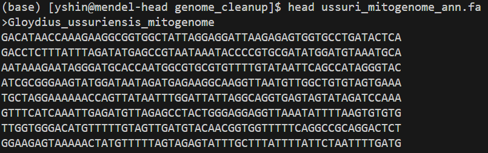
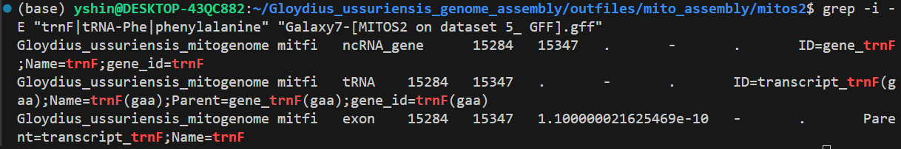
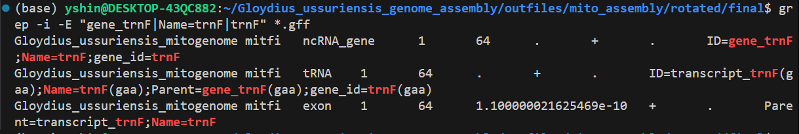
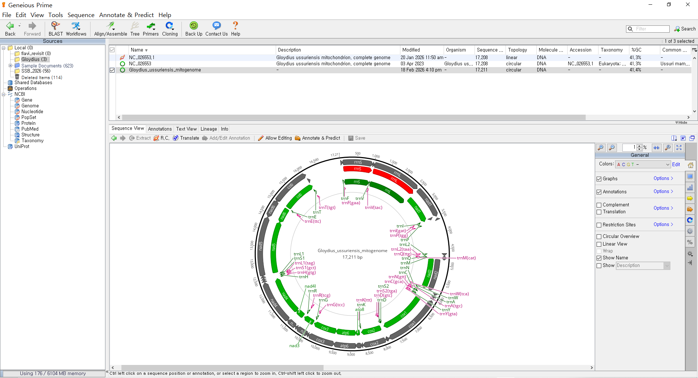
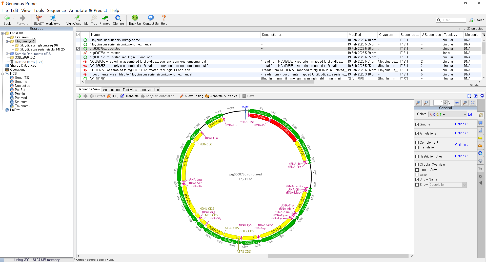
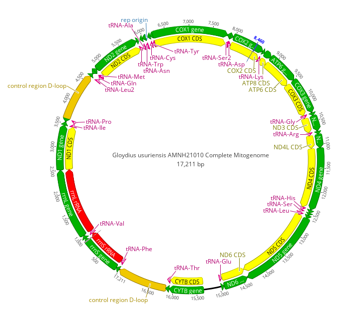
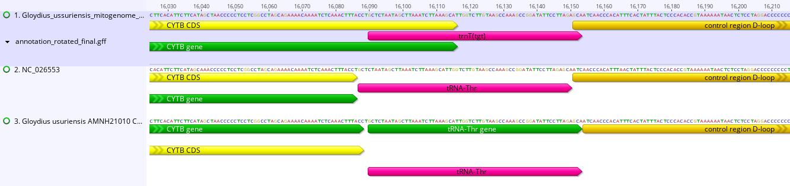

## 9) Mitogenome assembly
### "Manual" annotation with MITOS2
Running mitofifi will automatically give you the annotated mitogenome. This is an alternative method for annotating the mitogenome that is more time consuming (but I guess it is still valuabe for the purpose of learning). 

In the "Contamination screening" section above, we identified and stored the mitochondrial contig into a separate fasta file containing a single copy mitogenome ("mito_singlecopy.fa"). Now let's annotate this file.

First, let's check the fasta header (we are in the "genome_cleanup" directory):
```txt
head mito_singlecopy.fa 
```


We can see that the header is the contig name. This is not ideal; let's change the header with species name:
```txt
sed 's/^>.*/>Gloydius_ussuriensis_mitogenome/' mito_singlecopy.fa > ussuri_mitogenome_ann.fa
head ussuri_mitogenome_ann.fa 
```


Now, scp this file to your local device.

__*The following steps are (mostly) run on a local device*__

Now that this step is done, we can annotate the assembled mitogenome using MITOS2 (https://usegalaxy.org/root?tool_id=toolshed.g2.bx.psu.edu%2Frepos%2Fiuc%2Fmitos2%2Fmitos2%2F2.1.3%20galaxy0).

Use the following settings:
1) Input file: ussuri_mitogenome_ann.fasta
2) In file uploads, use "auto-detect" and do not specify the reference
3) Use "Vertebrate (2)" genetic code and "RefSeq63 Metazoa" for reference data
4) Select BED, GFF, and nucleotide FASTA, and zipped raw results as outputs
5) Turn on email notification
6) Turn on "Attempt to re-use jobs with identical parameters?"

MITOS2 can be run through the run on the Galaxy Server. The window looks something like this:


After MITOS2 run is complete, run a quick sanity check on the output GFF (annotation) file. First, download all output files in the "mitos2" directory in your local device and cd into it (in my case the directory in my local device is: /home/yshin/Gloydius_ussuriensis_genome_assembly/outfiles/mito_assembly/mitos2)
```txt
grep -v "^#" "Galaxy7-[MITOS2 on dataset 5_ GFF].gff" | cut -f3 | sort | uniq -c
```


Looks good! Also check if the names of all 13 protein-coding genes:
```
grep -v "^#" "Galaxy7-[MITOS2 on dataset 5_ GFF].gff" | awk -F'\t' '$3=="gene"{print $9}' | \
  grep -Eo 'cox1|cox2|cox3|cob|cytb|atp6|atp8|nad1|nad2|nad3|nad4l|nad4|nad5|nad6' | sort | uniq -c
```


Sweet. Now let's rotate the mitogenome FASTA based on the location of tRNA-Phe (trnF)
```txt
grep -i -E "trnF|tRNA-Phe|phenylalanine" "Galaxy7-[MITOS2 on dataset 5_ GFF].gff" 
```


We can see that trnF starts at position 15284 and ends at position 15347. __BUT,__ because the orientation of this sequence is (-), this means that the actual 5' end is at position 15347 and the 3' is at position 15284. 

Now we can rotate the sequence based on this information. To do so, first install the "rotate" package under the mendel-nas1 directory:

```txt
###  this is run on the cluster
# install
git clone https://github.com/richarddurbin/rotate.git ; cd rotate ; make

# to run, cd into the folder containing rotate and then run:
./rotate
```

Once the package is installed, run it on the head node. Since the start position orientation is on the (-) strand, make position 15347 as the start position. In addition, because the strand orientation is (-), make sure to reverse complement when you rotate (use the -rc flag).

```txt
### run rotate with the input sequence
# path to seq 
path_to_seq=/home/yshin/mendel-nas1/snake_genome_ass/G_ussuriensis_Chromo/genome_cleanup

# output dir
out_dir=/home/yshin/mendel-nas1/snake_genome_ass/G_ussuriensis_Chromo/mt_genome

# run rotate. run this in the rotate directory under mendel-nas1/
./rotate -x 15347 -rc ${path_to_seq}/ussuri_mitogenome_ann.fa > ${out_dir}/ussuri_mt_rotated.fasta

# check stats
conda activate genome_assembly
seqkit stats ${out_dir}/ussuri_mt_rotated.fasta
```
The output should look something like this:


Awesome. Now, scp the rotated fasta the directory in your local device and re-run MITOS2 to get GFF of the rotated FASTA. Once this is done, run some final checks

```txt
###  this is run on a local device
# cd into mito assembly directory
cd outfiles/mito_assembly/rotated/

# make directory for the final output files
mkdir final

# copy the "ussuri_mt_rotated.fasta" and the .gff file to the "final" folder
cp ussuri_mt_rotated.fasta final/
cp *.gff final/

# change the gff file name
mv 'Galaxy28-[MITOS2 on dataset 26_ GFF].gff' annotation_rotated_final.gff

# cd into final folder and change file names and confirm gene content again
cd final/
grep -v "^#" *.gff | cut -f3 | sort | uniq -c
```


```
# check trnF position
grep -i -E "gene_trnF|Name=trnF|trnF" *.gff
```


The trnF is now shown to span 1 bp - 64 bp.This is exactly what we expect from a correctly rotated sequence. Check the sequence stats in the local device using seqkit (install it if you need to).

```txt
seqkit stats ussuri_mt_rotated.fasta
```


Awesome! this can now be imported into Geneious for visualization.


__Note:__ The steps outlined above already have a lot of manual work. But then it needs further manual curation to adjust annotation. But we don't have to go through all of this for this sample because MitoHiFi run we did in the "Contamination screening" step will automatically produce fully annotated mitogenome that requires minimal manual data processing.


From here, we only need to manually annotate the replication origin and two D-loop regions. I did this by extracting these sequences from the reference mitogenome and aligning them to the MitoHiFi assembly. The final output looks like this (after some name edits):


Note that this genome is also 17,211bp long, like the assembly generated through the steps in this subsection. But overall, MitoHiFi output produced a cleaner output. This is because the assembly we annotated with MITOS2 had some issues determining gene boundaries in some places. Let's look at this by comparing the MitoHiFi assembly, MITOS2 assembly, and the reference mitogenome:


Finally, recall that our mitogenome was contained in the contig ptg000073c and that this contig was 68,844 bp in length. Since our mitogenome is 17.211 bp in length, this mean that the contig has four complete mitogenomes stitched back to back four times. Let's make sure this is actually the case by splitting up this contig into four equal chunks and see if each of them is indeed a complete mitogenome.

First, let's cd into the "genome_cleanup" directory on Mendel, which is where the ptg000073c contig fasta file is located in. Activate the "genome_assembly" conda env and use seqkit to check the length of this contig:
```sh
# in the "genome_cleanup" directory
conda activate genome_assembly
seqkit stats ptg000073c.fa
```


Now, let's create a "mito_chunks" directory under the current directory to store the split files, and use the samtools faidx command to slice this contig into four chunks, each exactlty 17,211 bp in length. 
```sh
# make the directory
mkdir mito_chunks

# copy the contig file into this directory
cp ptg000073c.fa mito_chunks

# cd into the mito_chunks directory
cd mito_chunks/

# index the fasta first
samtools faidx ptg000073c.fa

# set contig name as variable
c_name="ptg000073c"

# split
samtools faidx ptg000073c.fa ${c_name}:1-17211     > mito_part1.fa
samtools faidx ptg000073c.fa ${c_name}:17212-34422 > mito_part2.fa
samtools faidx ptg000073c.fa ${c_name}:34423-51633 > mito_part3.fa
samtools faidx ptg000073c.fa ${c_name}:51634-68844 > mito_part4.fa
```
Let's use seqkit to verify the size of each chunk
```sh
seqkit stats mito_part*
```


scp this folder to our local device and run blast on each of them. The results will show that they all match our *G. ussuriensis* reference mitogenome with > 99% percent identity with 100% query cover. This confirms that mitogenomes were stitched four times on to the contig ptg000073c. This likely happened because the assembler failed to recognize the circular nature of the mitogenome.

----------------------------------------------------------------------------------------------------
### Manual curation of the mitogenome assembled from MitoHiFi
I inspected the mitogenome assembled from MitoHiFi in Geneious after first downloading it to a local directory. The mitogenome was missing annotations for the two D-loops and origin of replication. In addition, the cytb annotation was truncated to 741 bp rather than the expected complete cytb length of 1114 bp. 

To resolve these issues, I aligned this mitogenome to a conspecific reference mitogenome available in GenBank (accession NC_026553) by running MAFFT in default settings in Geneious. Based on this alignment, I manually added annotations for the two D-loops and replication origin. I also manually extended the cytb annotation so that it has a correct full-length CDS. I then named this file as "AMNH_21010_Ref"

I also examined other annotations and noticed some overlaps between annotated features. These overlaps range from 1 bp to 10 bp. While short overlaps are likely to be biolkogically real overlaps found in vertebrate mitogenomes, longer overlaps are more suspicious. This is espeically the case because a published mitogenome of *G. ussuriensis* sequenced from an individual from South Korea reported overlaps that are 1 bp at most. In addition, there are other overlaps in our mitogenome not found in the published mitogenome. Therefore, manual curation and valiation of the mitogenome output from MitoHiFi is warranted. 

Create the following directory on Mendel:
```sh
# under the G_ussuriensis_Chromo directory
mkdir mitogenome_curation
mkdir mitogenome_curation/conspecific_ref
cd mitogenome_curation/conspecific_ref
```

Then download the conspecific mitogenome .fasta and .gb files:
```sh
conda activate genome_assembly

for acc in OR680782 KP262412 NC_026553; do
    efetch -db nuccore -id "$acc" -format gbwithparts > "${acc}.gb"
    efetch -db nuccore -id "$acc" -format fasta > "${acc}.fasta"
done
```

Validate the downloads:
```sh
# check records
ls -lh *.gb *.fasta

# check file completeness; a valid GenBank file should start with a LOCUS record and end with //
for f in *.gb; do
    echo "===== $f ====="
    grep -m1 '^LOCUS' "$f"
    tail -n 2 "$f"
done

# check file length
seqkit stats *.fasta
```

Seems like the files were downloaded correctly. Also, scp the "AMNH_21010_Ref" .gb and .fasta files to the "mitogenome_curation" dir.

Next, concatenate all fasta files into one:
```sh
cat \
    AMNH_21010_Ref.fasta \
    /home/yshin/mendel-nas1/snake_genome_ass/G_ussuriensis_Chromo/mitogenome_curation/conspecific_ref/OR680782.fasta \
    /home/yshin/mendel-nas1/snake_genome_ass/G_ussuriensis_Chromo/mitogenome_curation/conspecific_ref/KP262412.fasta \
    /home/yshin/mendel-nas1/snake_genome_ass/G_ussuriensis_Chromo/mitogenome_curation/conspecific_ref/NC_026553.fasta \
    > mitogenomes_merged.fasta
```

Now use mafft to align these sequences:
```sh
conda activate mafft
mafft --auto mitogenomes_merged.fasta \
    > mitogenomes_merged.mafft.fasta
```

After this, I used the Python script below to automatically check mitogenome annoatations without changing the original files. The script reads the input .gb and the mafft alignment, verifies that the aligned sequence is actually the same sequence as the GenBank record, converts raw GenBank coordinates into MAFFT alignment coordinates, and outputs three tables. Of these outputs, the "feature_boundaries_wide.tsv" would the main output to pay attention to.

```py
#!/usr/bin/env python3

from Bio import SeqIO
from collections import defaultdict
from pathlib import Path
import csv
import re
import sys


# ============================================================
# set paths
# ============================================================

CONSREF = Path(
    "/home/yshin/mendel-nas1/snake_genome_ass/"
    "G_ussuriensis_Chromo/mitogenome_curation/conspecific_ref"
)

ALIGNMENT = CONSREF / "/home/yshin/mendel-nas1/snake_genome_ass/G_ussuriensis_Chromo/mitogenome_curation/mitogenomes_merged.mafft.fasta"

GB_FILES = {
    "AMNH_21010_Ref": Path(
        "/home/yshin/mendel-nas1/ussuri_popgen/"
        "mitogenome/AMNH_21010_Ref.gb"
    ),
    "OR680782": CONSREF / "OR680782.gb",
    "KP262412": CONSREF / "KP262412.gb",
    "NC_026553": CONSREF / "NC_026553.gb",
}

# output directory for boundary-audit results
OUTDIR = CONSREF / "boundary_mismatch"
OUTDIR.mkdir(parents=True, exist_ok=True)

OUT_LONG = OUTDIR / "feature_boundaries_long.tsv"
OUT_WIDE = OUTDIR / "feature_boundaries_wide.tsv"
OUT_OVERLAPS = OUTDIR / "adjacent_feature_gaps_overlaps.tsv"


# ============================================================
# define helpers
# ============================================================

def strip_version(name):
    """
    OR680782.1 -> OR680782
    NC_026553.1 -> NC_026553
    """
    return re.sub(r"\.\d+$", "", name)


def clean_name(x):
    if x is None:
        return ""
    return str(x).strip()


def normalize_gene_name(name):
    """
    Normalize common mitochondrial gene-name variants.
    """
    if not name:
        return ""

    x = name.upper().replace("-", "").replace("_", "").replace(" ", "")

    aliases = {
        "COI": "COX1",
        "CO1": "COX1",
        "COXI": "COX1",

        "COII": "COX2",
        "CO2": "COX2",
        "COXII": "COX2",

        "COIII": "COX3",
        "CO3": "COX3",
        "COXIII": "COX3",

        "CYTB": "CYTB",
        "COB": "CYTB",

        "NAD1": "ND1",
        "NAD2": "ND2",
        "NAD3": "ND3",
        "NAD4": "ND4",
        "NAD4L": "ND4L",
        "NAD5": "ND5",
        "NAD6": "ND6",

        "ATPASE6": "ATP6",
        "ATPASE8": "ATP8",

        "RRNS": "12S",
        "12S": "12S",
        "12SRRNA": "12S",

        "RRNL": "16S",
        "16S": "16S",
        "16SRRNA": "16S",
    }

    return aliases.get(x, name)


def feature_base_label(feature):
    """
    Produce a biologically useful label before duplicate-numbering.
    """

    ftype = feature.type

    gene = clean_name(
        feature.qualifiers.get("gene", [""])[0]
    )

    product = clean_name(
        feature.qualifiers.get("product", [""])[0]
    )

    # ------------------------
    # protein-coding genes
    # ------------------------
    if ftype == "CDS":
        label = gene if gene else product
        return normalize_gene_name(label)

    # ------------------------
    # rRNAs
    # ------------------------
    if ftype == "rRNA":
        candidate = gene if gene else product

        x = candidate.lower()

        if (
            "rrns" in x
            or "12s" in x
            or "small subunit" in x
        ):
            return "12S"

        if (
            "rrnl" in x
            or "16s" in x
            or "large subunit" in x
        ):
            return "16S"

        return normalize_gene_name(candidate)

    # ------------------------
    # tRNAs
    # ------------------------
    if ftype == "tRNA":

        # Product is generally more standardized across annotations
        if product:
            return product.replace(" ", "_")

        if gene:
            return gene

        return "tRNA"

    # ------------------------
    # control regions
    # ------------------------
    if ftype == "D-loop":
        return "D-loop"

    if ftype == "rep_origin":
        return "rep_origin"

    return ftype


def get_qualifier(feature, key):
    values = feature.qualifiers.get(key, [])
    if not values:
        return ""
    return ",".join(str(x) for x in values)


def map_sequence_to_alignment(aligned_seq):
    """
    Return:
        ref_position (1-based ungapped)
            ->
        alignment_column (1-based)

    Example:
       A C - T
       1 2   3

    mapping:
       1 -> 1
       2 -> 2
       3 -> 4
    """

    mapping = {}

    ungapped_pos = 0

    for aln_col, base in enumerate(aligned_seq, start=1):

        if base not in "-.":
            ungapped_pos += 1
            mapping[ungapped_pos] = aln_col

    return mapping


# ============================================================
# input validation
# ============================================================

if not ALIGNMENT.exists():
    sys.exit(
        f"ERROR: alignment not found:\n{ALIGNMENT}"
    )

for name, gb in GB_FILES.items():
    if not gb.exists():
        sys.exit(
            f"ERROR: GenBank file missing for {name}:\n{gb}"
        )


# ============================================================
# read mafft alignment
# ============================================================

alignment_records = list(
    SeqIO.parse(ALIGNMENT, "fasta")
)

if not alignment_records:
    sys.exit("ERROR: alignment contains no sequences.")


alignment_length = len(alignment_records[0].seq)

for rec in alignment_records:
    if len(rec.seq) != alignment_length:
        sys.exit(
            "ERROR: alignment sequences have different lengths."
        )


# build aliases such that OR680782.1 matches OR680782
alignment_by_name = {}

for rec in alignment_records:
    raw = rec.id
    base = strip_version(raw)

    alignment_by_name[raw] = rec
    alignment_by_name[base] = rec


print(f"Alignment: {ALIGNMENT}")
print(f"Alignment length: {alignment_length}")
print(f"Alignment sequences: {len(alignment_records)}")
print()


# ============================================================
# read GenBank records and validate against MAFFT rows
# ============================================================

gb_records = {}
position_maps = {}

for accession, gb_path in GB_FILES.items():

    gb_record = SeqIO.read(gb_path, "genbank")
    gb_records[accession] = gb_record

    # Locate corresponding sequence in alignment
    aln_record = None

    for key in [
        accession,
        strip_version(accession),
        gb_record.id,
        strip_version(gb_record.id),
    ]:
        if key in alignment_by_name:
            aln_record = alignment_by_name[key]
            break

    if aln_record is None:
        available = sorted(
            set(rec.id for rec in alignment_records)
        )

        sys.exit(
            f"\nERROR: Could not find {accession} in alignment.\n"
            f"Available IDs:\n" +
            "\n".join(available)
        )

    ungapped_alignment = (
        str(aln_record.seq)
        .replace("-", "")
        .replace(".", "")
        .upper()
    )

    gb_sequence = str(gb_record.seq).upper()

    print(
        f"{accession}: "
        f"GB={len(gb_sequence)} bp; "
        f"alignment ungapped={len(ungapped_alignment)} bp"
    )

    if ungapped_alignment != gb_sequence:

        # Find first mismatch if lengths are equal
        msg = (
            f"\nERROR: Alignment row for {accession} "
            f"does not exactly match its GenBank sequence."
        )

        if len(ungapped_alignment) == len(gb_sequence):
            for i, (a, b) in enumerate(
                zip(ungapped_alignment, gb_sequence),
                start=1
            ):
                if a != b:
                    msg += (
                        f"\nFirst mismatch at nucleotide {i}: "
                        f"alignment={a}, GenBank={b}"
                    )
                    break
        else:
            msg += (
                f"\nLengths differ: "
                f"{len(ungapped_alignment)} vs "
                f"{len(gb_sequence)}"
            )

        sys.exit(msg)

    print("  sequence match: PASS")

    position_maps[accession] = map_sequence_to_alignment(
        str(aln_record.seq)
    )

print()
print("All four MAFFT rows exactly match their GenBank sequences.")
print()


# ============================================================
# extract functional annotation features
# ============================================================

KEEP_TYPES = {
    "CDS",
    "rRNA",
    "tRNA",
    "D-loop",
    "rep_origin",
}


all_features = []

for accession, record in gb_records.items():

    accession_features = []

    for feature in record.features:

        if feature.type not in KEEP_TYPES:
            continue

        raw_start = int(feature.location.start) + 1
        raw_end = int(feature.location.end)

        strand_value = feature.location.strand

        if strand_value == 1:
            strand = "+"
        elif strand_value == -1:
            strand = "-"
        else:
            strand = "."

        # Biological 5' and 3' boundaries
        if strand == "-":
            bio_start = raw_end
            bio_end = raw_start
        else:
            bio_start = raw_start
            bio_end = raw_end

        mapping = position_maps[accession]

        try:
            alignment_raw_start = mapping[raw_start]
            alignment_raw_end = mapping[raw_end]

            alignment_5prime = mapping[bio_start]
            alignment_3prime = mapping[bio_end]

        except KeyError as e:
            sys.exit(
                f"ERROR mapping {accession} "
                f"{feature.type} position {e} "
                f"onto alignment."
            )

        gene = get_qualifier(feature, "gene")
        product = get_qualifier(feature, "product")

        item = {
            "accession": accession,
            "feature_type": feature.type,
            "base_label": feature_base_label(feature),

            "gene": gene,
            "product": product,

            "raw_start": raw_start,
            "raw_end": raw_end,
            "strand": strand,
            "feature_length": len(feature.location),

            "bio_5prime": bio_start,
            "bio_3prime": bio_end,

            "alignment_start": alignment_raw_start,
            "alignment_end": alignment_raw_end,

            "alignment_5prime": alignment_5prime,
            "alignment_3prime": alignment_3prime,

            "codon_start": get_qualifier(
                feature, "codon_start"
            ),

            "transl_table": get_qualifier(
                feature, "transl_table"
            ),
        }

        accession_features.append(item)

    # --------------------------------------------------------
    # number duplicate labels by genomic order
    #
    # e.g.
    # tRNA-Leu_1
    # tRNA-Leu_2
    # D-loop_1
    # D-loop_2
    # --------------------------------------------------------

    grouped = defaultdict(list)

    for item in accession_features:
        grouped[item["base_label"]].append(item)

    for label, entries in grouped.items():

        entries.sort(key=lambda x: x["raw_start"])

        if len(entries) == 1:
            entries[0]["feature_label"] = label

        else:
            for i, item in enumerate(entries, start=1):
                item["feature_label"] = f"{label}_{i}"

    all_features.extend(accession_features)


# ============================================================
# write long-format feature table
# ============================================================

long_columns = [
    "accession",
    "feature_label",
    "feature_type",
    "gene",
    "product",
    "raw_start",
    "raw_end",
    "strand",
    "feature_length",
    "bio_5prime",
    "bio_3prime",
    "alignment_start",
    "alignment_end",
    "alignment_5prime",
    "alignment_3prime",
    "codon_start",
    "transl_table",
]


all_features.sort(
    key=lambda x: (
        x["accession"],
        x["raw_start"],
        x["raw_end"],
    )
)


with open(OUT_LONG, "w", newline="") as handle:

    writer = csv.DictWriter(
        handle,
        fieldnames=long_columns,
        delimiter="\t",
    )

    writer.writeheader()

    for item in all_features:
        writer.writerow(
            {k: item.get(k, "") for k in long_columns}
        )


# ============================================================
# write wide comparison table
# ============================================================

ACCESSION_ORDER = [
    "AMNH_21010_Ref",
    "OR680782",
    "KP262412",
    "NC_026553",
]


# feature_label -> accession -> item
feature_matrix = defaultdict(dict)

for item in all_features:
    feature_matrix[item["feature_label"]][
        item["accession"]
    ] = item


wide_columns = [
    "feature_label",
    "feature_type",
]

for acc in ACCESSION_ORDER:
    wide_columns.extend([
        f"{acc}_raw_start",
        f"{acc}_raw_end",
        f"{acc}_strand",
        f"{acc}_length",
        f"{acc}_aln_start",
        f"{acc}_aln_end",
        f"{acc}_aln_5prime",
        f"{acc}_aln_3prime",
    ])

wide_columns.extend([
    "all_alignment_starts_same",
    "all_alignment_ends_same",
])


# sort features according to AMNH genomic order where possible
def feature_sort_key(label):

    amnh = feature_matrix[label].get("AMNH_21010_Ref")

    if amnh:
        return (0, amnh["raw_start"])

    starts = [
        x["raw_start"]
        for x in feature_matrix[label].values()
    ]

    return (1, min(starts) if starts else 10**9)


with open(OUT_WIDE, "w", newline="") as handle:

    writer = csv.DictWriter(
        handle,
        fieldnames=wide_columns,
        delimiter="\t",
    )

    writer.writeheader()

    for label in sorted(
        feature_matrix.keys(),
        key=feature_sort_key,
    ):

        row = {
            "feature_label": label,
            "feature_type": "",
        }

        starts = []
        ends = []

        for acc in ACCESSION_ORDER:

            item = feature_matrix[label].get(acc)

            if item is None:
                continue

            row["feature_type"] = item["feature_type"]

            row[f"{acc}_raw_start"] = item["raw_start"]
            row[f"{acc}_raw_end"] = item["raw_end"]
            row[f"{acc}_strand"] = item["strand"]
            row[f"{acc}_length"] = item["feature_length"]

            row[f"{acc}_aln_start"] = item[
                "alignment_start"
            ]
            row[f"{acc}_aln_end"] = item[
                "alignment_end"
            ]

            row[f"{acc}_aln_5prime"] = item[
                "alignment_5prime"
            ]
            row[f"{acc}_aln_3prime"] = item[
                "alignment_3prime"
            ]

            starts.append(item["alignment_start"])
            ends.append(item["alignment_end"])

        row["all_alignment_starts_same"] = (
            "YES"
            if len(starts) == len(ACCESSION_ORDER)
            and len(set(starts)) == 1
            else "NO"
        )

        row["all_alignment_ends_same"] = (
            "YES"
            if len(ends) == len(ACCESSION_ORDER)
            and len(set(ends)) == 1
            else "NO"
        )

        writer.writerow(row)


# ============================================================
# report adjacent gaps / overlaps
# ============================================================

overlap_columns = [
    "accession",
    "feature_1",
    "feature_1_type",
    "feature_1_start",
    "feature_1_end",

    "feature_2",
    "feature_2_type",
    "feature_2_start",
    "feature_2_end",

    "gap_bp",
    "overlap_bp",
    "relationship",
]


with open(OUT_OVERLAPS, "w", newline="") as handle:

    writer = csv.DictWriter(
        handle,
        fieldnames=overlap_columns,
        delimiter="\t",
    )

    writer.writeheader()

    for accession in ACCESSION_ORDER:

        feats = [
            x for x in all_features
            if x["accession"] == accession
        ]

        feats.sort(
            key=lambda x: (
                x["raw_start"],
                x["raw_end"],
            )
        )

        for f1, f2 in zip(feats[:-1], feats[1:]):

            # Number of unannotated bases between features
            gap = f2["raw_start"] - f1["raw_end"] - 1

            if gap > 0:
                overlap = 0
                relationship = "gap"

            elif gap == 0:
                overlap = 0
                relationship = "adjacent"

            else:
                overlap = -gap
                gap = 0
                relationship = "overlap"

            writer.writerow({
                "accession": accession,

                "feature_1": f1["feature_label"],
                "feature_1_type": f1["feature_type"],
                "feature_1_start": f1["raw_start"],
                "feature_1_end": f1["raw_end"],

                "feature_2": f2["feature_label"],
                "feature_2_type": f2["feature_type"],
                "feature_2_start": f2["raw_start"],
                "feature_2_end": f2["raw_end"],

                "gap_bp": gap,
                "overlap_bp": overlap,
                "relationship": relationship,
            })


# ============================================================
# done
# ============================================================

print("Wrote:")
print(f"  {OUT_LONG}")
print(f"  {OUT_WIDE}")
print(f"  {OUT_OVERLAPS}")
```
Run the script like this:
```sh
conda activate genome_assembly
python3 \
    /home/yshin/mendel-nas1/snake_genome_ass/G_ussuriensis_Chromo/scripts/Python/mito_annotation_comparisons.py
```
Fix line endings in the output files and then check the outputs:
```sh
# cd into output dir
cd boundary_mismatch/

# fix line endings 
sed -i 's/\r$//' \
    feature_boundaries_long.tsv \
    feature_boundaries_wide.tsv \
    adjacent_feature_gaps_overlaps.tsv

# check main result         
column -t feature_boundaries_wide.tsv
```

Then specifically pull out the features where the aligned boundaries disagree:
```sh
awk -F'\t' '
NR==1 || $(NF-1)=="NO" || $NF=="NO"
' feature_boundaries_wide.tsv \
| column -t
```
This suggests several areas that require further verification. The annotated features below contain indels that are likely to be incorrect.
  - 1) ND2 3' end: AMNH 21010 mitogenome extends 2 bp further  
  - 2) tRNA-Ser_1 3' end: AMNH 21010 mitogenome extends 10 bp further
  - 3) COX2 3' end: AMNH 21010 mitogenome extends 8 bp further
  - 4) tRNA-Lys both ends: AMNH 21010 mitogenome is 1 bp shorter at each end
  - 5) tRNA-His 5' end: 21010 mitogenome extends 2 bp farther upstream

#### ND2 3' end
When you align the AMNH_21010_Ref with other conspecific mitogenomes (using .gb files), you will notice that the ND2 CDS in all conspecific comparisons ends at a position that is 2 bp shorter than the annotated ND2 CDS of AMNH 21010. In the original AMNH 21010 .gb file, the ND2 CDS annotation spans 4842 - 5867 bp. Edit this annotation to 4842 - 5865 bp.

#### tRNA-Ser_1 3' end
There are two tRNA-Ser in the *G. ussuriensis* mitogenome. The first tRNA-Ser is, of course, located closer to the replication origin. This particular tRNA gene is on the minus strand, meaning that its orientation on the mitogenome is 3' <- 5' instead of 5' -> 3'. Compared to all other conspecific mitogenomes, the AMNH 21010 mitogenome assembled from MitoHiFi has the 3' end extended by 10 bp, such that it overlaps with the COX1 CDS. Edit the 3' end so that the span is corrected from 7890 - 7823 to 7890 - 7833. 

#### COX2 3' end
The COX2 CDS 3' end in AMNH 21010 mitogenome showed 8 bp overextension relative to all other conspecific mitogenomes, suggesting the same sorts of mis-annotation as in two previous cases.

#### tRNA-Lys both ends
Same with above; the AMNH 21010 mitogenome is missing exactly 1 bp at both ends of this gene relative to all other conspecific mitogenomes. 

#### tRNA-His 5' end
The tRNA-His gene 5' end in AMNH 21010 mitogenome is overextended by 2 bp relative to all other conspecific mitogenomes. Especially, KP262412 and NC_026553 have the same ND4 endpoint as AMNH 21010, yet tRNA-His in both mitogenomes starts two alignment columns later.

After resolving all these overlaps, align the mitogenomes again in Geneious using MAFFT. You should now see that all the overlaps are now gone.

----------------------------------------------------------------------------------------------------
### Submitting mitogenome to GenBank
Let's submit the completed mitogenome assembly to GenBank. Prior to this step. I loaded the final mitogenome output from mitohifi on to Geneious Prime and manually annotated the two D-loops and replication origin. I did this by extracting these sequences from the conspecific reference mitogenome and mapping them to the assembled mitogenome using the "Map to reference" tool. I then downloaded this as a fasta file. This file is stored in a new directory at "/home/yshin/Gloydius_ussuriensis_genome_assembly/outfiles/mitogenome_GenBank_submission"

Let's also copy the "final_mitogenome.gb" file from the mitohifi output directory to this directory:
```sh
# cd into mitohifi output directory
cd /home/yshin/Gloydius_ussuriensis_genome_assembly/outfiles/mitohifi

# copy .gb file over to mitogenome submission directory
cp final_mitogenome.gb /home/yshin/Gloydius_ussuriensis_genome_assembly/outfiles/mitogenome_GenBank_submission

# cd into mitogenome submission directory
cd /home/yshin/Gloydius_ussuriensis_genome_assembly/outfiles/mitogenome_GenBank_submission
```
